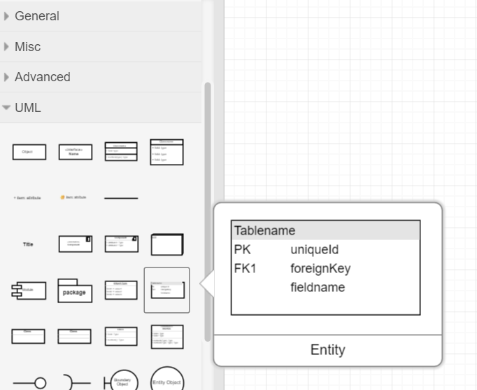
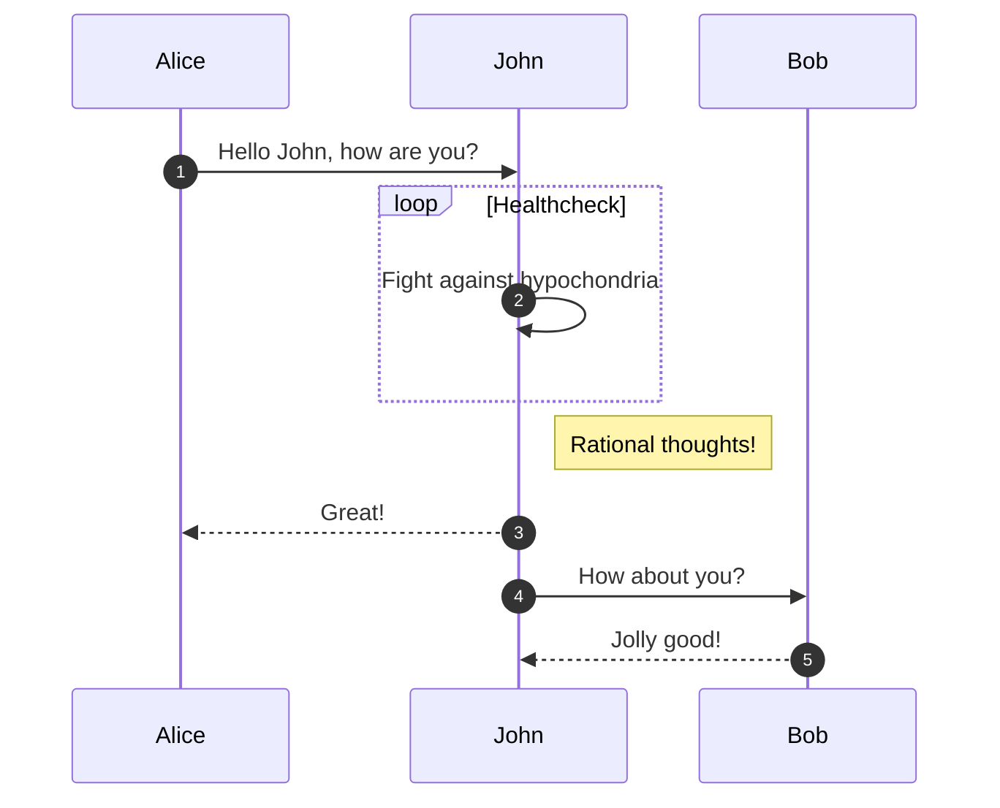
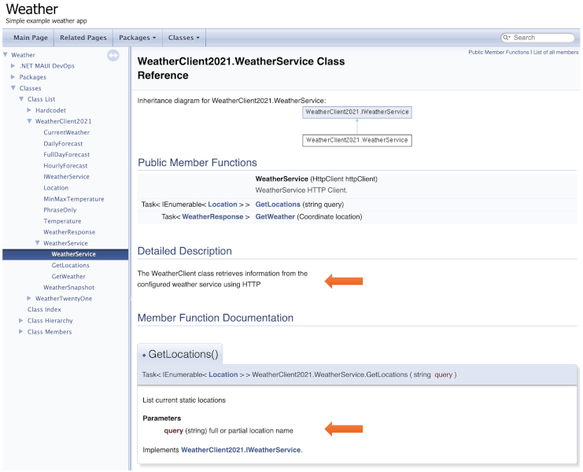

# Documentation

<hr class="splash">


### The best reaction to “this is confusing, where are the docs” is to rewrite the feature to make it less confusing, not write more docs.

<br/>

*Jeff Atwood*

<hr class="splash">


###### Contents

1. [Documentation types](#documentation-types)
2. [Design documentation](#design-documentation)
3. [Draw.io](#drawio)
4. [Mermaid](#mermaid)
5. [API documentation](#api-documentation)

## Documentation types

A very important point to remember about any kind of written information is that the most
important person is the Reader, not the author. Written material is meant to communicate
its contents clearly and intuitively. It therefore needs to carefully prepared with a
particular Reader in mind. The various stakeholders in a software development project have
different interests and therefore different requirements in terms of documentation. A
technical stakeholder for example such as a future maintainer of the code requires
information about the way the application is structured, the endpoints available through
the API, the coding conventions used, etc. An end user, on the other hand, needs guidance
on using the application. They might need tutorial material or just reference material that
describes how to perform a particular function through the UI. According to the international
standard [IEEE 1063-2001](https://napier.primo.exlibrisgroup.com/permalink/44NAP_INST/n96pef/alma9923431555702111),
user documentation should consider both the instructional mode and the reference mode. The main
point is that the types of documentation needed may be very different, and it is not appropriate
to mix them. The best way to start the process of planning what documentation to create is
with the list of stakeholders and to ask what each one needs.

The remainder of this section will focus on the creation of technical documentation.

## Design documentation

In an ideal world, every develope would document their ideas in UML before making their
first code change. As they went through the development, they would carefully make sure that
the design documentation was undated in parallel so that by the end, the UML was already a
perfect description of the code, and just needed to be committed to the repository. In reality,
the picture is much more varied. Typically, a bit of attention is given to design documentation
at the start, but just enough for the developer to make some strategic decisions. Occasionally,
they might revisit the documentation during the development,usually when there is some major
shift in the plan. Usually, the documentation is slightly out of date and incomplete by the
end of a development task. It is at this stage that problems can set in because it is tempting
to put the documentation aside and get on with more development. However, it is important to
think of the documentation in the same way as the code itself. If the developer fails to
complete it, they are creating a form of technical debt that must be repaid at some point in
the future when someone else has to modify the code. The team workflow therefore needs to include
steps to ensure that all expected documentation is complete and correct before the PR is
accepted.

Not all UML diagrams are needed in every project. The level of detail and complexity in the
documentation should reflect the needs of the project. Documentation that does not add value
is a waste of resources and adds unnecessary complexity to the project. It is therefore a
good idea to establish expectations at the outset and then to enforce them as the project
progresses. This type of decision should be recorded in the project definition along with the
standard team workflow.

Since it is not possible to predict the future with 100% accuracy at the start of a project, the
expectations around documentation and workflow can be adjusted as the project progresses if
inefficiencies or gaps are identified.

## Draw.io

There are many tools that could be used to create UML documentation, and to a large extent
the one you choose it a matter of preference. The only proviso is that it should be a team
preference and not an individual one. The documentation for an application must have a
consistent format and presentation; otherwise, it can create ambiguity and confusion. The
implication is that the whole team should use a consistent toolset for their documentation
in the same way that they need to use a consistent IDE configuration to develop the code.

The previous section mentioned [draw.io](https://www.drawio.com/) as a way of creating
entity-relationship diagrams. In fact, it can be used for a wide range of UML diagrams and
has the additional benefit of being completely free of charge. The one thing that you
need to know is that there is a special palette of UML elements available as shown in
Fig. 1. You need to select that palette explicitly rather than jump in with the default
generic shapes.



Fig. 1: Draw.io UML palette

## Mermaid

Another way to create UML diagrams which is particularly useful when working with Markdown
is [Mermaid](https://mermaid.js.org/). It provides a way of generating graphics based on a
textual description of the diagram content. For example, the code in Fig. 2 can be used to
generate the sequence diagram in Fig. 3 ([mermaid.js.org](https://mermaid.js.org/syntax/sequenceDiagram.html)).

    sequenceDiagram
    autonumber
    Alice->>John: Hello John, how are you?
    loop Healthcheck
        John->>John: Fight against hypochondria
    end
    Note right of John: Rational thoughts!
    John-->>Alice: Great!
    John->>Bob: How about you?
    Bob-->>John: Jolly good!

*Fig. 2: Mermaid code for generating a sequence diagram*



*Fig. 3: Resulting sequence diagram*

After an initial period of familiarisation, the syntax of Mermaid diagrams starts to
become quite intuitive. To embed the diagram description into a Markdown page, it
needs to be entered as a [fenced code block](https://docs.github.com/en/get-started/writing-on-github/working-with-advanced-formatting/creating-diagrams).
That is, it needs to be enclosed in three back-ticks and annotated as Mermaid code as
illustrated in Fig. 4.

````
``` mermaid
sequenceDiagram
    ...

```
````

*Fig. 4: Mermaid fenced code block*

## API documentation

It is often useful to have a complete reference of all the methods available in the collection
of classes that make up an application. Such comprehensive catalogues are often made available
through web platforms such as [ReadTheDocs](https://docs.readthedocs.io/). Documentation
is built in Markdown using a tool such as [Sphinx](https://www.sphinx-doc.org/en/master/) or
[MkDocs](https://www.mkdocs.org/), and it can be automatically updated on ReadTheDocs
whenever a new version is committed to GitHub. This process makes life simple in one respect
but there are some limitations. First, the tools are geared mainly towards Python and getting
them to work with other languages can be difficult. The main disadvantage though is that
documentation needs to be maintained in parallel with the code.

This may be appropriate for user-oriented content,but there are better approaches for the
technical description of the API. For example, Oracle provide the
[javadoc](https://www.oracle.com/technical-resources/articles/java/javadoc-tool.html)
tool for extracting useful API documentation from source code. The tool requires each
significant element of the code (class, method, etc.) to include a standard comment block at
the start that describes the purpose of the element, its parameters, its return value and
so on. The benefit of this method is that it minimises the effort required on the behalf of
the developer. It is also easy to ensure that the API documentation is kept synchronised
with any code changes such as by including it in the Definition of Done.

An open equivalent to javadoc that can be used with .NET projects is
[Doxygen](https://www.doxygen.nl/). It makes use of similar standard code blocks as headers
for significant code elements. A lot of information is extracted directly from the
source code, and the developer can also provide additional detail such as the meaning
and data type of each parameter.

Doxygen can be run using the command line, but it also has a wizard that provides a
convenient graphical interface. When configuring Doxygen using either method, the
important values to specified are

* **The run directory**

  This is not the installation directory for Doxygen, but the working directory. By
  default, it is also the location where the outout will be generated.

* **The source code directory**

  This is the root directory of the .NET project. To ensure that all files in the hierarchy
  are included in the documentation, check the *Scan recursively* option.

* **Extraction mode**

  The options here are *Documented entities only* or *All entities*. You can control
  the content of the documentation by choosing the first option and only documenting
  the entities that you want to be included.

* **Output formats**

  These options allow you to choose HTML and/or LaTex. You can additionally choose to
  include a navigation panel and search function in the HTML output.

* **Diagram options**

  Doxygen has a built-in diagram generator which is usually sufficient.

For the majority of options, please see the [Doxygen documentation](https://www.doxygen.nl/manual/index.html).
As a brief illustration, the following example is provided as a standard
[C# example](https://github.com/dotnet/maui-samples/tree/main/7.0/Apps/WeatherTwentyOne).
Explicit documentation has only been added to one source file,
`src/WeatherTwentyOne/Services/WeatherService.cs` as shown in Fig. 5. The comments
start with a delimiter, either `/!` for a single-line comment or `/*!` for a
multi-line comment.

``` csharp
using System.Net.Http.Json;

namespace WeatherClient2021;

/*! The WeatherClient class retrieves information from the   
 *  configured weather service using HTTP
 */

public class WeatherService : IWeatherService
{
    //! Static list of locations
    static List<Location> locations = new()
    {
        new Location { Name = "Redmond", Coordinate = new Coordinate(47.6740, 122.1215), Icon = "fluent_weather_cloudy_20_filled.png", WeatherStation = "USA", Value = "62°" },
        new Location { Name = "St. Louis", Coordinate = new Coordinate(38.6270, 90.1994), Icon = "fluent_weather_rain_showers_night_20_filled.png", WeatherStation = "USA", Value = "74°" },
        new Location { Name = "Boston", Coordinate = new Coordinate(42.3601, 71.0589), Icon = "fluent_weather_cloudy_20_filled.png", WeatherStation = "USA", Value = "54°" },
        new Location { Name = "NYC", Coordinate = new Coordinate(40.7128, 74.0060), Icon = "fluent_weather_cloudy_20_filled.png", WeatherStation = "USA", Value = "63°" },
        new Location { Name = "Amsterdam", Coordinate = new Coordinate(52.3676, 4.9041), Icon = "fluent_weather_cloudy_20_filled.png", WeatherStation = "USA", Value = "49°" },
        new Location { Name = "Seoul", Coordinate = new Coordinate(37.5665, 126.9780), Icon = "fluent_weather_cloudy_20_filled.png", WeatherStation = "USA", Value = "56°" },
        new Location { Name = "Johannesburg", Coordinate = new Coordinate(26.2041, 28.0473), Icon = "fluent_weather_sunny_20_filled.png", WeatherStation = "USA", Value = "62°" },
        new Location { Name = "Rio", Coordinate = new Coordinate(22.9068, 43.1729), Icon = "fluent_weather_sunny_20_filled.png", WeatherStation = "USA", Value = "79°" },
        new Location { Name = "Madrid", Coordinate = new Coordinate(40.4168, 3.7038), Icon = "fluent_weather_sunny_20_filled.png", WeatherStation = "USA", Value = "71°" },
        new Location { Name = "Buenos Aires", Coordinate = new Coordinate(34.6037, 58.3816), Icon = "fluent_weather_sunny_20_filled.png", WeatherStation = "USA", Value = "61°" },
        new Location { Name = "Punta Cana", Coordinate = new Coordinate(18.5601, 68.3725), Icon = "fluent_weather_rain_showers_day_20_filled.png", WeatherStation = "USA", Value = "84°" },
        new Location { Name = "Hyderabad", Coordinate = new Coordinate(17.3850, 78.4867), Icon = "fluent_weather_sunny_20_filled.png", WeatherStation = "USA", Value = "84°" },
        new Location { Name = "San Francisco", Coordinate = new Coordinate(37.7749, 122.4194), Icon = "fluent_weather_sunny_20_filled.png", WeatherStation = "USA", Value = "69°" },
        new Location { Name = "Nairobi", Coordinate = new Coordinate(1.2921, 36.8219), Icon = "fluent_weather_rain_20_filled.png", WeatherStation = "USA", Value = "67°" },
        new Location { Name = "Lagos", Coordinate = new Coordinate(6.5244, 3.3792), Icon = "fluent_weather_partly_cloudy.png", WeatherStation = "USA", Value = "83°" }
    };

    private readonly HttpClient httpClient;

    //! WeatherService HTTP Client
    public WeatherService(HttpClient httpClient)
    {
        this.httpClient = httpClient;
    }

    /*!
     * List current static locations
     * @param query (string) full or partial location name
     */
    public Task<IEnumerable<Location>> GetLocations(string query)
        => Task.FromResult(locations.Where(l => l.Name.Contains(query)));

    /*!
     * Fetch weather forecast of specified location
     * @param location (string) location name of a location
     */
    public Task<WeatherResponse> GetWeather(Coordinate location)
        => httpClient.GetFromJsonAsync<WeatherResponse>($"/weather/{location}");
}
```

*Fig. 5: Example Doxygen comments in a C# source file*

Fig. 6 shows the documentation that is generated when Doxygen is run on the example
code. The majority of the content is extracted directly from the code and the additional
comments can be seen in the open page that corresponds to the file in Fig. 5. Fig. 6 also
demonstrates the use of a navigation panel on the left, a search field at the top right and
a generated inheritance diagram.




Please note that the documentation generated by Doxygen does not have to be stored in
the repository since it can be generated at any time. Generating the documentation
pages might be included in the installation process for your application. In that case,
the working directory would be outside the project hierarchy. Alternatively, a project
might prefer to save the generated pages in the repository to simplify the installation.
That might be appropriate, for example, if you expect end users to download the code
directly from GitHub. Saving the generated documentation means that they do not need to
have Doxygen installed. The storage strategy is therefore a decision for the project team.
