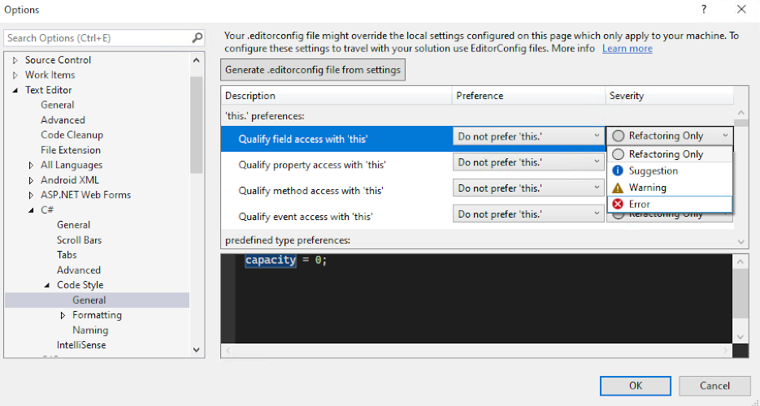

# Know your tools

### I've known people who have not mastered their tools who are good programmers, but not a tool master who remained a mediocre programmer.

 

*Kent Beck*

###### Contents

1. [The developer's working environment](#the-developers-working-environment)
2. [Editors and IDEs](#editors-and-ides)
3. [Static analysis](#static-analysis)
4. [Further reading](#further-reading)

## The developer's working environment

To recap on a point made in an earlier session, a software engineer has a lot to think about
besides just writing code. The tour below summarises the main considerations and
visualises two different ways of managing the tools needed to do the job effeciently
and effectively.

<h6 align="center"> Here's you, engineering your software...

</h6>

## Editors and IDEs

Development tools have had more than half a century to mature. Current editors and
integrated development environments (IDEs) offer many features that help the software
engineer to keep on top of the huge range of concerns when building high quality code.

The two main strategies visualised in the tour are the smart editor (such as
[Visual Studio Code](https://code.visualstudio.com/)) and the IDE (such as
[Visual Studio](https://visualstudio.microsoft.com/)).

The smart editor strategy can be considered bottom-up: its central function is editing
code, and additional functionality can be included as extensions. The advantages are
that its disk and memory footprints are kept as small as possible, and the working
user interface is simplified. Its disadvantage is that it requires customisation for
each distinct working environment, and some features require external configuration.
Because this working environment is a collection of loosely-coupled modules, it is not
as stable as the IDE approach.

The IDE strategy seeks to put all the tools the software engineer might need at their
fingertips by integrating them into a single software application. Because a lot of
functionality is included by default, its storage and memory footprints are much larger
than those of a smart editor, and the interface is more complicated because there are many
more options available. The main advantages of an IDE are its comparative stability, the
lower maintenance overhead and the availability of advanced features such as package
management.

## Static analysis

When carrying out a code review, the ideal approach is to include two steps. The first
is to examine the code in an editor to try to identify potential improvements, and the
second is to run the code to check that it behaves as expected. The first of these can be
thought of as *static analysis* because you are examining the code in isolation. The second
activity can be considered *dynamic analysis* since the code is actually in operation
and you are evaluating its behaviour.

Development tools such as Visual Studio perform static analysis on the code as you write
with the results presented in various ways. For example, lines of code that contravene
a style rule might be underlined or have a light bulb icon appear against them, for
example. The IDE may offer to reformat the code automatically if the resolution is a
simple one. Structural issues identified by the built-in code analysers may be
indicated by a different highlight or a different icon such as a screwdriver. Again,
the IDE may offer a range of solutions, but in the structural case, they affect the
code itself and not just the way it is formatted. These resolutions therefore constitute
code *refactorings*.

The default rules that are built into an IDE can be configured by changing the options
settings. A rule could be disabled, for example, so that the highlights and warnings no
longer appear. Alternatively, the severity of the rule might be increased so that the
IDE treats it as an error rather than a warning as illustrated in Fig. 1.

*Fig. 1: Visual Studio code analysis options*

It is very common for developers to ignore any warnings generated by the IDE since
they do not affect the operation of the code. They are therefore treated as
insignificant. However, in a team situation where future maintainability and general
code quality are major concerns, every software engineer should ain to resolve any
parts of their code that produce warnings. Any rules that are not required can be disabled
for the whole team, and the remainder can be configured so that their severity level
reflects the team's requirements.

When the default rules are not sufficient for a team's needs, other tools such as
[StyleCop](https://github.com/DotNetAnalyzers/StyleCopAnalyzers) can be added to the
IDE. In Visual Studio, this is done using the
[NuGet package manager](https://code.visualstudio.com/docs/csharp/package-management).
StyleCop provides greater control over code style with selectable rule sets. It is
also possible to manage the rules as described above and to create custom rules as
needed.

The main point of this section is that the warnings and suggestions generated by an IDE
need to be treated as a useful tool to help ensure code quality rather than annoying
background noise. Once the rules are appropriately configured, they provide vital
information to the software engineer that should not be ignored.

## Further reading

* Programming ([Stephens, 2022, Ch. 10](https://learning.oreilly.com/library/view/beginning-software-engineering/9781119901709/c10.xhtml))
* [Common C# code conventions](https://learn.microsoft.com/en-us/dotnet/csharp/fundamentals/coding-style/coding-conventions)
* [StyleCop: A Detailed Guide to Starting and Using It](https://blog.submain.com/stylecop-detailed-guide/)
