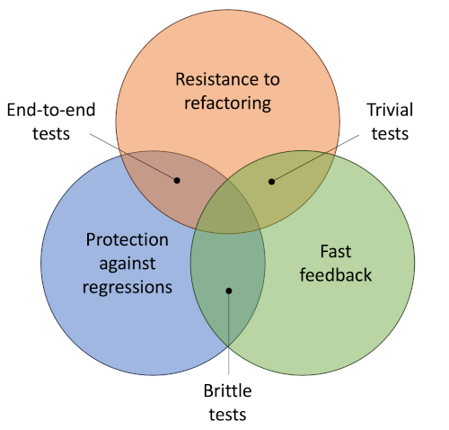

# Mocking and testing

<hr class="splash">


### Avoid heavy mocking. This allows you to meet the promise to refactoring. You will refactor your code and your tests won’t break.

<br/>

*Ian Cooper*

<hr class="splash">


###### Contents

1. [What is mocking?](#what-is-mocking)
2. [Dependency injection](#dependency-injection)
3. [Creating mocks](#creating-mocks)
4. [Unit test value](#unit-test-value)
5. [Testing private elements](#testing-private-elements)
6. [Further reading](#further-reading)

## What is mocking?

In many situations, the method that requires testing relies on some other system elements,
either internal or external, that are either difficult or impossible to call directly. An
example might be a method that calculates a result based on data from a database or from
an external API. When testing the method, it is important to be able to control the input.
However, it is a major chore to set up the required database records, and impossible to
control the instantaneous output from an API that is under external control.

The solution is to use a mock object in place of the real element. A mock object stands
in for the real one and is configured to behave in an entirely predictable way. Generally
speaking, a mock is created either from a class definition or from an interface definition.
Both provide information about the behaviour that is needed. Mocking a concrete class
rather than an abstract interface has the benefit that the mock will preserve all the
class behaviour other that the part we specifically want to control. However,
[Khorikov (2020)](https://napier.primo.exlibrisgroup.com/permalink/44NAP_INST/13v8mut/alma9923667243102111)
points out that the main reason that this appears to be necessary is a violtatioon of the
single responsibility principle. Ideally, the functionality that needs to be preserved
should be decoupled from the behaviour that needs to be controlled. This would mean
splitting the original class into parts, each with its own interface that can be mocked
independently. Once the functionality has been partitioned, *dependency injection* can
be used to provide the calling method with access to the dependent object.

## Dependency injection

When functionality is partitioned as described above, the class that requires access to
the other is termed the *client* while the other is called the *service*. Instead of
constructing a private instance of the service object, the client receives it from the
context. This assumes that the service either already exists or there is a mechanism to
create it on demand.

The three main types of dependency injection are:

1. **Constructor injection**: The service is provided as an argument to the client's
   constructor.
2. **Setter injection**: The client defines a setter function that can be used to set
   the value of an internal variable to an instance of the service
3. **Interface injection**: The system context provides a framework for constructing
   service objects as needed and the client only needs a reference to the service's
   interface. This is the most complex variation, but provides some additional benefits
   if the service needs to do additional work such as keeping track of the number of
   clients.

The example in Fig. 1 shows how a video game system could decouple gamepad functionality
from the rest of the system to allow for multiple implementations. Constructor injection
is used to provide the appropriate gamepad implementation to the `GamePad` class at
instantiation.

```C#
using System;

namespace VideoGame;

interface IGamepadFunctionality {
    string GetGamepadName();
    GamePadSettings GetCurrentSettings();
    ...
}

class XBoxGamepad : IGamepadFunctionality {...}
class PlaystationJoystick : IGamepadFunctionality {...}
class SteamController : IGamepadFunctionality {...}

class Gamepad {
    IGamepadFunctionality gamepadFunctionality;

    public Gamepad(IGamepadFunctionality gamepadFunctionality) =>
                   this.gamepadFunctionality = gamepadFunctionality;

    public GamePadSettings GetCurrentSettings() {
        GamePadSettings gamePadSettings = new(
            this.gamepadFunctionality.GetVibrationPower();
            ...
        )
        return gamePadSettings;
    }
    ...    
}

class Program {
    static void Main() {
        var steamController = new SteamController();
        var gamepad = new Gamepad(steamController);
        ...
    }
}
```

*Fig. 1: A C# dependency injection example ([Wikipedia](https://en.wikipedia.org/wiki/Dependency_injection))*

> **Notes**
>
> **Lines 5-9**: Define the interface implemented by each of the different gamepads
>
> **Line 16**: The `GamePad` class defines an internal member that implements the
> gamepad interface
>
> **Line 18**: The internal member is set when the `GamePad` object is instantiated based
> on the argument to the constructor
>
> **Line 34**: The service is created as a singleton object in the main program

## Creating mocks

The general pattern for preparing a mock object consists of two steps. The first is to
create the mock, ideally from an interface definition. The second step is to define the
behaviour that is required for the test. Fig. 2 shows a code snippet that illustrates
this with an example using the [moq](https://documentation.help/Moq/) library.
We assume that we are going to test a method `DisplayCurrentGamepadSettings()` but we
do not want to be tied to using a physical gamepad. We therefore need a mock gamepad
object.

```C#
public void DisplayGamepadSettings_updates_ui_correctly()
{
    var mockGamepad = new Mock<IGamepadFunctionality>();

    mockGamepadSettings = new GamePadSettings();
    mockGamepadSettings.vibrationPower = 0.5;
    ...

    mockGamepad
        .Setup(x => x.GetCurrentSEttings())
        .Returns(mockGamepadSettings);

    var gameDisplay = new GameDisplay(mockGamepad.Object);
    gameDisplay.ShowGamepadSettings();
    Assert.Equal(gameDisplay.GamepadPowerField.Text, mockGamepadSettings.vibrationPower.ToString());
}
```

*Fig. 2: A unit test using dependency injection*

> **Notes**
>
> **Line 3**: Create mock object
>
> **Lines 5-7**: Create dummy return value
>
> **Lines 9-11**: Setup mock object behaviour
>
> **Line 13**: Inject dependency into `GameDisplay()`
>
> **Line 15**: Check that the display has been correctly updated

## Unit test value

Units tests accumulate over time and the theory is that they can be run by the whole
development team on a regular basis. The test suite therefore provides continuous
protection against faulty code. It isnot beneficial to test absolutely every line of
code in the system. Including trivial tests can be a wwaste of time. Instead, they
should focus on delivering maximum value for the minimum overhead. The value of unit
tests is captured in four pillars by [Khorikov, 2020](https://napier.primo.exlibrisgroup.com/permalink/44NAP_INST/13v8mut/alma9923667243102111):

* Protection against regressions

  Exercising more code in a single test maximises the possibility of finding regression
  errors.

* Resistance to refactoring

  Tests should focus on *behaviour* and not *implementation*

* Fast feedback

  Tests should run quickly - if tests run slowly, developers may avoid them

* Maintainability

  Tests should be simpleand easy to understand. They should also be easy to run.

Leaving aside maintainability for the time being, the ideal test should be ine that
maximises the other three pillars simultaneously - that would be the three-way
intersection in Fig. 3.



*Fig.3: Unit test value ([Khorikov, 2020](https://napier.primo.exlibrisgroup.com/permalink/44NAP_INST/13v8mut/alma9923667243102111))*

End-to-end tests are designed to test the system from the user's point of view. They focus
on high-level behaviours and exercise a lot of code at one time. For these reasons, they
deliver high value on two counts, but because they use a lot of the system functionality,
they can be comparatively slow.

Trivial tests focus on individual operations in the code and are therefore resistant to
refactoring and they are fast. On the other hand, because they do not exercise much code
they are unlikely to identify regression errors. As the name suggests, this type of test
is probably not worth the additional overhead.

Brittle tests are those which are closely tied to the underlying implementation. They run
fast and they will definitely guard against regression errors. However, because they use
implementation detail, they are not very resistant to refactoring.

Khorikov recommends maximising a test's resistance to refactoring as the priority, and
then choosing which of regression protection and speed is the most desirable quality in
the particular case. This comes down to eliminating brittleness wherever possible.

## Testing private elements

The purpose of unit testing should be to verify that the system behaves as expected.
How that behaviour is implemented should be irrelevant. For that reason, many testing
frameworks only allow tests to be applied to publicly exposed methods and properties.

This is easy to understand from the point of view of eliminating test brittleness which
arises from tying tests too closely to the underlying implementation detail. If a private
element is important, then its effect should be observable in the result of calling a
public method or in the value of a public property.

While there may be exceptions (see [Khorikov (2020) Ch. 11](https://napier.primo.exlibrisgroup.com/permalink/44NAP_INST/13v8mut/alma9923667243102111)),
the general strategy should be to avoid testing private elements.

## Further reading

* [Using Moq: A Simple Guide to Mocking for .NET](https://www.codemag.com/Article/2305041/Using-Moq-A-Simple-Guide-to-Mocking-for-.NET)
* Unit testing : principles, practices, and patterns [Khorikov, 2020](https://napier.primo.exlibrisgroup.com/permalink/44NAP_INST/13v8mut/alma9923667243102111)
