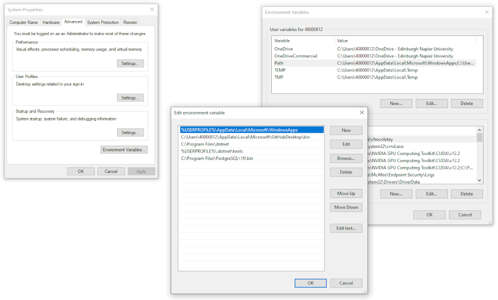
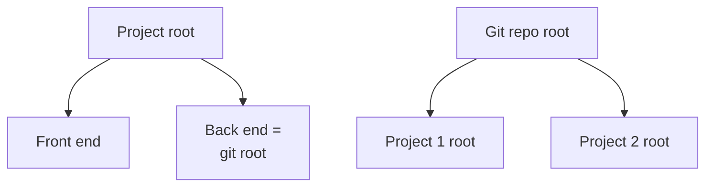
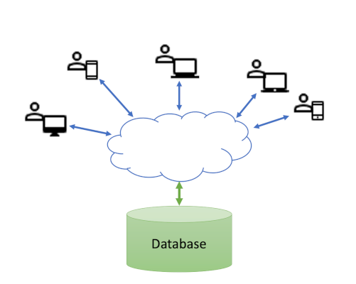

# Working with databases

### Object-relational mapping is the Vietnam of computer science.

 

*Jeff Atwood*

##### Contents

*Under development*

## Prologue: file systems, environments and repositories

This section recaps on some concepts that have been covered before either in this module or
earlier in your studies. They bear repeating here though because they are fundamental to the
way software systems are developed and managed, and having a clear picture of what is going on
behind the scenes helps to understand processes more clearly and goves you greater control over
them.

Although the majority of our interactions with computers now take place via a graphical user
interface (GUI), the files that make up an application are still arranged in a hierarchical tree
structure. This has been a constant feature of operating system design since the introduction of
[Multics](https://en.wikipedia.org/wiki/Hierarchical_file_system) in 1967.
The GUI manages the communications between the application and the underlying file system to a
large extent. However, there are some things that every software engineer should know about.

### The path

Applications and other executable files exist in specific locations in the file system. To run
an application, the operating system needs to know where to find it. The location is known as
the *path* and can be absolute or relative. An absolute path starts at the top level and includes
all directories between the file system *root* and the file of interest. A relative path starts
at the user's current working directory and includes a series of steps to get from that directory
to the file of interest. That can involve moving upwards through the hierarchy until a common
directory is reached before following a branch to the target.

*Fig. 1: File systems on Windows and Mac/Linux*

Normally, you can run an executable file by providing a full path, but usually, you want to be
able to call the executable by name only. In that case, the operating system checks a set of
common locations that are listed in an *environment variable* usually called `PATH`. Fig. 1
illustrates some of the usual locations for installed applications in Windows and Mac/Linux. The
problem is that there are several possible locations each of which may have further subdirectories.
If an application encloses its executable binaries in additional levels of structure, they will
not be visible unless the relevant subdirectory is added to the `PATH`. Fig. 2 illustrates the
dialogs provided by Windows for updating the `PATH`.

*Fig. 2: Updating the Windows PATH*

### The project root

We already mentioned the root of the file system. That is the top-level directory which acts as
the ancestor of all other directories. It is often useful, however, to identify a specific
directory to act as the root for an individual project. A development project in Visual Studio
uses this concept, and by default, project root directories are created in the
_**C:\Users\<username>\source\repos**_ directory on Windows. There are two major benefits to
this approach. The first is that all project root directories are kept together which makes
them easy to lcate if necessary. The second benefit is that it keeps each project independent
and self-contained. While Visual Studio project share some features, they will also all be
slightly different.

Other software tools such as git use the same concept of the root folder. Git is a distributed
software coordination system where each developer has their own copy of the repository of
interest. Keeping the contents in a known location with a common structure allows git to
identify changes when it comes to committing and merging.

It is important to understand, though, that although these two examples share the concept of the
root folder, there is no intrinsic link between them. It would be perfectly possible, for example,
to create a git repository that includes only part of a Visual Studio project. In that case, the
git root would be located in a subdirectory below the project root. Similarly, it is possible to
include more than on project in the same git repository. In that case, each project would occupy
a subdirectory of the git root. This is visualised in Fig. 3.

*Fig. 3: Cases where the project root and git root are different*

### Hidden files

Many applications require configuration and state information to be saved so that the setting
persist from one use of the application to the next. Visual Studio does this, as does git and
many other common tools. Typically, this information is saved in a hidden file in the
relevant root directory - i.e. git information is saved in the git root directory. The most
common way to designate a file as hidden is to start its filename with a dot. Windows allows
you to view hidden files in the file explorer, but you need to select this option explicitly.

It is vital to understand that these hidden files are context-dependent. That is, they relate
specifically to the local environment and include such things as local `PATH` settings,
relative paths and preference setting for the specific user. These settings cannot necessarily
be transferred to another user or environment where the environment may be different because
they would cause errors.

The implication of the last point is that hidden files _**must not**_ be committed to a
shared code repository. If they are, a developer's environment will become corrupted when
they synchronise their repository becuase their own setting will be overwritten by someone
else's.

One of the hidden files that is maintained at the git root is the _**.gitignore**_. This file
maintains a list of the files and subdirectories below the git root will *not* be included in
any git operations. That is, they will not be committed locally or pushed to the remote repo.
All hidden files should be excluded from the repo by adding them to the _**.gitignore**_ file -
this is easy to do via the IDE interface.

If any hidden files are committed to the repo by accident, they need to be removed. In addition,
it is necessary to find out who made the mistake and to ensure that they exclude the files.
Otherwise, they will reappear next time the same developer pushes their changes.

## Databases in application architecture

In general, a database is something that is independent of the rest of the code for an
application. The code makes a connection to the database in order to interact with the
data, but the database itself is managed by its own management software, and is often
running on a different host machine from the application code. Some major advantages of this
model are that the database can be shared between different applications, it can be scaled
separately as the amount of data grows, and it can have specific security measures applied
that are perhaps not relevant to the application as a whole. This typical arrangement is
visualised in Fig. 4. The cloud is included to emphasise the separation between the different
instances of the application and the database, and the fact that the route between the
application and the database may not be known. We often rely on standard internet
infrastructure to resolve the route for us.

*Fig. 4: Multi-user database access*

While Fig. 4 depicts a database in use, there are two other situation that you need to be
aware of. The first is where the database is not intended to be shared, but instead provides
storage exclusively for a single application user, or is used as a local data cache which is
periodically synchronised with a remote shared database. In that case,
[SQLite](https://www.sqlite.org/index.html) is a common choice. It provides single-user access
to relational data structures via standard [SQL](https://www.w3schools.com/whatis/whatis_sql.asp).
It also has a range of APIs for different programming environments and makes use of a local file
for data storage.

It is tempting in this case to assume that the database can be included in the application repo
since it is a local, single user file. However, that would be a mistake because while the database
might be common to all users of the application, the data it contains will almost certainly be
different. This is also a case where the database should be *excluded* from the repo just like
the hidden files. SQLlite implementations typically include the facility to create the database
on the fly if it does not already exist. That is the preferred mechanism for ensuring that every
instance of the application has access to a database.

The second situation is during the development project where different members of the development
team may need slight variations of the database for the changes they are currently working on.
This means that each developer needs their own copy of the database. However, the important
point is that although it may be a feature of the developer's local working environment, it
should be treated in exactly the same way as the shared database that will eventually be used.
Changes should always be made via script files rather than by interacting with the database
structure manually. Those scripts can then be checked into the repo so that they are available for
other member of the development team to use to implement the same changes on their local copies
of the database. Typically, database changes are defined in code using an object-relational
mapper (ORM) tool. Running the change scripts on an instance of the database in order to make
the required changes is known as *migration*.

## Microsoft Entity Framework

## Database migrations

## Epilogue: file systems, environments and repositories

## Further reading

* [Linux directory structure explained](https://linuxhandbook.com/linux-directory-structure/)
