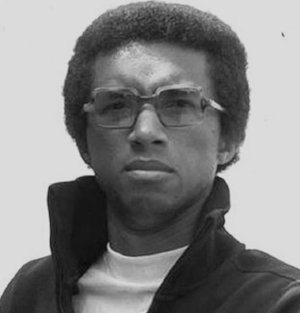

# Interview preparation

### One important key to success is self-confidence. An important key to self-confidence is preparation.

 

*Arthur Ashe*

###### Contents

1. [Know the requirements](#know-the-requirements)
2. [Review and revise](#review-and-revise)
3. [Think about timing](#think-about-timing)

## Know the requirements

The requirements for the interview are described on the
[assessment page](../assessment/interview.md).
Make sure that you have read that material thoroughly.

You need to demonstrate your abilities under the four module learning outcomes which are:

1. Explain software quality in both formal and informal terms
2. Apply design and development practices to optimise the quality of software systems
3. Evaluate software quality
4. Critique software development processes

For each one, you should be prepared to

* Explain any important concepts providing definitions if appropriate
* Demonstrate your theoretical knowledge - e.g. relating to standards or established techniques
* Demonstrate your practical ability - e.g. by describing events during the project work
  or by illustrating your explanations with material from your portfolio
* Show a capacity for reflection and critical analysis

## Review and revise

Make sure that you know the material in your portfolio well. You need to be able to go to
the relevant section quickly and you need to know what you might say about it. A good way
to think about your portfolio contents is as a source of examples. It will not be enough
in answer to a question about code reviews, for example, to just show one in your portfolio.
The *existence* of a code review is not the point; instead, it is a question of *how well
you can explain* code review. You can refer to the examples in your portfolio, but they can
only help with your explanation. They cannot do the whole job for you.

In addition to reviewing your portfolio, you should also review the module notes. If you have
a good understanding of that material, you should be able to answer questions *reasonably*
well. To give better responses, though, you will need to provide evidence of wider reading.
That may include following up on some of the links provided in the notes, but it can also
include other reading that you have done independently.

A third activity under this heading is to make sure that have a good knowledge of the
meaning of technical terms. You should aim to make accurate use of recognised terminology
where appropriate. If you have to resort to vague, everyday language to describe a technical
concept, it suggests that you are not as familiar with it as you should be.

A possible strategy that you could use in revising technical terms is to go through the notes
and to compile a list of the technical terms. You could then extend your list to include
appropriate definitions and references if appropriate.

## Think about timing

There are four learning outcomes and you can assume that the interview will give equal weight
to each one. The time available is 15 minutes which suggests about three minutes per learning
outcome with a further three minutes contingency time. It is important that you try to keep
your responses to around three minutes each; otherwise, you will eat into the time available
for the other learning outcomes. The tutor conducting the interview will help with this, but
that could mean cutting you off before you have made the most important points in your answer.

Several strategies can be used to help with the timing of your answers. One is to spend a few
seconds at the start writing a quick set of bullet points for yourself. This will help you to
include all the points you want to make within the time. Do not spend more than about 30
seconds on this though; otherwise, it will again cut down on the overall answer time.

Another strategy is to adopt a consistent structure to you answers. One well-known example
of this is the [STAR](https://resources.biginterview.com/behavioral-interviews/star-interview-method/)
approach where the letters stand for:

> **S**: Situation
>
> **T**: Task
>
> **A**: Action
>
> **R**: Result

This structure is commonly used in job interview practice and would be appropriate for
questions relating to your own practice such as one specifically related to your last
portfolio entry.

For questions that are more related to theoretical concepts, the STAR method is not
appropriate. Although there are no widely-used methods for this type of question, you
could still come up with something that would give you a starting point. For example,
you might settle on something like CEDS:

> **C**: Concept
>
> **E**: Example
>
> **D**: Discussion
>
> **S**: Summary

Here, the *concept* section would set demonstrate that you know about the topic of the
question by providing a definition, ideally backed up with a reference or source. The
*example* section would follow up on this by using an example to illustrate the concept
in action. The example could be from the literature, from your portfolio or from your
experience with the project generally. The important thing is that the example matches
as closely as possible the main focus of the question that was orginally asked.

The *discussion* section is an opportunity to demonstrate the depth of your understanding
by covering limitations of the concept, alternative ideas or practical difficulties with
its use or implementation. The *summary* section brings your discussion to a close by
highlighting the main points.

> **NB.** Please note that if your learning profile includes agreed modifications to
> standard assessment requirements, your interview slot will be 30 minutes rather than
> 15, and you will have the opportunity for a practice interview in advance of the
> marked one. If your learning profile includes the presence of a reader, scribe or
> other third person, please make sue that you have made appropriate arrangements fro
> both the actual interview and the practice run.
