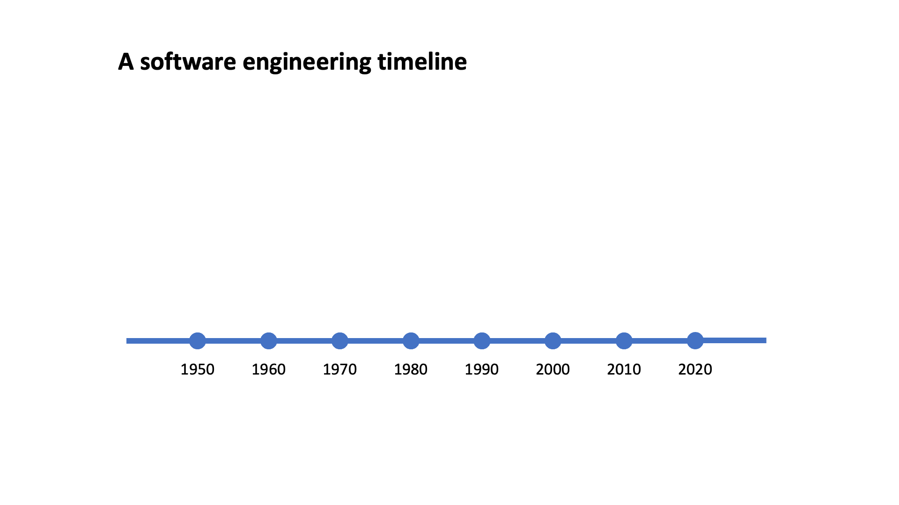

# Introduction

The focus of this module is firmly on quality, and code quality in particular.
It introduces you to some of the international quality standards that are relevant to
software engineering, and provides practical experience with tools and techniques
that you are already aware of, but with the overriding aim of maximising quality.

By the end of the module, you should be able to

1. Design and create high-quality, maintainable code
2. Implement software development processes to optimise the quality of software systems
3. Evaluate and apply software quality assurance metrics and techniques
4. Demonstrate competent and ethical use of AI tools in software development

You will be writing some software and we will be exploring methods for ensuring
that your code meets appropriate quality criteria. That is only part of the jigsaw,
however. We will also be looking at the context in which software is created, the
tools and processes that are used and how to manage them with quality in mind.

As well as traditional skills and technologies, we will also be taking a look at
computer-aided software engineering(CASE) and the use of the new generation of
AI tools such as ChatGPT and StableCode and coding assistants such as
GitHub Copilot.

The module is not designed to teach you basic programming. It is assumed that you
have done that already and that you are already familiar with the object-oriented
approach, and you know your way around an integrated development environment (IDE).
It is also assumed that you have at least a basic understanding of git and GitHub.

Although we will be using C#, the module will not be leading you step by step through
the syntax of the language. As a prospective software engineer, you need to be able to
transfer your skills in one language to another. You will do this many times over your
working life. As noted in [Stephens, 2022, Ch. 12](https://learning.oreilly.com/library/view/beginning-software-engineering/9781119901709/c12.xhtml),
once you are familiar with two or more languages, you come to realise that they are all
very similar. Dating back to 2002, C# was Microsoft's response to Java and the
[original version](https://learn.microsoft.com/en-us/dotnet/csharp/whats-new/csharp-version-history)
had very similar syntax. The languages have diverged since then, but the concepts you have learnt
in relation to Java are all relevant to C#. All you need is a good tutorial and some
reference material, and you should soon feel at home.

{: standalone #fig1 data-title="A software engineering timeline" }

History can be instructive: it shows you the connections between ideas, illuminates
the emergence of innovations and identifies old ideas that have been left behind.

From the perspective of a student today, some things feel as though they have been
around forever. It pays to remember that every digital innovation has been brought
about by software engineers. Fig. 1 provides an *extremely* selective historical tour.
It is intended to be illustrative rather than comprehensive.

## What is a software engineer?

Before addressing the question of what makes a person a software engineer, let's briefly
consider some common terms for people who write software that are definitely *not*
software engineers.

### Hacker

> A person skilled in information technology who uses their technical knowledge to
> achieve a goal or overcome an obstacle, within a computerized system by non-standard
> means.
>
> 

Now almost exclusively used in the sense of a *security hacker*, someone attempting to
infiltrate or disable a computer system without authorisation, a hacker was simply
someone adept at writing code. It connoted someone who could get things working quickly
but not necessarily in a principled way. This meaning is the basis of the word *hackathon*.

### Script kiddie

> A script kiddie is a derogatory term used to refer to non-serious hackers who [...] use
> hacking programs written by other hackers because they often lack the skills to write
> their own.
>
> 

The name suggests an immaturity in this group of people. They have no serious interest in
building their knowledge and expertise; instead, they are just excited by the idea of
causing mischief.

### Code monkey

> A [...] programmer or developer who is seen as someone who writes code quickly and
> without much thought or creativity [...] only capable of mechanically following
> instructions without understanding the broader implications of their work.
>
> 

This type of programmer is good at what they do, but have no interest in the wider context.
They do not care about the purpose or impact of the development, and they avoid interactions
with users, relying on others to create instructions they can follow.

[Stephens, 2022, Ch. 1](https://learning.oreilly.com/library/view/beginning-software-engineering/9781119901709/c01.xhtml#please-read)
sets out the main dimensions of software engineering going beyond simply coding.
The chapter is short and you should read it this week. In the meantime, click the image for a
summary...

An official definition of software engineering is provided by the IEEE:

> The application of a systematic, disciplined, quantifiable approach to the development,
> operation, and maintenance of software; that is, the application of engineering to
> software.
>
> [IEEE Standard Glossary of Software Engineering Terminology](10.1109/IEEESTD.1990.101064)

This definition refers to *engineering* without actually defining it. The following
extract from [Software Engineering for the 21st Century](https://www.cs.cmu.edu/~Compose/SEprinciples-pub-rev2.pdf)
fills that gap.

> **Engineering Fundamentals**
>
> The systematic method and attention to pragmatic solutions that shapes software engineering
> practice is the practical, goal-directed method of engineering, together with specific
> knowledge about design and evaluation techniques.
>
> Engineering quality resides in engineering judgment. Tools, techniques, methods, models,
> and processes are means that support this end. They can enhance sound judgment, and they
> may make development activities more accurate and efficient, but they cannot replace sound
> judgment.
>
> Quality of the software product depends on the engineer's faithfulness to the engineered
> artifact. This quality is achieved through commitment to understanding the client’s
> needs; it is evaluated by assessing the properties of the artifact that are important to
> the client. This is the basis for ethical practice.
>
> Engineering requires reconciling conflicting constraints. These constraints arise both
> from requirements and from implementation considerations. They typically overconstrain
> the system, so the engineer must find reasonable compromises that reflect the client's
> priorities. Engineers generate and compare alternative designs and refine the most
> promising; they prefer quantitative evaluations and predictions. Finding sufficiently
> good cost-effective solutions is usually preferable to optimization.
>
> Engineering skills improve as a result of careful systematic reflection on experience.
> A normal part of any project should be critical evaluation of the work. Critical
> evaluation of prior and competing work is also important, especially as it informs
> current design decisions.

In other disciplines such as construction or power distribution, people need to hold an
officially recognised professional qualification before they can call themselves engineers.
That is not the case with software engineering, and there is no strict enforcement of the
use of the title. However, there are several professional associations such as the IEEE and the
[**British Computer Society (BSC)**](https://www.bcs.org/) which offer professional
certifications and which publish codes of conduct. Membership of such a body and holding
one or more professional qualifications can be a sign that the individual is competent
and trustworthy. It is the same principle as standards compliance.

As you have seen, there is a huge body of information available that sets out the
expectations for a software engineer. The IEEE publishes a handy digest in the form of
[BS/ISO/IEC 24773-1:9019](https://napier.primo.exlibrisgroup.com/permalink/44NAP_INST/19n0mho/cdi_bsi_primary_000000000030314312),
the Software Engineering Body of Knowledge (SWEBOK). Along with
[ISO/IEC/IEEE 24765:2010](https://pascal.computer.org/sev_display/index.action),
Systems and Software Engineering — Vocabulary (SEVOCAB), SWEBOK makes a useful reference
when a full standard might be too onerous to read.

## Further reading

* [SWEBOK: Software Engineering Body of Knowledge](https://napier.primo.exlibrisgroup.com/permalink/44NAP_INST/19n0mho/cdi_bsi_primary_000000000030314312)
* [SEVOCAB: System Engineering dictionary of terms](https://pascal.computer.org/sev_display/index.action)
* [ISO/IEC/IEEE 15288:2023](https://doi-org.napier.idm.oclc.org/10.1109/IEEESTD.2023.10123367)

