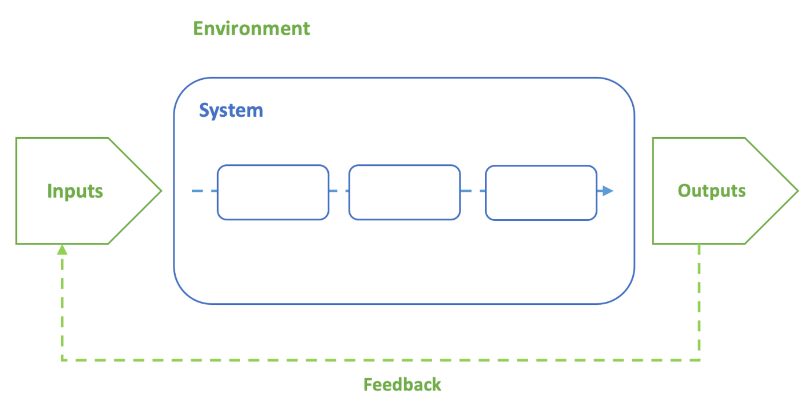

# Introduction

###### Contents

1. [What this module covers (and what it doesn't...)](#what-this-module-covers-and-what-it-doesnt)
2. [A brief historical tour](#a-brief-historical-tour)
3. [International standards](#international-standards)
4. [What is a software engineer?](#what-is-a-software-engineer)
5. [System concepts](#system-concepts)
6. [Further reading](#further-reading)

## What this module covers (and what it doesn't...).

The focus of this module is firmly on quality, and code quality in particular.
It introduces you to some of the international quality standards that are relevant to
software engineering, and provides practical experience with tools and techniques
that you are already aware of, but with the overriding aim of maximising quality.

By the end of the module, you should be able to

1. Explain software quality in both formal and informal terms
2. Apply design and development practices to optimise the quality of software systems
3. Evaluate software quality
4. Critique software development processes

You will be writing some software and we will be exploring methods for ensuring
that your code meets appropriate quality criteria. That is only part of the jigsaw,
however. We will also be looking at the context in which software is created, the
tools and processes that are used and how to manage them with quality in mind.

As well as traditional skills and technologies, we will also be taking a look at
computer-aided software engineering(CASE) and the use of the new generation of
AI tools such as ChatGPT and StableCode and coding assistants such as
GitHub Copilot.

The module is not designed to teach you basic programming. It is assumed that you
have done that already and that you are already familiar with the object-oriented
approach, and you know your way around an integrated development environment (IDE).
It is also assumed that you have at least a basic understanding of git and GitHub.

Although we will be using C#, the module will not be leading you step by step through
the syntax of the language. As a prospective software engineer, you need to be able to
transfer your skills in one language to another. You will do this many times over your
working life. As noted in [Stephens, 2022, Ch. 12](https://learning.oreilly.com/library/view/beginning-software-engineering/9781119901709/c12.xhtml),
once you are familiar with two or more languages, you come to realise that they are all
very similar. Dating back to 2002, C# was Microsoft's response to Java and the
[original version](https://learn.microsoft.com/en-us/dotnet/csharp/whats-new/csharp-version-history)
had very similar syntax. The languages have diverged since then, but the concepts you have learnt
in relation to Java are all relevant to C#. All you need is a good tutorial and some
reference material, and you should soon feel at home.

The module site provide basic notes on each topic with additional links to other
material. Reading comes in two types: essential reading and further reading. You
are encouraged to read as widely as possible in the field of software engineering
and the reading links provided here are just a starting point. The essential
reading is the minimum you should do, and you will see it highlighted
<a href="#please-read">like this</a>.

The reading is typically from the textbooks on the
[reading list](https://eu.alma.exlibrisgroup.com/leganto/public/44NAP_INST/lists/6676828460002111?auth=SAML)

## A brief historical tour

###### {:target="_blank"}

History can be instructive: it shows you the connections between ideas, illuminates
the emergence of innovations and identifies old ideas that have been left behind.

From the perspective of a student in 2023, some things feel as though they have been
around forever. It pays to remember that every digital innovation has been brought
about by software engineers. Click the image for an *extremely* selective historical tour.
It is intended to be illustrative rather than comprehensive.

## International standards

The purpose of a standard is to rationalise the terminology, roles and processes in a
domain. Without standards to guide technical work, companies,organisations and individuals
are free to make up their own rules as they go along. This causes many difficulties
including

* Hampering communication
* Increasing costs
* Creating the risk of vendor lock-in
* Preventing interoperability
* etc.

Standards also provide a badge of respectability for tools and organisations. If a
company claims conformance with a standard, or better still, can show that it has been
inspected by an appropriate authority and is *certified* as conformant, that is a sign
that it can be trusted.

Some standards bodies that you need to be aware of as a future software engineer are
briefly described below.

The [**International Organization for Standardization (ISO)**](https://www.iso.org/about-us.html)
is an independent organisation with a membership made up of 169 national standards
bodies from across the world. Through a series oftechnical committees, it manages the
creation and maintenance of international standards in many fields from paper sizes to
the use of concrete in construction. The ISO maintains a [large number of standards](https://www.iso.org/ics/35.080/x/)
relevant to software engineering. We will be referring to some of them in this module
and several are available through the library.

The [**British Standards Institution (BSI)**](https://www.bsigroup.com/en-GB/)
is the British national standards body and a member of the ISO. The majority of
British technical standards are identical to the equivalent ISO standards. The BSI provides
a similar[list of standards](https://knowledge.bsigroup.com/search?query=software%20engineering).

The ISO collaborates with two other similar organisations to promote the development of
global consensus-based standards. They are
[**The International Electrotechnical Commission (IEC)**](https://www.iec.ch/homepage)
and [**The International Telecommunications Union (ITU)**
](https://www.itu.int/)

Together, the ISO, IEC and ITU form the
[**World Standards Cooperation (WSC)](https://www.worldstandardscooperation.org/).

Another organisation with a role in drafting standards is the [**Institute of Electrical and
Electronics Engineers (IEEE)](https://www.ieee.org/). The IEEE attempts to keep pace with
technological developments andpublishes around 100 standards a year. Its approach is
bottom-up in the sense that standards committees are made up of expert practitioners in
the relevant field. Where interests overlap, the IEEE also cooperates with the WSC, and
standards are often published with the same number and a series of prefixes to show that
they are recognised by the different organisations. For example the standard that describes
system lifecycle processes is
[ISO/IEC/IEEE 15288:2023](https://doi-org.napier.idm.oclc.org/10.1109/IEEESTD.2023.10123367)

## What is a software engineer?

Before addressing the question of what makes a person a software engineer, let's briefly
consider some common terms for people who write software that are definitely *not*
software engineers.

##### Hacker

> A person skilled in information technology who uses their technical knowledge to
> achieve a goal or overcome an obstacle, within a computerized system by non-standard
> means.
>
> 

Now almost exclusively used in the sense of a *security hacker*, someone attempting to
infiltrate or disable a computer system without authorisation, a hacker was simply
someone adept at writing code. It connoted someone who could get things working quickly
but not necessarily in a principled way. This meaning is the basis of the word *hackathon*.

##### Script kiddie

> A script kiddie is a derogatory term used to refer to non-serious hackers who [...] use
> hacking programs written by other hackers because they often lack the skills to write
> their own.
>
> 

The name suggests an immaturity in this group of people. They have no serious interest in
building their knowledge and expertise; instead, they are just excited by the idea of
causing mischief.

##### Code monkey

> A [...] programmer or developer who is seen as someone who writes code quickly and
> without much thought or creativity [...] only capable of mechanically following
> instructions without understanding the broader implications of their work.
>
> 

###### {:target="_blank"}

This type of programmer is good at what they do, but have no interest in the wider context.
They do not care about the purpose or impact of the development, and they avoid interactions
with users, relying on others to create instructions they can follow.

[Stephens, 2022, Ch. 1](https://learning.oreilly.com/library/view/beginning-software-engineering/9781119901709/c01.xhtml#please-read)
sets out the main dimensions of software engineering going beyond simply coding.
The chapter is short and you should read it this week. In the meantime, click the image for a
summary...

An official definition of software engineering is provided by the IEEE:

> The application of a systematic, disciplined, quantifiable approach to the development,
> operation, and maintenance of software; that is, the application of engineering to
> software.
>
> [IEEE Standard Glossary of Software Engineering Terminology](10.1109/IEEESTD.1990.101064)

This definition refers to *engineering* without actually defining it. The following
extract from [Software Engineering for the 21st Century](https://www.cs.cmu.edu/~Compose/SEprinciples-pub-rev2.pdf)
fills that gap.

> **Engineering Fundamentals**
>
> The systematic method and attention to pragmatic solutions that shapes software engineering
> practice is the practical, goal-directed method of engineering, together with specific
> knowledge about design and evaluation techniques.
>
> Engineering quality resides in engineering judgment. Tools, techniques, methods, models,
> and processes are means that support this end. They can enhance sound judgment, and they
> may make development activities more accurate and efficient, but they cannot replace sound
> judgment.
>
> Quality of the software product depends on the engineer's faithfulness to the engineered
> artifact. This quality is achieved through commitment to understanding the client’s
> needs; it is evaluated by assessing the properties of the artifact that are important to
> the client. This is the basis for ethical practice.
>
> Engineering requires reconciling conflicting constraints. These constraints arise both
> from requirements and from implementation considerations. They typically overconstrain
> the system, so the engineer must find reasonable compromises that reflect the client's
> priorities. Engineers generate and compare alternative designs and refine the most
> promising; they prefer quantitative evaluations and predictions. Finding sufficiently
> good cost-effective solutions is usually preferable to optimization.
>
> Engineering skills improve as a result of careful systematic reflection on experience.
> A normal part of any project should be critical evaluation of the work. Critical
> evaluation of prior and competing work is also important, especially as it informs
> current design decisions.

In other disciplines such as construction or power distribution, people need to hold an
officially recognised professional qualification before they can call themselves engineers.
That is not the case with software engineering, and there is no strict enforcement of the
use of the title. However, there are several professional associations such as the IEEE and the
[**British Computer Society (BSC)**](https://www.bcs.org/) which offer professional
certifications and which publish codes of conduct. Membership of such a body and holding
one or more professional qualifications can be a sign that the individual is competent
and trustworthy. It is the same principle as standards compliance.

As you have seen, there is a huge body of information available that sets out the
expectations for a software engineer. The IEEE publishes a handy digest in the form of
[BS/ISO/IEC 24773-1:9019](https://napier.primo.exlibrisgroup.com/permalink/44NAP_INST/19n0mho/cdi_bsi_primary_000000000030314312),
the Software Engineering Body of Knowledge (SWEBOK). Along with
[ISO/IEC/IEEE 24765:2010](https://pascal.computer.org/sev_display/index.action),
Systems and Software Engineering — Vocabulary (SEVOCAB), SWEBOK makes a useful reference
when a full standard might be too onerous to read.

## System concepts

The word *system* is used regularly in everyday language and most people have
a working understanding of what a system is. However, in a technical context it
is important to have a clear definition. This helps to define the
processes needed to design, create, operate, maintain and communicate with a
system. From a software engineering point of view, we are mainly interested in
systems that consist only of code; however, software control system may interact
with physical devices, humans interact with a software system via its user
interface and systems communicate with each other over standard channels. Ignoring
such concerns can lead to software systems that do not fulfil the purpose they
were designed for.

The international standard [ISO/IEC/IEEE 15288:2023](https://doi-org.napier.idm.oclc.org/10.1109/IEEESTD.2023.10123367)
sets out to define a common framework for understanding systems and their
lifecycles. It aims to facilitate communication between different stakeholders by
defining a set of generic processes and associated terminology with the overall
goal of delivering high quality products. It defines a system as an

> arrangement of parts or elements that together exhibit a stated behaviour or
> meaning that the individual constituents do not.

This definition, illustrated in Fig. 1, highlights the need for a designed system to
have a clear *purpose*. Elsewhere, the standard clarifies that a system can include
elements that can be

> hardware elements, software elements, data, humans,
> processes, services, procedures, facilities, materials,
> and naturally occurring entities.

*Fig. 1: General system visualisation*

The [INCOSE Systems Engineering Handbook](https://eu.alma.exlibrisgroup.com/leganto/public/44NAP_INST/citation/6677951920002111?auth=SAML)
extends the general definition to *engineered systems* which are

> designed or adapted to interact with an anticipated operational environment to
> achieve one or more intended purposes while complying with applicable constraints.

This formulation highlights the need for the system to conform to expectations.
In a software engineering project, such expectations have to be defined at the start
of a project (or smaller unit of work) and then evaluated at the end through an
appropriate form of testing.

Identifying the *system boundary*, the conceptual interface between the system
and its environment, is very important in software engineering because the boundary
defines what is part of the system and what is not. From a development point of
view, that is equivalent to defining the required functionality of the system. From
a project management point of view, it determines the scope of the project. Anything
outside the boundary is not the responsibility of the project.

This is a simplified picture, however. Different stakeholders might identify the
system boundary differently depending on their interests. In addition, any component
part of the system, or *system element*, can be regarded as a system in its own
right, and may be further decomposed into smaller elements. Thus, there is a
hierarchical relationship between elements, and a stakeholder may only be concerned
with a subset of these system elements. When focusing on a particular system -
whether or not it is a component of a larger system - it can be referred to as the
*system of interest* (SOI).

On page 11, [ISO/IEC/IEEE 15288:2023](https://doi-org.napier.idm.oclc.org/10.1109/IEEESTD.2023.10123367)
defines the following six key characteristics of systems:

* defined boundaries encapsulate meaningful needs and practical solutions;
* there is a hierarchical or other relationship between system elements;
* an entity at any level in the SoI can be viewed as a system;
* a system comprises an integrated, defined set of subordinate system elements;
* humans can be viewed as both users external to a system (e.g. users) and as system
  elements (e.g. operators) within a system;
* a system can be viewed in isolation as an entity, i.e. a product; or as a
  collection of functions capable of interacting with its surrounding environment,
  i.e. a set of services.

ISO15288 also defines the concept of a *system of systems* (SOS). In an SOS,
systems interact to provide capabilities that no one system can deliver on its
own. This is very similar to the relationships among system elements. The
distinguishing feature of an SOS is that the individual systems are operationally
and managerially independent. Consider a software application that makes use of data
from a cloud service by calling an API function. There is interaction between the two
systems, but they are managed independently and operate independently. This
interaction represents an SOS rather than a single system that is decomposed
into smaller elements.

The SOS concept also demonstrates a limitation of the illustration in Fig. 1 and the
subsequent explanation: in the case where your SOI is part of an SOS, it is in
fact necessary to consider communications across the system boundary. For example,
APIs are sometimes unavailable. If the calling application is well-designed, it
will anticipate the problem and provide a fallback so that it is not dependent on
the external system.

For other definitions of systems and related concepts, see the
[Software and Systems Engineering Vocabulary (SEVOCAB)](https://pascal.computer.org/sev_display/index.action).

## Further reading

* [SWEBOK: Software Engineering Body of Knowledge](https://napier.primo.exlibrisgroup.com/permalink/44NAP_INST/19n0mho/cdi_bsi_primary_000000000030314312)
* [SEVOCAB: System Engineering dictionary of terms](https://pascal.computer.org/sev_display/index.action)
* [ISO/IEC/IEEE 15288:2023](https://doi-org.napier.idm.oclc.org/10.1109/IEEESTD.2023.10123367)
