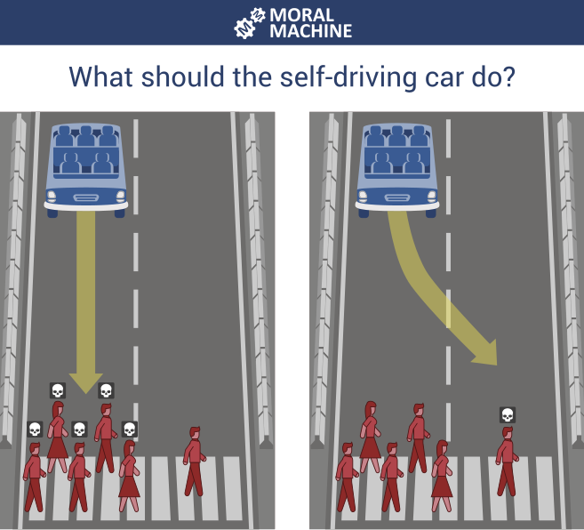
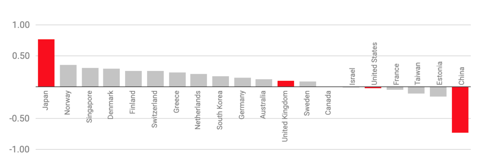

When it comes to abstract concepts like ethics and professionalism, it can be difficult to
find clear definitions. Many standard definitions are very abstract themselves and are
designed to be applied to a wide range of contexts. This means that they need to be
interpreted for a particular case.

In general, both concepts are used to describe the desirable characteristics of a person
acting in a particular role. Loui and Millar (2007) describe ethics as follows:

> #### Ethics
>
> The study of the actions that a responsible individual ought to choose, the values that an
> honorable individual ought to espouse, and the character that a virtuous individual ought
> to have.
>
> For example, everyone ought to be honest, fair, kind, civil, respectful, and trustworthy.
> Besides these general obligations that everyone shares, professionals have additional
> obligations that arise from the responsibilities of their professional work and their
> relationships with clients, employers, other professionals, and the public.
>
> [(Loui & Miller, 2007)](https://onlineethics.org/cases/ethics-and-professional-responsibility-computing)

Marebane et al., 2023 identify seven dimensions of professional responsibility in the field
of software engineering. These are summarised in the tour below.

<h6 align="center"> Here's you, engineering your software...

</h6>

## The trolley problem

There follows a series of fairly well-known ethical dilemmas related to death and
responsibility. At first, they seem contrived and of little relevance to software engineers.

1. You are walking by a railway track when you notice a trolley that is out of control
   and heading towards a group of five workers. Next to you, there is a lever that will
   divert the trolley onto an empty siding that will save the lives of the workers.
   **Do you pull the lever?**
2. You are in the same situation, except this time there is a single worker on the siding.
   That person will die if you pull the lever, but on the other hand you will still save
   the lives of the original group. **Do you pull the lever?**
3. This time there is no siding and you are on a bridge over the railway track. The trolley
   is still out of control and heading towards the group of five workers, but there is a
   large man standing next to you. If you push him off the bridge his body will block the
   track and save the workers. **Do you push the man off the bridge?**

The trolley problem is summarised in a
[TEDEd animation](https://ed.ted.com/lessons/would-you-sacrifice-one-person-to-save-five-eleanor-nelsen)
bu Eleanor Nelson.

In 2018, researchers from MIT ran an experiment called
the [Moral Machine](https://doi.org/10.1038/s41586-018-0637-6) in which people were
invited to choose the course of action that an autonomous vehicle should take when
faced with a life-and-death decision. Overall, 40 million decisions were captured from
people in 233 countries. Fig. 1 shows an example of one of the questions.

*Fig. 1: A question in the Moral Machine*

Surprising patterns emerged when the data was analysed that were dependent on the
cultural preferences in different parts of the world. For example, some cultures
prioritised saving passengers in the car over pedestrians while others took the
opposite view. This difference is visualised in Fig. 2 where a score closer to 1
indicates that respondents placed a greater emphasis on sparing pedestrians. If the score
is closer to -1, they preferred to save passengers while 0 is the global average.

*Fig. 2. Choosing to save pedestrians or passengers
([Hao, 2018](https://www.technologyreview.com/2018/10/24/139313/a-global-ethics-study-aims-to-help-ai-solve-the-self-driving-trolley-problem/)).*

The choice of whether to save the very young or the very old revealed a more uncomfortable
difference in cultural preferences. Faced with a scenario in which the brakes on the
autonomous vehicle had failed and at least one death was inevitable, respondents had to
choose between a baby and an elderly grandmother. The results are shown in Fig. 3 where
a score closer to 1 indicates that respondents preferred to save the young and a score
closer to -1 showed they preferred to save the old. Again, 0 represents the global average.

*Fig. 3: Choosing to save the young or the old.
([Hao, 2018](https://www.technologyreview.com/2018/10/24/139313/a-global-ethics-study-aims-to-help-ai-solve-the-self-driving-trolley-problem/)).*
