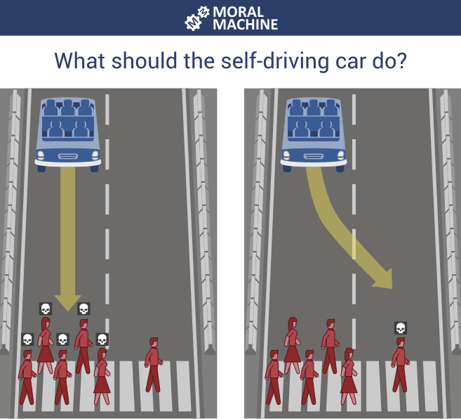
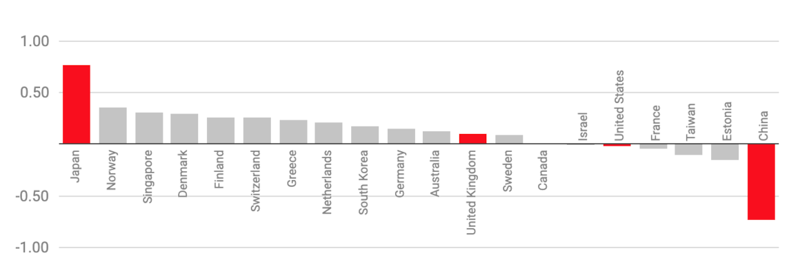
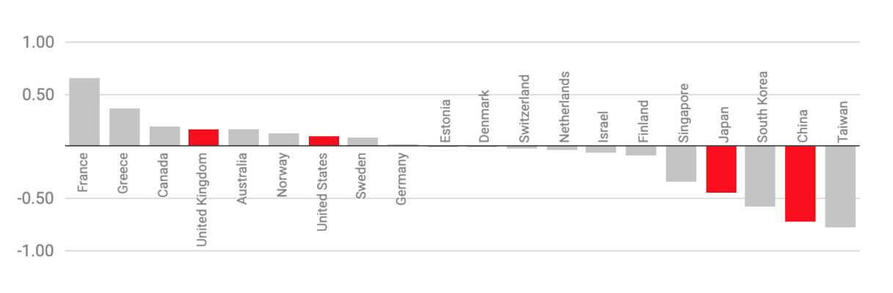

# Ethics

When it comes to abstract concepts like ethics and professionalism, it can be difficult to
find clear definitions. Many standard definitions are very abstract themselves and are
designed to be applied to a wide range of contexts. This means that they need to be
interpreted for a particular case.

In general, both concepts are used to describe the desirable characteristics of a person
acting in a particular role. Loui and Millar (2007) describe ethics as follows:

> #### Ethics
>
> The study of the actions that a responsible individual ought to choose, the values that an
> honorable individual ought to espouse, and the character that a virtuous individual ought
> to have.
>
> For example, everyone ought to be honest, fair, kind, civil, respectful, and trustworthy.
> Besides these general obligations that everyone shares, professionals have additional
> obligations that arise from the responsibilities of their professional work and their
> relationships with clients, employers, other professionals, and the public.
>
> [(Loui & Miller, 2007)](https://onlineethics.org/cases/ethics-and-professional-responsibility-computing)

[Marebane et al., 2023](https://doi.org/10.1109/AFRICON55910.2023.10293734) identify seven dimensions of 
professional responsibility in the field of software engineering:

Public

* To ensure the safety, health, and welfare of the public
* Contribute to public policies on computing
* Not to cause harm
* Ensure the security of stored data for society
* To serve and promote public good
* Improve public understanding of computing and its consequences
* Create software that respects and values people
* Have concerns about the social effects of computers on operators, users, and the public

Clients/users

* Perform assigned tasks competently, according to professional standards
* Concern for the social effects of computers on operators, users, and the public
* Exercise due diligence in creating software, and they should be as candid as possible about both known and unknown faults in the software—particularly software for safety-critical systems
* Should prevent harm to the ultimate users and others
* Safety of software product users
* Security vulnerabilities
* Develop quality products for clients
* Consult customers and other experts to ensure solving the real problem of the client
* Protect the privacy of personal information of clients and other stakeholders of their products
* Report all relevant findings honestly and accurately

Organisations/management/employer

* Keep trade secrets information of employers confidential
* Honour other forms of intellectual property
* Be aware of potential conflicts of interest
* Report and resolve security vulnerabilities

Other professionals/colleagues

* Demonstrate a kind of respect called collegiality
* Be open for peer review
* Accept and provide appropriate professional review
* Acquire and maintain professional competence
* Follow professional standards
* Mentor junior professionals
* Produce maintainable products

Self

* Accepts responsibility for design decisions and must not approve inappropriate designs even if ordered to do so
* Object openly to decisions that violate professional standards
* Be honest about capabilities
* Honour contracts, agreements and assigned responsibilities
* Access computing and communication resources only when authorised to do so

Profession

* Consider not only the specifications but non-technical issues as well, e.g. quality of life of users and others
* Volunteer knowledge of the profession
* Strive to achieve the highest quality, effectiveness and dignity in both the process and products of professional work
* Know and respect existing laws pertaining to professional work
* Give comprehensive and thorough evaluations of computer systems and their impacts, including analysis of possible risks

Legislators

* Adhere to the law and regulatory mandates

## The trolley problem

There follows a series of fairly well-known ethical dilemmas related to death and
responsibility. At first, they seem contrived and of little relevance to software engineers.

1. You are walking by a railway track when you notice a trolley that is out of control
   and heading towards a group of five workers. Next to you, there is a lever that will
   divert the trolley onto an empty siding that will save the lives of the workers.
   **Do you pull the lever?**
2. You are in the same situation, except this time there is a single worker on the siding.
   That person will die if you pull the lever, but on the other hand you will still save
   the lives of the original group. **Do you pull the lever?**
3. This time there is no siding and you are on a bridge over the railway track. The trolley
   is still out of control and heading towards the group of five workers, but there is a
   large man standing next to you. If you push him off the bridge his body will block the
   track and save the workers. **Do you push the man off the bridge?**

The trolley problem is summarised in a
[TEDEd animation](https://ed.ted.com/lessons/would-you-sacrifice-one-person-to-save-five-eleanor-nelsen)
bu Eleanor Nelson.

In 2018, researchers from MIT ran an experiment called
the [Moral Machine](https://doi.org/10.1038/s41586-018-0637-6) in which people were
invited to choose the course of action that an autonomous vehicle should take when
faced with a life-and-death decision. Overall, 40 million decisions were captured from
people in 233 countries. Fig. 1 shows an example of one of the questions.

{: standalone #fig1 data-title="A question in the Moral Machine" }

Surprising patterns emerged when the data was analysed that were dependent on the
cultural preferences in different parts of the world. For example, some cultures
prioritised saving passengers in the car over pedestrians while others took the
opposite view. This difference is visualised in Fig. 2 where a score closer to 1
indicates that respondents placed a greater emphasis on sparing pedestrians. If the score
is closer to -1, they preferred to save passengers while 0 is the global average.

{: standalone #fig2 data-title="Choosing to save pedestrians or passengers" }

The choice of whether to save the very young or the very old revealed a more uncomfortable
difference in cultural preferences. Faced with a scenario in which the brakes on the
autonomous vehicle had failed and at least one death was inevitable, respondents had to
choose between a baby and an elderly grandmother. The results are shown in Fig. 3 where
a score closer to 1 indicates that respondents preferred to save the young and a score
closer to -1 showed they preferred to save the old. Again, 0 represents the global average.

{: standalone #fig3 data-title="Choosing to save the young or the old" }

## Dark patterns

In software engineering, dark patterns are design practices intentionally crafted to deceive, manipulate, 
or coerce users into making choices they might not otherwise make. These patterns are implemented within 
the interface, user experience (UX), or content, subtly guiding users towards actions that benefit the 
organisation or product rather than the user. Examples of dark patterns include tricking users into 
subscribing to a service, adding extra items to a shopping cart, making it difficult to cancel a 
subscription, or hiding essential information to influence user behaviour. The website
[Deceptive Patterns](https://www.deceptive.design/) lists over 400 examples in its hall of shame.

The concept of dark patterns raises ethical concerns, as these tactics exploit cognitive biases and trust, 
often prioritising short-term gains over long-term user satisfaction and transparency. A common dark 
pattern example is the "roach motel," where users can sign up for a service easily but find it challenging 
to cancel. Another example is "forced continuity," where a user is enrolled in a paid subscription after 
a trial period without a clear reminder or option to opt-out. Such patterns can erode trust, leading to 
user frustration and potential reputational harm for the company involved.

Dark patterns contrast with good UX design principles, which aim to create interfaces that are intuitive, 
user-friendly, and aligned with the user’s best interests. As awareness around ethical design grows, 
there is increasing scrutiny from both regulatory bodies and the public regarding the use of dark 
patterns. Responsible software engineering prioritises transparent, honest interfaces that respect user
autonomy, aiming to build trust and promote ethical engagement rather than manipulation.

## The engineer's responsibility

When faced with an ethical decision, software engineers are expected to make judgements that balance 
technical considerations with the potential impact of their actions on users, organisations, and society. 
Ethical judgements in software engineering often require an evaluation of the risks, benefits, and 
responsibilities associated with a particular decision, as well as an awareness of professional standards 
and regulatory requirements. These judgements are not always straightforward, as they involve assessing 
complex situations where multiple interests and outcomes must be weighed.

One type of ethical judgement involves weighing privacy against functionality. Engineers must decide how 
much user data to collect to ensure an application’s functionality while respecting users’ right to privacy. 
For instance, collecting more data than necessary might improve user experience or increase personalisation, 
but it can also compromise privacy and expose users to risks if that data is mishandled. Engineers are 
expected to make balanced choices, limiting data collection to what is strictly necessary and ensuring 
transparency about data usage.

Another key tradeoff relates to security versus usability. While strong security measures protect users 
and systems, they can also make applications less user-friendly if they are overly complex. Engineers may 
need to decide how to implement security protocols that are effective without overburdening users, such 
as requiring complex passwords or multiple authentication steps. An ethical judgement here involves 
ensuring adequate security while keeping the application accessible, especially for users with varying 
levels of technical ability.

Engineers are also expected to make ethical judgements about fairness and bias, particularly when working 
with algorithms that may impact decision-making. In situations where automated systems influence hiring, 
credit scoring, or healthcare, engineers must carefully assess the fairness of these systems. This 
includes recognising and addressing biases in data and algorithms that could lead to discriminatory 
outcomes. Ethical judgement here involves considering whether an algorithm is treating all groups fairly 
and deciding how to correct biases to ensure equitable treatment for all users.

Another ethical consideration for engineers is the balance between innovation and safety. When developing 
new features or products, there is often pressure to deliver quickly to stay competitive. However, 
engineers are expected to evaluate whether rushing development could lead to untested or unreliable code, 
which might expose users to harm or disruption. Making an ethical judgement here involves prioritising 
user safety and reliability over rapid deployment, even if it means slowing down the pace of innovation.

Finally, engineers must make ethical judgements regarding accountability and responsibility. In cases 
where a system fails or leads to unintended consequences, engineers are expected to take responsibility 
for identifying and addressing issues, rather than deflecting blame. Ethical judgement in these 
situations involves being transparent about the cause of the problem, learning from mistakes, and 
taking corrective action to prevent future occurrences. This judgement extends to ensuring that software 
is designed with mechanisms to mitigate potential risks, reducing the likelihood of harm.

These ethical judgements require a balance of technical skill, moral awareness, and a commitment to 
upholding ethical standards in software engineering. By making these judgements thoughtfully, engineers 
contribute to responsible technology development, demonstrating a dedication to protecting users, 
promoting fairness, and maintaining public trust in software systems. The engineer's responsibility
is discussed in Martin Fowler's presentation at the GOTO conference in 2014. Although the event was some 
time ago, it is interesting to consider what has changed since and what has not. It is clear that some of 
the issues he discusses are still relevant today.

{: standalone #fig4 data-title="Martin Fowler at GOTO2014" }

## Further reading

* Ethics and professional responsibility in computing [(Loui & Miller, 2007)](https://onlineethics.org/cases/ethics-and-professional-responsibility-computing)
* Mapping of studies on ethical responsibilities of software engineers [(Marebane, Hans & Kgaphola, 2023)](https://doi.org/10.1109/AFRICON55910.2023.10293734)
* [Stephens, 2022, Ch. 20](https://learning.oreilly.com/library/view/beginning-software-engineering/9781119901709/c20.xhtml)
* [O'Regen, 2022, Ch. 2](https://link-springer-com.napier.idm.oclc.org/chapter/10.1007/978-3-031-07816-3_2)
