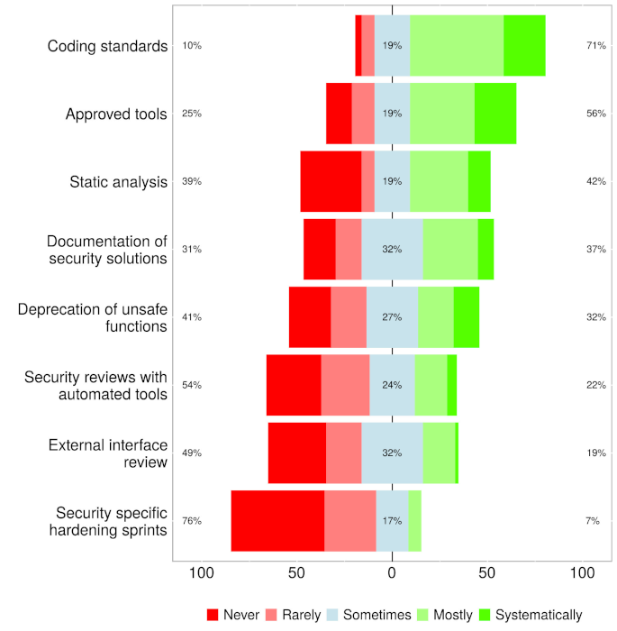

# Security

Another critical ethical responsibility is security. Engineers are responsible for developing software 
that is safe and resilient, protecting users from risks such as data breaches, identity theft, and 
malicious attacks. Security involves proactive measures to identify and mitigate vulnerabilities, regular 
updates, and secure coding practices that help protect both user data and the broader digital ecosystem.

The CIA triad of Confidentiality, Integrity and Availability illustrated in Fig. 1 is a broad,
commonly-used framework for describing system and data security.

{: standalone #fig1 data-title="The CIA triad" }

> **Confidentiality**: Access to data and systems is restricted to authorised users
>
> **Integrity**: The data content of a system should be correct and protected from improper
> modification, either accidental or malicious.
>
> **Availability**: Genuine users should be able to access systems and data whenevery they need to.

The first scenario that usually comes to mind when considering security is the deliberate
intrusion by an unauthorised user. However, threats come in many other forms and the CIA triad
provides a structure in which to think about the full range of possible threats. The table
below contrasts accidental and deliberate threats in relation to their general source.

| Source      | Deliberate                                                  | Accidental                  |
|-------------|-------------------------------------------------------------|-----------------------------|
| Human       | Abuse of privilege, Spoofing                                | Operational error           |
| Software    | SQL injection, Ransomware, Denial of Service, Worms/viruses | Incompatibility             |
| Hardware    | Physical sabotage                                           | Power failure, Disk failure |
| Environment | Terrorist attack                                            | Natural disaster            |

Some aspects of security - while important - are the responsibility of systems administrators and
network teams rather than software engineers. Fig. 2 illustrates some of the vulnerabilities
of a typical software system with a view to highlighting the areas of specific concern for
software specialists.

{: standalone #fig2 data-title="Typical security concerns" }

## Seven pernicious kingdoms

The number of potential security threats is large and grows with every technological
innovation. Each threat has its own characteristics and such a large body of information is
difficult to conceptualise. In fact,human beings have difficulty holding more than about seven
categories in their minds at any one time. In 2005, Tsipenyuk, Chess and McGraw introduced a
taxonomy of software security errors that acknowledged this limitation. They identified categories
of software errors that they called *phyla* and then grouped them into the seven *pernicious
kingdoms* listed below.

1. **Input validation and representation**

   This group includes any situation in which a user could enter data into a system that would
   cause errors.This includes malicious activities such as SQLcinjection and cross-site scripting,
   and also accidental effects such as buffer overflows.
2. **API abuse**

   An *API* represents a contract between a caller (e.g. a remote client, or just a client class
   within an application) and a callee which provides certain services. API abuse errors are those
   in which an API can fail to behave as promised, or which can be exploited by the caller.
3.**Security features**

   This group refers to standard features such as authentication, access control and encryption
   that a developer might build into an application but which may contain errors that allow
   manipulation by malicious actors.
4. ***Time and state***

   Modern computer systems, especially those that explicitly implement event-driven or
   asynchronous features, do not always perform actions in the same sequence as the designer
   originally imagined. This group of software errors focuses on the failure to appreciate this
   complexity and to take adequate control and verification actions.
5. **Errors**

   While error handling is an essential practice, information about the way the system works
   can leak out through the details provided by error messages. Two typical scenarios are where
   default messages are simply forwarded to the UI and where the developer has deliberately
   included extra detail to help with debugging.
6. **Code quality**

   Poor code quality leads to unpredictable behaviour which can be exploited by a malicious
   actor. Errors in this group may have specific causes and effects, but the general category
   is similar to the concept of a code smell - if something is not obviously done in a princpled
   way, there is a good chance that it can be exploited.
7. **Encapsulation**

   The term *encapsulation* is used here in a slightly more general sense than usual. The authors
   use it to refer to any strict demarcation between types of data or elements of a system. They
   use the example of a web browser that allows access only to carefully controlled areas of the
   user's hard drive. Errors in this category represent failures to maintain adequate safeguards
   of this kind.

Since 2005, further work has been done in this area, and the original taxonomy developed by
Tsipenyuk, Chess and McGraw has been incorporated into the
[Common Weakness Enumeration](https://cwe.mitre.org/data/definitions/699.html) (CWE), an open
database of known security threats maintained by [MITRE](https://www.mitre.org/). The database
is kept up to date by the user community, and a list of the top 25 software vulnerabilities is
published each year. The list for 2025 is shown below.

|                                                                                   |                                                                                                                   |
|-----------------------------------------------------------------------------------|-------------------------------------------------------------------------------------------------------------------|
| 1. [Cross-site Scripting](https://cwe.mitre.org/data/definitions/79.html)         | 14. [Stack-based Buffer Overflow](https://cwe.mitre.org/data/definitions/121.html)                                |
| 2. [SQL Injection](https://cwe.mitre.org/data/definitions/89.html)                | 15. [Deserialization of Untrusted Data](https://cwe.mitre.org/data/definitions/502.html)                          |
| 3. [Cross-Site Request Forgery](https://cwe.mitre.org/data/definitions/352.html)  | 16. [Heap-based Buffer Overflow](https://cwe.mitre.org/data/definitions/122.html)                                 |
| 4. [Missing Authorization](https://cwe.mitre.org/data/definitions/862.html)       | 17. [Incorrect Authorization](https://cwe.mitre.org/data/definitions/863.html)                                    |
| 5. [Out-of-bounds Write](https://cwe.mitre.org/data/definitions/787.html)         | 18. [Improper Input Validation](https://cwe.mitre.org/data/definitions/20.html)                                   |
| 6. [Path Traversal](https://cwe.mitre.org/data/definitions/22.html)               | 19. [Improper Access Control](Improper Access Control)                                                            |
| 7. [Use After Free](https://cwe.mitre.org/data/definitions/416.html)              | 20. [Exposure of Sensitive Information to an Unauthorized Actor](https://cwe.mitre.org/data/definitions/200.html) |
| 8. [Out-of-Bounds Read](https://cwe.mitre.org/data/definitions/125.html)          | 21. [Missing Authentication for Critical Function](https://cwe.mitre.org/data/definitions/306.html)               |
| 9. [OS Command Injection](https://cwe.mitre.org/data/definitions/78.html)         | 22. [Server-Side Request Forgery](https://cwe.mitre.org/data/definitions/918.html)                                |
| 10. [Code Injection](https://cwe.mitre.org/data/definitions/94.html)              | 23. [Command Injection](https://cwe.mitre.org/data/definitions/77.html)                                           |
| 11. [Classic Buffer Overflow](https://cwe.mitre.org/data/definitions/120.html)    | 24. [Authorization Bypass Through User-Controlled Key](https://cwe.mitre.org/data/definitions/639.html)           |
| 12. [Dangerous File Type Upload](https://cwe.mitre.org/data/definitions/434.html) | 25. [Allocation of Resources Without Limits or Throttling](https://cwe.mitre.org/data/definitions/770.html)       |
| 13. [NULL Pointer Dereference](https://cwe.mitre.org/data/definitions/476.html)   |                                                                                                                   |

Other organisations, such as the
[Open Worldwide Application Security Project](https://owasp.org/) (OWASP) also produce updated
lists of security threats. The [OWASP Top Ten](https://owasp.org/www-project-top-ten/), for example,
is specifically aimed at web-based systems. In contrast, the CWE list is more general and includes
issues related to compiled object-oriented languages as well as web-related threats.

## Thinking like a threat actor

Planning an exploit has a lot in common with agile software development. It is an essentially
iterative process as illustrated in Fig. 3 in which the threat actor attempts to take advantage
of a known system weakness. If the exploit is not 100% successful in achieving the intended goal,
the process is repeated.

{: standalone #fig3 data-title="Security exploit lifecycle" }

Any of the vulnerabilities listed in the CWE could be the starting point for an attempted exploit.
Any system that captures user input, for example, might be vulnerable to injection attacks or
to induced buffer overflow errors.

A number of frameworks are available to be used in the evaluation of potential security threats.
One of these is STRIDE where the meaning of each letter of the acronymis expanded in the table
below.

| Threat type                 | Description                                                                                                                                                           |
|-----------------------------|-----------------------------------------------------------------------------------------------------------------------------------------------------------------------|
| **S**poofing identity       | The situation where messages or data appear to come from a legitimate source, but which are in fact generated by a malicious actor.                                   |
| **T**ampering               | The injection of malicious code which compromises the normal operation of the system. This could include, for example, uploading modified firmware to an edge device. |
| **R**epudiation             | The failure to securely attribute an action to a user (or a device).                                                                                                  |
| **I**nformation disclosure  | The unauthorised leakage of data from system. This includes data of any kind including user or device identities as well as sensor data.                              |
| **D**enial of service       | The overloading of the system so that it becomes unavailable.                                                                                                         |
| **E**scalation of privilege | The unauthorised access to administrative functions of a system.                                                                                                      |

Like any other framework of this type, STRIDE provides a checklist for the security analyst to
work through. However, these models typically treat the system under test as a black box and are
therefore of limited use to the software engineer.

## security testing

In the past, security testing has been something that happens after an application has been built.
That is an inefficient and unreliable approach for the same reasons that including a final testing
phase is a bad idea in a structured development lifecycle. If any problems are discovered, it
means delays and rework. A recent concept that aims to remedy this situation is the introduction
of security concerns throughout the software development process. This has given rise to the term
*DevSecOps* which expresses the parallel nature of development, security and operations activities.

Another common term used to describe the migration of security issues to earlier points in the
development process is
[*shift left*](https://www.fortinet.com/resources/cyberglossary/shift-left-security).
Taking the usual left-to-right flow of diagrams such as the one in Fig. 4 that illustrates the
usual series of DevOps stages, shifting left implies that security issues are pushed back from
their usual home in the test stage to the earlier build, code and plan stages.

{: standalone #fig4 data-title="Typical DevOps stages" }

For the software engineer, there are two main strategies for resolving security issues during
design and coding activities. The first is to avoid the introduction of security flaws in the first
place through greater attention to secure practices, and the second is to detect security flaws
early so that they can be fixed.

## Secure design patterns

A design pattern provides an outline solution to a recurring problem that can be adpted toa wide
range of contexts. The most widely-known patterns are used to solve common processing challenges
but since the publication of
[*Design patterns : elements of reusable object-oriented software*](https://napier.primo.exlibrisgroup.com/permalink/44NAP_INST/n96pef/alma9923574391402111)
in 1995, the idea has also been applied to application security. In particular,
[Dougherty et al. (2009)](https://resources.sei.cmu.edu/asset_files/TechnicalReport/2009_005_001_15110.pdf)
classify several patterns by their level of abstraction:


> Focusing on the high-level allocation of responsibilities between different components of the
> system, examples of **architectural-level patterns** are:
>
> * Distrustful Decomposition
> * PrivSep (Privilege Separation)
> * Defer to Kernel
>
> Addressing problems in the internal design of a single high-level system component, examples of
> **design-level patterns** are:
>
> * Secure Factory
> * Secure Strategy Factory
> * Secure Builder Factory
> * Secure Chain of Responsibility
> * Secure State Machine
> * Secure Visitor
>
> Applicable to the implementation of specific functions or methods in the system and often linked
> to corresponding secure coding guidelines, examples of **implementation-level patterns**  are:
>
> * Secure Logger
> * Clear Sensitive Information
> * Secure Directory
> * Pathname Canonicalization
> * Input Validation
> * Resource Acquisition Is Initialization

## Design by contract

Security problems generally mean that the software is not behaving or is not being used as the
engineer originally intended. Instead, it is being manipulated by a malicious actor in some way.
A strategy to detect and counter such unexpected behaviour is to include additional checks on the
state of the system during execution. The
[*design by contract*](https://en.wikipedia.org/wiki/Design_by_contract) concept allows the software
engineer to verify the correct operation of properties and methods by defining

* **preconditions** that must be met on entering the relevant code block
* **postconditions** that define the expectations at the time the property or method code exists
* **invariants** that specify conditions that should always be true is the code is operating correctly

The idea of code contracts was first introduced by Bertrand Meyer in the Eiffel language in 1986.
Since then, support for contracts has been included in many common languages including C#. The
[Microsoft documentaion](https://learn.microsoft.com/en-us/dotnet/framework/debug-trace-profile/code-contracts)
explains how to use annotations to invoke the contract features and provides an illustrative example.

The checks carried out as part of a code contract define the expectations at specific points in the
code execution. Although they are generally used in unit tests, assertions can also be used in a
similar way. For example, a code contract for a class that calculates VAT might require that the
net price is non-negative as a precondition, and that the VAT calculated is non-negative as a
postcondition. This could be expressed as shown below:

```c#
using System;
using System.Diagnostics.Contracts;

public class VatCalculator
{
    private const double VatRate = 0.2; // 20% VAT rate

    public double CalculateVat(double amount)
    {
        // Precondition: Ensure that the amount is non-negative
        Contract.Requires(amount >= 0, "Amount should be non-negative");

        // Business logic: Calculate VAT
        double vat = amount * VatRate;

        // Postcondition: Ensure that the calculated VAT is non-negative
        Contract.Ensures(vat >= 0, "Calculated VAT should be non-negative");

        return vat;
    }
}

class Program
{
    static void Main()
    {
        var vatCalculator = new VatCalculator();

        double amount = 100;
        double vat = vatCalculator.CalculateVat(amount);

        Console.WriteLine($"VAT for {amount:C} is {vat:C}");
    }
}

```

The same checks could be carried out using assertions as shown below. Note that `Trace.Assert()`
is used rather than `Debug.Assert()` since `Debug` references are removed from production code.

```c#
#define TRACE

using System;
using System.Diagnostics;

public class VatCalculator
{
    private const double VatRate = 0.2; // 20% VAT rate

    public double CalculateVat(double amount)
    {
        // Precondition: Ensure that the amount is non-negative
        Trace.Assert(amount >= 0, "Amount should be non-negative");

        // Business logic: Calculate VAT
        double vat = amount * VatRate;

        // Postcondition: Ensure that the calculated VAT is non-negative
        Trace.Assert(vat >= 0, "Calculated VAT should be non-negative");

        return vat;
    }
}

class Program
{
    static void Main()
    {
        var vatCalculator = new VatCalculator();

        double amount = 100;
        double vat = vatCalculator.CalculateVat(amount);

        Console.WriteLine($"VAT for {amount:C} is {vat:C}");
    }
}
```

## Static analysis tools

Many security errors can be detected by the identification of characteristic patterns in the code.
This makes them amenable to static analysis and several tools are available that can scan code and
pick them up. Some commonly-used static application security test (SAST) tools are listed below.
All of them require a paid subscription and are cloud-based. There is a NuGet package that can
be used to provide Intellisense hints in Visual Studio by using the Checkmarx API, but a
subscription is still required.

* [Fortify on Demand](https://www.microfocus.com/en-us/cyberres/application-security/fortify-on-demand)
* [Veracode](https://www.veracode.com/products/binary-static-analysis-sast)
* [Checkmarx](https://checkmarx.com/)
* [Microsoft Security Code Analysis](https://learn.microsoft.com/en-us/previous-versions/azure/security/develop/security-code-analysis-overview)

Fig. 5 shows the main diagnostic page from Fortify. Panel **①** lists the vulnerabilities
discovered by a scan and the number of occurrences. Panel **②** lists the locations of the
vulnerabilities in the codebase, and panel **③** highlights the actual code. The application also
provides an explanation of the issues found and recommendations for resolving them. The other tools
listed above provide similar functionality.

{: standalone #fig5 data-title="Fortify results page" }

## Integrating security engineering into Agile

Effective security engineering in the planning, design and coding activities of a software project
add to the already long list of responsibilities for the software engineer. However, we have already
discussed some strategies that can be used to make the task less onerous. Adapting the workflow
definition to include security-specific activities, for example, can help to ensure that they are
not overlooked. The integration of static analysis tools into the working environment and ideally
into the IDE can provide help for the developer in context. However, there is also a need for
developer education regarding security. Knowledge of security vulnerabilities such as those listed
in the CWE and of secure design patterns means that the developer is less likely to introduce
security flaws by accident.

Like any kind of activity, security-enhancing practices must be seen to deliver value. A recent
[survey](https://doi.org/10.1016/j.infsof.2020.106488) of agile practitioners in Finland concluded
that agile teams did engage in security-oriented activities, especially in the planning and coding
stages. The respondents considered the activities carried out early in the lifecycle to have the
most impact. However, an interesting feature of the results suggested that although the impact of
such activities was rated highly, they were not used as much as they might have been. The
researchers noted this as a point for further investigation. The images shown in Fig. 3 present the
results of the survey for security-related activities carried out during coding.

| a                                                                  | b                                                                     |
|--------------------------------------------------------------------|-----------------------------------------------------------------------|
|    |    |

*Fig. 3: Security activity use (a), and impact (b) during the implementation phase of an agile project
([Rindell et al., 2021](https://doi.org/10.1016/j.infsof.2020.106488))*

The authors note that the practices that see the most use are those used for other purposes as well.
Although static analysis falls into this category, its impact in terms of security is not rated very
highly. The authors suggest that this might be due to limitations of static analysis tools to identify
security issues; however, another explanation might be that SAST tools such as those mentioned above
are not widely used. The authors also note the mismatch between the perceived value of hardening
sprints in which the focus is on improving security and their low uptake. They suggest that hardening
sprints might be difficult to introduce without breaking agile's flexible practices.

{: .tip-title }
> [<i class="fa-regular fa-lightbulb"></i> Practical tips for adopting strong security practices](security_tips)

## Further reading

* Security in agile software development: A practitioner survey ([Rindell et al., 2021](https://doi.org/10.1016/j.infsof.2020.106488))
* Seven pernicious kingdoms: a taxonomy of software security errors [(Tsipenyuk, Chess & McGraw, 2005)](https://doi.org/10.1109/MSP.2005.159)
* [Haleliuk, 2023](https://ventureinsecurity.net/p/if-we-cant-produce-enough-security)
* [Stephens, 2022, Ch. 8](https://learning.oreilly.com/library/view/beginning-software-engineering/9781119901709/c08.xhtml)
* [2022 Top Routinely Exploited Vulnerabilities](https://www.cisa.gov/news-events/cybersecurity-advisories/aa23-215a)
* A Taxonomy of Software Flaws Leading to Buffer Overflows ([Khoury, 2022](https://doi.org/10.1109/QRS57517.2022.00011))
* A Taxonomy for Security Flaws in Event-Based Systems ([Lee & Kim, 2020](https://www.mdpi.com/2076-3417/10/20/7338))
* [What is DevSecOps?](https://www.microsoft.com/en-us/security/business/security-101/what-is-devsecops)
