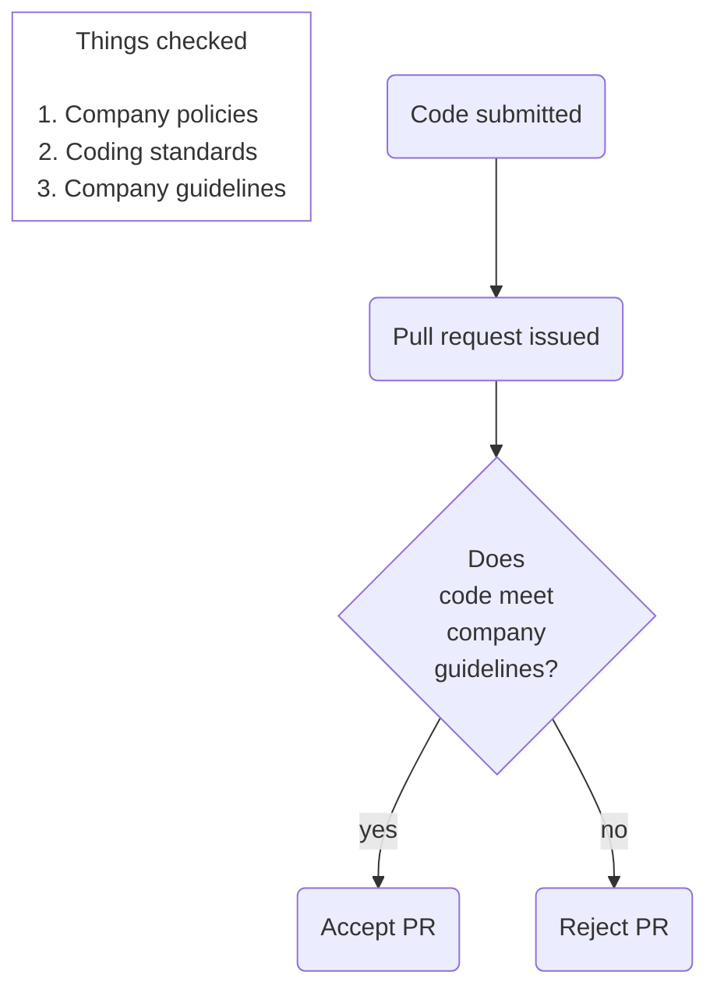

# Code reviews

The code review is a crucial part of the software development process for several reasons.

* It directly checks the quality of code being produces and enhances its quality
* It is a method for educating less experienced developers in the organisation's
  expectations
* It provides a feedback mechanism through which organisational expectations can evolve over
  time

Like any other procedural operation, the effectiveness of a code review depends on the
diligence of the reviewer. It would be very easy to approve every code change without
examining it in detail on the assumption that colleagues know what they are doing.
However, that does not allow for human error or deliberate corner-cutting, nor does it
prevent technical debt accruing because developers are under pressure to get work done as
quickly as possible. It is also unprofessional: skimping on a code review is simply
avoiding the professional responsibility to produce work that is as good as possible.
The second and third points in the list above emphasise the community aspect of code
reviews. As a member of the organisation's professional community of software engineers,
the individual developer needs to take an active role in enhancing the quality of the
output of the whole team.

{: standalone #fig1 data-title="Code quality" }

A formal approach to code inspections was defined in the 1970s by Michael Fagan for
IBM. Some variations exist, but in general a Fagan inspection is quite a cumbersome
and time-consuming process involving a formal meeting and several people in different
roles. However, it does have the advantage of facilitating the collection of statistics
related to the occurrence of code defects. This data can then in turn be used to
improve processes and target developer education.

With the widespread adoption of an agile life cycle methodology and the use of code
repositories such as GitHub, more lightweight review processes are typically preferred.
Alls ([2020](https://napier.primo.exlibrisgroup.com/permalink/44NAP_INST/n96pef/alma9923706264502111))
provides a very clear description of a typical code review which is the basis of the following notes.

Please read the section entitled *Code Review - Process and Importance* in the first chapter of
Alls ([2020](https://napier.primo.exlibrisgroup.com/permalink/44NAP_INST/n96pef/alma9923706264502111))

## Code review process overview

A code review happens between the completion a set of code changes and the merging of
those changes into the main codebase. Before development starts, the developer will
create a feature branch so that the related changes are isolated from the rest of the team.
During development, there may be many commits until the work is finally complete. This
will include the unit test code that the developer has created along the way. Once the
developer believes that the changes are complete, they will make the final commit and
create a *pull request* (PR). This is the signal for the code review to take place as
illustrated in Fig. 3.

*Fig. 3: Code review process ([Alls, 2020, Ch. 1](https://napier.primo.exlibrisgroup.com/permalink/44NAP_INST/n96pef/alma9923706264502111))*

## Preparing for a code review

In advance of issuing a PR, the developer should make sure that they have applied all the expected
guidance and carried out the checks shown in Fig. 2. The checklist below summarises the actions
required.

* Have you checked the wider impact of your code changes?
* Have you applied [coding conventions](https://learn.microsoft.com/en-us/dotnet/csharp/fundamentals/coding-style/coding-conventions)
  for the language you are working in?
* Have you applied generic software engineering principles such as [SOLID](../unit1_code_quality/principles.md#solid)?
* Have you checked for [code smells](../unit1_code_quality/code_smells.md#code-smells)?
* Have you applied the principles of [Clean Code](../unit1_code_quality/readability.md#clean-code)?
* Have you created and run sufficient unit tests?
* Have you checked the hints provided by the static analysis tools in the IDE?
* Have you used the feedback available to sanity check your code?

## Leading a code review

As the reviewer, you are acting as a technical authority. You need to exercise your own knowledge of
good coding practices and agreed conventions, and you need to be prepared to complement your existing
knowledge by using appropriate reference material. Remember that the purpose of the code review is
to enhance the quality of the code and for all those involved to learn from the exercise.

When providing feedback to a developer, it is important to be tactful and constructive. While amusing,
the xkcd cartoons on this page and in the previous section illustrate exactly how **NOT** to word your
feedback. Again, remember that the process should be *constructive* - creating resentment through
undiplomatic feedback is not the way to enhance the overall performance of the team.

