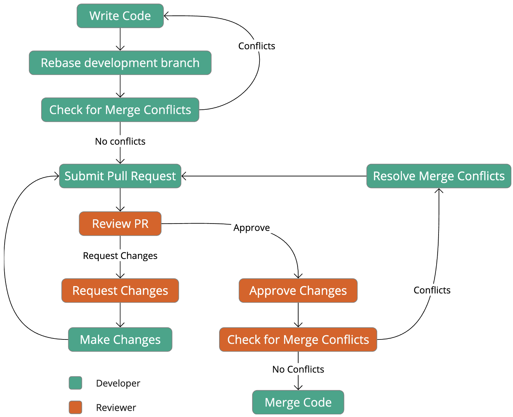
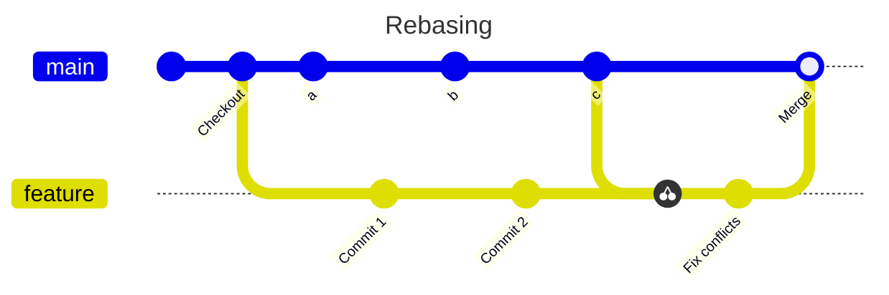

# Code reviews

The code review is a crucial part of the software development process for several reasons.

* It directly checks the quality of code being produced and enhances its quality
* It is a method for educating less experienced developers in the organisation's
  expectations
* It provides a feedback mechanism through which organisational expectations can evolve over
  time

Like any other procedural operation, the effectiveness of a code review depends on the
diligence of the reviewer. It would be very easy to approve every code change without
examining it in detail on the assumption that colleagues know what they are doing.
However, that does not allow for human error or deliberate corner-cutting, nor does it
prevent technical debt accruing because developers are under pressure to get work done as
quickly as possible. It is also unprofessional: skimping on a code review is simply
avoiding the professional responsibility to produce work that is as good as possible.
The last two points emphasise the community aspect of code
reviews. As a member of the organisation's professional community of software engineers,
the individual developer needs to take an active role in enhancing the quality of the
output of the whole team.

{: standalone #fig1 data-title="Code quality" }

A formal approach to code inspections was defined in the 1970s by Michael Fagan for
IBM. Some variations exist, but in general a Fagan inspection is quite a cumbersome
and time-consuming process involving a formal meeting and several people in different
roles. However, it does have the advantage of facilitating the collection of statistics
related to the occurrence of code defects. This data can then in turn be used to
improve processes and target developer education.

With the widespread adoption of an agile life cycle methodology and the use of code
repositories such as GitHub, more lightweight review processes are typically preferred.
Alls ([2020](https://napier.primo.exlibrisgroup.com/permalink/44NAP_INST/n96pef/alma9923706264502111))
provides a very clear description of a typical code review which is the basis of the following notes.

Please read the section entitled *Code Review - Process and Importance* in the first chapter of
Alls ([2020](https://napier.primo.exlibrisgroup.com/permalink/44NAP_INST/n96pef/alma9923706264502111))

## Code review process overview

A code review happens between the completion a set of code changes and the merging of
those changes into the main codebase. Before development starts, the developer will
create a feature branch so that the related changes are isolated from the rest of the team.
During development, there may be many commits until the work is finally complete. This
will include the unit test code that the developer has created along the way. Once the
developer believes that the changes are complete, they will make the final commit and
create a *pull request* (PR). This is the signal for the code review to take place as
illustrated in Fig. 2.

{: standalone #fig2 data-title="Code review process" }

## Preparing for a code review

In advance of issuing a PR, the developer should make sure that they have applied all the expected
guidance and carried out the appropriate checks:

* Have you checked the wider impact of your code changes?
* Have you applied [coding conventions](https://learn.microsoft.com/en-us/dotnet/csharp/fundamentals/coding-style/coding-conventions)
  for the language you are working in?
* Have you applied generic software engineering principles such as [SOLID](../unit1_code_quality/principles.md#solid)?
* Have you checked for [code smells](../unit1_code_quality/code_smells.md#code-smells)?
* Have you applied the principles of [Clean Code](../unit1_code_quality/readability.md#clean-code)?
* Have you created and run sufficient unit tests?
* Have you checked the hints provided by the static analysis tools in the IDE?
* Have you used the feedback available to sanity check your code?

It is considered good practice for a developer to 
[rebase](https://docs.github.com/en/get-started/using-git/about-git-rebase) 
their development branch onto the main 
branch(or the target branch) to check for merge conflicts before issuing a pull request. Rebasing 
helps ensure that the development branch is up-to-date with the latest changes from the main 
branch and resolves potential conflicts early, making the pull request easier to review and merge.

Fig. 3 illustrates a scenario where a developer is working on a feature. In parallel, other
developers merge changes a, b and c into the main branch. Because this could cause merge
conflicts, the developer rebases their development environment before creating the pull request.
Any conflicts can then be fixed in advance. The developer "cherry-picks" the latest commit
from the main branch, hence the icon in the diagram.

{: data-title="Rebasing"}

{: .figcaption}
Fig 3: Rebasing

## Being the reviewer

As the reviewer, you are acting as a technical authority. You need to exercise your own knowledge of
good coding practices and agreed conventions, and you need to be prepared to complement your existing
knowledge by using appropriate reference material. Remember that the purpose of the code review is
to enhance the quality of the code and for all those involved to learn from the exercise.

The best way to start a code review is to clone a copy of the code you have been asked to review.
That will allow you to check that it runs as expected, that the tests all pass and there are no
conflicts with the main branch. You should also run through the same set of quality criteria as the
developer uses before creating the pull request (see above).

When providing feedback to a developer, it is important to be tactful and constructive. While amusing,
the xkcd cartoons on this page and elsewhere illustrate exactly how **NOT** to word your
feedback. Again, remember that the process should be *constructive* - creating resentment through
undiplomatic feedback is not the way to enhance the overall performance of the team.

Collaborative platform like GitHub allow the reviewer and developer to have a conversation around
the pull request. This is a flexible arrangement that allows for the fact that the points
raised by the reviewer are not always black and white, and it may be necessary to exercise 
judgement and negotiate the appropriate solution.

## Responding to change requests

If the reviewer requests changes during a code review, the developer should make the changes,
test them and commit them to the branch associated with the pull request. It is good practice
to add to the pull request conversation on GitHub or an equivalent platform. GitHub also allows
the developer to formally request a re-review by using the options in the sidebar of the pull
request page.

## Performing the merge

Fig. 2 shows the merge step as the developer's responsibility; however, either the developer or 
the reviewer can be responsible depending on the project's workflow and team preferences. Both 
approaches have advantages, and the decision often depends on the specific context of the project.

| Who Merges | Advantages                                                                                                                                                                                                               |
|------------|--------------------------------------------------------------------------------------------------------------------------------------------------------------------------------------------------------------------------|
| Developer  | {::nomarkdown}<ul><li>Greater control and accountability</li><li>Can handle last-minute changes or conflicts</li><li>Faster, smoother development flow once the code is approved</li></ul>{:/}                           |
| Reviewer	  | {::nomarkdown}<ul><li>Final quality assurance before the merge</li><li>Clear separation of duties between coding and codebase maintenance</li><li>More objective decision-making regarding merge readiness</li></ul>{:/} |

In smaller or more agile teams where the developer owns the process it is more common for the
developer to perform the merge as shown in Fig. 2. The reviewer approves the changes, and the 
developer merges the code after addressing feedback. 

In more formal settings, or where extra control is needed, the reviewer will handle the merge after 
confirming that everything is complete, passing tests, and conflict-free. This is typical in 
larger teams with stricter processes.

{: .tip-title }
> [<i class="fa-regular fa-lightbulb"></i> Tips for code review](code_reviews_tips)

## Further reading

* [GitHub pull request documentation](https://docs.github.com/pull-requests)
* Software inspections [O'Regen, 2022, Ch. 7](https://link-springer-com.napier.idm.oclc.org/chapter/10.1007/978-3-031-07816-3_7)
* Modern Code Reviews — Survey of Literature and Practice ([Badampudi et al., 2023](https://doi.org/10.1145/3585004))
* A Faceted Classification Scheme for Change-Based Industrial Code Review Processes ([Baum et al., 2016]()https://doi.org/10.1109/QRS.2016.19)
