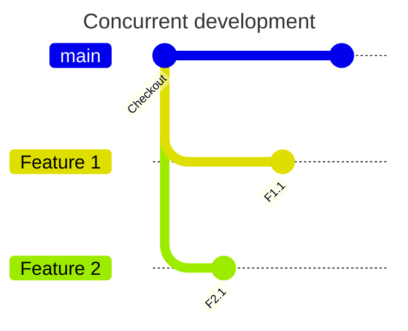
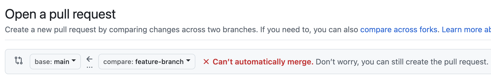
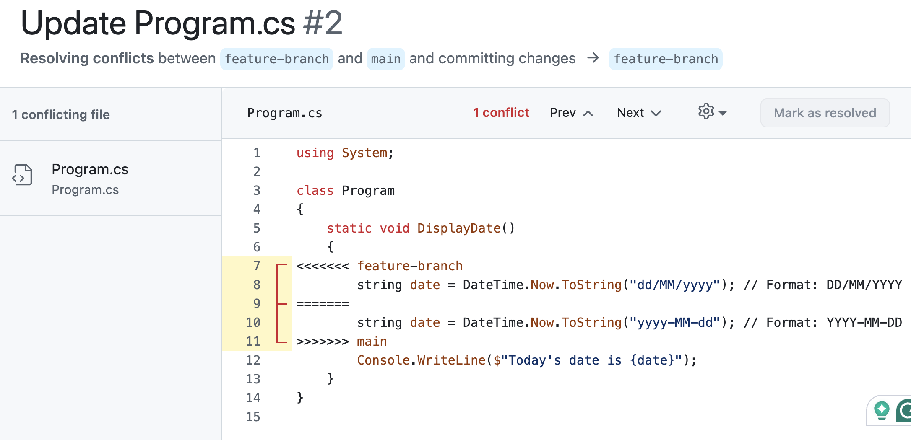

# Conflict resolution

In collaborative software development, multiple developers often work on the same codebase 
simultaneously, leading to a common challenge known as code conflicts. A code conflict occurs 
when two or more developers make changes to the same part of a file or repository, and the 
version control system (such as Git) cannot automatically determine how to merge those changes. 
Conflict resolution is a critical skill for developers working in teams, as it ensures that the 
integration of changes from multiple contributors happens smoothly and does not introduce errors 
into the project.

Effective conflict resolution is essential for maintaining a clean, functioning codebase and 
minimising disruption to the development workflow. It involves carefully reviewing conflicting 
changes, understanding the intent behind each modification, and determining the best way to 
merge them. This process requires clear communication between team members, attention to detail, 
and familiarity with the tools used for version control.

## Causes

Code conflicts occur when multiple developers work on the same codebase and their changes overlap 
or affect the same sections of code. Recall that it is good practice to use a branching strategy
that isolates each developer's working environment as shown in Fig. 1. If the same files are 
modified in commits `F1.1` and `F2.1`, for example, a conflict can arise.



{: .figcaption}
Fig 1: Concurrent development

Even when two developers make changes to the same file, merge conflicts are not certain. For 
instance, if Developer A adds a function at the top of the file while Developer B modifies a 
function at the bottom, no conflict will occur since the changes are in separate parts of the 
file. Similarly, even within the same function, as long as Developer A changes line 10 and 
Developer B changes line 20, Git can automatically merge the changes without a conflict because 
they do not modify the same lines of code. The problem occurs when the same parts of a file are
changed which can happen in several situations:

* Simultaneous changes to the same file as part of normal development
* Working on a branch that is not updated with the latest changes from the main branch
* Merging or rebasing branches with significant changes
* Concurrent work on shared files such as configuration files, package manifests
* Large-scale refactoring, such as renaming classes, moving files, or changing function signatures
* Delayed pull requests where new changes have been merged into the main branch in the meantime

You need to be alert to the potential for conflicts in these situations so that you can take 
proactive steps to avoid or minimise conflicts. Preventative measures include syncing/rebasing 
your development branch, communicating with teammates, and breaking down work into smaller, 
independent tasks. The last strategy means that tasks will be completed more quickly which allows
less time for parallel changes to accumulate in the main branch.

## Tools

While the best way to avoid or resolve code conflicts is care and attention on the part of the
developer, several tools are available to help especially when using version control systems like 
Git. These tools streamline the process of detecting conflicting changes and offer methods for 
resolving them effectively.

### Git

Git itself provides built-in conflict detection and resolution features. When a conflict occurs 
during a merge or rebase, Git halts the process and highlights the conflicting lines in the 
affected files, marked by special conflict markers (<<<<<, =====, >>>>>). Developers can manually 
resolve conflicts by editing the file and choosing the correct changes to keep.

Consider a situation where Developer A changes the date format in `Program.cs` to `YYYY-MM-DD`
and in parallel, Developer B changes the same date format in `Program.cs` to `DD/MM/YYYY`. After 
attempting a merge, Git identifies the conflict and modifies the file to indicate the conflicting 
changes as follows:

```c#
using System;

class Program
{
    static void DisplayDate()
    {
<<<<<<< HEAD
        string date = DateTime.Now.ToString("yyyy-MM-dd"); // Format: YYYY-MM-DD
=======
        string date = DateTime.Now.ToString("dd/MM/yyyy"); // Format: DD/MM/YYYY
>>>>>>> feature-branch
        Console.WriteLine($"Today's date is {date}");
    }
}
```

Explanation:

* `<<<<<<< HEAD` marks the beginning of the code from the current branch (the branch you were on 
  when you initiated the merge).
* `=======` separates the two conflicting changes.
* `>>>>>>> feature-branch` marks the end of the code from the branch being merged (in this case, 
  the `feature-branch`).

The developer must manually resolve the conflict by choosing which date format to keep or by 
handling both formats. Here's an example of a potential resolution that gives flexibility for 
both formats:

```c#
using System;

class Program
{
    static void DisplayDate(string format = "YYYY-MM-DD")
    {
        string date;
        if (format == "YYYY-MM-DD")
        {
            date = DateTime.Now.ToString("yyyy-MM-dd"); // Format: YYYY-MM-DD
        }
        else
        {
            date = DateTime.Now.ToString("dd/MM/yyyy"); // Format: DD/MM/YYYY
        }
        Console.WriteLine($"Today's date is {date}");
    }
}
```

### Code management platforms

At base, Git is a command-line tool for managing distributed code repositories. Platforms such 
as GitHub, GitLab and Bitbucket offer user-friendly interfaces that build on Git and add 
additional feature for things like handling code conflicts during pull requests. They highlight 
conflicts directly within the web interface, allowing developers to resolve simple conflicts 
without leaving the platform. They also provide detailed diff views to help compare changes side 
by side. The first indication that there may be a code conflicts is provided when a pull request
is created as shown in Fig. 2.

{: standalone #fig2 data-title="Conflict alert" }

Conflicts can be resolved before or after creating the pull request. Either way, GitHub provides
a web version of the standard Git conflict view as illustrated in Fig. 3.

{: standalone #fig3 data-title="Conflict diff view" }

### Dedicate merge tools

Tools like [KDiff3](https://kdiff3.sourceforge.net/), [Meld](https://meldmerge.org/), 
[Beyond Compare](https://www.scootersoftware.com/home), and 
[P4Merge](https://www.perforce.com/products/helix-core-apps/merge-diff-tool-p4merge) are 
external visual merge tools that can be integrated with Git. These tools provide side-by-side or 
three-way comparisons to visualise conflicts, making it easier to resolve them by showing the 
base version, current branch changes, and incoming changes.

### Integrated Development Environments (IDEs)

Popular IDEs such as [Visual Studio Code](https://code.visualstudio.com/docs/sourcecontrol/overview), 
[IntelliJ IDEA](https://www.jetbrains.com/help/idea/comparing-files-and-folders.html), and 
[Eclipse](https://help.eclipse.org/latest/index.jsp?topic=%2Forg.eclipse.platform.doc.user%2Ftasks%2Ftasks-113b.htm) 
have built-in Git support and conflict resolution features. They automatically detect conflicts, 
highlight them within the editor, and often provide graphical interfaces to resolve them with ease.

### Continuous Integration (CI) Systems

CI platforms like [Jenkins](https://www.jenkins.io/), [Travis CI](https://www.travis-ci.com/), 
and [CircleCI](https://circleci.com/) can detect merge conflicts early during the automated 
testing and integration process. They notify developers of conflicts, allowing them to resolve 
issues before merging the code into the main branch. See the [CI/CD notes](../unit6_ci_cd) for
more details on this.

## Best practices

