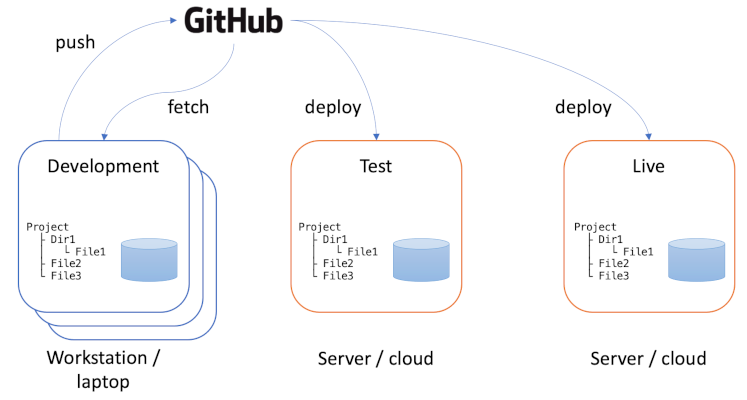

# Environments

We have already discussed distributed version control where each developer has their own clone
of the shared repository. Here, we introduce a related concept that also involves multiple
copies of the codebase.

An *environment* is the working context of a software system. The term is widely used and it
is important to understand its full implications. The major distinction is between the *production*
environment (also referred to as the *live* environment) where a system is in actual use,
and the *development* environment where software developers are making changes. As the software
system evolves over time, code changes will be introduced into the production environment, but this 
has to be done very carefully to avoid any disruption to the users. The development environment
replicates the production environment including code and supporting infrastructure such as databases.
Because each member of the development team will be working on different changes to the codebase,
each one will have their own development environment. This is an important detail: the development
environment is not shared - each member of the team has their own copy which includes the last known
good configuration of the codebase, plus the changes they are currently working on.

{: standalone #fig1 data-title="System environments"}

Fig. 1 shows the three main types of environment:

1. **Development Environment**

    The development environment is where developers write and test code locally. It's a sandbox 
    for building new features, fixing bugs, and experimenting with changes. This environment 
    mirrors the structure of the production environment, but it often includes developer tools, 
    debuggers, and local configurations. Changes in this environment are frequent, and the code is 
    not yet stable.

    Purpose: Code creation, local testing, and debugging.

2. **Testing Environment (QA/Staging)**

    The testing environment (sometimes referred to as QA or staging) is used for more rigorous, 
    controlled testing before deployment. This environment closely resembles the production 
    environment but is not customer-facing. It is where integration tests, unit tests, and user 
    acceptance tests (UAT) are performed to ensure that the software functions as expected. The 
    testing environment allows teams to catch bugs or inconsistencies without affecting users.

    Purpose: Quality assurance and verifying software performance, functionality, and stability.

3. **Production (Live) Environment**

    The production environment where the final, stable version of the software is deployed for end 
    users. This is the environment that users interact with, and it needs to be highly reliable, 
    secure, and optimised for performance. Code deployed to production has passed all necessary 
    testing stages, and any issues here could impact users directly.

    Purpose: Deliver the final product to end users in a stable and secure environment.

Repository management tools such as GitHub are excellent tools for managing the synchronisation of 
the various environments in use. Once developers have completed the changes they are working on,
they *push* the code to the repository. Once any quality assurance procedures have been
completed, the code can then be *deployed* to the production environment. Fig. 1 illustrates this
and also includes a test environment where integrated code can be tested before deployment.
Like the production environment, the test environment is a shared instance of the code that is
hosted on a server or on the cloud. Development environments, in contrast, are located on
the workstation belonging to the individual developer. In order for their personal development
environment to be kept up to date, developers need to *fetch* changes from the repository on
a regular basis. Typically, this is done just before starting a new development task. During
work on a task, it is important that developer's working environment remains stable. Changes
from other developers are only introduced between one task and the next.

## Deployment

Deployment in the context of software product development and maintenance refers to the process 
of making an application or software system available for use by deploying its code to a specific 
environment. This can involve moving the software from development (where it is built and tested) 
to a production environment (where end users interact with the application) or to intermediate 
environments like testing or staging for quality assurance.

Deployment is a crucial step in the software development lifecycle as it takes the software from 
a development state to an operational state, making it accessible to users or testers. It typically 
includes installing the software, configuring the environment, updating databases, ensuring 
compatibility, and preparing the system for user access. These operations can be performed manually
or they can be automated using 
[continuous integration/continuous deployment](../unit6_ci_cd/index.md) (CI/CD). Both strategies
have their advantages and disadvantages:

**Manual Deployment**

Manual deployment refers to the process where developers or DevOps engineers manually execute the 
steps required to deploy code to a test environment, such as copying files, setting up configuration 
files, running deployment scripts, or issuing server commands.

| Advantages                                                                                                                                                                                                                                                  | Disadvantages                                                                                                                                                                                                                                                                |
|-------------------------------------------------------------------------------------------------------------------------------------------------------------------------------------------------------------------------------------------------------------|------------------------------------------------------------------------------------------------------------------------------------------------------------------------------------------------------------------------------------------------------------------------------|
| **Control:** Manual deployment provides developers with complete control over each step of the process. This is useful when deploying small changes, troubleshooting specific deployment issues, or handling custom or ad-hoc deployment needs.          | **Human Error:** Manual deployment is prone to mistakes, such as missing steps, misconfiguring settings, or issuing incorrect commands. These errors can lead to failed deployments, issues in the test environment, or difficulty reproducing the same deployment steps. |
| **Flexibility:** Manual deployment allows for last-minute changes or specific adjustments based on the unique needs of each deployment, making it more adaptable for testing experimental features or configurations.                                    | **Inconsistent Process:** The manual approach can lead to inconsistencies between deployments, as different team members may execute the process differently each time. This lack of standardisation can introduce errors that are difficult to trace and resolve.        |
| **Learning Opportunity:** For developers and operations teams, manual deployment can be a valuable learning experience, offering insights into the deployment pipeline and helping them gain deeper knowledge of the system’s underlying infrastructure. | **Time-Consuming:** Manual deployment can be slow, especially when changes need to be deployed frequently or across multiple environments. Each step must be performed manually, which is labor-intensive and inefficient for teams aiming for rapid iteration.           |
|                                                                                                                                                                                                                                                             | **Scalability Issues:** As the project grows, manual deployment becomes less feasible. Coordinating deployments across multiple environments and handling larger, more complex systems manually becomes increasingly difficult and error-prone.                           |

**Automated Deployment**

Automated deployment uses scripts, configuration files, and tools like CI/CD pipelines (e.g., 
[Jenkins](https://www.jenkins.io/), [GitHub Actions](https://github.com/features/actions), 
[GitLab CI](https://docs.gitlab.com/ee/ci/)) to handle the deployment process automatically. This 
includes everything from packaging the code to deploying it to the test environment without human 
intervention.

| Advantages                                                                                                                                                                                                                                                                              | Disadvantages                                                                                                                                                                                                                                                                                                                          |
|-----------------------------------------------------------------------------------------------------------------------------------------------------------------------------------------------------------------------------------------------------------------------------------------|----------------------------------------------------------------------------------------------------------------------------------------------------------------------------------------------------------------------------------------------------------------------------------------------------------------------------------------|
| **Consistency:** Automated deployments ensure that every deployment follows the exact same process, reducing variability and errors. This consistency is especially important in a test environment where you want reproducible results across deployments.                          | **Initial Setup Complexity:** Setting up an automated deployment pipeline can be complex and time-consuming. It requires careful configuration and integration with the development pipeline. The initial effort may be significant, especially for smaller teams or projects.                                                      |
| **Speed:** Automated deployment significantly reduces the time required to deploy code. With a single click or trigger, code is deployed, reducing the manual effort involved and allowing for more frequent deployments, which is crucial for continuous testing.                   | **Less Flexibility:** Automated deployment systems follow predefined steps and may not offer as much flexibility for handling last-minute changes or special cases. Although it is consistent, making quick adjustments on the fly can be more difficult without modifying the automation scripts.                                  |
| **Reduced Human Error:** Automation eliminates the risk of manual mistakes like skipping steps or incorrect configurations. Since the deployment process is predefined, it reduces the likelihood of deployment failures caused by human oversight.                                  | **Maintenance Overhead:** Once automated pipelines are set up, they need to be maintained. Changes in the build or deployment process require updates to the automation scripts, and any issues with the pipeline itself can delay deployments. Additionally, ensuring that automation tools are kept up to date ca n add overhead. |
| **Faster Feedback Loop:** Automated deployment enables faster deployments to test environments, which speeds up the feedback loop. This allows developers and testers to quickly see the effects of new changes, leading to quicker identification of bugs and more rapid iteration. | **Learning Curve:** For teams unfamiliar with CI/CD tools or automation, there can be a steep learning curve to understanding how to set up, manage, and troubleshoot automated deployments. It may require specialised skills, particularly for smaller teams.                                                                     |
| **Easier Rollbacks:** Automated deployment processes often include rollback procedures, making it easier to revert to previous versions of the code if something goes wrong during the deployment, ensuring the stability of the test environment.                                   |                                                                                                                                                                                                                                                                                                                                        |
| **Scalability:** As the project grows, automated deployment scales well across multiple environments and large systems. It ensures that the same deployment process can be replicated efficiently across multiple teams and environments.                                            |                                                                                                                                                                                                                                                                                                                                        |

The choice between manual and automated deployment for a test environment depends on the complexity 
of the project, team size, and the frequency of deployments. Manual deployment offers control and 
flexibility but comes with a high risk of human error and inefficiency, especially as projects grow. 
Automated deployment, while requiring upfront investment and setup, provides speed, consistency, and 
scalability, making it ideal for projects with continuous integration and rapid testing needs. For 
most teams aiming for efficiency and scalability, automated deployment is the preferred approach, 
especially as they grow and require more frequent releases.

{: .tip-title }
> [<i class="fa-regular fa-lightbulb"></i> General tips for getting started with multiple environments](environments_tips.md)
