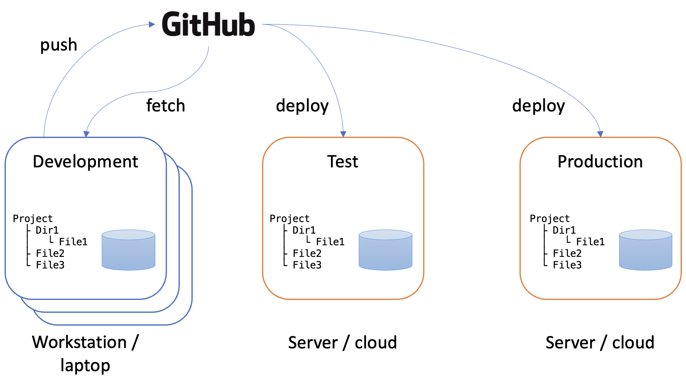

# Environments

We have already discussed distributed version control where each developer has their own clone
of the shared repository. Here, we introduce a related concept that also involves multiple
copies of the codebase.

An *environment* is the working context of a software system. The term is widely used and it
is important to understand its full implications. The major distinction is between the *live*
environment (also referred to as the *production* environment) where a system is in actual use,
and the *development* environment where software developers are making changes. As the software
system evolves over time, code changes will be introduced into the live environment, but this has
to be done very carefully to avoid any disruption to the users. The development environment
replicates the live environment including code and supporting infrastructure such as databases.
Because each member of the development team will be working on different changes to the codebase,
each one will have their own development environment. This is an important detail: the development
environment is not shared - each member of the team has their own copy which includes the last known
good configuration of the codebase, plus the changes they are currently working on.

{: standalone #fig1 data-title="System environments"}

Fig. 1 shows the three main types of environment:

1. Development Environment

    The development environment is where developers write and test code locally. It's a sandbox 
    for building new features, fixing bugs, and experimenting with changes. This environment 
    mirrors the structure of the production environment, but it often includes developer tools, 
    debuggers, and local configurations. Changes in this environment are frequent, and the code is 
    not yet stable.

    Purpose: Code creation, local testing, and debugging.

2. Testing Environment (QA/Staging)

    The testing environment (sometimes referred to as QA or staging) is used for more rigorous, 
    controlled testing before deployment. This environment closely resembles the production 
    environment but is not customer-facing. It is where integration tests, unit tests, and user 
    acceptance tests (UAT) are performed to ensure that the software functions as expected. The 
    testing environment allows teams to catch bugs or inconsistencies without affecting users.

    Purpose: Quality assurance and verifying software performance, functionality, and stability.

3. Live (Production) Environment

    The live environment where the final, stable version of the software is deployed for end users. 
    This is the environment that users interact with, and it needs to be highly reliable, secure, and 
    optimized for performance. Code deployed to production has passed all necessary testing stages, 
    and any issues here could impact users directly.

    Purpose: Deliver the final product to end users in a stable and secure environment.

Repository management tools such as GitHub are excellent tools for managing the synchronisation of 
the various environments in use. Once developers have completed the changes they are working on,
they *push* the code to the repository. Once any quality assurance procedures have been
completed, the code can then be *deployed* to the live environment. Fig. 1 illustrates this
and also includes a test environment where integrated code can be tested before deployment.
Like the live environment, the test environment is a shared instance of the code that is
hosted on a server or on the cloud. Development environments, in contrast, are located on
the workstation belonging to the individual developer. In order for their personal development
environment to be kept up to date, developers need to *fetch* changes from the repository on
a regular basis. Typically, this is done just before starting a new development task. During
work on a task, it is important that developer's working environment remains stable. Changes
from other developers are only introduced between one task and the next.

