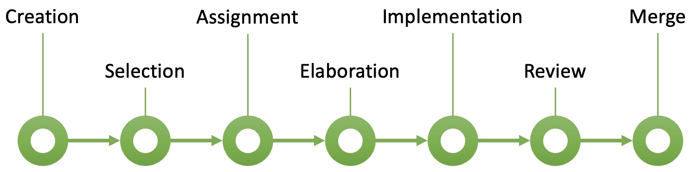
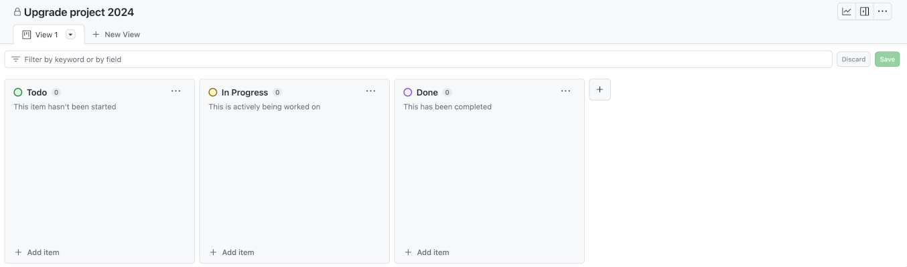
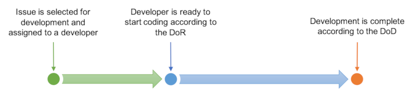

# Issues

Issues are a powerful tool for managing tasks, bugs, and feature requests in a software 
project. Mastering the basics of creating, labeling, assigning, and collaborating on issues will 
help you stay organized and contribute effectively to your team. Understanding how to track progress, 
link work, and participate in discussions about issues is essential for any developer working in 
a collaborative environment.

The lifecycle of an issue tends to follow the pattern shown in Fig. 1. 

{: standalone #fig1 data-title="Issue lifecycle"}

## Issue creation

Issues are created for various reasons, each helping to track different aspects of the development 
process. During an initial development project to build a software product from scratch, the main 
source of new issues is the initial analysis work that produces a set of user stories. Even in a
development project, though, issues are created in a variety of situations:

Bug reporting

This occurs when a problem or defect is found in the software, such as when the application doesn’t 
behave as expected. For example, a user might report being unable to log in after a password reset 
or a page might crash when submitting a form.

Feature requests or enhancements

Here, developers or stakeholders propose new functionality or improvements to existing features. 
Examples include requests to add a dark mode to the user interface or to improve the performance of 
the search function.

Technical debt

This refers to areas of the code that need refactoring or cleanup to improve maintainability. For 
instance, developers might need to refactor the authentication module to improve readability or reduce 
duplicate code in the payment processing system.

Task management

These tasks might not involve code changes but are still critical to the project, such as setting up 
a continuous integration/continuous deployment (CI/CD) pipeline or writing documentation for an API.

Performance issues

Performance issues track areas where the software may be performing inefficiently and needs 
optimization, such as improving database query performance for large datasets or optimizing image 
loading times on a webpage.

Security vulnerabilities

Potential or known flaws that could compromise the system lead to the creation of issues. For 
example, a SQL injection vulnerability might need to be fixed, or stronger password encryption 
might need to be implemented.

User feedback

When end users provide suggestions or report problems, developers create issues to track and 
address this feedback. Examples include users requesting the ability to export data as CSV or 
reporting that the interface is not intuitive on mobile devices.

Testing requirements

Requirements for unit tests, integration tests, or the performance of user acceptance testing (UAT)
are documented as issues. For example, a developer might create an issue to write unit tests for the 
payment processing module or to perform cross-browser testing on a new feature.

Infrastructure issues

These are created when there are problems with the project's infrastructure, such as server downtime, 
configuration errors, or deployment failures. An example might be a server crashing during high 
traffic or a misconfiguration in the database connection string.

Compliance and legal requirements

Issues are often used to capture compliance and regulatory requirements, especially when ensuring 
that the software meets regulatory or industry standards. Examples include making sure the system 
complies with GDPR regulations or implementing accessibility features in line with WCAG 2.1 
standards.

Dependencies

Projects that depend on third-party libraries or services often track dependency-related issues. 
For example, issues might be created to update a third-party library to its latest version or to 
fix an integration problem with a payment gateway API.

Version releases

Issues can be used to track specific tasks that must be completed before a new version is deployed. 
This might include preparing release notes for version 2.0 or fixing critical bugs before version 
1.5 is rolled out.

## Issue-related workflow

Most code management platforms provide features to help manage projects. In GitHub, a project can be
represented in a tabular format, as a roadmap or in the form of a Kanban-style task board. The choice
of format is up to the team, but for the purposes of these notes, we will assume the use of a task board.

By default, a task board in GitHub contains the three swimlanes, `Todo`, `In Progress` and `Done` as
shown in Fig. 2. Further columns can be added if needed - this depends on how the team decides to
manage the work. For example, a swimlane for stalled tasks could be added, or for tasks in review.
The task board can be as complicated as required, but in general, the simpler the structure, the
more intuitive it is to use.

{: standalone #fig2 data-title="Default GitHub task board"}

Tasks in GitHub are represented by [issues](https://docs.github.com/en/issues). They can be added
directly on the task board using the button at the bottom of each swimlane. If you take that option,
you will need to explicitly attach the new issue to the relevant code repository. This is because
the relationship between projects and repositories doesnot have to be one-to-one. You can also create
issues using the issues tab on the repository page. If you take that option, you will need to say
explicitly which project the issue should be added to. This is done using the controls on the right of
the issue creation page as shown in Fig. 3.

{: standalone #fig3 data-title="GitHub new issue page"}

When using a task board, an item gradually accumulates detail and moves through the swimlanes from left
to right as the work progresses. Exactly *when* an item is moved from one swimlane to the next needs to
be defined in the team workflow so that there is no ambiguity. Once defined, these rules can be
performed and enforced manually, but GitHub can help to automate some of the steps. Clicking on the
three-dots icon in the top right-hand corner of the task board (see Fig. 5) allows you to select a
`Workflows` option. Here, you can define several actions to be triggered automatically. The options
are more or less self-explanatory and require some experimentation. The main point is that a team
should make explicit decisions about how their task board should operate and which steps are to be
automated. Thos decisions should be clearly documented sothat they are easy for team members to
follow.

## Definition of Ready

It is a simple observable fact that the majority of developers like to get started working on
code changes as quickly as possible. However, that is not always the most efficient approach
and it can lead to dead ends, delays and re-work. To counter this, a *Definition of Ready* (DoR)
can be used. Essentially, it is a checklist that defines the criteria for starting on a
development task. The DoR might include items such as:

* Requirements are clear
* Requirements are testable
* Acceptance criteria are defined
* Dependencies have been identified

A good way to decide whether a development task is ready to be worked on is to use the INVEST
method:

> **Independent**:
> It should be possible to work on a task independently of any other
>
> **Negotiable**:
> A task should not be over-constrained; instead, there should be room for negotiatioon about
> the best way to implement it
>
> **Valuable**:
> The value of the task for the project/client should be clear. This is usually captured by
> acceptance criteria
>
> **Estimable**:
> It should be possible to make a reasonably accurate estimate of the time required for the task.
> If a task is too complex this will be difficult and the task may need splitting.
>
> **Small**:
> (See previous point) Ideally a single task should represent a few person-days of work.
>
> **Testable**:
> Another indication that a task needs to be split is when the tests required are hard to define
> or are very complex.

## Definition of Done

In Scrum, the *Definition of Done* (DoD) is a checklist of things that need to ticked off
before a product configuration is considered ready to release. An example of a simple DoD might be:

* All acceptance criteria are met
* Unit test coverage > 80%
* Functional tests passed
* No known defects
* Documentation is up-to-date

The DoD defines the threshold for release of the product, but at the point a development task
is completed it also needs to be checked against the DoD. This ensures that acceptance
criteria are checked at the earliest opportunity, for example, and avoids the accumulation
of hidden problems.

## Summary

In light of the previous sections, two main phases of activity can be identified around
any piece of development work as shown in Fig.4. The time required for each stage depends on the
complexity of the original issue.

{: standalone #fig4 data-title="Two-phase development process"}

The rules that a team sets for itself in defining a standard workflow are intended to help
with communication and to avoid errors and conflicts. Although there are examples of good
practice available, there is no golden standard - each team needs to define its own specific
workflow. Some steps are entirely procedural in the sense that they are the responsibility of
the individual developer and cannot be automated. Others are made trivially easy by using the
digital tools available. It must be stressed, however, that the team workflow needs to be
actively managed. If assumptions are made about how team members will behave, serious difficulties
may arise if they do not behave as expected. It is also tempting to try to define a complicated
workflow from the outset in order to keep tight control over the project. This can be
counter-productive, however, making the workflow difficult to understand. A good approach is
often to set up a relatively simple workflow using default or standard options,and then to
introduce changes when it becomes clear that the workflow can be improved.

## Further reading

* [Definition of Ready](https://resources.scrumalliance.org/Article/pros-cons-definition-ready)
* [Definition of Done](https://www.scrum.org/resources/blog/done-understanding-definition-done)
