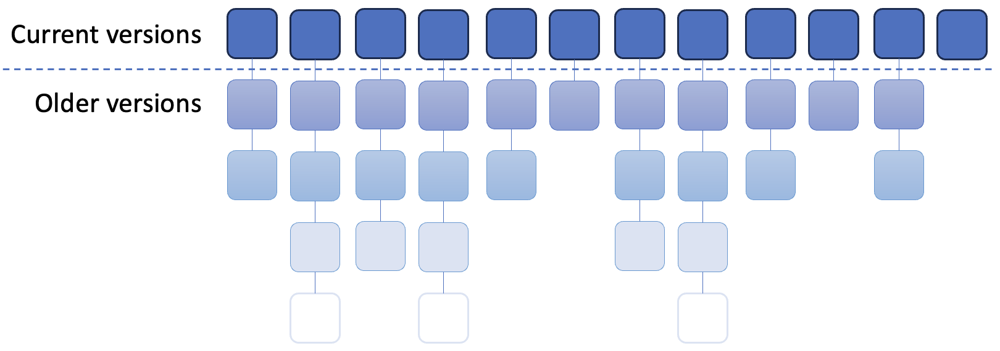
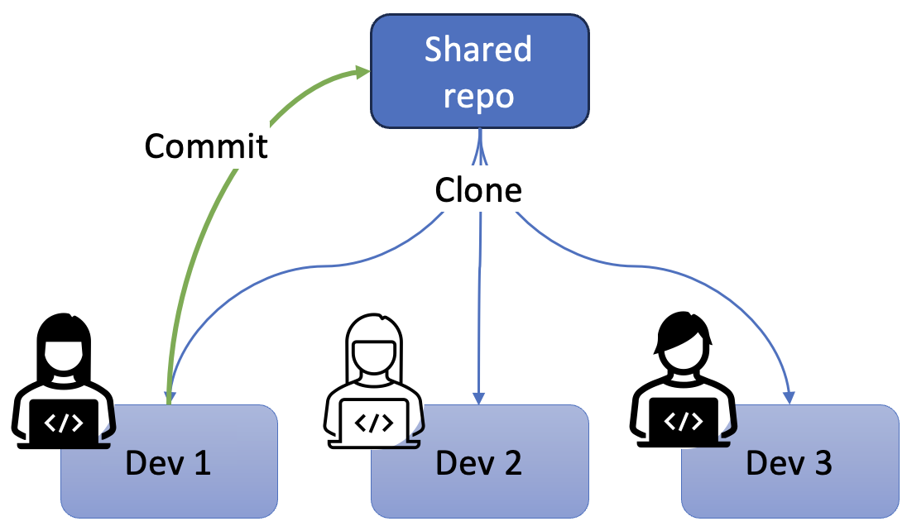

# Version Control

Version control is a fundamental practice in software development that allows teams and 
individuals to manage changes to code, track its history, and collaborate effectively. It 
provides a structured way to track changes, manage different versions of software, and 
coordinate the efforts of multiple developers. By maintaining a history of changes, version 
control helps developers understand who made modifications, when they were made, and why, 
making it easier to debug, refactor, or revert to previous versions if necessary.

The most widely used version control systems today, such as [Git](https://git-scm.com/), 
[Subversion](https://subversion.apache.org/) (SVN), and 
[Mercurial](https://www.mercurial-scm.org/), allow for distributed collaboration, where 
each developer works independently on their own copy of the project. With tools like 
[GitHub](https://github.com),[GitLab](https://about.gitlab.com/), and 
[Bitbucket](https://bitbucket.org/product/), teams can easily manage branches, pull 
requests, and code reviews, ensuring that changes are properly reviewed and integrated 
into the main codebase.

Version control also plays a critical role in supporting continuous integration/continuous 
deployment (CI/CD) workflows by enabling automated testing and deployment pipelines. 
Whether working alone or in a large team, version control is an essential tool for 
maintaining the integrity of a codebase, managing collaboration, and ensuring that 
software can evolve efficiently over time.

{: standalone #fig1 data-title="Don't be ignorant" }

## Repositories

A code repository, or repo, is a centralized location where software project files and 
their version history are stored and managed. It serves as the backbone of version control 
systems, allowing multiple developers to collaborate on a project while keeping track of 
every change made over time. Developers save files to the repo through the _commit_ action.
A commit represents a snapshot of changes made to the codebase at a particular point in time. 
Each commit has a unique identifier (hash), and it typically includes a message describing 
the changes. Commits allow developers to track and review every modification made to the 
project over time.

A file version history is a detailed record of all the changes made to each file in a 
project over time. Every time a developer makes modifications and commits them, the system 
saves a snapshot of those changes, including the author of the change, the timestamp, and 
a message describing what was done. This history allows developers to track the evolution 
of the codebase, see who made specific changes, and understand why those changes were made.

{: standalone #fig2 data-title="File histories" }

A major advantage of maintaining a full file history is that changes can always be undone.
However, that is only possible for committed version of the file. Committing often is 
therefore a good practice to develop. 

## Distributed version control

In distributed version control systems such as git, every developer has a full copy of 
the entire project history stored locally on their machine, rather than relying on a 
single, central server to manage the codebase. This means that all commits, branches and 
tags are available offline, and developers can work independently without needing 
continuous access to the central repository. Two key actions in distributed version 
control are **forking** and **cloning**. A fork is a personal copy of someone else’s 
repository, typically used in open-source development to create independent versions of 
a project that can be worked on and modified freely. A clone, on the other hand, refers 
to creating a local copy of a repository on your own machine, allowing you to make 
changes and later sync those with the original repository by pushing updates. In a 
collaborative project with mutiple developers, for example, each team member will clone 
the shared central repository so that their work does not interfere with anyone else's.

While cloned repositories provide flexibility and independence, this strategy introduces 
certain logical challenges related to synchronization and collaboration. Since multiple 
developers can work on the same project simultaneously, their local repositories may 
diverge over time, resulting in different sets of changes or conflicting modifications to 
the same files. For example, Fig. 3 shows three developers working on cloned copies of
the shared central repository. They have each made their local copy at the same point in 
time. If Dev 1 finishes their work and commits new versions of files to the shared 
repository, Dev 2 and Dev 3 do not have those updates and are therefore working on
outdated code.

{: standalone #fig3 data-title="Distributed Version Control" }

One major challenge is the need to synchronize the local clone with the remote repository 
to ensure that a developer's work remains in sync with the broader team's progress. If a 
developer doesn't regularly pull updates from the remote repository, their local clone 
can become outdated, leading to potential conflicts when trying to merge changes. These 
conflicts occur when two or more developers modify the same section of code in different 
ways, requiring manual intervention to reconcile the differences.

Regular synchronization through **pulling** and **pushing** updates helps avoid these 
issues. By frequently pulling changes from the remote repository, developers ensure that 
their local clone stays up to date with the latest work from other team members. This 
allows them to address conflicts earlier and maintain compatibility between their changes 
and the shared project. Without regular synchronization, merging changes later can become 
more complicated, resulting in a more time-consuming and error-prone process.

