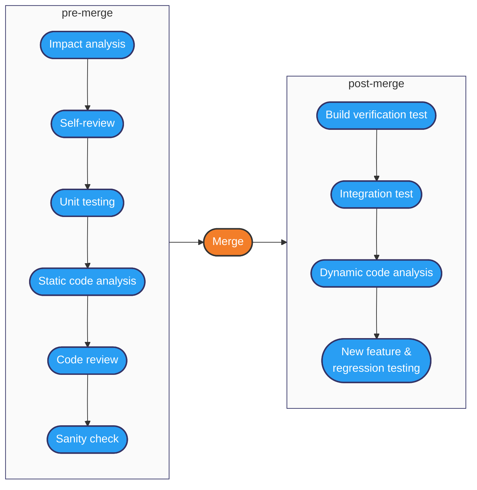
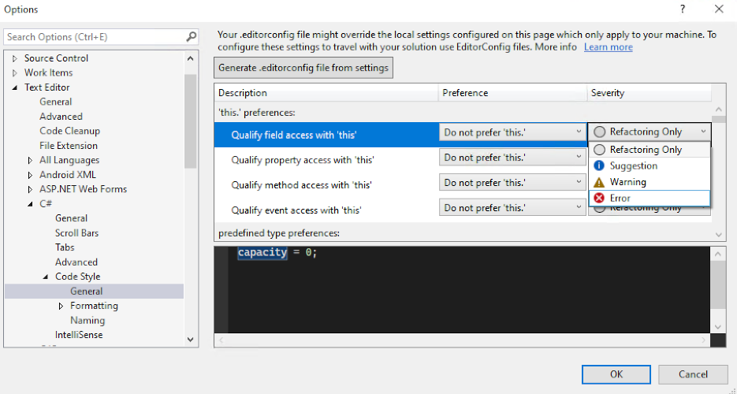

## Workflow

When you are working on a string of similar tasks using the same tools it can get a
bit boring. A natural tendency is to internalise short and reliable patterns for
getting the work done. Perhaps it involves remembering to save your work at a
particular point before going on to the next step, or creating stub tests as you go
along so that you don't have to think too hard later on. As time goes on, you can
reach the point where you just do these things on autopilot. What you are doing is
creating and maintaining a *workflow*. Just as with design patterns and many other
aspects of software development, the way you organise your work is up to you. If you
are working alone, creating your own workflows is convenient, but in a team situation
it becomes vital going far beyond simply alleviating the boredom of repetition.

One of the issues that needs to be addressed in a team context is that different
people prefer to do things in different ways. That is OK up to the point that it starts
to reduce the overall efficiency of the team effort. That can occur for example if one
person on a team fails to take into account someone else's needs. In that case,
something does not get done at the most efficient moment, and time is lost later.
Another case is where a developer finishes the task they are on but fails to update the
documentation or let the rest of the team know that the task is complete. The solution
to these and many other types of communication and coordination issues is to establish
team workflows and to make sure that the whole team sticks to them.

)](https://imgs.xkcd.com/comics/team_chat.png) {: standalone #fig1 data-title="Don't be ignorant" }

A software engineer makes a personal contribution to a project through the application of
good programming practice and the adherence to the agreed workflow of the team. Once a
development task is complete, it is committed to the code repository where it is reviewed by
another developer. Once the comments are addressed, the modified code is merged with the
main codebase.

After merging, further quality checks are performed which focus on the operation of the
entire system including the new code changes. The pre- and post-merge checks are
summarised in Fig. 2.

*Fig. 2: Code quality analysis techniques (Adapted from [Cap Gemini, n.d.](https://www.capgemini.com/wp-content/uploads/2020/11/PoV-Code-Analytics.pdf))*

The checks in Fig. 2 can be summarised as follows:

> **Impact analysis**
>
> Investigating the impact that proposed code changes are likey to have on the rest of
> the codebase
>
> **Self-review**
>
> The application of good practices during code development
>
> **Unit testing**
>
> The creation of code by the developer for the automatic testing of application code
> (covered in the [Test-driven development](../unit4_testing/Week06a_test_driven_development.md) section)
>
> **Static code analysis**
>
> Performed automatically by the developer's IDE and possibly also be stand-alone tools.
> Code is examined for known weaknesses and potential solutions are suggested.
>
> **Code review**
>
> A process of peer review where one developer provides feedback on another's work.
>
> **Sanity check**
>
> Last-minute checks for artefacts that should not be committed to the repository. Some
> of these are automated - for example, before proceeding with a commit operation, the IDE
> will warn the developer if the code contains ToDo comments.
>
> **Build verification test**
>
> Verification that the entire application builds when the code changes are included
>
> **Integration test**
>
> Verifies that the entire application performs as intended when the code changes are
> included
>
> **Dynamic code analysis**
>
> Consists of checks that are performed while the application is running. This can include
> checks on external properties such as performance efficiency, but also provides a
> mechanism for checking for runtime errors. These might be caused by dependencies that
> cannot be checked statically such as instances of reflection, dependency injection, etc.
>
> **New feature and regression testing**
>
> Here, new system-level tests are developed for any new features, and the behaviour of
> the rest of the system is compared to previous results to ensure that it has not been
> adversely affected by recent changes.

## Procedural conventions

GitHub and similar platforms provide an intuitive interface for managing collaborative code development.
However, they also provide a lot of freedom to use the tools in different ways. For example, when
a developer issues a PR, the system can suggest an appropriate reviewer based on activity data. This
may be appropriate, but a team may want to intervene in this default process for various reasons. For
example, the team may include people with different levels of experience and it may be appropriate
that only the experienced people are asked to perform reviews.  

A similar question arises with merge operations. The default case is that the original developer eventually
merges the feature branch with the main branch. If there are code conflicts that need to be resolved
manually, then it is the developer who is responsible for doing that. This is a potential risk to the
main branch, and the team may decide that only certain people should be allowed to resolve this type of
conflict.

Each team will have slightly different requirements, and these questions need to be answered by creating
an explicit procedure in the team's documentation.

## The developer's working environment

To recap on a point made in an earlier session, a software engineer has a lot to think about
besides just writing code. The tour below summarises the main considerations and
visualises two different ways of managing the tools needed to do the job effeciently
and effectively.

<h6 align="center"> Here's you, engineering your software...

</h6>

## Editors and IDEs

Development tools have had more than half a century to mature. Current editors and
integrated development environments (IDEs) offer many features that help the software
engineer to keep on top of the huge range of concerns when building high quality code.

The two main strategies visualised in the tour are the smart editor (such as
[Visual Studio Code](https://code.visualstudio.com/)) and the IDE (such as
[Visual Studio](https://visualstudio.microsoft.com/)).

The smart editor strategy can be considered bottom-up: its central function is editing
code, and additional functionality can be included as extensions. The advantages are
that its disk and memory footprints are kept as small as possible, and the working
user interface is simplified. Its disadvantage is that it requires customisation for
each distinct working environment, and some features require external configuration.
Because this working environment is a collection of loosely-coupled modules, it is not
as stable as the IDE approach.

The IDE strategy seeks to put all the tools the software engineer might need at their
fingertips by integrating them into a single software application. Because a lot of
functionality is included by default, its storage and memory footprints are much larger
than those of a smart editor, and the interface is more complicated because there are many
more options available. The main advantages of an IDE are its comparative stability, the
lower maintenance overhead and the availability of advanced features such as package
management.

## Static analysis

When carrying out a code review, the ideal approach is to include two steps. The first
is to examine the code in an editor to try to identify potential improvements, and the
second is to run the code to check that it behaves as expected. The first of these can be
thought of as *static analysis* because you are examining the code in isolation. The second
activity can be considered *dynamic analysis* since the code is actually in operation
and you are evaluating its behaviour.

Development tools such as Visual Studio perform static analysis on the code as you write
with the results presented in various ways. For example, lines of code that contravene
a style rule might be underlined or have a light bulb icon appear against them, for
example. The IDE may offer to reformat the code automatically if the resolution is a
simple one. Structural issues identified by the built-in code analysers may be
indicated by a different highlight or a different icon such as a screwdriver. Again,
the IDE may offer a range of solutions, but in the structural case, they affect the
code itself and not just the way it is formatted. These resolutions therefore constitute
code *refactorings*.

The default rules that are built into an IDE can be configured by changing the options
settings. A rule could be disabled, for example, so that the highlights and warnings no
longer appear. Alternatively, the severity of the rule might be increased so that the
IDE treats it as an error rather than a warning as illustrated in Fig. 1.

*Fig. 1: Visual Studio code analysis options*

It is very common for developers to ignore any warnings generated by the IDE since
they do not affect the operation of the code. They are therefore treated as
insignificant. However, in a team situation where future maintainability and general
code quality are major concerns, every software engineer should ain to resolve any
parts of their code that produce warnings. Any rules that are not required can be disabled
for the whole team, and the remainder can be configured so that their severity level
reflects the team's requirements.

When the default rules are not sufficient for a team's needs, other tools such as
[StyleCop](https://github.com/DotNetAnalyzers/StyleCopAnalyzers) can be added to the
IDE. In Visual Studio, this is done using the
[NuGet package manager](https://code.visualstudio.com/docs/csharp/package-management).
StyleCop provides greater control over code style with selectable rule sets. It is
also possible to manage the rules as described above and to create custom rules as
needed.

The main point of this section is that the warnings and suggestions generated by an IDE
need to be treated as a useful tool to help ensure code quality rather than annoying
background noise. Once the rules are appropriately configured, they provide vital
information to the software engineer that should not be ignored.

## Further reading

* Programming ([Stephens, 2022, Ch. 10](https://learning.oreilly.com/library/view/beginning-software-engineering/9781119901709/c10.xhtml))
* [Common C# code conventions](https://learn.microsoft.com/en-us/dotnet/csharp/fundamentals/coding-style/coding-conventions)
* [StyleCop: A Detailed Guide to Starting and Using It](https://blog.submain.com/stylecop-detailed-guide/)

## Further reading

* [GitHub pull request documentation](https://docs.github.com/pull-requests)
* Software inspections [O'Regen, 2022, Ch. 7](https://link-springer-com.napier.idm.oclc.org/chapter/10.1007/978-3-031-07816-3_7)
* Modern Code Reviews — Survey of Literature and Practice ([Badampudi et al., 2023](https://doi.org/10.1145/3585004))
* A Faceted Classification Scheme for Change-Based Industrial Code Review Processes ([Baum et al., 2016]()https://doi.org/10.1109/QRS.2016.19)
