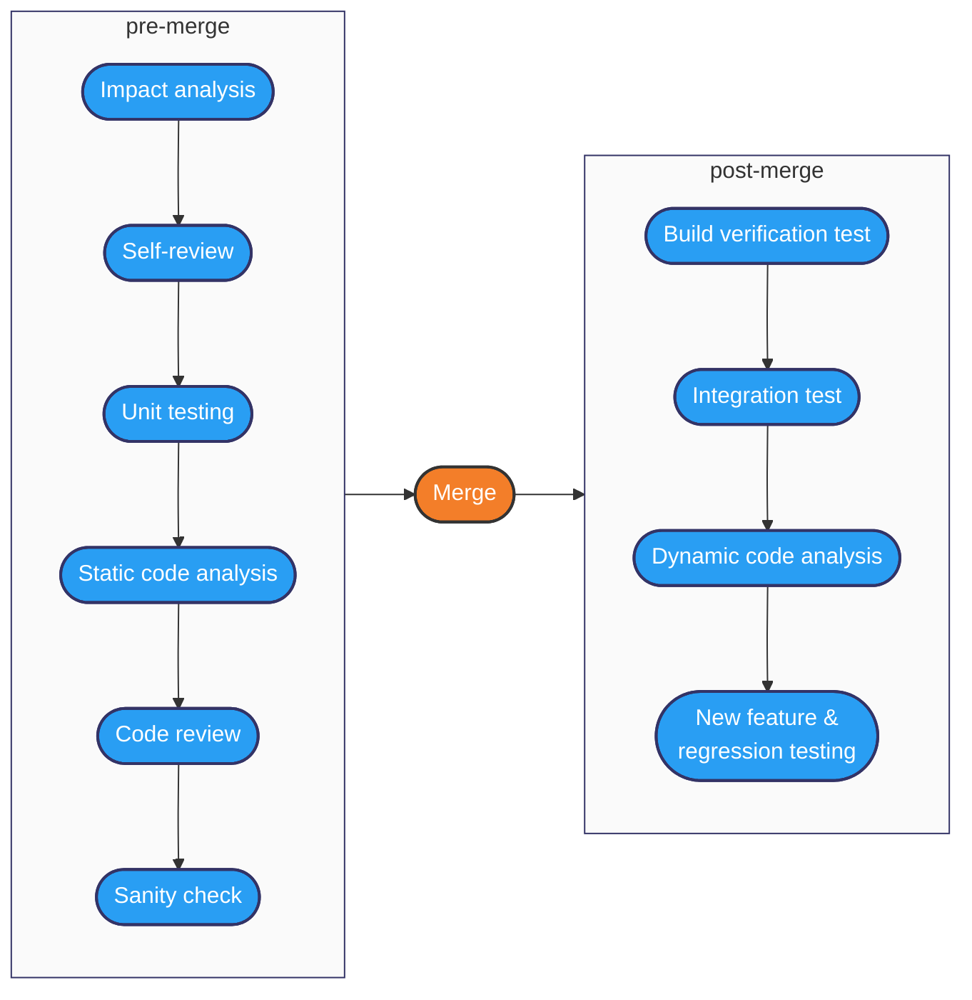
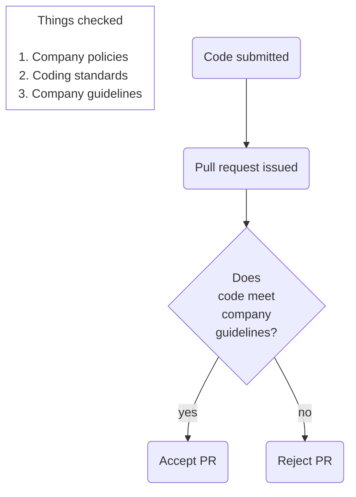

# Quality: processes

### Always code as if the guy who ends up maintaining your code will be a violent psychopath who knows where you live.

 

*[John F. Woods](https://groups.google.com/g/comp.lang.c++/c/rYCO5yn4lXw/m/oITtSkZOtoUJ)*

###### Contents

1. [ISO 25000 Systems and software Quality Requirements and Evaluation (SQuaRE)](#iso-25000-systems-and-software-quality-requirements-and-evaluation-square)
2. [Workflow](#workflow)
3. [Code review](#code-review)
4. [Procedural conventions](#procedural-conventions)
5. [Further reading](#further-reading)

## ISO 25000 Systems and software Quality Requirements and Evaluation (SQuaRE)

To produce a high-quality output requires two complementary elements. The obvious one is
that the product itself must conform to certain agreed standards. However, that can only
be guaranteed if the processes by which the product is produced are clearly defined and
carefully followed. That is the second element. With a carefully designed process, the
quality characteristics of the product can be checked at various important stages in its
life cycle. In addition, sticking to a specified process ensures that those activities that
contribute to the final quality of the product are carried out correctly.

[ISO 25000](https://iso25000.com/index.php/en/iso-25000-standards) is a coordinated set of
standards related to the quality of software products which summarise the relationships
between different quality aspects and their measurements as shown in Fig. 1.

*Fig. 1: Relationship between types of quality measures [ISO 25023](https://napier.primo.exlibrisgroup.com/permalink/44NAP_INST/19n0mho/cdi_bsi_primary_000000000030280200)*

In the last section, we discussed internal and external properties of code and related
quality criteria and standards. The next logical question is when and how the appropriate
checks need to be performed. As illustrated in Fig. 1, both internal and external properties
depend on the processes that were used to create them. That includes project-level processes
for the allocation and completion of work, life cycle processes and how they are implemented in
an organisation, operational processes represented by standard workflows as well as the
personal processes used by a skilled developer. In these notes, we will be focussing on the
workflow aspects as the interface between the software engineer and the project context.

## Workflow

A software engineer makes a personal contribution to a project through the application of
good programming practice and the adherence to the agreed workflow of the team. Once a
development task is complete, it is committed to the code repository where it is reviewed by
another developer. Once the comments are addressed, the modified code is merged with the
main codebase.

After merging, further quality checks are performed which focus on the operation of the
entire system including the new code changes. The pre- and post-merge checks are
summarised in Fig. 2.

*Fig. 2: Code quality analysis techniques (Adapted from [Cap Gemini, n.d.](https://www.capgemini.com/wp-content/uploads/2020/11/PoV-Code-Analytics.pdf))*

The checks in Fig. 2 can be summarised as follows:

> **Impact analysis**
>
> Investigating the impact that proposed code changes are likey to have on the rest of
> the codebase
>
> **Self-review**
>
> The application of good practices during code development
>
> **Unit testing**
>
> The creation of code by the developer for the automatic testing of application code
> (covered in the [Test-driven development](../unit4_testing/Week06a_test_driven_development.md) section)
>
> **Static code analysis**
>
> Performed automatically by the developer's IDE and possibly also be stand-alone tools.
> Code is examined for known weaknesses and potential solutions are suggested.
>
> **Code review**
>
> A process of peer review where one developer provides feedback on another's work.
>
> **Sanity check**
>
> Last-minute checks for artefacts that should not be committed to the repository. Some
> of these are automated - for example, before proceeding with a commit operation, the IDE
> will warn the developer if the code contains ToDo comments.
>
> **Build verification test**
>
> Verification that the entire application builds when the code changes are included
>
> **Integration test**
>
> Verifies that the entire application performs as intended when the code changes are
> included
>
> **Dynamic code analysis**
>
> Consists of checks that are performed while the application is running. This can include
> checks on external properties such as performance efficiency, but also provides a
> mechanism for checking for runtime errors. These might be caused by dependencies that
> cannot be checked statically such as instances of reflection, dependency injection, etc.
>
> **New feature and regression testing**
>
> Here, new system-level tests are developed for any new features, and the behaviour of
> the rest of the system is compared to previous results to ensure that it has not been
> adversely affected by recent changes.

## Code review

[*Source: xkcd* ](https://xkcd.com/1833)

The code review is a crucial part of the software development process for several reasons.

* It directly checks the quality of code being produces and enhances its quality
* It is a method for educating less experienced developers in the organisation's
  expectations
* It provides a feedback mechanism through which organisational expectations can evolve over
  time

Like any other procedural operation, the effectiveness of a code review depends on the
diligence of the reviewer. It would be very easy to approve every code change without
examining it in detail on the assumption that colleagues know what they are doing.
However, that does not allow for human error or deliberate corner-cutting, nor does it
prevent technical debt accruing because developers are under pressure to get work done as
quickly as possible. It is also unprofessional: skimping on a code review is simply
avoiding the professional responsibility to produce work that is as good as possible.
The second and third points in the list above emphasise the community aspect of code
reviews. As a member of the organisation's professional community of software engineers,
the individual developer needs to take an active role in enhancing the quality of the
output of the whole team.

A formal approach to code inspections was defined in the 1970s by Michael Fagan for
IBM. Some variations exist, but in general a Fagan inspection is quite a cumbersome
and time-consuming process involving a formal meeting and several people in different
roles. However, it does have the advantage of facilitating the collection of statistics
related to the occurrence of code defects. This data can then in turn be used to
improve processes and target developer education.

With the widespread adoption of an agile life cycle methodology and the use of code
repositories such as GitHub, more lightweight review processes are typically preferred.
Alls ([2020](https://napier.primo.exlibrisgroup.com/permalink/44NAP_INST/n96pef/alma9923706264502111))
provides a very clear description of a typical code review which is the basis of the following notes.

Please read the section entitled *Code Review - Process and Importance* in the first chapter of
Alls ([2020](https://napier.primo.exlibrisgroup.com/permalink/44NAP_INST/n96pef/alma9923706264502111))

### Code review process overview

A code review happens between the completion a set of code changes and the merging of
those changes into the main codebase. Before development starts, the developer will
create a feature branch so that the related changes are isolated from the rest of the team.
During development, there may be many commits until the work is finally complete. This
will include the unit test code that the developer has created along the way. Once the
developer believes that the changes are complete, they will make the final commit and
create a *pull request* (PR). This is the signal for the code review to take place as
illustrated in Fig. 3.

*Fig. 3: Code review process ([Alls, 2020, Ch. 1](https://napier.primo.exlibrisgroup.com/permalink/44NAP_INST/n96pef/alma9923706264502111))*

### Preparing for a code review

In advance of issuing a PR, the developer should make sure that they have applied all the expected
guidance and carried out the checks shown in Fig. 2. The checklist below summarises the actions
required.

* Have you checked the wider impact of your code changes?
* Have you applied [coding conventions](https://learn.microsoft.com/en-us/dotnet/csharp/fundamentals/coding-style/coding-conventions)
  for the language you are working in?
* Have you applied generic software engineering principles such as [SOLID](../unit1_code_quality/Week04a_quality_code.md#solid)?
* Have you checked for [code smells](../unit1_code_quality/Week04a_quality_code.md#code-smells)?
* Have you applied the principles of [Clean Code](../unit1_code_quality/Week04a_quality_code.md#clean-code)?
* Have you created and run sufficient unit tests?
* Have you checked the hints provided by the static analysis tools in the IDE?
* Have you used the feedback available to sanity check your code?

### Issuing a pull request

GitHub and other similar tools provide excellent support for reviewing the changes you have made
to pieces of code. At the point you create a PR, code changes are displayed automatically. You should
take the opportunity to look over the changes as part of the final sanity check before going ahead with
the PR.

It is good to keep in mind that a large PR will be difficult and time-consuming for the reviewer. Small
PRs are typically preferred because they represent a smaller interruption to the reviewer's other work,
and they provide faster feedback to the original developer.

### Responding to a pull request

To carry out a review properly, you will need to clone the developer's feature branch. That will allow
you to run the modified code, and crucially to run the unit tests as well.

There are essentially three options for your response:

1. Add a comment and accept the PR. This indicates that all is well, but code conflicts may still
   arise at the point the feature branch is merged into the main codebase.
2. Add a comment and close the PR, effectively rejecting it. This would need to be pretty bad to take
   this option.
3. Add a comment or query to be addressed by the developer. This could simply involve an exchange of
   information, but may require the developer to make further changes. If further cfhanges are needed,
   the developer can use the tools in GitHub to request another review from the same person once they
   are done.

### Leading a code review

As the reviewer, you are acting as a technical authority. You need to exercise your own knowledge of
good coding practices and agreed conventions, and you need to be prepared to complement your existing
knowledge by using appropriate reference material. Remember that the purpose of the code review is
to enhance the quality of the code and for all those involved to learn from the exercise.

When providing feedback to a developer, it is important to be tactful and constructive. While amusing,
the xkcd cartoons on this page and in the previous section illustrate exactly how **NOT** to word your
feedback. Again, remember that the process should be *constructive* - creating resentment through
undiplomatic feedback is not the way to enhance the overall performance of the team.

## Procedural conventions

GitHub and similar platforms provide an intuitive interface for managing collaborative code development.
However, they also provide a lot of freedom to use the tools in different ways. For example, when
a developer issues a PR, the system can suggest an appropriate reviewer based on activity data. This
may be appropriate, but a team may want to intervene in this default process for various reasons. For
example, the team may include people with different levels of experience and it may be appropriate
that only the experienced people are asked to perform reviews.  

A similar question arises with merge operations. The default case is that the original developer eventually
merges the feature branch with the main branch. If there are code conflicts that need to be resolved
manually, then it is the developer who is responsible for doing that. This is a potential risk to the
main branch, and the team may decide that only certain people should be allowed to resolve this type of
conflict.

Each team will have slightly different requirements, and these questions need to be answered by creating
an explicit procedure in the team's documentation.

## Further reading

* [GitHub pull request documentation](https://docs.github.com/pull-requests)
* Software inspections [O'Regen, 2022, Ch. 7](https://link-springer-com.napier.idm.oclc.org/chapter/10.1007/978-3-031-07816-3_7)
* Modern Code Reviews — Survey of Literature and Practice ([Badampudi et al., 2023](https://doi.org/10.1145/3585004))
* A Faceted Classification Scheme for Change-Based Industrial Code Review Processes ([Baum et al., 2016]()https://doi.org/10.1109/QRS.2016.19)
