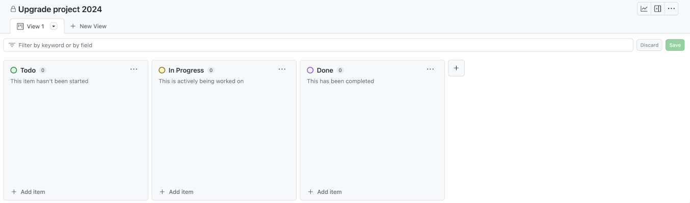
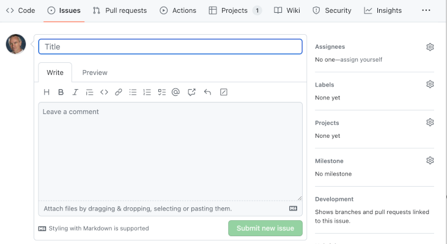

# Agile methodologies

<blockquote class="pretty">
Agile is an attitude, not a technique with boundaries. An attitude has no boundaries, so we wouldn’t ask ‘can I use agile here’, but rather ‘how would I act in the agile way here?’ or ‘how agile can we be, here?'
</blockquote>

Alistair Cockburn

## Issue-related workflow

Most code management platforms provide features to help manage projects. In GitHub, a project can be
represented in a tabular format, as a roadmap or in the form of a Kanban-style task board. The choice
of format is up to the team, but for the purposes of these notes, we will assume the use of a task board.

By default, a task board in GitHub contains the three swimlanes, `Todo`, `In Progress` and `Done` as
shown in Fig. 2. Further columns can be added if needed - this depends on how the team decides to
manage the work. For example, a swimlane for stalled tasks could be added, or for tasks in review.
The task board can be as complicated as required, but in general, the simpler the structure, the
more intuitive it is to use.

{: standalone #fig2 data-title="Default GitHub task board"}

Tasks in GitHub are represented by [issues](https://docs.github.com/en/issues). They can be added
directly on the task board using the button at the bottom of each swimlane. If you take that option,
you will need to explicitly attach the new issue to the relevant code repository. This is because
the relationship between projects and repositories doesnot have to be one-to-one. You can also create
issues using the issues tab on the repository page. If you take that option, you will need to say
explicitly which project the issue should be added to. This is done using the controls on the right of
the issue creation page as shown in Fig. 3.

{: standalone #fig3 data-title="GitHub new issue page"}

When using a task board, an item gradually accumulates detail and moves through the swimlanes from left
to right as the work progresses. Exactly *when* an item is moved from one swimlane to the next needs to
be defined in the team workflow so that there is no ambiguity. Once defined, these rules can be
performed and enforced manually, but GitHub can help to automate some of the steps. Clicking on the
three-dots icon in the top right-hand corner of the task board (see Fig. 5) allows you to select a
`Workflows` option. Here, you can define several actions to be triggered automatically. The options
are more or less self-explanatory and require some experimentation. The main point is that a team
should make explicit decisions about how their task board should operate and which steps are to be
automated. Thos decisions should be clearly documented sothat they are easy for team members to
follow.

