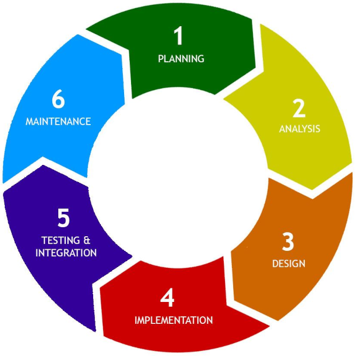
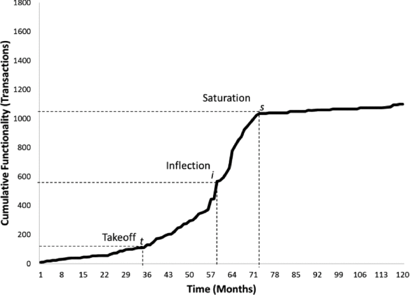
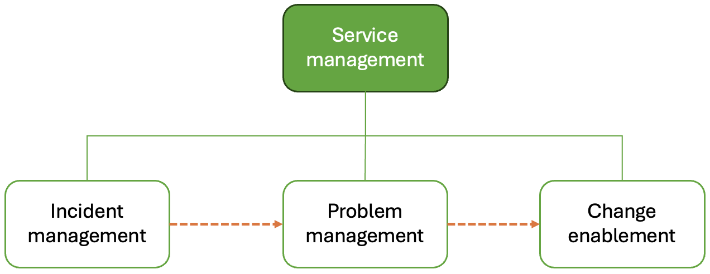

# Maintenance/evolution

Software evolution refers to the process of continuously adapting and improving software systems 
to meet changing requirements, rectify faults, and enhance performance and reliability. It is an 
essential aspect of software engineering, acknowledging that software systems must evolve to 
remain useful and effective in dynamic business environments. The importance of software evolution 
lies in its ability to sustain the value of software assets over time, ensuring they can adapt to 
new technological advancements, changing user needs, and evolving business processes. By 
systematically managing and implementing changes, organisations can extend the lifespan of 
their software, reduce the costs associated with system failures, and maintain a competitive 
edge through enhanced functionality and performance. Without ongoing evolution, software systems 
become obsolete, less efficient, and increasingly challenging to maintain, ultimately risking 
significant disruptions to business operations.

The concept of software evolution comes from the structured development tradition where the 
software development lifecycle is usually expressed in a linear form as shown in Fig. 12. Each 
phase builds on the previous one, culminating in the maintenance phase in which the project team 
has been disbanded and the system is in active use supported by a maintenance team.

{: standalone #fig12 data-title="The linear structured software development lifecycle"}

Although we are more used to thinking about software development in terms of an iterative Agile 
cycle, even in Agile projects there has to be an initial development effort that leads up to the 
initial release and deployment of the application. After that, the system is in active use and 
changes have to be carefully planned to avoid disrupting the work of the users. Talking about a 
maintenance phase therefore has meaning in both contexts. Other similarities between the 
structured and Agile approaches include:

*   The development team is often larger than the maintenance team.
*   The initial development is much shorter than the maintenance phase.
*   The cost of changes is greater during the maintenance phase.

The increasing cost of maintaining legacy systems was exemplified by a 
[UK government report](https://www.gov.uk/government/publications/organising-for-digital-delivery/organising-for-digital-delivery) 
from 2021 which reported that out of a total budget of £4.7BN, about half (£2.3BN) was spent 
"keeping the lights on".

Definition

According to [Gartner](https://www.gartner.com/en/information-technology/glossary/legacy-application-or-system), a legacy system is "an information system that may be based on outdated technologies, but is critical to day-to-day operations". The term _legacy system_ is therefore relative - it does not indicate a system built in a particular style or using a particular technology; any system can become a legacy system over time as technology and functional requirements evolve.

## Types of change

In 1976, [Swanson](https://dl.acm.org/doi/epdf/10.5555/800253.807723) identified the three types 
of software change shown below that might occur during maintenance. These categories have been 
widely adopted, although some authors have suggested alternative formulations based on the type 
of activity rather than on the intention behind the change 
([Chapin, 2001](https://doi.org/10.1002/smr.220)). All three types contribute to software evolution.

> Corrective
> 
> 1.  Processing failure
> 2.  Performance failure
> 3.  Implementation failure
> 
> Adaptive
> 
> 1.  Change in data environment
> 2.  Change in processing environment
> 
> Perfective
> 
> 1.  Processing inefficiency
> 2.  Performance enhancement
> 3.  Maintainability

Corrective changes are intrinsically linked to the accumulation of technical debt incurred during 
the development phase. Technical debt refers to the shortcuts and suboptimal solutions adopted to 
expedite delivery or reduce costs, often at the expense of code quality and maintainability. 
During initial development - especially in the later stages when there is pressure to release 
the first version of the application - these quick fixes and compromises accumulate, stocking 
up problems for the future.

Adaptive changes are intended to keep pace with changing requirements. The risk is that 
developers will be conservative when it comes to modifying the existing codebase and will 
prefer to add workarounds rather than carry out more extensive refactoring. Such an approach 
makes the codebase increasingly complex and harder to modify. This is sometimes referred to 
as [architecture erosion](https://doi.org/10.1002/smr.2423) since it gradually compromises 
any overarching architectural conventions.

Perfective changes are designed to add missing functionality to the application. In an Agile 
project, that could mean addressing some of the backlog items that were deemed low priority 
and were therefore not included in the initial release. Alternatively, they might be the result 
of post-release requests from the client on the basis of experience with the application and 
user feedback. They share the same risks as adaptive changes leading potentially to maintenance 
efforts becoming more time-consuming and costly as developers must navigate and address the 
accumulated technical debt to implement new features, fix bugs, or adapt to changing 
requirements. The ongoing management of technical debt is therefore crucial during the 
maintenance phase to ensure that the software remains functional, reliable, and scalable, 
ultimately supporting the system's long-term evolution and reducing the risk of system 
degradation.

## Lehman's laws

Another body of theory that was developed in the 1970s and has been repeatedly validated since 
concerns the phenomenology of software evolution - i.e. rules that appear to hold true in most 
situations. The table below lists the eight laws of software evolution that were developed by 
Manny Lehman and Les Belady between 1974 and 1996 
([Herraiz et al., 2013](http://dx.doi.org/10.1145/2543581.2543595)).

Table 1. Lehman's laws ([Herraiz et al. (2013))](http://dx.doi.org/10.1145/2543581.2543595)

| Number  | Law                                                                                                                                                                                                            |
|---------|----------------------------------------------------------------------------------------------------------------------------------------------------------------------------------------------------------------|
| I       | _Law of Continuing Change_   A system must be continually adapted, or else it becomes progressively less satisfactory in use.                                                                               |
| II      | _Law of Increasing Complexity_ As a system is changed, its complexity increases and becomes more difficult to evolve unless work is done to maintain or reduce the complexity.                              |
| III     | _Law of Self Regulation_ Global system evolution is feedback regulated.                                                                                                                                     |
| IV      | _Law of Conservation of Organisational Stability_ The work rate of an organisation evolving a software system tends to be constant over the operational lifetime of that system or phases of that lifetime. |
| V       | _Law of Conservation of Familiarity_ In general, the incremental growth (growth rate trend) of systems is constrained by the need to maintain familiarity.                                                  |
| VI      | _Law of Continuing Growth_ The functional capability of systems must be continually enhanced to maintain user satisfaction over system lifetime.                                                            |
| VII     | _Law of Declining Quality_ Unless rigorously adapted and evolved to take into account changes in the operational environment, the quality of a system will appear to be declining.                          |
| VIII    | _Law of Feedback System_ System evolution processes are multilevel, multiloop, multiagent feedback systems.                                                                                                 |

Note

Lehman's laws refer to _E-type_ (evolutionary) systems that approximate human activity in the real 
world in contrast to _S-type_ (specified) systems which can be proven correct in terms of 
deterministic specification, and _P-type_ (problem-solving) systems which apply heuristics or 
approximations to theoretical problems.

Over the years validation studies have been performed in different contexts to test the validity 
of Lehman's laws. The results have been mixed; however, two of the laws (I and VI) have been 
validated in all cases. Change, therefore, is inevitable for all the reasons discussed above. 
This was clearly demonstrated in a study carried out in 2014 by 
[Ramasubbu and Kemerer](https://doi.org/10.1109/TSE.2014.2327027) who tracked the changes to 
an example software system over time. As well as showing changes accumulating over time, they 
also revealed an interesting pattern in the way this occurred. The authors found that the 
functionality growth of a software system represented by "transactions" (similar to 
[function points](https://en.wikipedia.org/wiki/Function_point)) followed an S-shaped pattern 
shown in Fig. 13. Once the system proves useful to early adopters, the demand for change exhibits 
a sudden increase or "takeoff". After that, its cumulative functionality grows, following the 
sixth law of software evolution, until it reaches an inflection point. After this point in time, 
the growth rate of the software slows down until reaching the saturation point, where marginal 
functionalities are incorporated into the software baseline.

{: standalone #fig13 data-title="The accumulation of software changes over time"}

Once the rate of change has levelled out, the system is by definition receiving less attention. 
Over time, its technology will become outdated and members of the maintenance team will be lost 
through natural staff turnover. This has led some commentators to suggest that once the saturation 
point is reached, the system fits the description of a legacy system as shown in Fig. 14.

{: standalone #fig14 data-title="Creation of a legacy system?"}

To examine the interactions between the laws, 
[Franco et al.](https://doi.org/10.1007/s11219-022-09600-6) (2023) used the systems thinking 
approach to map the main concepts related to the software maintenance processes and describe 
their causal relationships. They expressed their finding through causal loop diagrams which 
correspond to mapping the causal relations between the system’s elements and which can be used 
to represent feedback loops of systems of any domain. The diagram consists of nodes and their 
relationships, where relationships can be positive or negative as indicated by the corresponding 
symbol at the end of a relationship arrow.

{: standalone #fig15 data-title="Feedback loops arising from the second and sixth laws of software evolution"}

The left-hand side of Fig. 15 shows a positive feedback loop in which the more complete the 
system, the more attractive it is. It therefore garners more change requests and attracts more 
development resource. This positive feedback arises as a consequence of Lehman's sixth law. 
The right-hand side shows a negative feedback loop arising from Lehman's second law. As the rate 
of enhancive (perfective) changes increases as a result of user demand, technical debt increases. 
The consequence of this is that software maintainability decreases even though there is an 
apparent increase in development team productivity. This increase is "borrowed" against future 
maintenance effort. The two opposing feedback loops in Fig. 4 therefore limit the growth 
potential of the system in the long term. For a full development of the feedback model, please 
refer to the original article.

## Evolution processes

The main message emerging from all of the theoretical work on software evolution is that 
software systems tend towards greater entropy over time just like physical systems. The 
term _software entropy_ has been used to describe the gradual deterioration in a system's 
quality, although a more common term is 
[software rot](https://en.wikipedia.org/w/index.php?title=Software_entropy&redirect=no). 
Lehman's laws II and VII refer explicitly to the need for active management of technical 
debt during the evolution of a software system. This section examines some of the methods 
by which that can be achieved.

### Service management

Bearing in mind that software evolution refers to the further development of an application 
after its initial release, the 
[ITIL](https://napier.primo.exlibrisgroup.com/permalink/44NAP_INST/n96pef/alma9923796456902111) 
(Information Technology Infrastructure Library) framework provides a useful perspective. 
Aimed at large organisations, ITIL defines a set of structured processes and best practices 
for IT service management. The framework can be tailored for smaller organisations, but 
crucially it can be harmoniously integrated into an Agile software development environment 
for effective bug resolution and change request handling. In Agile, where flexibility and 
rapid iterations are key, ITIL's 
[Change Management](https://wiki.en.it-processmaps.com/index.php/Change_Management) process 
ensures that all changes, including bug fixes and new features, are systematically recorded, 
evaluated, and authorised, maintaining control and reducing risk. The 
[Incident Management](https://wiki.en.it-processmaps.com/index.php/Incident_Management) process 
complements Agile's iterative cycles by quickly addressing and resolving bugs, ensuring minimal 
disruption to service. By incorporating ITIL’s structured approach within Agile's dynamic 
framework, organisations can achieve a balanced blend of agility and control, enhancing 
responsiveness to change while maintaining service quality and stability.

{: .note-title }
> <i class="fa-solid fa-circle-info"></i> Note
>
> The [latest version of ITIL](https://wiki.en.it-processmaps.com/index.php/ITIL_4) does not 
> define set processes, and instead refers to management _practices_ to allow implementing 
> organisations more freedom to define processes that suit their own context.

ITIL distinguishes between _incidents_, _problems_ and _requests for change_ (RFCs) which are 
variously handled by the management practices shown in Fig. 16. Incidents are interruptions to 
the IT service which could, for example, refer to bug reports coming through a helpdesk. It is 
the job of frontline support to resolve incidents as quickly as possible. A problem is the 
underlying cause of one or more incidents. Another responsibility of the support team is to 
identify and document workarounds for problems to help with the resolution of further incidents. 
Both incidents and problems can give rise to RFCs which are the items that are passed on to 
the development team for attention.

{: standalone #fig16 data-title="ITIL change-related practices"}

### Impact analysis

Impact analysis is a systematic process used to evaluate the potential consequences of proposed 
changes to the software system. This involves identifying the components, modules, and 
functionalities that may be affected by the change, assessing the risk of introducing new 
defects, and estimating the resources required for implementation. The primary goal of impact 
analysis is to understand the breadth and depth of the change's effects, ensuring informed 
decision-making and effective planning. By thoroughly analysing the impact, developers and 
project managers can anticipate potential problems, mitigate risks, and ensure that changes 
are implemented smoothly without disrupting the overall functionality and stability of the 
software. Several types of impact can be identified, and it is useful to split the overall 
concept of impact analysis into different dimensions as illustrated in Fig. 17. You can use 
the grid below the figure to explore these dimensions in more detail.

{: standalone #fig17 data-title="Dimensions of impact"}

Functional

*   **Requirements Gathering**: Collect detailed functional requirements for the new feature.
*   **Change in Features**: Introduction, modification, or removal of system features and 
    functionalities.
*   **User Workflow**: Alteration of user processes and how they interact with the system.
*   **System Behaviour**: Changes in how the system responds to different inputs and conditions.

Technical

*   **System Architecture**: Examine how the new feature will fit into the existing system 
    architecture. Identify any required modifications to the current architecture.
*   **Infrastructure**: Assess the need for additional hardware or software infrastructure, 
    such as APIs, or cloud services.
*   **Integration**: Determine how the new feature will integrate with existing components, such 
    as databases, message processing, and user interfaces.
*   **Data Storage**: Analyse changes needed in the database schema to accommodate new data 
    requirements.

Operational

*   **Maintenance**: Changes in maintenance schedules, procedures, and complexity.
*   **Support**: Impact on technical support requirements and capacity.
*   **Backup and Recovery**: Modifications to backup procedures and disaster recovery plans.
*   **Business Processes**: Review existing business processes and workflows to identify changes 
    needed to incorporate telephone call processing.
*   **Staff Training**: Determine the training requirements for staff to effectively use and 
    support the new features.
*   **Support and Maintenance**: Assess the impact on support and maintenance processes, 
    including potential changes to support documentation and procedures.

Performance

*   **System Speed**: Effects on response times, processing speed, and overall system performance.
*   **Scalability**: Ability of the system to handle increased load or growth in users and data.
*   **Resource Utilisation**: Changes in the usage of system resources like CPU, memory, and storage.

Reliability/stability

*   **System Downtime**: Potential increase in system downtime during and after the change.
*   **Error Rates**: Increase or decrease in the frequency of system errors and failures.
*   **Data Integrity**: Ensuring data remains accurate, consistent, and secure during and after 
    the change.

Security

*   **Vulnerabilities**: Introduction of new security vulnerabilities or weaknesses.
*   **Data Privacy**: Changes in how data is handled, affecting user privacy and compliance with 
    regulations.
*   **Access Control**: Modification of user access levels and authentication mechanisms.

Usability

*   **User Interface**: Changes in the look and feel of the system interface.
*   **User Experience**: Overall impact on user satisfaction, ease of use, and accessibility.

Stakeholder

*   **Stakeholder Identification**: Identify all stakeholders affected by the change, including 
    end-users, support staff, and management.
*   **Stakeholder Communication**: Develop a communication plan to keep stakeholders informed 
    about the change, its benefits, and its impact on their roles.
*   **User Satisfaction**: How users perceive and react to the changes.
*   **Stakeholder Relationships**: Impact on relationships with customers, partners, and other 
    stakeholders.
*   **Communication**: Need for effective communication to manage expectations and feedback.

Financial

*   **Cost Estimation**: Estimate the costs associated with implementing the new feature, 
    including development, infrastructure, training, and ongoing maintenance.
*   **Budgeting**: Determine if the project fits within the existing budget or if additional 
    funding is needed.
*   **Revenue**: Potential impact on revenue, either positive or negative, due to changes in 
    system capabilities.
*   **Return on Investment (ROI)**: Evaluation of the financial benefits versus the costs of the 
    change.

Risk

*   **Risk Identification**: Identify potential risks associated with the change, such as 
    technical challenges, integration issues, or user resistance.
*   **Risk Mitigation**: Develop strategies to mitigate identified risks, such as phased 
    implementation, thorough testing, and user training.
*   **Contingency Planning**: Prepare contingency plans to address potential issues that may 
    arise during implementation.

Compliance and regulatory

*   **Regulatory Requirements**: Assess any regulatory requirements related to telephone call handling, such as data protection laws and communication regulations.
*   **Compliance Measures**: Ensure that the new feature complies with all relevant regulations 
    and standards, and implement necessary measures to maintain compliance.
*   **Licensing**: Changes in software licensing requirements and costs.
*   **Contractual Obligations**: Impact on existing contracts and service level agreements (SLAs).

Strategic

*   **Alignment with Business Goals**: How well the change supports the organisation’s strategic 
    objectives.
*   **Market Position**: Impact on the organisation's competitive position in the market.
*   **Innovation**: Potential for the change to drive innovation and future growth.

### Refactoring

We have already considered the use of refactoring software during the development process. During 
the maintenance phase, proactive use of refactoring systematically improves the internal structure 
of the code without altering its external behaviour. It allows the development team to clean up 
and optimise code to enhance readability, reduce complexity, and improve maintainability. Through 
refactoring, developers can address technical debt, remove redundancies, and simplify intricate 
code segments, making the software easier to understand and modify. As a result, refactoring helps 
maintain the software's health over time, supports the seamless integration of new features, and 
facilitates ongoing adaptation to changing requirements and technologies. By investing in regular 
refactoring, organisations ensure that their software systems remain robust, agile, and capable 
of evolving efficiently to meet future business needs.

Earlier we discussed three types of change, corrective, adaptive and perfective. Given the 
imperative to pay down technical debt where possible, some authors have suggested a fourth 
category of _preventative_ change. Despite the risk of introducing new bugs when modifying code, 
preventative tasks use refactoring to

*   Clarify confusing code by adding comments or improving class, function and variable names
*   Consolidate duplicated code to simplify maintenance
*   Adjust code to accommodate future changes more easily

Bug-prone sections of code, often complicated or frequently modified, benefit significantly from 
refactoring to prevent future issues. Although refactoring requires careful consideration and 
testing to avoid replacing functional code with broken code, it ultimately leads to cleaner, 
more maintainable, and less error-prone software.

## Re-engineering

Legacy systems pose some characteristic problems in terms of maintenance. As the definition 
above states, a legacy system is integral to ongoing operations. When a potential change to a 
legacy system is identified, several dimensions of impact take on particular importance. Changes 
to legacy systems are more expensive and risk-prone compared to more modern systems, for example. 
Retaining the system in its current form may not be compatible with the current organisational 
strategy and may expose the organisation to security vulnerabilities not present in current 
systems. When considering a change to a legacy system, therefore, the option to _re-engineer_ 
the entire system must be considered. If the system ceases to deliver business value, another 
option might be to scrap it completely and migrate users to an alternative. Fig. 18. divides 
legacy systems into four clusters depending on their business value and system quality.

)](images/legacy_system_classification.png){: standalone #fig18 data-title="Classifying legacy systems"}

Classifying systems in this way suggests four different strategies:

{::nomarkdown}  
<table class="quadrants">
    <tbody><tr><th rowspan="2">Business value</th><th>High</th><td>Re-engineer or replace</td><td>Maintain</td>
    </tr><tr><th>Low</th><td>Scrap</td><td>Replace with COTS, scrap or maintain</td></tr>
    <tr><td colspan="2"></td><th>Low</th><th>High</th></tr>
    <tr><td colspan="2"></td><th colspan="2">System quality</th></tr>
</tbody></table>
{:/}

The need for software re-engineering became significant by the late 1990s, driven by the transition 
of information systems to web-based interfaces. Re-engineering emerged to address the challenges 
posed by legacy systems that are critical for business operations. Researchers have since developed 
flexible and repeatable process models and road maps for re-engineering these systems. According 
to [Sommerville](https://napier.primo.exlibrisgroup.com/permalink/44NAP_INST/13v8mut/alma9923404758802111), 
software engineering encompasses all aspects of software production, from specification to 
maintenance. In contrast, re-engineering focuses on making legacy systems more maintainable by 
revisiting documentation, reorganising system architecture, and re-implementing the system using 
modern technologies while preserving core functionalities. Unlike forward engineering, which 
starts with a specification and moves towards implementation, re-engineering begins with an 
existing system and transforms it through understanding and modification. Re-engineering is 
necessary when code structures become unclear, documentation is missing, support for current 
hardware and software becomes obsolete, original developers are unavailable, and extensive 
modifications render the system difficult or expensive to change.

A key component of the re-engineering process is an initial activity aimed at understanding the 
existing system. When represented in process diagrams, it is the equivalent of requirements 
analysis in the forward engineering scenario. Although the existing codebase captures the 
structure and operation of the system, it is not necessarily easy to understand. This has led 
[some authors](https://ceur-ws.org/Vol-3672/PT-paper2.pdf) to recommend the application of 
standard requirements analysis techniques during the system understanding phase. The term 
_reverse engineering_ is often used to describe the process of analysing and understanding an 
existing software system to extract knowledge or design information from it. This process 
involves examining the system's components, architecture, and behaviour to create a higher-level 
representation, such as models or documentation, which may not be available or may have become 
outdated over time. The goal of reverse engineering is to gain a comprehensive understanding of 
how the legacy system operates.

Once an abstract understanding of the legacy system has been developed, the next stage of the 
process is often referred to as _transformation_. The central concept is that the structure of 
the existing system is based on outdated conventions and needs to be redesigned using current 
techniques. Only after this transformation stage which may also include removing any unnecessary 
elements is the system ready for redevelopment.

It is worth mentioning that at the time of writing, a common theme in the literature is the 
migration of legacy systems to a microservices architecture which is deployed on a cloud service. 
However, further discussion of this particular case is beyond the scope of the module.

{: .tip-title }
> [<i class="fa-regular fa-lightbulb"></i> Practical tips on software evolution](evolution_tips)

## Further reading

*   [Herraiz et al. (2013) The Evolution of the Laws of Software Evolution: A Discussion Based on a Systematic Literature Review](http://dx.doi.org/10.1145/2543581.2543595)
*   [ITIL® 4 Create, Deliver and Support (CDS)](https://napier.primo.exlibrisgroup.com/permalink/44NAP_INST/n96pef/alma9923796456902111)
*   [Towards a Topology for Legacy System Migration](https://doi.org/10.1145/3387940.3391476)
*   [Stephens, 2022, Ch. 16](https://learning.oreilly.com/library/view/beginning-software-engineering/9781119901709/c01.xhtml)
