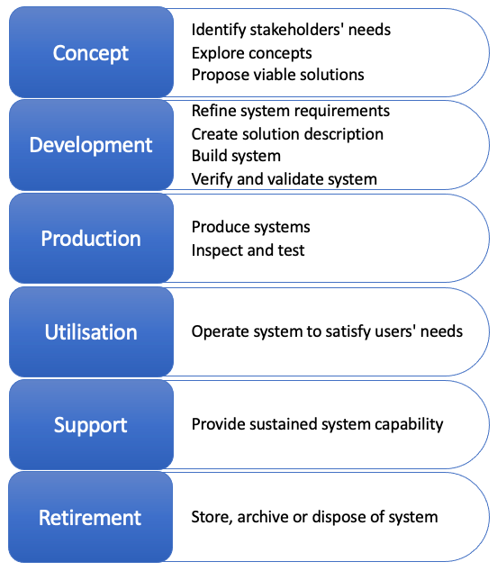
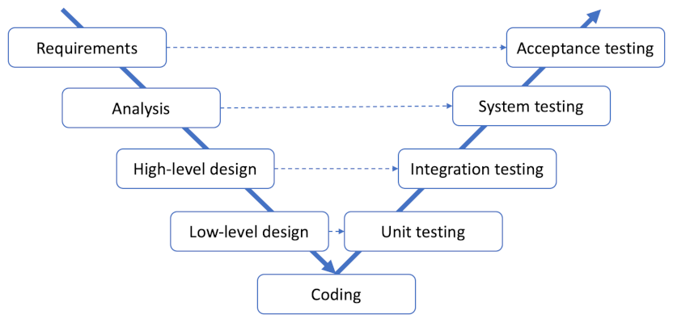
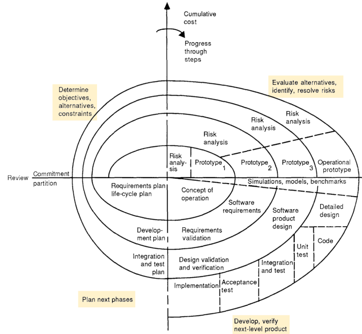
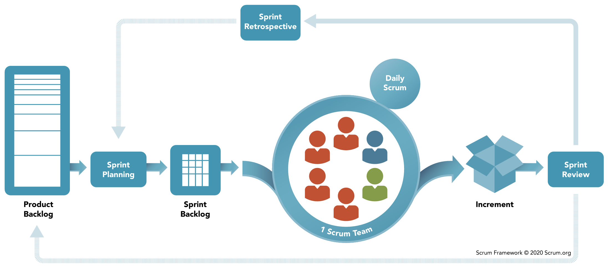

# Lifecycles and stages

<blockquote class="pretty">
If you think it’s simple, then you have misunderstood the problem.
</blockquote>

Bjarne Stroustrup

# Lifecycle and development models

## System life cycles

Because science, technology, society and customer requirements all evolve over time, every
engineered system has a lifecycle. It starts as a concept, moves through design and 
development, spends most of its time being used, and is finally retired. Dividing a system
lifecycle into stages helps with planning, provisioning, operating and supporting the SOI.
A lifecycle model helps an organisation to make appropriate decisions and to manage the risks
related to the development and use of systems by providing clear thresholds, sometimes called
*gateways*.

ISO24748-1 defines six standard lifecycle stages as shown in Fig. 1.

*Fig. 1: Lifecycle stages ([ISO24748-1](https://doi-org.napier.idm.oclc.org/10.1109/IEEESTD.2018.8526560))*

The progression from one lifecycle stage to another is not linear or predetermined. ISO24748-1 provides 
some example transitions as shown in Fig. 2 with the following decision options at each stage.

* Begin subsequent stage or stages
* Continue this stage
* Go to or restart a preceding stage
* Hold project activity
* Terminate project

<pre class="mermaid figure">
flowchart LR
    Concept <--> Development
    Concept <--> Production
    Development <--> Production
    Production --> Utilisation
    Development <--> Utilisation
    Concept <--> Utilisation
    Utilisation <--> Support
    Concept <--> Support
    Utilisation --> Retirement
    Support --> Retirement
</pre>
*Fig. 2: Lifecycle stage transitions ([ISO24748-1](https://doi-org.napier.idm.oclc.org/10.1109/IEEESTD.2018.8526560))*

ISO24748-1 identifies five common principles associated with system lifecycle management:

1. A system progresses through specific stages during its life.
2. Enabling systems should be available for each stage in order to achieve the outcomes of the 
   stage.
3. At specific life cycle stages, attributes, such as producibility, usability, supportability 
   and disposability should be specified and designed into a system.
4. Progression to another stage requires satisfaction of exit criteria of the current stage and 
   possibly entrance criteria for the following stage or stages.
5. Exit criteria are usually based on satisfactory outcomes of the stage being completed and may
   include demonstrable readiness to execute the processes in the subsequent stage or stages.

The concept of exit criteria is very important for ensuring the quality of a system. At the end of a 
software engineering project, for example, the system may only move from the development stage to the 
utilisation stage if pre-defined user acceptance criteria are met. This is a particularly important
transition for any development project since it represents the completion of the development work. As such,
it has its own name, often being referred to as *deployment*. Checks against standard criteria can be 
performed within stages as well to safeguard the quality of the work in progress.

The purpose of ISO24748-1 is to provide a common framework for the description and discussion of
system lifecycles; it does not attempt to dictate how a particular team or organisation should arrange
its lifecycle stages, or indeed which ones need to be implemented. A further complication is that there
are other terms for some of the stages mentioned in the standard. The development and production stages 
are often conflated, for example, so that a composite development stage also includes the building,
inspection and testing of a system. The support and utilisation stages are often conflated as well with
the resulting composite stage referred to as the *operation and maintenance* stage. The idea is that 
the work of building the system is complete, and the responsibility of the producer now shifts to 
maintaining the system in use. Confusingly, this stage may also be referred to as the production stage 
which is in direct conflict with the nomenclature defined in the standard.

For a deeper understanding of the system lifecycle stages discussed above, please review the 
[ISO24748-1](https://doi-org.napier.idm.oclc.org/10.1109/IEEESTD.2018.8526560#please-read) 
standard itself which is relatively short and easy to read.

## Development project lifecycles

Clearly, the development phase in Figs. 1 and 2 is of particular interest because it is in this stage 
that the code is built. In order to monitor and manage the development phase, a clear framework is
needed. During the 20th century, the predominant model for software development was linear. It 
consisted of a logical series of stages with quality checks at the end of each one. This approach,
originally introduced by Winston Royce ([1970](https://dl.acm.org/doi/10.5555/41765.41801)),
is known as the *waterfall* method of the visual representation of the sequential stages as shown
in Fig. 3. The waterfall approach is an extreme expression of what Stephens calls a 
*[predictive model](https://learning.oreilly.com/library/view/beginning-software-engineering/9781119901709/c17.xhtml)*.
The idea is that when the requirements are clearly and comprehensively defined in advance, these models
will work well.

*Fig. 3: Simplified waterfall project lifecycle*

Strictly adhering to the sequential nature of the stages in the waterfall approach leads to a number
of practical difficulties. These include

* The inability to introduce requirements later in the project if they were overlooked at the start
* The rigidity of the specification and design - once approved, they cannot easily be changed if 
  problems emerge
* The postponing of any major testing until all the code is complete

To address these issues, several modifications to the waterfall approach have been proposed including
the two outlined below.

### The V model

The main innovation in the V model was to identify different types of testing that were used at 
different stages of the project. This went some way to resolving the problem with postponed testing,
but other issues still remained.

*Fig 4: V model ([Rook, 1986](https://doi.org/10.1049/sej.1986.0003))*

### The waterfall model with feedback

Another refinement of the waterfall model attempted to reconcile the sequential nature of the stages
with the reality of discovering error over time by introducing feedback loops. The idea was to
contain errors within a phase so that the transition to the next phase could still be made cleanly.
In fact, this version of the waterfall model incorporates ideas from Royce's original paper. The main
idea is that events during the project can trigger the return to an earlier stage as illustrated in
Fig. 5.

*Fig. 5: The waterfall model with feedback*

### The iterative waterfall model

The number of variations on the waterfall model are evidence that something was wrong and needed 
fixing. A further version proposed the idea of a single project being decomposed into a series of
waterfalls, one feeding into the next as shown in Fig. 6.

*Fig 6: The iterative waterfall model*

### The spiral model

In another step away from the strictly linear approach, Barry Boehm introduced the spiral model in 
[1986](https://doi.org/10.1109/2.59). While visually complex, the spiral model, shown in Fig. 7, 
was based on the idea that risk management should be the main concern in software development projects.
Starting with simple, fundamental piece of the development, it explicitly captured the concept of
iterative prototyping by following a repeating pattern of four stages:

1. Determine objectives, alternatives and constraints
2. Evaluate alternatives and identify and resolve risks
3. Develop and verify next-level product
4. Plan next phase

However, it also inherited extensive testing towards the end of the project 
from the traditional waterfall approach.

*Fig. 7: The spiral model ([Boehm, 1986](https://doi.org/10.1109/2.59))*

## Agile

Predictive models have two major drawbacks. The first is that they do not have a way to manage the 
unexpected or the uncertain. The second is that from a management point of view, once the design and
the timescale have been agreed, legal and commercial interests come into play that place huge 
constraints on the development team. To a certain extent, the rigid structure of the waterfall model
was the result of a misinterpretation of Royce's original paper. It was an oversimplification that
downplayed the challenge of creating a comprehensive design in advance of any development work. On the
other hand, it could be argued that the waterfall approach is ideally suited to high-risk projects
where an error might lead to death or large-scale financial loss. Even in those cases, however, code
is written by fallible human beings and the process has to account for errors and oversights.

The need for a more nuanced approach to the management of software development was recognised by
many pioneering figures from the 1980s onwards. Several methodologies were proposed that were based
on the principles of iterative prototype building and incremental refinement of requirements. Some
notable examples are RAD ([Martin, 1991](https://en.wikipedia.org/wiki/Rapid_application_development))
and Dynamic Systems Development Method (DSDM) reviewed by 
Millington and Stapleton ([1995](https://doi.org/10.1109/52.406757)).

The final move to a dynamic approach that prioritised the incremental nature of software development
occurred in 2001 with the publication of the 
[Manifesto for Agile Software Development](https://agilemanifesto.org/). It marked a major 
[paradigm shift](https://en.wikipedia.org/wiki/Paradigm_shift) and agile has become the preferred 
approach to software development projects for many companies. According to
[some sources](https://www.simform.com/blog/state-of-agile-adoption/), up to 94% of companies
practice agile to some extent, although only 52% use agile for the majority of projects. 

The international standard 
[ISO/IEC/IEEE 26515](https://napier.primo.exlibrisgroup.com/permalink/44NAP_INST/19n0mho/cdi_ieee_standards_0b0000648897745a),
last updated in 2018, provides a benchmark for agile methods. The agile manifesto itself is built around 
12 principles that will be referred to at various points in the module. The three most relevant at this 
point in the discussion are

* Our highest priority is to satisfy the customer through early and continuous delivery of valuable 
  software.
* Deliver working software frequently, from a couple of weeks to a couple of months, with a preference 
  to the shorter timescale.
* Working software is the primary measure of progress.

These three principles highlight the *continuous* nature of an agile approach with the goal of delivering
working software in the shortest possible timeframe. The 
[Scrum](https://www.scrum.org/learning-series/what-is-scrum) framework interprets the general agile
principles in a way that splits a project into short periods of time called *sprints*. Each sprint
has a managed life cycle as illustrated in Fig. 8.

*Fig. 8: The Scrum framework ([Scrum.org](https://www.scrum.org/learning-series/what-is-scrum)*)

Although Scrum is the most widely-used agile methodology, there are other such as 
[Kanban](https://kanbanize.com/kanban-resources) which dispense with sprints and adopt a fully
continuous process instead. Despite their differences, there is a large degree of overlap in agile
methods, and a practical implementation of agile will include elements from more than one.

For a discussion of agile methods, please read [Stephens, 2022, Ch. 19](https://learning.oreilly.com/library/view/beginning-software-engineering/9781119901709/c19.xhtml#please-read)

## DevOps

Because an agile project is delivering working software in a continuous series of increments, it then
becomes possible to automate some of the essential steps in the process. The current term for this
is *DevOps*, a compound of *Development* and  *Operations*. The main goal is to eliminate delays and
human error involved in some of the routine aspects of software quality assurance including,
for example, building, testing and even deployment. *Continuous integration* (CI) is the terms used
to indicate that changes to a software application are automatically assembled, compiled and tested.
The process is often visualised as a series of steps known as a *pipeline*. Going one step further
and automatically releasing and deploying software increments is known as *Continuous deployment* (CD).
CD is obviously a more risky proposition that CI and a complete CI/CD pipeline includes rigorous
verification and monitoring steps before software is actually released to users as illustrated in
Fig. 9.

*Fig 9: The four activities of continuous deployment ([Scaled Agile, 2023](https://scaledagileframework.com/continuous-deployment/))*

## Further reading

* Software Project Management ([O'Regen, 2022, Ch. 4](https://link-springer-com.napier.idm.oclc.org/chapter/10.1007/978-3-031-07816-3_4))
* Manifesto for Agile Software Development ([Beck et al., 2001](https://agilemanifesto.org/))
* Developing information for users in an agile environment ([ISO/IEC/IEEE 26515](https://napier.primo.exlibrisgroup.com/permalink/44NAP_INST/19n0mho/cdi_ieee_standards_0b0000648897745a))
* Deployment ([Stephens, 2022, Ch. 14](https://learning.oreilly.com/library/view/beginning-software-engineering/9781119901709/c14.xhtml))
