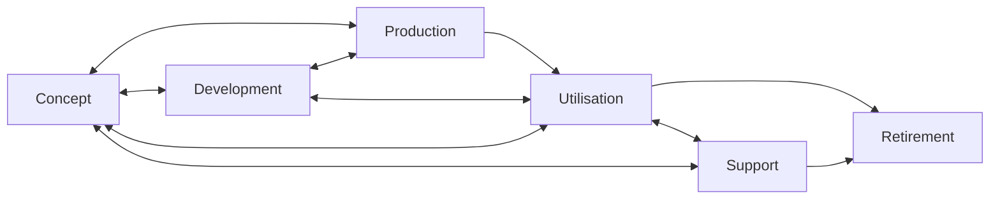
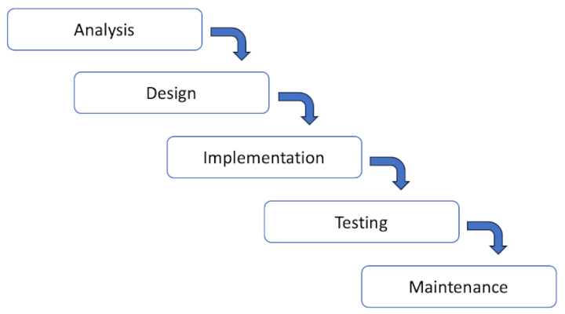
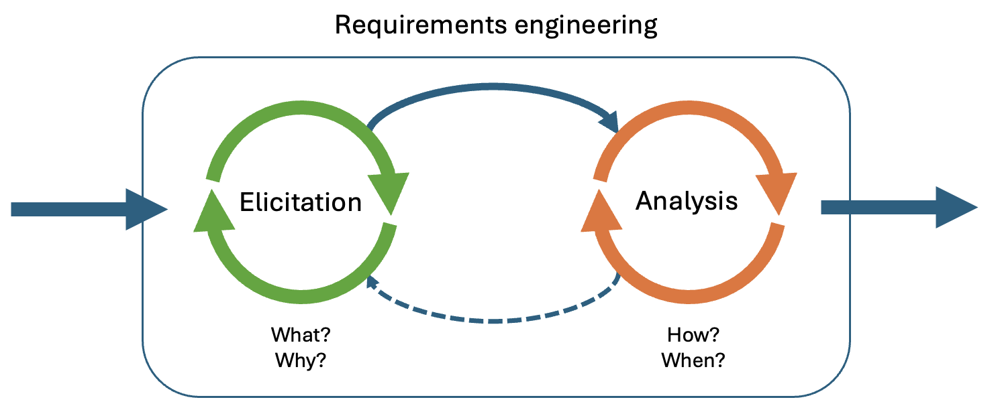
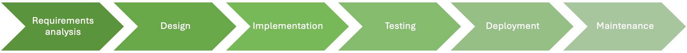
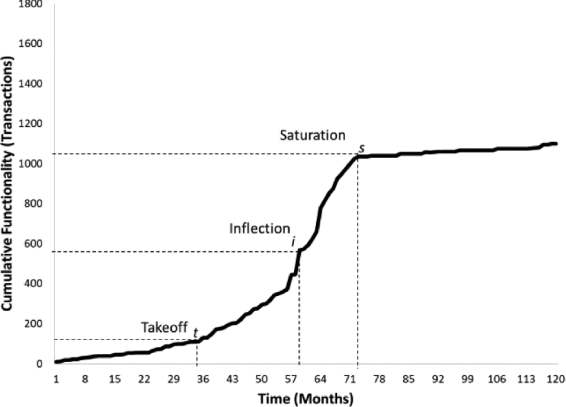
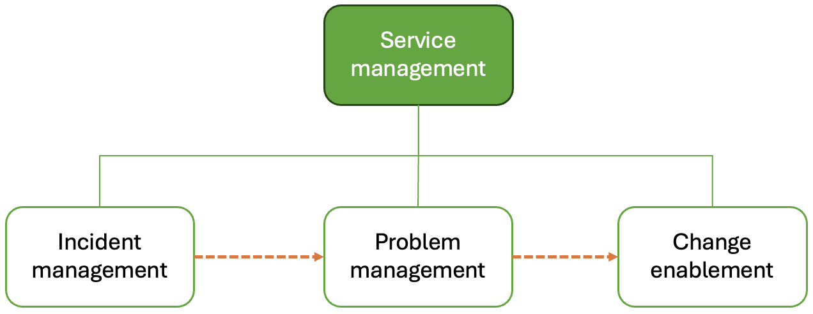
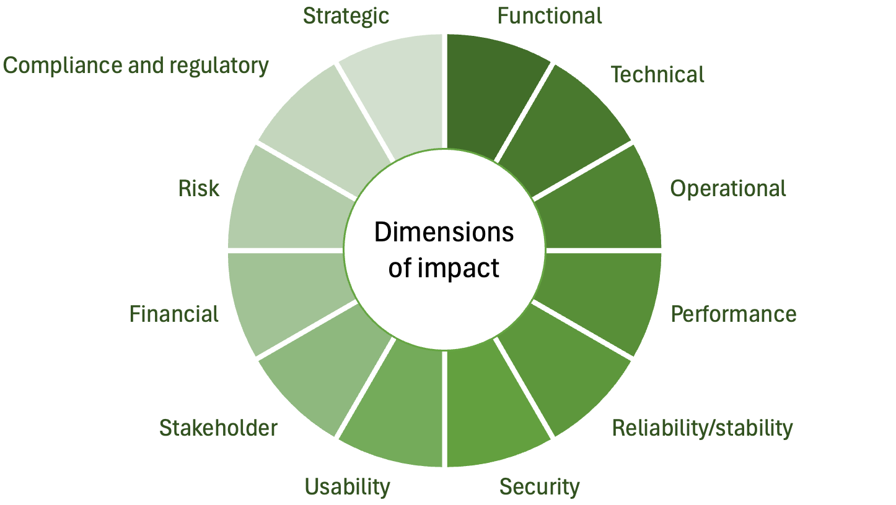

# Lifecycles and stages

<blockquote class="pretty">
If you think it’s simple, then you have misunderstood the problem.
</blockquote>

Bjarne Stroustrup

## System lifecycles

Because science, technology, society and customer requirements all evolve over time, every
engineered system has a lifecycle. It starts as a concept, moves through design and 
development, spends most of its time being used, and is finally retired. Dividing a system
lifecycle into stages helps with planning, provisioning, operating and supporting the 
system of interest (SOI).
A lifecycle model helps an organisation to make appropriate decisions and to manage the risks
related to the development and use of systems by providing clear thresholds, sometimes called
*gateways*.

ISO24748-1 defines six standard lifecycle stages as shown in Fig. 2.

)](images/lifecycle_stages.png){: standalone #fig2 data-title="Lifecycle stages"}

The progression from one lifecycle stage to another is not linear or predetermined. ISO24748-1 provides 
some example transitions as shown in Fig. 3 with the following decision options at each stage.

* Begin subsequent stage or stages
* Continue this stage
* Go to or restart a preceding stage
* Hold project activity
* Terminate project

*Fig. 3: Lifecycle stage transitions ([ISO24748-1](https://doi-org.napier.idm.oclc.org/10.1109/IEEESTD.2018.8526560))*

ISO24748-1 identifies five common principles associated with system lifecycle management:

1. A system progresses through specific stages during its life.
2. Enabling systems should be available for each stage in order to achieve the outcomes of the 
   stage.
3. At specific life cycle stages, attributes, such as producibility, usability, supportability 
   and disposability should be specified and designed into a system.
4. Progression to another stage requires satisfaction of exit criteria of the current stage and 
   possibly entrance criteria for the following stage or stages.
5. Exit criteria are usually based on satisfactory outcomes of the stage being completed and may
   include demonstrable readiness to execute the processes in the subsequent stage or stages.

The concept of exit criteria is very important for ensuring the quality of a system. At the end of a 
software engineering project, for example, the system may only move from the development stage to the 
utilisation stage if pre-defined user acceptance criteria are met. This is a particularly important
transition for any development project since it represents the completion of the development work. 
As such, it has its own name, often being referred to as *deployment*. Checks against standard 
criteria can be performed within stages as well to safeguard the quality of the work in progress.

The purpose of ISO24748-1 is to provide a common framework for the description and discussion of
system lifecycles; it does not attempt to dictate how a particular team or organisation should arrange
its lifecycle stages, or indeed which ones need to be implemented. A further complication is that there
are other terms for some of the stages mentioned in the standard. The development and production stages 
are often conflated, for example, so that a composite development stage also includes the building,
inspection and testing of a system. The support and utilisation stages are often conflated as well with
the resulting composite stage referred to as the *operation and maintenance* stage. The idea is that 
the work of building the system is complete, and the responsibility of the producer now shifts to 
maintaining the system in use. Confusingly, this stage may also be referred to as the production stage 
which is in direct conflict with the nomenclature defined in the standard.

For a deeper understanding of the system lifecycle stages discussed above, please review the 
[ISO24748-1](https://doi-org.napier.idm.oclc.org/10.1109/IEEESTD.2018.8526560#please-read) 
standard itself which is relatively short and easy to read.

## Development project lifecycles

Clearly, the development phase in Figs. 1 and 2 is of particular interest because it is in this stage 
that the code is built. In order to monitor and manage the development phase, a clear framework is
needed. During the 20th century, the predominant model for software development was linear. It 
consisted of a logical series of stages with quality checks at the end of each one. This approach,
originally introduced by Winston Royce ([1970](https://dl.acm.org/doi/10.5555/41765.41801)),
is known as the *waterfall* method of the visual representation of the sequential stages as shown
in Fig. 4. The waterfall approach is an extreme expression of what Stephens calls a 
*[predictive model](https://learning.oreilly.com/library/view/beginning-software-engineering/9781119901709/c17.xhtml)*.
The idea is that when the requirements are clearly and comprehensively defined in advance, these models
will work well.

{: standalone #fig4 data-title="Simplified waterfall project lifecycle"}

Strictly adhering to the sequential nature of the stages in the waterfall approach leads to a number
of practical difficulties. These include

* The inability to introduce requirements later in the project if they were overlooked at the start
* The rigidity of the specification and design - once approved, they cannot easily be changed if 
  problems emerge
* The postponing of any major testing until all the code is complete

To address these issues, several modifications to the waterfall approach have been proposed including
the two outlined below.

## Agile

Predictive models have two major drawbacks. The first is that they do not have a way to manage the 
unexpected or the uncertain. The second is that from a management point of view, once the design and
the timescale have been agreed, legal and commercial interests come into play that place huge 
constraints on the development team. To a certain extent, the rigid structure of the waterfall model
was the result of a misinterpretation of Royce's original paper. It was an oversimplification that
downplayed the challenge of creating a comprehensive design in advance of any development work. On the
other hand, it could be argued that the waterfall approach is ideally suited to high-risk projects
where an error might lead to death or large-scale financial loss. Even in those cases, however, code
is written by fallible human beings and the process has to account for errors and oversights.

The need for a more nuanced approach to the management of software development was recognised by
many pioneering figures from the 1980s onwards. Several methodologies were proposed that were based
on the principles of iterative prototype building and incremental refinement of requirements. Some
notable examples are RAD ([Martin, 1991](https://en.wikipedia.org/wiki/Rapid_application_development))
and Dynamic Systems Development Method (DSDM) reviewed by 
Millington and Stapleton ([1995](https://doi.org/10.1109/52.406757)).

The final move to a dynamic approach that prioritised the incremental nature of software development
occurred in 2001 with the publication of the 
[Manifesto for Agile Software Development](https://agilemanifesto.org/). It marked a major 
[paradigm shift](https://en.wikipedia.org/wiki/Paradigm_shift) and agile has become the preferred 
approach to software development projects for many companies. According to
[some sources](https://www.simform.com/blog/state-of-agile-adoption/), up to 94% of companies
practice agile to some extent, although only 52% use agile for the majority of projects. 

The international standard 
[ISO/IEC/IEEE 26515](https://napier.primo.exlibrisgroup.com/permalink/44NAP_INST/19n0mho/cdi_ieee_standards_0b0000648897745a),
last updated in 2018, provides a benchmark for agile methods. The agile manifesto itself is built around 
12 principles that will be referred to at various points in the module. The three most relevant at this 
point in the discussion are

* Our highest priority is to satisfy the customer through early and continuous delivery of valuable 
  software.
* Deliver working software frequently, from a couple of weeks to a couple of months, with a preference 
  to the shorter timescale.
* Working software is the primary measure of progress.

These three principles highlight the *continuous* nature of an agile approach with the goal of delivering
working software in the shortest possible timeframe. The 
[Scrum](https://www.scrum.org/learning-series/what-is-scrum) framework interprets the general agile
principles in a way that splits a project into short periods of time called *sprints*. Each sprint
has a managed life cycle as illustrated in Fig. 9.

)](images/scrum.png){: standalone #fig9 data-title="The Scrum framework"}

Although Scrum is the most widely-used agile methodology, there are other such as 
[Kanban](https://kanbanize.com/kanban-resources) which dispense with sprints and adopt a fully
continuous process instead. Despite their differences, there is a large degree of overlap in agile
methods, and a practical implementation of agile will include elements from more than one.

For a discussion of agile methods, please read [Stephens, 2022, Ch. 19](https://learning.oreilly.com/library/view/beginning-software-engineering/9781119901709/c19.xhtml#please-read)

## DevOps

Because an agile project is delivering working software in a continuous series of increments, it then
becomes possible to automate some of the essential steps in the process. The current term for this
is *DevOps*, a compound of *Development* and  *Operations*. The main goal is to eliminate delays and
human error involved in some of the routine aspects of software quality assurance including,
for example, building, testing and even deployment. *Continuous integration* (CI) is the terms used
to indicate that changes to a software application are automatically assembled, compiled and tested.
The process is often visualised as a series of steps known as a *pipeline*. Going one step further
and automatically releasing and deploying software increments is known as *Continuous deployment* (CD).
CD is obviously a more risky proposition that CI and a complete CI/CD pipeline includes rigorous
verification and monitoring steps before software is actually released to users as illustrated in
Fig. 10.

)](https://scaledagileframework.com/wp-content/uploads/2023/01/Continuous_Deployment_F02-2.svg#figure){: standalone #fig10 data-title="The four activities of continuous deployment"}

## Requirements engineering

Having a clear understanding of a project's requirements is essential for success. It is often 
difficult for the development team to understand the requirements from the end user's point of view 
and for this reason, it is important to employ appropriate analytical techniques. This usually 
requires communication skills rather than software development skills and may therefore feel 
unfamiliar. However, effective clarification of requirements ensures that the development effort 
remains aligned with business priorities and delivers maximum value. It also keeps the development 
team focused on delivering features that meet user needs and expectations, helps identify 
potential issues early, reducing the risk of costly rework and delays and streamlines the 
development process by ensuring that requirements are clear, feasible, and well-understood by 
all team members.

### Requirements elicitation and analysis

To fully understand the complexities involved, it is important to break the concept down in 
various ways. Firstly, we can distinguish between requirements _elicitation_ and requirements 
_analysis_. Both are crucial steps in understanding and defining what needs to be built. 
However, they serve different purposes and involve different activities.

**_Requirements elicitation_** is the process of gathering information about the requirements from 
stakeholders and other sources. Clients and users are the only authentic sources of information 
about the system requirements, but they may struggle to articulate them clearly and in ways that 
are useful to the software development team. The main goal of requirements elicitation is to gather 
a comprehensive list of requirements, understanding stakeholder needs, expectations, and 
constraints. It is about discovering the "what" and "why" of the project. Key activities can 
therefore include

*   **Stakeholder Identification**: Identifying all the stakeholders who have a vested interest in 
    the project, including users, clients, and team members.
*   **Interviews and Surveys**: Conducting interviews, surveys, and questionnaires to gather 
    insights and expectations from stakeholders.
*   **Workshops and Brainstorming**: Holding collaborative workshops and brainstorming sessions 
    to uncover requirements through group discussions.
*   **Observation**: Observing users in their environment to understand how they interact with 
    existing systems and to identify pain points and opportunities for improvement.
*   **Document Analysis**: Reviewing existing documentation, such as process flows, user manuals, 
    and system specifications, to extract relevant requirements.

Early in an agile project, for example, requirements elicitation might involve the product owner 
conducting a series of interviews with key users to understand their needs and problems, followed 
by a workshop with the development team to brainstorm potential solutions.

**_Requirements Analysis_** is the process of refining, prioritizing, and detailing the gathered 
requirements to ensure they are clear, feasible, and aligned with the project goals. The main goal 
of requirements analysis is to transform the raw requirements into a structured and prioritized set 
of actionable items that can guide the development process. It is about defining the "how" and 
"when" of the project. Key activities include

* **Prioritisation**: Assessing and ranking the requirements based on their value, impact, and 
  feasibility. In Agile, this is often done through the product backlog and a useful method is 
  MoSCoW prioritisation.
* **Refinement**: Breaking down high-level requirements into more detailed user stories or tasks 
  that can be acted upon by the development team.
* **Validation**: Ensuring that the requirements are feasible and that they accurately represent 
  the needs and constraints of the stakeholders. This might involve creating prototypes or models 
  such as wireframes.
* **Defining Acceptance Criteria**: Specifying the conditions under which a requirement or user 
  story will be considered complete and acceptable.
* **Collaboration and Communication**: Ongoing discussions with stakeholders and team members to 
  clarify and refine requirements as the project progresses.

During an agile project, for example, requirements analysis might involve the product owner and 
development team refining a user story from the backlog, detailing the acceptance criteria, and 
discussing how it fits into the upcoming sprint.

| Aspect                      | Requirements Elicitation                                     | Requirements Analysis                                     |
|-----------------------------|--------------------------------------------------------------|-----------------------------------------------------------|
| **Focus**                   | Gathering information and identifying needs                  | Refining and detailing requirements for implementation    |
| **Activities**              | Interviews, surveys, workshops, observation, document review | Prioritization, refinement, validation, defining criteria |
| **Outcome**                 | Comprehensive list of requirements                           | Detailed, prioritized, and actionable user stories        |
| **Stakeholder Involvement** | High involvement during information gathering                | Continuous involvement for clarification and validation   |
| **Stage**                   | Early stages of the project                                  | Ongoing throughout the project in iterations              |

While requirements elicitation and requirements analysis are closely related, they serve distinct 
purposes in Agile software development. Elicitation focuses on discovering and gathering the needs 
and expectations of stakeholders, whereas analysis is concerned with refining, prioritizing, and 
detailing these requirements to guide the development process. Both are essential for ensuring 
that the final product meets stakeholder needs and aligns with business goals. Their relationship, 
especially at the outset of the project, can be visualised as shown in Fig. 11.

{: standalone #fig11 data-title="The four activities of continuous deployment"}

Requirements analysis in the context of agile software development is the process of refining, 
prioritizing, and detailing the requirements gathered from stakeholders to ensure they are 
understood, feasible, and align with the project's goals. This process is continuous and 
iterative, aligning with the Agile principles of flexibility and adaptability. It is therefore 
a feature of most development interactions.

### Development perspectives

As software engineers, we are mainly interested in the functions provided by the system we are 
building; however, the way in which those functions are presented to the user can have a major 
impact on the success of the eventual product. A system may function perfectly, but if it is 
difficult to use it may not fulfil its intended purpose. We can therefore differentiate between 
_functional_ requirements and _non-functional_ requirements. Understanding and properly addressing 
both types of requirements ensures that the product not only works correctly but also performs 
well and provides a good user experience.

**_Functional requirements_** specify the specific behaviours, functions, or tasks that the system 
must perform. They define how the system interacts with users, other systems, and data and can be 
tested objectively using white box testing techniques such as automated unit testing. Some examples 
might be

* **User Authentication**: The system must allow users to log in using a username and password.
* **Data Processing**: The system must calculate and display the monthly sales report.
* **Transaction Handling**: The system must process and record financial transactions.

The main goal of functional requirements is to ensure that the system performs the necessary tasks 
that fulfil the users' needs and business objectives. They are usually captured as user stories 
which include explicit acceptance criteria for validating that the functionality is correctly 
implemented.

**_Non-functional requirements_** specify how the system should perform in terms of its 
operational qualities and constraints. They capture quality attributes such as performance, 
usability, reliability and security, as well as system-wide constraints such as compliance, 
compatibility, and scalability. Non-functional requirements affect the overall behaviour and 
experience of the system rather than specific functionalities. Some examples are

* **Performance**: The system must respond to user actions within 2 seconds.
* **Usability**: The system must be accessible to users with disabilities, following WCAG 2.1 
  guidelines.
* **Security**: The system must encrypt all sensitive data in transit and at rest.

The main goal of non-functional requirements is to ensure that the system meets explicit standards 
and operates effectively and efficiently under various conditions. The Definition of Done (DoD) 
is an important tool in an Agile project for ensuring that quality attributes are considered 
during each sprint. Non-functional aspects can also be part of acceptance criteria for relevant 
user stories.

The table below contrasts these two types of requirement

| Aspect                  | Functional Requirements                                    | Non-Functional Requirements                                          |
|-------------------------|------------------------------------------------------------|----------------------------------------------------------------------|
| **Focus**               | What the system should do                                  | How the system should perform                                        |
| **Type**                | Specific behaviors and functionalities                     | Quality attributes and operational constraints                       |
| **Examples**            | User authentication, data processing, transaction handling | Performance, usability, security, scalability                        |
| **Measurement**         | Directly testable through functionality tests              | Measured through performance tests, user feedback, and audits        |
| **Documentation**       | User stories, use cases, functional specifications         | Quality attributes, service level agreements, compliance standards   |
| **Impact**              | Affects specific functions or modules                      | Affects the overall system behavior and user experience              |
| **Importance in Agile** | User stories with clear acceptance criteria                | Included in the definition of done and acceptance criteria           |
| **Stakeholder Focus**   | End users, business analysts, developers                   | System architects, QA testers, IT operations                         |

### User experience (UX)

UX is a concept closely related to that of non-functional requirements. It focuses explicitly on 
understanding and improving the user's interaction with the product, ensuring it is intuitive, 
accessible, and satisfying. It requires intense communication between the development team and 
the client/users to fully understand how the system is expected to behave. Part of the process is 
about understanding the pathways through the system from the users' point of view. Key activities 
that can help to discover the users' expectations include

* **User Research**: Conducting studies to understand the target users, their needs, behaviours, 
  and pain points. Methods include interviews, surveys, and observation.
* **Personas and User Stories**: Creating personas to represent different user types and user 
  stories to capture their needs and goals.
* **Wireframing and Prototyping**: Designing wireframes and prototypes to visualize the user 
  interface and interaction flow.
* **Usability Testing**: Testing the prototypes with real users to gather feedback and identify 
  usability issues.
* **Interaction Design**: Designing the interactions users have with the product to ensure they 
  are seamless and intuitive.
* **Visual Design**: Creating the look and feel of the product, including layout, colour schemes, 
  and typography.

In an agile project, a UX designer might create a prototype of a new feature and conduct usability 
tests to ensure it is easy to navigate and meets user expectations. Feedback from these tests would 
then be used to refine the design iteratively. The table below illustrates the differences between 
a functional approach to system design and one focused on UX. It is clear from the table contents 
that the two perspectives are complementary and that bot are needed to deliver a successful project.

| Aspect                      | UX (User Experience) Analysis                                   | Functional Analysis                                             |
|-----------------------------|-----------------------------------------------------------------|-----------------------------------------------------------------|
| **Focus**                   | User interaction and satisfaction                               | System functionality and behavior                               |
| **Primary Concern**         | How users feel about and interact with the product              | What the system should do and how it should do it               |
| **Activities**              | User research, wireframing, prototyping, usability testing      | Requirement gathering, use case development, system modelling   |
| **Outcome**                 | Improved user interface and interaction design                  | Detailed functional requirements and specifications             |
| **Stakeholder Involvement** | High involvement from end users and UX designers                | High involvement from business analysts and stakeholders        |
| **Tools and Methods**       | Personas, user stories, wireframes, prototypes, usability tests | Use cases, functional specifications, flowcharts, data diagrams |
| **Goal**                    | Enhance usability, accessibility, and user satisfaction         | Ensure the system performs required functions correctly         |

### User Stories:

In agile projects, requirements are typically captured as _user stories_, which are short, simple 
descriptions of a feature told from the perspective of the end user. They help to ensure that 
each requirement provides value to the end user and keeps the development team focused on delivering 
user-centric features. In addition to clarifying what is required, user stories are also a useful 
communication tool to facilitate conversations between end users and the development team.

_As a [type of user], I want [an action] so that [benefit/reason]_

In the context of a hospital management system, for example, some user stories might be as follows:

*   **Appointment Booking**:
    *   **As a** patient, **I want** to book an appointment with a doctor **so that** I can receive medical consultation.
    *   **As a** patient, **I want** to view available appointment slots **so that** I can choose a convenient time.
*   **Medical Records Access**:
    *   **As a** doctor, **I want** to access a patient’s medical history **so that** I can provide informed medical care.
    *   **As a** patient, **I want** to view my medical records online **so that** I can stay informed about my health.
*   **Prescription Management**:
    *   **As a** doctor, **I want** to write and send electronic prescriptions to pharmacies **so that** patients can get their medications easily.
    *   **As a** patient, **I want** to view my current prescriptions and refill status **so that** I can manage my medication.

Notice that a key requirement is to identify the different types of user that the system must 
cater for. This will feed into the overall system design by underpinning role-based navigation 
and security.

The complete set of user stories defined during the requirements analysis process is referred to 
as the _product backlog_: Here, user stories are prioritized according to their value to the 
business, user needs, and the feasibility of implementation along with system features, 
enhancements, and bug fixes. Regular sessions (often referred to as backlog grooming or refinement) 
are held to review and update the backlog, ensuring that it accurately reflects current priorities 
and understanding.

During development - during a sprint planning session, for example - user stories are selected for 
development according to their priority. At this point, further requirements analysis is typically 
needed to add more detail to the task and also to define the task's acceptance criteria. These are 
the conditions that must be met for the story to be considered complete. Acceptance criteria 
provide clear, testable conditions that help the development team understand what is required and 
help ensure the feature meets the stakeholders' expectations. Refining a user story may require 
input from project stakeholders such as end users as well as from cross-functional team members 
such as developers, testers and product owners. These actors collaborate to ensure a shared 
understanding and technical feasibility.

Because agile projects deliver features in small, manageable increments, ongoing requirements 
analysis is needed so that each increment delivers valuable and usable functionality. Each 
increment provides an opportunity for stakeholders to give feedback, which is then used to 
refine future requirements.

### Change management

Agile project embraces change and therefore, requirements analysis in Agile is flexible, allowing 
for adjustments based on new information, changes in business priorities, or feedback from earlier 
increments. In most cases, changes are agreed between the client and the development team in the 
normal course of iterative development. The product backlog is a useful tool for managing changing 
requirements because it provides a central repository for all current project requirements. This 
means that it can be used as a focus for discussions during sprint planning and review meetings 
and the priorities assigned to particular requirements can be updated as the project proceeds. 
If the client introduces a new requirement that was not discussed at the outset of the project, 
it is simply added to the backlog. Its priority is then evaluated in the context of other 
requirements and the time available which may imply changes in the priorities of other backlog 
items.

## Maintenance/evolution

Software evolution refers to the process of continuously adapting and improving software systems 
to meet changing requirements, rectify faults, and enhance performance and reliability. It is an 
essential aspect of software engineering, acknowledging that software systems must evolve to 
remain useful and effective in dynamic business environments. The importance of software evolution 
lies in its ability to sustain the value of software assets over time, ensuring they can adapt to 
new technological advancements, changing user needs, and evolving business processes. By 
systematically managing and implementing changes, organizations can extend the lifespan of 
their software, reduce the costs associated with system failures, and maintain a competitive 
edge through enhanced functionality and performance. Without ongoing evolution, software systems 
become obsolete, less efficient, and increasingly challenging to maintain, ultimately risking 
significant disruptions to business operations.

The concept of software evolution comes from the structured development tradition where the 
software development lifecycle is usually expressed in a linear form as shown in Fig. 12. Each 
phase builds on the previous one, culminating in the maintenance phase in which the project team 
has been disbanded and the system is in active use supported by a maintenance team.

{: standalone #fig12 data-title="The linear structured software development lifecycle"}

Although we are more used to thinking about software development in terms of an iterative Agile 
cycle, even in Agile projects there has to be an initial development effort that leads up to the 
initial release and deployment of the application. After that, the system is in active use and 
changes have to be carefully planned to avoid disrupting the work of the users. Talking about a 
maintenance phase therefore has meaning in both contexts. Other similarities between the 
structured and Agile approaches include:

*   The development team is often larger than the maintenance team.
*   The initial development is much shorter than the maintenance phase.
*   The cost of changes is greater during the maintenance phase.

The increasing cost of maintaining legacy systems was exemplified by a 
[UK government report](https://www.gov.uk/government/publications/organising-for-digital-delivery/organising-for-digital-delivery) 
from 2021 which reported that out of a total budget of £4.7BN, about half (£2.3BN) was spent 
"keeping the lights on".

Definition

According to [Gartner](https://www.gartner.com/en/information-technology/glossary/legacy-application-or-system), a legacy system is "an information system that may be based on outdated technologies, but is critical to day-to-day operations". The term _legacy system_ is therefore relative - it does not indicate a system built in a particular style or using a particular technology; any system can become a legacy system over time as technology and functional requirements evolve.

### Types of change

In 1976, [Swanson](https://dl.acm.org/doi/epdf/10.5555/800253.807723) identified the three types 
of software change shown below that might occur during maintenance. These categories have been 
widely adopted, although some authors have suggested alternative formulations based on the type 
of activity rather than on the intention behind the change 
([Chapin, 2001](https://doi.org/10.1002/smr.220)). All three types contribute to software evolution.

> Corrective
> 
> 1.  Processing failure
> 2.  Performance failure
> 3.  Implementation failure
> 
> Adaptive
> 
> 1.  Change in data environment
> 2.  Change in processing environment
> 
> Perfective
> 
> 1.  Processing inefficiency
> 2.  Performance enhancement
> 3.  Maintainability

Corrective changes are intrinsically linked to the accumulation of technical debt incurred during 
the development phase. Technical debt refers to the shortcuts and suboptimal solutions adopted to 
expedite delivery or reduce costs, often at the expense of code quality and maintainability. 
During initial development - especially in the later stages when there is pressure to release 
the first version of the application - these quick fixes and compromises accumulate, stocking 
up problems for the future.

Adaptive changes are intended to keep pace with changing requirements. The risk is that 
developers will be conservative when it comes to modifying the existing codebase and will 
prefer to add workarounds rather than carry out more extensive refactoring. Such an approach 
makes the codebase increasingly complex and harder to modify. This is sometimes referred to 
as [architecture erosion](https://doi.org/10.1002/smr.2423) since it gradually compromises 
any overarching architectural conventions.

Perfective changes are designed to add missing functionality to the application. In an Agile 
project, that could mean addressing some of the backlog items that were deemed low priority 
and were therefore not included in the initial release. Alternatively, they might be the result 
of post-release requests from the client on the basis of experience with the application and 
user feedback. They share the same risks as adaptive changes leading potentially to maintenance 
efforts becoming more time-consuming and costly as developers must navigate and address the 
accumulated technical debt to implement new features, fix bugs, or adapt to changing 
requirements. The ongoing management of technical debt is therefore crucial during the 
maintenance phase to ensure that the software remains functional, reliable, and scalable, 
ultimately supporting the system's long-term evolution and reducing the risk of system 
degradation.

### Lehman's laws

Another body of theory that was developed in the 1970s and has been repeatedly validated since 
concerns the phenomenology of software evolution - i.e. rules that appear to hold true in most 
situations. The table below lists the eight laws of software evolution that were developed by 
Manny Lehman and Les Belady between 1974 and 1996 
([Herraiz et al., 2013](http://dx.doi.org/10.1145/2543581.2543595)).

Table 1. Lehman's laws ([Herraiz et al. (2013))](http://dx.doi.org/10.1145/2543581.2543595)

| Number  | Law                                                                                                                                                                                                            |
|---------|----------------------------------------------------------------------------------------------------------------------------------------------------------------------------------------------------------------|
| I       | _Law of Continuing Change_   A system must be continually adapted, or else it becomes progressively less satisfactory in use.                                                                               |
| II      | _Law of Increasing Complexity_ As a system is changed, its complexity increases and becomes more difficult to evolve unless work is done to maintain or reduce the complexity.                              |
| III     | _Law of Self Regulation_ Global system evolution is feedback regulated.                                                                                                                                     |
| IV      | _Law of Conservation of Organizational Stability_ The work rate of an organization evolving a software system tends to be constant over the operational lifetime of that system or phases of that lifetime. |
| V       | _Law of Conservation of Familiarity_ In general, the incremental growth (growth rate trend) of systems is constrained by the need to maintain familiarity.                                                  |
| VI      | _Law of Continuing Growth_ The functional capability of systems must be continually enhanced to maintain user satisfaction over system lifetime.                                                            |
| VII     | _Law of Declining Quality_ Unless rigorously adapted and evolved to take into account changes in the operational environment, the quality of a system will appear to be declining.                          |
| VIII    | _Law of Feedback System_ System evolution processes are multilevel, multiloop, multiagent feedback systems.                                                                                                 |

Note

Lehman's laws refer to _E-type_ (evolutionary) systems that approximate human activity in the real 
world in contrast to _S-type_ (specified) systems which can be proven correct in terms of 
deterministic specification, and _P-type_ (problem-solving) systems which apply heuristics or 
approximations to theoretical problems.

Over the years validation studies have been performed in different contexts to test the validity 
of Lehman's laws. The results have been mixed; however, two of the laws (I and VI) have been 
validated in all cases. Change, therefore, is inevitable for all the reasons discussed above. 
This was clearly demonstrated in a study carried out in 2014 by 
[Ramasubbu and Kemerer](https://doi.org/10.1109/TSE.2014.2327027) who tracked the changes to 
an example software system over time. As well as showing changes accumulating over time, they 
also revealed an interesting pattern in the way this occurred. The authors found that the 
functionality growth of a software system represented by "transactions" (similar to 
[function points](https://en.wikipedia.org/wiki/Function_point)) followed an S-shaped pattern 
shown in Fig. 13. Once the system proves useful to early adopters, the demand for change exhibits 
a sudden increase or "takeoff". After that, its cumulative functionality grows, following the 
sixth law of software evolution, until it reaches an inflection point. After this point in time, 
the growth rate of the software slows down until reaching the saturation point, where marginal 
functionalities are incorporated into the software baseline.

{: standalone #fig13 data-title="The accumulation of software changes over time"}

Once the rate of change has levelled out, the system is by definition receiving less attention. 
Over time, its technology will become outdated and members of the maintenance team will be lost 
through natural staff turnover. This has led some commentators to suggest that once the saturation 
point is reached, the system fits the description of a legacy system as shown in Fig. 14.

)](images/legacy_system.png){: standalone #fig14 data-title="Creation of a legacy system?"}

To examine the interactions between the laws, 
[Franco et al.](https://doi.org/10.1007/s11219-022-09600-6) (2023) used the systems thinking 
approach to map the main concepts related to the software maintenance processes and describe 
their causal relationships. They expressed their finding through causal loop diagrams which 
correspond to mapping the causal relations between the system’s elements and which can be used 
to represent feedback loops of systems of any domain. The diagram consists of nodes and their 
relationships, where relationships can be positive or negative as indicated by the corresponding 
symbol at the end of a relationship arrow.

 )](images/feedback_loops.png){: standalone #fig15 data-title="Feedback loops arising from the second and sixth laws of software evolution"}

The left-hand side of Fig. 15 shows a positive feedback loop in which the more complete the 
system, the more attractive it is. It therefore garners more change requests and attracts more 
development resource. This positive feedback arises as a consequence of Lehman's sixth law. 
The right-hand side shows a negative feedback loop arising from Lehman's second law. As the rate 
of enhancive (perfective) changes increases as a result of user demand, technical debt increases. 
The consequence of this is that software maintainability decreases even though there is an 
apparent increase in development team productivity. This increase is "borrowed" against future 
maintenance effort. The two opposing feedback loops in Fig. 4 therefore limit the growth 
potential of the system in the long term. For a full development of the feedback model, please 
refer to the original article.

### Evolution processes

The main message emerging from all of the theoretical work on software evolution is that 
software systems tend towards greater entropy over time just like physical systems. The 
term _software entropy_ has been used to describe the gradual deterioration in a system's 
quality, although a more common term is 
[software rot](https://en.wikipedia.org/w/index.php?title=Software_entropy&redirect=no). 
Lehman's laws II and VII refer explicitly to the need for active management of technical 
debt during the evolution of a software system. This section examines some of the methods 
by which that can be achieved.

#### Service management

Bearing in mind that software evolution refers to the further development of an application 
after its initial release, the 
[ITIL](https://napier.primo.exlibrisgroup.com/permalink/44NAP_INST/n96pef/alma9923796456902111) 
(Information Technology Infrastructure Library) framework provides a useful perspective. 
Aimed at large organisations, ITIL defines a set of structured processes and best practices 
for IT service management. The framework can be tailored for smaller organisations, but 
crucially it can be harmoniously integrated into an Agile software development environment 
for effective bug resolution and change request handling. In Agile, where flexibility and 
rapid iterations are key, ITIL's 
[Change Management](https://wiki.en.it-processmaps.com/index.php/Change_Management) process 
ensures that all changes, including bug fixes and new features, are systematically recorded, 
evaluated, and authorised, maintaining control and reducing risk. The 
[Incident Management](https://wiki.en.it-processmaps.com/index.php/Incident_Management) process 
complements Agile's iterative cycles by quickly addressing and resolving bugs, ensuring minimal 
disruption to service. By incorporating ITIL’s structured approach within Agile's dynamic 
framework, organizations can achieve a balanced blend of agility and control, enhancing 
responsiveness to change while maintaining service quality and stability.

Note

The [latest version of ITIL](https://wiki.en.it-processmaps.com/index.php/ITIL_4) does not 
define set processes, and instead refers to management _practices_ to allow implementing 
organisations more freedom to define processes that suit their own context.

ITIL distinguishes between _incidents_, _problems_ and _requests for change_ (RFCs) which are 
variously handled by the management practices shown in Fig. 16. Incidents are interruptions to 
the IT service which could, for example, refer to bug reports coming through a helpdesk. It is 
the job of frontline support to resolve incidents as quickly as possible. A problem is the 
underlying cause of one or more incidents. Another responsibility of the support team is to 
identify and document workarounds for problems to help with the resolution of further incidents. 
Both incidents and problems can give rise to RFCs which are the items that are passed on to 
the development team for attention.

{: standalone #fig16 data-title="ITIL change-related practices"}

#### Impact analysis

Impact analysis is a systematic process used to evaluate the potential consequences of proposed 
changes to the software system. This involves identifying the components, modules, and 
functionalities that may be affected by the change, assessing the risk of introducing new 
defects, and estimating the resources required for implementation. The primary goal of impact 
analysis is to understand the breadth and depth of the change's effects, ensuring informed 
decision-making and effective planning. By thoroughly analyzing the impact, developers and 
project managers can anticipate potential problems, mitigate risks, and ensure that changes 
are implemented smoothly without disrupting the overall functionality and stability of the 
software. Several types of impact can be identified, and it is useful to split the overall 
concept of impact analysis into different dimensions as illustrated in Fig. 17. You can use 
the grid below the figure to explore these dimensions in more detail.

{: standalone #fig17 data-title="Dimensions of impact"}

Functional

*   **Requirements Gathering**: Collect detailed functional requirements for the new feature.
*   **Change in Features**: Introduction, modification, or removal of system features and 
    functionalities.
*   **User Workflow**: Alteration of user processes and how they interact with the system.
*   **System Behaviour**: Changes in how the system responds to different inputs and conditions.

Technical

*   **System Architecture**: Examine how the new feature will fit into the existing system 
    architecture. Identify any required modifications to the current architecture.
*   **Infrastructure**: Assess the need for additional hardware or software infrastructure, 
    such as APIs, or cloud services.
*   **Integration**: Determine how the new feature will integrate with existing components, such 
    as databases, message processing, and user interfaces.
*   **Data Storage**: Analyse changes needed in the database schema to accommodate new data 
    requirements.

Operational

*   **Maintenance**: Changes in maintenance schedules, procedures, and complexity.
*   **Support**: Impact on technical support requirements and capacity.
*   **Backup and Recovery**: Modifications to backup procedures and disaster recovery plans.
*   **Business Processes**: Review existing business processes and workflows to identify changes 
    needed to incorporate telephone call processing.
*   **Staff Training**: Determine the training requirements for staff to effectively use and 
    support the new features.
*   **Support and Maintenance**: Assess the impact on support and maintenance processes, 
    including potential changes to support documentation and procedures.

Performance

*   **System Speed**: Effects on response times, processing speed, and overall system performance.
*   **Scalability**: Ability of the system to handle increased load or growth in users and data.
*   **Resource Utilization**: Changes in the usage of system resources like CPU, memory, and storage.

Reliability/stability

*   **System Downtime**: Potential increase in system downtime during and after the change.
*   **Error Rates**: Increase or decrease in the frequency of system errors and failures.
*   **Data Integrity**: Ensuring data remains accurate, consistent, and secure during and after 
    the change.

Security

*   **Vulnerabilities**: Introduction of new security vulnerabilities or weaknesses.
*   **Data Privacy**: Changes in how data is handled, affecting user privacy and compliance with 
    regulations.
*   **Access Control**: Modification of user access levels and authentication mechanisms.

Usability

*   **User Interface**: Changes in the look and feel of the system interface.
*   **User Experience**: Overall impact on user satisfaction, ease of use, and accessibility.

Stakeholder

*   **Stakeholder Identification**: Identify all stakeholders affected by the change, including 
    end-users, support staff, and management.
*   **Stakeholder Communication**: Develop a communication plan to keep stakeholders informed 
    about the change, its benefits, and its impact on their roles.
*   **User Satisfaction**: How users perceive and react to the changes.
*   **Stakeholder Relationships**: Impact on relationships with customers, partners, and other 
    stakeholders.
*   **Communication**: Need for effective communication to manage expectations and feedback.

Financial

*   **Cost Estimation**: Estimate the costs associated with implementing the new feature, 
    including development, infrastructure, training, and ongoing maintenance.
*   **Budgeting**: Determine if the project fits within the existing budget or if additional 
    funding is needed.
*   **Revenue**: Potential impact on revenue, either positive or negative, due to changes in 
    system capabilities.
*   **Return on Investment (ROI)**: Evaluation of the financial benefits versus the costs of the 
    change.

Risk

*   **Risk Identification**: Identify potential risks associated with the change, such as 
    technical challenges, integration issues, or user resistance.
*   **Risk Mitigation**: Develop strategies to mitigate identified risks, such as phased 
    implementation, thorough testing, and user training.
*   **Contingency Planning**: Prepare contingency plans to address potential issues that may 
    arise during implementation.

Compliance and regulatory

*   **Regulatory Requirements**: Assess any regulatory requirements related to telephone call handling, such as data protection laws and communication regulations.
*   **Compliance Measures**: Ensure that the new feature complies with all relevant regulations 
    and standards, and implement necessary measures to maintain compliance.
*   **Licensing**: Changes in software licensing requirements and costs.
*   **Contractual Obligations**: Impact on existing contracts and service level agreements (SLAs).

Strategic

*   **Alignment with Business Goals**: How well the change supports the organization’s strategic 
    objectives.
*   **Market Position**: Impact on the organization's competitive position in the market.
*   **Innovation**: Potential for the change to drive innovation and future growth.

#### Refactoring

We have already considered the use of refactoring software during the development process. During 
the maintenance phase, proactive use of refactoring systematically improves the internal structure 
of the code without altering its external behaviour. It allows the development team to clean up 
and optimise code to enhance readability, reduce complexity, and improve maintainability. Through 
refactoring, developers can address technical debt, remove redundancies, and simplify intricate 
code segments, making the software easier to understand and modify. As a result, refactoring helps 
maintain the software's health over time, supports the seamless integration of new features, and 
facilitates ongoing adaptation to changing requirements and technologies. By investing in regular 
refactoring, organizations ensure that their software systems remain robust, agile, and capable 
of evolving efficiently to meet future business needs.

Earlier we discussed three types of change, corrective, adaptive and perfective. Given the 
imperative to pay down technical debt where possible, some authors have suggested a fourth 
category of _preventative_ change. Despite the risk of introducing new bugs when modifying code, 
preventative tasks use refactoring to

*   Clarify confusing code by adding comments or improving class, function and variable names
*   Consolidate duplicated code to simplify maintenance
*   Adjust code to accommodate future changes more easily

Bug-prone sections of code, often complicated or frequently modified, benefit significantly from 
refactoring to prevent future issues. Although refactoring requires careful consideration and 
testing to avoid replacing functional code with broken code, it ultimately leads to cleaner, 
more maintainable, and less error-prone software.

### Re-engineering

Legacy systems pose some characteristic problems in terms of maintenance. As the definition 
above states, a legacy system is integral to ongoing operations. When a potential change to a 
legacy system is identified, several dimensions of impact take on particular importance. Changes 
to legacy systems are more expensive and risk-prone compared to more modern systems, for example. 
Retaining the system in its current form may not be compatible with the current organisational 
strategy and may expose the organisation to security vulnerabilities not present in current 
systems. When considering a change to a legacy system, therefore, the option to _re-engineer_ 
the entire system must be considered. If the system ceases to deliver business value, another 
option might be to scrap it completely and migrate users to an alternative. Fig. 18. divides 
legacy systems into four clusters depending on their business value and system quality.

)](images/legacy_system_classification.png){: standalone #fig18 data-title="Classifying legacy systems"}

Classifying systems in this way suggests four different strategies:

<table class="quadrants">
    <tbody><tr><th rowspan="2">Business value</th><th>High</th><td>Re-engineer or replace</td><td>Maintain</td>
    </tr><tr><th>Low</th><td>Scrap</td><td>Replace with COTS, scrap or maintain</td></tr>
    <tr><td colspan="2"></td><th>Low</th><th>High</th></tr>
    <tr><td colspan="2"></td><th colspan="2">System quality</th></tr>
</tbody></table>

The need for software re-engineering became significant by the late 1990s, driven by the transition 
of information systems to web-based interfaces. Re-engineering emerged to address the challenges 
posed by legacy systems that are critical for business operations. Researchers have since developed 
flexible and repeatable process models and road maps for re-engineering these systems. According 
to [Sommerville](https://napier.primo.exlibrisgroup.com/permalink/44NAP_INST/13v8mut/alma9923404758802111), 
software engineering encompasses all aspects of software production, from specification to 
maintenance. In contrast, re-engineering focuses on making legacy systems more maintainable by 
revisiting documentation, reorganizing system architecture, and re-implementing the system using 
modern technologies while preserving core functionalities. Unlike forward engineering, which 
starts with a specification and moves towards implementation, re-engineering begins with an 
existing system and transforms it through understanding and modification. Re-engineering is 
necessary when code structures become unclear, documentation is missing, support for current 
hardware and software becomes obsolete, original developers are unavailable, and extensive 
modifications render the system difficult or expensive to change.

A key component of the re-engineering process is an initial activity aimed at understanding the 
existing system. When represented in process diagrams, it is the equivalent of requirements 
analysis in the forward engineering scenario. Although the existing codebase captures the 
structure and operation of the system, it is not necessarily easy to understand. This has led 
[some authors](https://ceur-ws.org/Vol-3672/PT-paper2.pdf) to recommend the application of 
standard requirements analysis techniques during the system understanding phase. The term 
_reverse engineering_ is often used to describe the process of analyzing and understanding an 
existing software system to extract knowledge or design information from it. This process 
involves examining the system's components, architecture, and behaviour to create a higher-level 
representation, such as models or documentation, which may not be available or may have become 
outdated over time. The goal of reverse engineering is to gain a comprehensive understanding of 
how the legacy system operates.

Once an abstract understanding of the legacy system has been developed, the next stage of the 
process is often referred to as _transformation_. The central concept is that the structure of 
the existing system is based on outdated conventions and needs to be redesigned using current 
techniques. Only after this transformation stage which may also include removing any unnecessary 
elements is the system ready for redevelopment.

It is worth mentioning that at the time of writing, a common theme in the literature is the 
migration of legacy systems to a microservices architecture which is deployed on a cloud service. 
However, further discussion of this particular case is beyond the scope of the module.

### Further reading

*   [Herraiz et al. (2013) The Evolution of the Laws of Software Evolution: A Discussion Based on a Systematic Literature Review](http://dx.doi.org/10.1145/2543581.2543595)
*   [ITIL® 4 Create, Deliver and Support (CDS)](https://napier.primo.exlibrisgroup.com/permalink/44NAP_INST/n96pef/alma9923796456902111)
*   [Towards a Topology for Legacy System Migration](https://doi.org/10.1145/3387940.3391476)
*   [Stephens, 2022, Ch. 16](https://learning.oreilly.com/library/view/beginning-software-engineering/9781119901709/c01.xhtml)

### Further reading

*   Requirements engineering ([O'Regen, 2022, Ch. 5](https://link-springer-com.napier.idm.oclc.org/book/10.1007/978-3-031-07816-3))
*   [UX guidelines for people-friendly software](https://www.techtarget.com/searchsoftwarequality/feature/UX-guidelines-for-people-friendly-software)

## Further reading

* [SWEBOK: Software Engineering Body of Knowledge](https://napier.primo.exlibrisgroup.com/permalink/44NAP_INST/19n0mho/cdi_bsi_primary_000000000030314312)
* [SEVOCAB: System Engineering dictionary of terms](https://pascal.computer.org/sev_display/index.action)
* [ISO/IEC/IEEE 15288:2023](https://doi-org.napier.idm.oclc.org/10.1109/IEEESTD.2023.10123367)
* Software Project Management ([O'Regen, 2022, Ch. 4](https://link-springer-com.napier.idm.oclc.org/chapter/10.1007/978-3-031-07816-3_4))
* Manifesto for Agile Software Development ([Beck et al., 2001](https://agilemanifesto.org/))
* Developing information for users in an agile environment ([ISO/IEC/IEEE 26515](https://napier.primo.exlibrisgroup.com/permalink/44NAP_INST/19n0mho/cdi_ieee_standards_0b0000648897745a))
* Deployment ([Stephens, 2022, Ch. 14](https://learning.oreilly.com/library/view/beginning-software-engineering/9781119901709/c14.xhtml))

