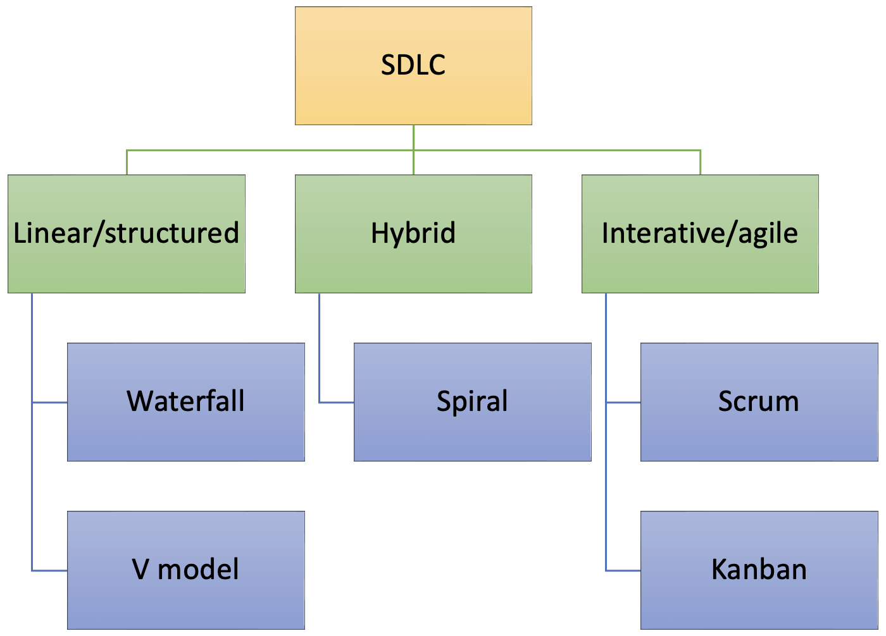
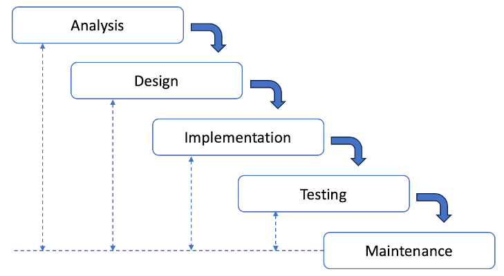
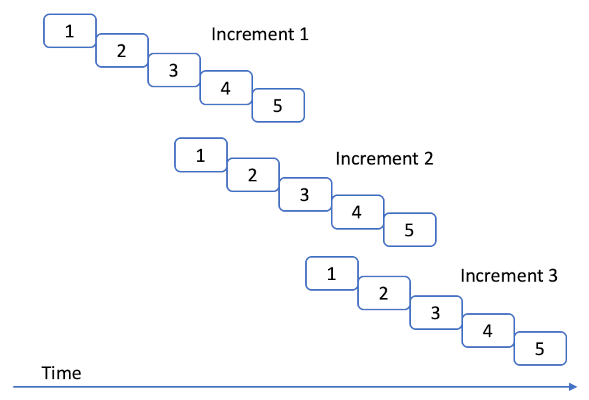

# The Software Development LifeCycle (SDLC)

The System Development Lifecycle (SDLC) is often described as a structured process used by 
organisations to design, develop, and implement software systems. The idea is that it should serve as 
a framework to ensure that high-quality systems are delivered in a methodical, organised way. 
However, the term "System Development Lifecycle" can be considered misleading in several ways due 
to the assumptions it might create about the process.

The word "lifecycle" suggests that the development process is always sequential, moving in a strict, 
linear order from one stage to the next. In reality, many SDLC models (e.g., Agile) are iterative or 
cyclical, with stages revisited multiple times throughout the project. Development often involves 
feedback loops, where progress may revert to earlier phases for refinement. The linear approach is 
often associated with rigid, waterfall models of development, where one stage must be completed 
before the next begins. This can be misleading for teams that use Agile, DevOps, or other 
methodologies that emphasise flexibility, continuous development, and the delivery of smaller, 
incremental changes rather than a single "complete" system.

The term "lifecycle" also implies that the process ends when the system is delivered or implemented, 
but in most cases, systems require ongoing maintenance, updates, and adaptations long after their 
initial deployment. These post-implementation activities (like system maintenance and upgrades) are 
often just as critical as the development phases themselves. Likewise, the term "system development" 
focuses heavily on the development aspect, which might overshadow the importance of other phases like 
planning, analysis, design, and testing. It can also overlook the significance of post-launch 
activities like monitoring, maintenance, and decommissioning.

These criticisms do not mean that the SDLC concept is not useful, but it should be approached with
a degree of caution. Any model that oversimplifies reality will carry risks with it. In some ways 
the SDLC is similar to the idea of an 
[abstract class](https://www.quickstart.com/software-engineering/when-and-how-to-use-abstract-class-and-interface/) 
in object-oriented development: it is never instantiated directly and instead acts as a prototype for
other classes as depicted inn Fig. 1. The SDLC can be interpreted in a linear way and can also be 
implemented in an agile, iterative way. In both cases, the development team carries out the same 
activities but they are organised differently. 

{: standalone #fig1 data-title="Lifecycle hierarchy"}

## Lifecycle activities

The internet provides many versions of "the" SDLC that break the job of building software into
different activities. However, there is no agreement on just how many activities or phases there
are, or indeed what they should be called. The international standard 
[ISO24748-1](https://doi-org.napier.idm.oclc.org/10.1109/IEEESTD.2018.8526560)
defines six standard lifecycle phases as shown in the table below.

| Stage       | Description                                                                                                                                                |
|-------------|------------------------------------------------------------------------------------------------------------------------------------------------------------|
| Concept     | {::nomarkdown}<ul><li>Identify stakeholders' needs</li><li>Explore concepts</li><li>Propose viable solutions</li></ul>{:/}                                 |
| Development | {::nomarkdown}<ul><li>Refine system requirements</li><li>Create solution description</li><li>Build system</li><li>Verify and validate system</li></ul>{:/} |
| Production  | {::nomarkdown}<ul><li>Produce system</li><li>Inspect and test</li></ul>{:/}                                                                                |
| Utilisation | {::nomarkdown}<ul><li>Operate system to satisfy users' needs</li></ul>{:/}                                                                                 |
| Support     | {::nomarkdown}<ul><li>Provide sustained system capability</li></ul>{:/}                                                                                    |
| Retirement  | {::nomarkdown}<ul><li>Store, archive or dispose of system</li></ul>{:/}                                                                                    |

The terminology in the table is rarely used exactly as shown. The main reasons are that the
term used in the standard is too broad and needs to be further divided, that the distinction between
terms is not useful, or that there is some important aspect that is not covered. Many versions
separate requirements analysis and development into different phases, for example. Most also combine
_Utilisation_ and _Support_ as _Maintenance_. More elaborate versions of the SDLC include a distinct
phase for documentation. Different models are shown with between 
[five](https://en.wikipedia.org/wiki/Systems_development_life_cycle) and 
[ten](https://ndtechdock.wordpress.com/2012/04/06/the-ten-phases-of-systems-development-life-cycle-sdlc/) 
phases with six being the most popular number as exemplified in Fig 2.

{: standalone #fig2 data-title="Six-phase SDLC"}

As you can see, the typical model ignore the retirement or disposal stage which can be important in
long-term planning.

## Structured methods

A structured software development methodology is a disciplined approach that implements the SDLC as a
sequential series of project phases. They focus on thorough upfront planning and design to reduce 
risks and avoid costly changes later in the process. The idea is that this approach fosters stability 
and predictability, making it ideal for projects where requirements are well understood from the 
start and unlikely to change significantly during development. Structured approaches are used in
industries where predictability, control, and thorough documentation are essential. These 
industries often have strict regulatory environments, require high levels of risk management, and 
typically work with stable requirements that do not change frequently. Examples include

* Aerospace and Defense
* Healthcare and Medical Devices
* Government and Public Sector
* Manufacturing
* Energy and Utilities

Agile methods are being adopted to varying degrees in industries traditionally dominated by 
structured development, but the extent of adoption is often tied to the flexibility of the project 
type. Agile is most commonly applied to software development, IT, and digital transformation 
projects, while more rigid, safety-critical, or highly regulated areas tend to stick to structured 
or hybrid methodologies. In many cases, industries are adopting "hybrid" approaches, where Agile 
techniques are combined with structured practices to balance flexibility with the need for 
compliance, predictability, and risk management.

### Waterfall model

The waterfall approach, originally introduced by Winston Royce ([1970](https://dl.acm.org/doi/10.5555/41765.41801)), advocates a strict
sequence of project stages as shown in Fig. 3. The waterfall approach is an extreme expression of 
what Stephens calls a *[predictive model](https://learning.oreilly.com/library/view/beginning-software-engineering/9781119901709/c17.xhtml)*. The idea is that when the requirements are clearly 
and comprehensively defined in advance, these models will work well.

{: standalone #fig3 data-title="Simplified waterfall project lifecycle"}

Strictly adhering to the sequential nature of the stages in the waterfall approach leads to a number
of practical difficulties. These include

* The inability to introduce requirements later in the project if they were overlooked at the start
* The rigidity of the specification and design - once approved, they cannot easily be changed if 
  problems emerge
* The postponing of any major testing until all the code is complete

To address these issues, several modifications to the waterfall approach have been proposed including
the two outlined below.

### The V model

The main innovation in the V model was to identify different types of testing that were used at 
different stages of the project. This went some way to resolving the problem with postponed testing,
but other issues still remained.

)](images/v-model.png){: standalone #fig4 data-title="V model"}

### The waterfall model with feedback

Another refinement of the waterfall model attempted to reconcile the sequential nature of the stages
with the reality of discovering error over time by introducing feedback loops. The idea was to
contain errors within a phase so that the transition to the next phase could still be made cleanly.
In fact, this version of the waterfall model incorporates ideas from Royce's original paper. The main
idea is that events during the project can trigger the return to an earlier stage as illustrated in
Fig. 5.

{: standalone #fig5 data-title="The waterfall model with feedback"}

### The iterative waterfall model

The number of variations on the waterfall model are evidence that something was wrong and needed 
fixing. A further version proposed the idea of a single project being decomposed into a series of
waterfalls, one feeding into the next as shown in Fig. 6.

{: standalone #fig6 data-title="The iterative waterfall model"}

### The spiral model

In another step away from the strictly linear approach, Barry Boehm introduced the spiral model in 
[1986](https://doi.org/10.1109/2.59). While visually complex, the spiral model, shown in Fig. 7, 
was based on the idea that risk management should be the main concern in software development projects.
Starting with simple, fundamental piece of the development, it explicitly captured the concept of
iterative prototyping by following a repeating pattern of four stages:

1. Determine objectives, alternatives and constraints
2. Evaluate alternatives and identify and resolve risks
3. Develop and verify next-level product
4. Plan next phase

However, it also inherited extensive testing towards the end of the project from the traditional 
waterfall approach.

)](images/spiral.png){: standalone #fig7 data-title="The spiral model"}

## Summary

Structured development methods, such as the Waterfall, V-Model, and Spiral Model, offer robust, 
methodical frameworks for developing complex systems, particularly in environments where precision, 
documentation, and risk management are critical. Each model has its strengths: the Waterfall 
model’s linear approach ensures clear phases and deliverables, the V-Model emphasises continuous 
verification and validation, and the Spiral Model incorporates iterative cycles with a focus on 
risk assessment. While the software industry has increasingly embraced Agile methodologies for 
flexibility and speed, structured development methods remain essential in industries like 
aerospace, healthcare, banking, and manufacturing. These sectors continue to rely on 
structured approaches for projects where stability, regulatory compliance, and risk management 
are paramount.

The ongoing use of structured methodologies in these industries highlights their enduring value, 
particularly for projects that demand high levels of control and predictability. Understanding 
these traditional models provides a foundation for selecting the right methodology based on the 
project’s requirements, balancing the need for flexibility with the importance of disciplined 
execution.

{: .tip-title }
> [<i class="fa-regular fa-lightbulb"></i> Practical tips for when to use structured methods](sdlc_tips)

## Further reading

* [SWEBOK: Software Engineering Body of Knowledge](https://napier.primo.exlibrisgroup.com/permalink/44NAP_INST/19n0mho/cdi_bsi_primary_000000000030314312)
* [SEVOCAB: System Engineering dictionary of terms](https://pascal.computer.org/sev_display/index.action)
* [ISO/IEC/IEEE 15288:2023](https://doi-org.napier.idm.oclc.org/10.1109/IEEESTD.2023.10123367)
* Deployment ([Stephens, 2022, Ch. 14](https://learning.oreilly.com/library/view/beginning-software-engineering/9781119901709/c14.xhtml))
