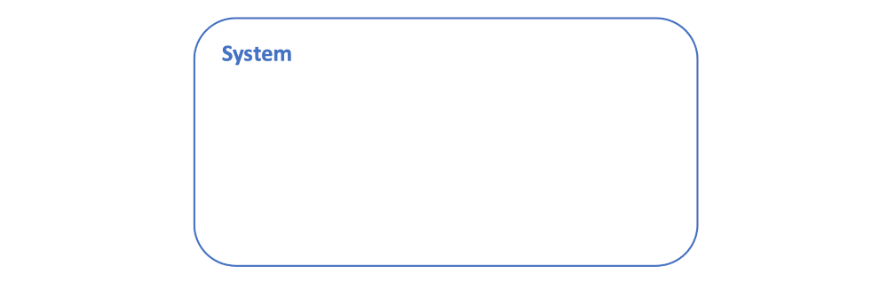
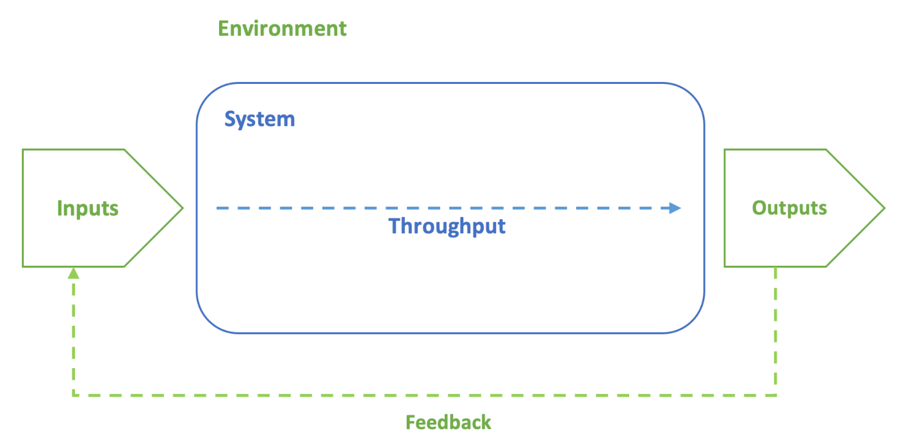

# Systems concepts

The word _system_ is used regularly in everyday language and most people have a working 
understanding of what a system is. However, in a technical context it is important to have a 
clear definition. This helps to define the processes needed to design, create, operate, maintain 
and communicate with a system. From a software engineering point of view, we are mainly interested 
in systems that consist only of code; however, software control systems may interact with physical 
devices, humans interact with a software system via its user interface and systems communicate 
with each other over networks. Ignoring such concerns can lead to software systems that 
do not fulfil the purpose they were designed for.

## Definitions

General Systems Theory (GST) is an interdisciplinary framework based on the work of Ludwig von
Bertalanffy ([1968](https://napier.primo.exlibrisgroup.com/permalink/44NAP_INST/19n0mho/cdi_crossref_primary_10_2307_2093003))
that aims to understand and model complex systems by focusing on the relationships and interactions 
between components within a system, rather than studying each part in isolation. The theory applies 
across various disciplines, including biology, engineering, sociology, and software development, 
providing a holistic view of how systems function and evolve.

The international standard 
[ISO/IEC/IEEE 15288:2023](https://doi-org.napier.idm.oclc.org/10.1109/IEEESTD.2023.10123367) 
builds on GST defining a system as

> an interacting combination of elements to accomplish a defined objective. These include 
> hardware, software, firmware, people, information, techniques, facilities, services, and 
> other support elements

This definition highlights the need for a designed system to have a clear _purpose_ and that is 
potentially composed on many interacting elements. The 
[INCOSE Systems Engineering Handbook](https://eu.alma.exlibrisgroup.com/leganto/public/44NAP_INST/citation/6677951920002111?auth=SAML)
extends the general definition to _engineered systems_ which are

> designed or adapted to interact with an anticipated operational environment to achieve one or more 
> intended purposes while complying with applicable constraints.

This formulation highlights the need for the system to conform to expectations. In a software 
engineering project, such expectations have to be defined at the start of a project (or smaller 
unit of work) and then evaluated at the end through an appropriate form of testing.

Mathematics and terminology aside, GST gives rise to a simple visualisation of a system as a 
bounded region:

{: standalone #fig1 data-title="The basic general system model"}

While it appears trivial, this representation already identifies the _system boundary_ as a key 
component of the model. What is within the boundary is part of the system, and what is outside the 
boundary is not relevant. The concept of the system boundary is important in the definition of a 
software application, for example, where the application requirements define what is inside and 
exclude everything else. It is also important in project management where the boundary defines 
the project scope. Making these things explicit at the planning stage simplifies later work.

{: standalone #fig2 data-title="The general system model highlighting the relationship with the system's environment"}

Fig. 2 illustrates the purpose of the system as a way of processing inputs taken from the 
environment and delivering its result back to the environment. This view of a system can be 
thought of as synonymous with a _process_. Software engineers are comfortable thinking about the 
inputs and outputs of their system exclusively in terms of data and information. However, that 
ignores all of the physical exchanges between the system and its environment. A software system 
cannot operate without a physical device, and the main immediate input into a that device is the 
electrical power it consumes. Likewise, its main physical output is heat which is released into 
the atmosphere using heat sinks and fans.

Computing professionals are familiar with another aspect of systems identified by GST, and that is 
that any system may be _decomposed_ into a network of subsystems as illustrated in Fig. 3. The 
diagram is simple visualisation of the definition at the top of the page.

{: standalone #fig3 data-title="The general system model highlighting decomposition of the top-level system into a network of subsystems"}

This is a simplified picture, however. Different stakeholders might identify the system boundary 
differently depending on their interests. In addition, any component part of the system, or 
_system element_, can be regarded as a system in its own right, and may be further decomposed into 
smaller elements. Thus, there is a hierarchical relationship between elements, and a stakeholder 
may only be concerned with a subset of these system elements. When focusing on a particular 
system - whether or not it is a component of a larger system - it can be referred to as the 
_system of interest_ (SOI).

On page 11, [ISO/IEC/IEEE 15288:2023](https://doi-org.napier.idm.oclc.org/10.1109/IEEESTD.2023.10123367) 
defines the following six key characteristics of systems:

*   defined boundaries encapsulate meaningful needs and practical solutions;
*   there is a hierarchical or other relationship between system elements;
*   an entity at any level in the SoI can be viewed as a system;
*   a system comprises an integrated, defined set of subordinate system elements;
*   humans can be viewed as both users external to a system (e.g. users) and as system elements (e.g. operators) within a system;
*   a system can be viewed in isolation as an entity, i.e. a product; or as a collection of functions capable of interacting with its surrounding environment, i.e. a set of services.

ISO15288 also defines the concept of a _system of systems_ (SOS). In an SOS, systems interact to 
provide capabilities that no one system can deliver on its own. This is very similar to the 
relationships among system elements. The distinguishing feature of an SOS is that the individual 
systems are operationally and managerially independent. Consider a software application that makes 
use of data from a cloud service by calling an API function. There is interaction between the two 
systems, but they are managed independently and operate independently. This interaction represents 
an SOS rather than a single system that is decomposed into smaller elements.

The SOS concept also demonstrates a limitation of the illustration in Fig. 1 and the subsequent 
explanation: in the case where your SOI is part of an SOS, it is in fact necessary to consider 
communications across the system boundary. For example, APIs are sometimes unavailable. If the 
calling application is well-designed, it will anticipate the problem and provide a fallback so 
that it is not dependent on the external system.

For other definitions of systems and related concepts, see the 
[Software and Systems Engineering Vocabulary (SEVOCAB)](https://pascal.computer.org/sev_display/index.action).

## Applications of systems concepts in software engineering

### Subsystems and Supersystems

_Subsystems_ are smaller, individual components within a larger system, while a _supersystem_ 
is the larger context or environment in which a system exists. Subsystems interact to form the 
whole system, and the system itself is part of a broader supersystem. In a software system, 
individual modules or services are subsystems, while the entire IT infrastructure could be 
considered a supersystem.

A [microservices architecture](https://microservices.io/) is a good example of system decomposition. 
The entire system is 
composed of smaller, independently deployable services (subsystems), each responsible for a 
specific functionality. For instance, in an e-commerce application, there may be microservices 
for user management, inventory, order processing, and payments. These microservices work 
together to form the larger e-commerce platform (supersystem). Each microservice can evolve 
independently, but they must communicate with each other to form a fully functional system. 

### Open vs. Closed Systems

_Open systems_ interact with their environment by exchanging energy, information, or matter. 
They adapt and evolve based on external inputs. _Closed systems_, on the other hand, have no 
interaction with the external environment and are isolated. A web application that interacts with 
third-party APIs (e.g., payment gateways, social media authentication, or external data feeds) is 
an example of an open system. It constantly interacts with the external environment and adapts 
based on the inputs it receives. Open systems, like these web applications, need to handle 
uncertainties from the external environment, such as API changes or service outages. Software 
engineers must account for this by implementing error handling, retries, and monitoring to 
ensure the system adapts to changes in external conditions.

### Feedback Loops

Feedback loops occur when the output of a system is fed back into the system as input, influencing 
future behavior. Feedback can be positive (amplifying changes) or negative (stabilizing the system).
Continuous Integration/Continuous Deployment (CI/CD) pipelines provide a clear example of feedback 
loops in software engineering. When developers commit code, automated tests run in the pipeline and 
provide immediate feedback on whether the new code breaks any existing functionality. If the tests 
fail, the feedback loop alerts the developer, prompting them to fix the issues before the code can 
be deployed.

Feedback loops are crucial for maintaining code quality, ensuring that defects are caught early, 
and enabling continuous improvement, which is central to the agile development process. These 
feedback loops help the system maintain a stable state (_homeostasis_).

### Homeostasis (Equilibrium)

_Homeostasis_ refers to the system's ability to maintain stability or balance through 
self-regulation. Systems strive for equilibrium, where inputs and outputs are balanced, even in 
the face of external disturbances. In biological systems, homeostasis is the body's ability to 
regulate internal conditions (like temperature). In software, load balancers or auto-scaling 
mechanisms in distributed systems help maintain system equilibrium by distributing incoming traffic 
evenly across servers or instances. This ensures that no single server becomes overwhelmed and that 
the overall system maintains its performance even under fluctuating load conditions.

### Emergence

_Emergence_ is the idea that a system exhibits properties or behaviors that are not present in its 
individual components but arise from the interactions between those components. In machine learning 
systems, the behavior of the system as a whole cannot be directly inferred from the behavior of 
individual components. For instance, a deep learning neural network's ability to classify images 
accurately emerges from the interactions between neurons across many layers. None of the individual 
neurons "know" what an image is, but collectively they produce intelligent behavior.

### Hierarchy

Systems are often structured hierarchically, where subsystems are nested within larger systems. 
Each level in the hierarchy operates semi-independently but contributes to the functioning of the 
larger system. In a software project, individual classes form modules, modules combine into 
services, and services work together to form the overall application. The layered architecture of 
software systems provides another illustration of the concept of hierarchy. For example, in a web 
application, the user interface layer (UI) interacts with the business logic layer, which, in turn, 
communicates with the data access layer. Each layer operates semi-independently but contributes to 
the functionality of the entire system.

Hierarchical systems allow for separation of concerns, making the system easier to manage, develop, 
and scale. Lower layers provide foundational services, while higher layers build upon them, reducing 
complexity.

### Entropy

_Entropy_ refers to the tendency of a system to move toward disorder or disorganization over time. 
Systems must continually adapt and reorganize to avoid breakdown and maintain functionality.
Technical debt is an example of entropy in software systems. As a system grows and evolves, 
shortcuts taken during development (e.g., lack of refactoring, poor design choices) lead to 
increased complexity and disorganization. Over time, the system degrades, making it harder to 
maintain and adding to the entropy of the software.

To combat entropy, developers must actively refactor and improve the codebase to maintain order 
and reduce technical debt. Without regular maintenance, a system becomes more chaotic and harder to 
manage, just as entropy increases in physical systems over time.

### Adaptation and Evolution

Systems have the ability to adapt and evolve over time in response to changes in their environment. 
In an open system, adaptation is crucial for survival or continued functionality. In software, 
systems evolve through updates, patches, and feature enhancements to adapt to changing user needs, 
technological advancements, or security requirements.

Agile software development models emphasize adaptability and evolution. In agile development, 
software is built incrementally, and the team continuously adapts based on user feedback, testing, 
and changing requirements. This adaptive cycle allows the system (software product) to evolve in 
response to external changes such as market conditions or user demands.

### Equifinality

_Equifinality_ suggests that there are multiple paths to reach the same end state in a system. 
Different starting conditions or processes can lead to the same outcome. In software development, 
there are often multiple ways to achieve the same outcome. For instance, you can implement a 
feature using a relational database (SQL) or a NoSQL database depending on the requirements, and 
both approaches can lead to the same end result — data storage and retrieval.

{: .tip-title }
> [<i class="fa-regular fa-lightbulb"></i> Practical tips for applying systems concepts](systems_tips)
