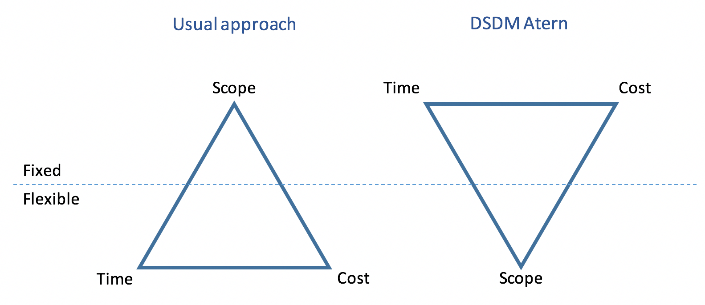
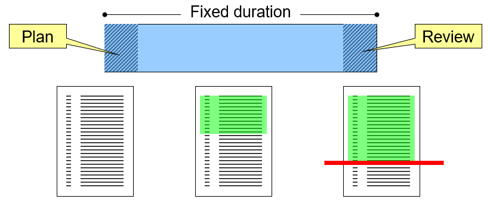
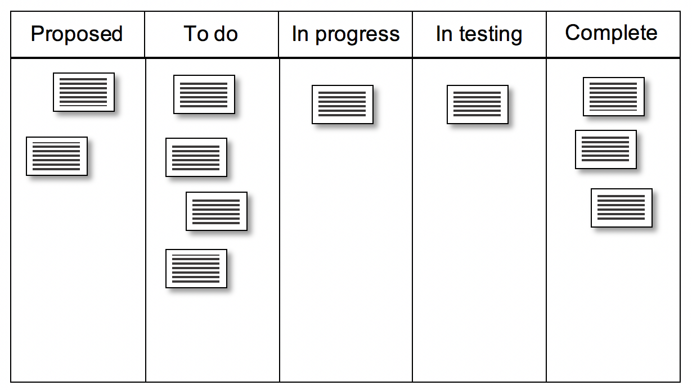
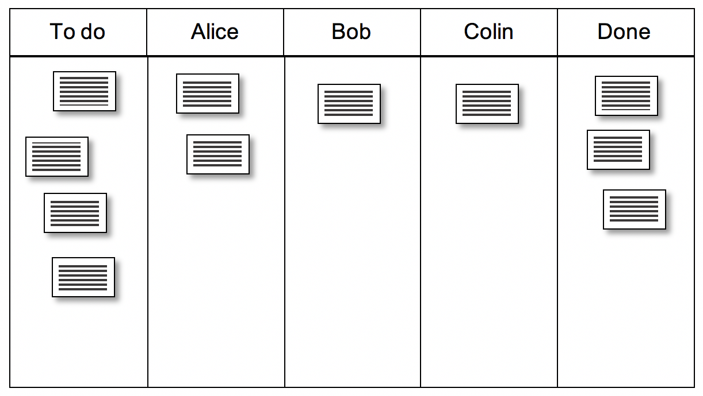

# Controlling Agile Projects

## Prioritising requirements

[DSDM Atern](https://www.agilebusiness.org/page/whatisdsdm) 
is an agile methodology that defines a useful technique for
prioritisation which can be used to control the overall scope of a project
and to control iterative development. 

DSDM Atern refers to a prototyping cycle as a *timebox* which it
defines as a period of time with a fixed duration. This means that time
is not a flexible quantity, and missing deadlines is not permitted in a
DSDM Atern project. Likewise, DSDM Atern insists that the budget for a
project is also fixed, and that the cost of a project must not increase
over time. The three dimensions of time, cost and scope are sometimes
referred to as the iron triangle, and together they define the output of
the project. In many projects, the scope of the project - the list of
features - is the fixed dimension, and time and cost are flexible as illustrated in Fig. 1.
However, this can lead to missed deadlines and cost over-runs. Because
DSDM Atern fixes time and cost, the only other source of flexibility is
in the project scope.

{: standalone #fig1 data-title="The Iron Triangle" }
      
## MoSCoW prioritisation

In order to allow flexibility in scope, DSDM Atern uses the MoSCoW
prioritisation technique. This is a four-level scheme which is applied
to the requirements that will be attempted during a timebox. The four
priority levels are described in the table below.

| Label  | Interpretation                                                                                                                           |
|--------|------------------------------------------------------------------------------------------------------------------------------------------|
| *M*    | ***M***ust-have items are essential for the product or for the business case of the project                                              |
| *S*    | ***S***hould-have items are not essential, but are nevertheless important for the quality of the finished product                        |
| *C*    | ***C***ould-have items are features which would be nice to have, but which would not compromise the overall quality if they were missing |
| *W*    | ***W***on't-have items are not included in the current scope - this final category is more important than it first appears               |

## MoSCoW at project level

Clients may not differentiate between different requirement priorities until prompted. 
They can have an all-or-nothing view of the project which you need to move them away from.
This is a process of education in that you may have to explain MoSCoW to them so that you
can come to an informed agreement over the scope of the project.

Two important things to remember during these early negotiations are:

**A good scope definition will have an even spread of requirements across the *M*, *S*
and *C* categories**

> Spreading the requirements across categories is what gives your project flexibility.
> Without this, you will not reap the full benefit of an agile approach.

**You should actively try to reduce the number of items in the *M* category**

> Because the ***M*** category represents the essential requirements for the project, it is 
> essentially your definition of success. Once you have achieved all of the ***M***ust-have
> items, you have by definition achieved a successful project. The shorter the list,
> the more quickly you can reach *success*.

## MoSCoW at timebox level

At the start of a timebox, DSDM Atern says that there should be a list of 
requirements that will be attempted within the time available.
MoSCoW is applied to this list so that there are items in
each category, and that according to your best estimates, there is
enough time to complete all the ***M***ust-have and ***S***hould-have items. This is
how DSDM Atern builds in flexibility: if things go well, you finish all
of the planned items and you can also include some of the ***C***ould-have
items as well. On the other hand, if things do not go to plan (which is
more likely), some of the ***S***hould-have items can be dropped without
compromising on the essentials. Putting items in the ***W***on't-have category
ensures that no-one on the team is tempted to spend time on things which
are not immediate priorities. 

The red line in the diagram below represents the point that is reached in the 
requirements list at the fixed end point of the timebox. Careful scoping should
ensure that at this point all ***M***ust-have items have been done and ideally
some of the ***S***hould-have and ***C***ould-have items as well.

{: standalone #fig2 data-title="Timebox" }

At the end of a timebox, the delivered features are compared with the
original prioritised list. This provides an opportunity to take explicit
decisions about the remaining requirements by adjusting their 
priorities. Something that was a ***S***hould-have in the previous timebox,
for example, can be promoted to a ***M***ust-have item in the next.
Alternatively, it could keep the same priority or be demoted to a
***C***ould-have or a ***W***on't-have. In this way, priorities are constantly
re-evaluated throughout the project ensuring that the team focuses on
what is most important. If the priorities change by a large degree, this
could trigger a discussion with the client. This is especially true
when something is moved into the ***W***on't-have category since this means
that the team no longer expects it to be included in the final product. This is 
called *de-scoping*, and is a natural part of a DSDM Atern project.

## Task boards

When you are working on your own, tracking the progress of your project
is fairly simple. You keep some sort of checklist of what needs to be
done, keep notes about what has been completed and you adjust your
schedule as you go along. Things start to fall apart though as soon as
you are working as part of a team. People keep notes in different ways
and update them at different times. These incompatible ways of working
mean that some people on a team may not be aware of the overall state of
the development. This is a particular problem when one team member is
dependent on another for a task. It also means that delays may go
unnoticed until a deadline arrives. If the team does not have a
confident sense of what is going on, confidence and morale will suffer,
deadlines will be missed and the project schedule will fall behind. If
the project is a commercial one, this also means it will start to cost
more than planned.

Clearly, making sure that everyone on the team knows the current state
of the project is important. To make that happen, the whole team needs
to adhere to a standard process for recording the tasks that they are
working on, and when those tasks are completed. In many agile
methodologies, this is done using a task board which the team keeps up
to date. The task board is central to the Kanban approach, and is often
referred to as a Kanban board.

A task board is laid out as a series of columns that represent the
different stages of completion that a task can go through - e.g.
proposed, to do, in progress, in testing, complete. A task is
represented as a card that starts in the leftmost column and moves into
the next column as it reaches the new stage as illustrated in the first
image below.In its simplest form, a task board can be implemented
using real cards stuck onto a vertical surface like a whiteboard,
although there are several software applications available available
too.

{: standalone #fig3 data-title="Task board" }

Using the arrangement above, the information about who is doing each
task would have to be included in the written content of each card. The
simplified version of the task board shown below can be useful in
small projects. In this version, each member of the team has their own
column, and so it is very easy to see who is working on what. A useful
rule with this style of board is to place a limit on the number of cards
that any one person can own at one time. This encourages team members to
focus on a small number of things at one time.

{: standalone #fig4 data-title="Simplified Task board" }

## Further reading

* [DSDM Atern](https://www.agilebusiness.org/page/whatisdsdm)
* [MoSCoW prioritisation](https://www.agilebusiness.org/resource/video-mastering-moscow-prioritisation.html)
* [A Comparison of Nine Basic Techniques for Requirements Prioritization](http://www.mvnet.fi/publications/software_development_seminar.pdf)
* [Kanban board](https://www.agilealliance.org/glossary/kanban-board)
* [What is a Kanban board?](https://leankit.com/learn/kanban/kanban-board)
* [Project boards in GitHub](https://docs.github.com/en/enterprise-server@3.14/issues/planning-and-tracking-with-projects/learning-about-projects/about-projects)
