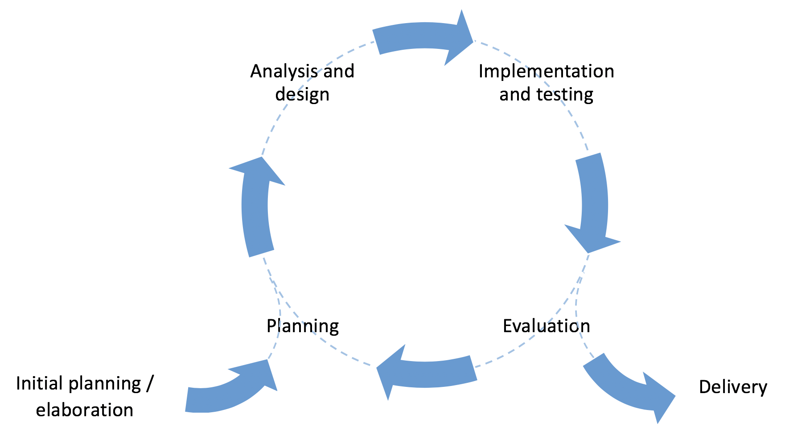
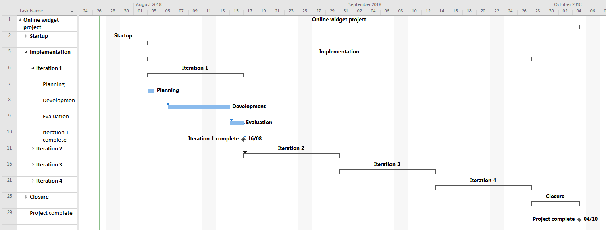

# Controlling Agile Projects

When they first hear about Agile development, many people mistakenly
think that it is a licence to work without rules. In fact, the work in
an Agile project needs to be coordinated just as much as it does in any
other kind of project. The Agile approach does, however, acknowledges
that it is difficult, time-consuming and often futile to attempt to
answer all of the design questions in advance. Instead, it assumes that
the requirements themselves will be clarified as the project accumulates
knowledge during the development. This would be naively optimistic
though without some control over the process, and one of the fundamental
elements of the Agile approach is *iterative development* as illustrated in
Fig. 1.

{: standalone #fig1 data-title="Prototyping cycle" }

A project usually runs for several months. A prototyping cycle
structures that time to create opportunities to re-evaluate the work
done so far and to check that the project is going in the right
direction. The simplest approach is to choose a period of time such as
two weeks, and to structure each period according to the illustration
above. Each cycle would start with some planning, followed by some
analysis and design, some implementation and eventually the evaluation
of the work within the cycle. Using this approach, a two-month project
would be made up of four cycles. It is also possible to divide a project
into cycles of unequal sizes if there is some advantage to doing so.
      
An important element of iterative development is that a working
prototype is produced at the end of each cycle. This is often referred
to as the *frequent delivery of product* which is an expression
of Agile principle 3. Delivering working software on a regular basis
provides an opportunity to 
    
* identify problems
* seek feedback from others
* evaluate work done so far
* refine the design
* re-evaluate the scope of the project
* plan the next stage of development
     
## Managing iterations

In a project team, it is important that everyone is working in a
coordinated fashion in order to realise the benefits of iterative
development. The regular delivery of prototypes creates a rhythm to the
work which contributes to a sense of progress and achievement. This in
turn supports a good working atmosphere with natural breaks in the
pressure to get things done.

The basic requirements are to make sure that everyone knows what the
goals of a cycle are at the start, to communicate progress during the
cycle, and to coordinate the work of the team towards the end so that
the prototype emerges in a controlled way at the expected time. The
first requirement then, is for the team to know when the deadlines are.
Fig. 2 shows how a Gantt chart for an Agile project might be
structured at the top level.

{: standalone #fig2 data-title="Gantt chart overview" }
      
There are several things that need to be done during project start-up
and project closure. There are many sources of advice on this topic,
including 
    
[ P3.express](http://p3.express/a00)

[ The Disciplined Agile Framework](http://www.disciplinedagiledelivery.com/tag/project-initiation)

[ Agile development release planning](https://www.versionone.com/agile-101/agile-management-practices/agile-development-release-planning)
    
In this illustration, they are simply represented as a single activity
on the Gantt chart as shown in the next image. Expanding the *Startup*
and *Closure* stages reveals two important features of the Gantt
chart. First, the name of every task is displayed on the chart. This
makes it easier to read and understand, especially as the complexity
grows. Second, each summary task ends with a *milestone*. This is
a task of zero duration which acts as a deadline. One way to measure the
health of a project is to monitor the milestones in the plan to make
sure that they do not slip. Notice that the milestone which marks the
end of *Startup* is linked to the beginning of the next summary
task, *Implementation*.
      
{: standalone #fig3 data-title="Gantt chart showing startup and closure detail" }
      
In Fig. 3 it is clear that the Implementation stage lasts
eight weeks. In our example, we have decided to split that into four
iterations of two weeks each. This could be represented as a series of
further summary tasks as shown in Fig. 4.
      
{: standalone #fig4 data-title="Gantt chart showing iterations" }
      
In some ways, each iteration is like a small project in its own right.
They all have a similar structure with some planning at the start and
the evaluation of the prototype at the end. This has benefits for the
team because each iteration has a predictable structure. In addition,
the transition from one iteration to the next provides an opportunity to
celebrate the achievements of the one that has just finished. The image
below illustrates how each iteration might appear on the Gantt chart. In
some cases it is not possible to add more detail than this to the
implementation stage of the Gantt chart because the actual tasks are
handled in an Agile manner using techniques such as a Kanban board.

{: standalone #fig5 data-title="Gantt chart showing internal structure of an iteration" }

## Prioritising requirements

[DSDM Atern](https://www.agilebusiness.org/page/whatisdsdm) 
is an agile methodology that defines a useful technique for
prioritisation which can be used to control the overall scope of a project
and to control iterative development. 

DSDM Atern refers to a prototyping cycle as a *timebox* which it
defines as a period of time with a fixed duration. This means that time
is not a flexible quantity, and missing deadlines is not permitted in a
DSDM Atern project. Likewise, DSDM Atern insists that the budget for a
project is also fixed, and that the cost of a project must not increase
over time. The three dimensions of time, cost and scope are sometimes
referred to as the iron triangle, and together they define the output of
the project. In many projects, the scope of the project - the list of
features - is the fixed dimension, and time and cost are flexible as illustrated in Fig. 1.
However, this can lead to missed deadlines and cost over-runs. Because
DSDM Atern fixes time and cost, the only other source of flexibility is
in the project scope.

{: standalone #fig1 data-title="The Iron Triangle" }
      
## MoSCoW prioritisation

In order to allow flexibility in scope, DSDM Atern uses the MoSCoW
prioritisation technique. This is a four-level scheme which is applied
to the requirements that will be attempted during a timebox. The four
priority levels are described in the table below.

| Label  | Interpretation                                                                                                                           |
|--------|------------------------------------------------------------------------------------------------------------------------------------------|
| *M*    | ***M***ust-have items are essential for the product or for the business case of the project                                              |
| *S*    | ***S***hould-have items are not essential, but are nevertheless important for the quality of the finished product                        |
| *C*    | ***C***ould-have items are features which would be nice to have, but which would not compromise the overall quality if they were missing |
| *W*    | ***W***on't-have items are not included in the current scope - this final category is more important than it first appears               |

## MoSCoW at project level

Clients may not differentiate between different requirement priorities until prompted. 
They can have an all-or-nothing view of the project which you need to move them away from.
This is a process of education in that you may have to explain MoSCoW to them so that you
can come to an informed agreement over the scope of the project.

Two important things to remember during these early negotiations are:

**A good scope definition will have an even spread of requirements across the *M*, *S*
and *C* categories**

> Spreading the requirements across categories is what gives your project flexibility.
> Without this, you will not reap the full benefit of an agile approach.

**You should actively try to reduce the number of items in the *M* category**

> Because the ***M*** category represents the essential requirements for the project, it is 
> essentially your definition of success. Once you have achieved all of the ***M***ust-have
> items, you have by definition achieved a successful project. The shorter the list,
> the more quickly you can reach *success*.

## MoSCoW at timebox level

At the start of a timebox, DSDM Atern says that there should be a list of 
requirements that will be attempted within the time available.
MoSCoW is applied to this list so that there are items in
each category, and that according to your best estimates, there is
enough time to complete all the ***M***ust-have and ***S***hould-have items. This is
how DSDM Atern builds in flexibility: if things go well, you finish all
of the planned items and you can also include some of the ***C***ould-have
items as well. On the other hand, if things do not go to plan (which is
more likely), some of the ***S***hould-have items can be dropped without
compromising on the essentials. Putting items in the ***W***on't-have category
ensures that no-one on the team is tempted to spend time on things which
are not immediate priorities. 

The red line in the diagram below represents the point that is reached in the 
requirements list at the fixed end point of the timebox. Careful scoping should
ensure that at this point all ***M***ust-have items have been done and ideally
some of the ***S***hould-have and ***C***ould-have items as well.

{: standalone #fig2 data-title="Timebox" }

At the end of a timebox, the delivered features are compared with the
original prioritised list. This provides an opportunity to take explicit
decisions about the remaining requirements by adjusting their 
priorities. Something that was a ***S***hould-have in the previous timebox,
for example, can be promoted to a ***M***ust-have item in the next.
Alternatively, it could keep the same priority or be demoted to a
***C***ould-have or a ***W***on't-have. In this way, priorities are constantly
re-evaluated throughout the project ensuring that the team focuses on
what is most important. If the priorities change by a large degree, this
could trigger a discussion with the client. This is especially true
when something is moved into the ***W***on't-have category since this means
that the team no longer expects it to be included in the final product. This is 
called *de-scoping*, and is a natural part of a DSDM Atern project.

## Issue-related workflow

Most code management platforms provide features to help manage projects. In GitHub, a project can be
represented in a tabular format, as a roadmap or in the form of a Kanban-style task board. The choice
of format is up to the team, but for the purposes of these notes, we will assume the use of a task board.

By default, a task board in GitHub contains the three swimlanes, `Todo`, `In Progress` and `Done` as
shown in Fig. 6. Further columns can be added if needed - this depends on how the team decides to
manage the work. For example, a swimlane for stalled tasks could be added, or for tasks in review.
The task board can be as complicated as required, but in general, the simpler the structure, the
more intuitive it is to use.

{: standalone #fig6 data-title="Default GitHub task board"}

Tasks in GitHub are represented by [issues](https://docs.github.com/en/issues). They can be added
directly on the task board using the button at the bottom of each swimlane. If you take that option,
you will need to explicitly attach the new issue to the relevant code repository. This is because
the relationship between projects and repositories doesnot have to be one-to-one. You can also create
issues using the issues tab on the repository page. If you take that option, you will need to say
explicitly which project the issue should be added to. This is done using the controls on the right of
the issue creation page as shown in Fig. 7.

{: standalone #fig7 data-title="GitHub new issue page"}

When using a task board, an item gradually accumulates detail and moves through the swimlanes from left
to right as the work progresses. Exactly *when* an item is moved from one swimlane to the next needs to
be defined in the team workflow so that there is no ambiguity. Once defined, these rules can be
performed and enforced manually, but GitHub can help to automate some of the steps. Clicking on the
three-dots icon in the top right-hand corner of the task board (see Fig. 5) allows you to select a
`Workflows` option. Here, you can define several actions to be triggered automatically. The options
are more or less self-explanatory and require some experimentation. The main point is that a team
should make explicit decisions about how their task board should operate and which steps are to be
automated. Those decisions should be clearly documented sothat they are easy for team members to
follow.

{: .tip-title }
> [<i class="fa-regular fa-lightbulb"></i> Practical tips for effective iteration](control_tips)

## Further reading

* [DSDM Atern](https://www.agilebusiness.org/page/whatisdsdm)
* [MoSCoW prioritisation](https://www.agilebusiness.org/resource/video-mastering-moscow-prioritisation.html)
* [A Comparison of Nine Basic Techniques for Requirements Prioritization](http://www.mvnet.fi/publications/software_development_seminar.pdf)
* [Iterative development](https://www.agilebusiness.org/content/iterative-development)
