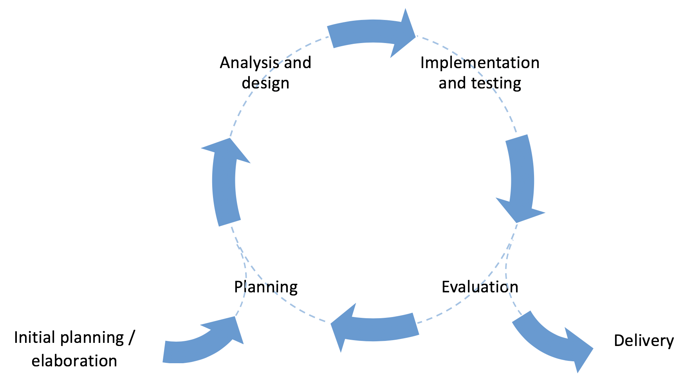
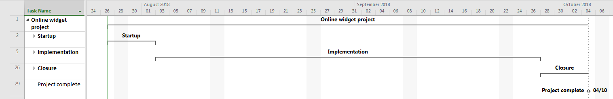
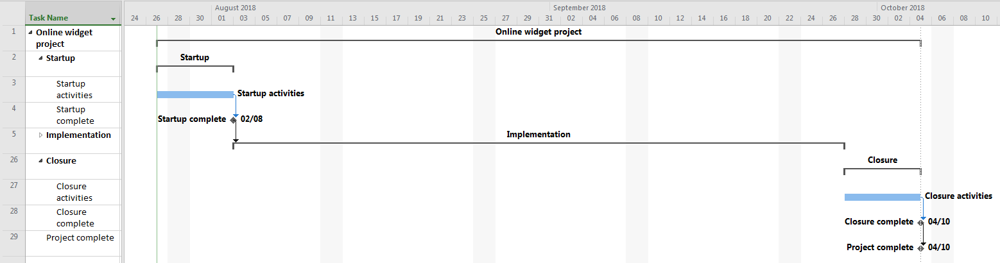
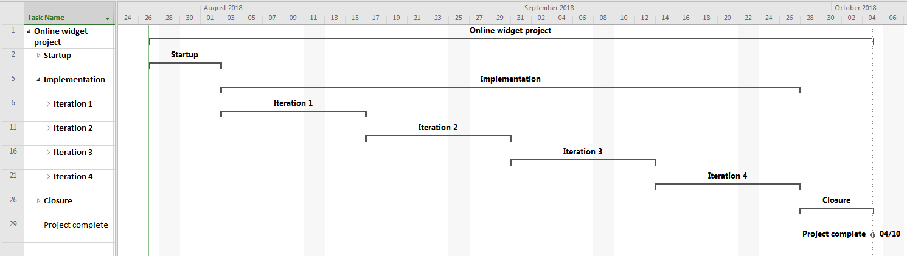
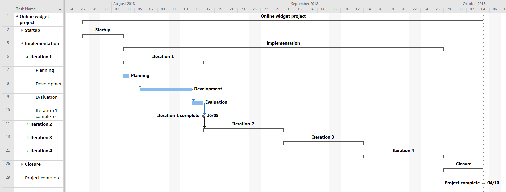

# Fundamental Features of an Agile Approach

Agile methodologies share several core features that define their approach to software development. 
These common features are the foundation of Agile practices, regardless of the specific framework 
(e.g., Scrum, Kanban, Extreme Programming). Collectively they help Agile teams deliver software more 
efficiently, adapt to changes quickly, and focus on producing high-quality products that meet 
customer needs.

## Iteration

When they first hear about Agile development, many people mistakenly
think that it is a licence to work without rules. In fact, the work in
an Agile project needs to be coordinated just as much as it does in any
other kind of project. The Agile approach does, however, acknowledges
that it is difficult, time-consuming and often futile to attempt to
answer all of the design questions in advance. Instead, it assumes that
the requirements themselves will be clarified as the project accumulates
knowledge during the development. This would be naively optimistic
though without some control over the process, and one of the fundamental
elements of the Agile approach is *iterative development* as illustrated in
Fig. 1.

{: standalone #fig1 data-title="Prototyping cycle" }

A project usually runs for several months. A prototyping cycle
structures that time to create opportunities to re-evaluate the work
done so far and to check that the project is going in the right
direction. The simplest approach is to choose a period of time such as
two weeks, and to structure each period according to the illustration
above. Each cycle would start with some planning, followed by some
analysis and design, some implementation and eventually the evaluation
of the work within the cycle. Using this approach, a two-month project
would be made up of four cycles. It is also possible to divide a project
into cycles of unequal sizes if there is some advantage to doing so.
      
An important element of iterative development is that a working
prototype is produced at the end of each cycle. This is often referred
to as the *frequent delivery of product* which is an expression
of Agile principle 3. Delivering working software on a regular basis
provides an opportunity to 
    
* identify problems
* seek feedback from others
* evaluate work done so far
* refine the design
* re-evaluate the scope of the project
* plan the next stage of development
     
## Managing iterations

In a project team, it is important that everyone is working in a
coordinated fashion in order to realise the benefits of iterative
development. The regular delivery of prototypes creates a rhythm to the
work which contributes to a sense of progress and achievement. This in
turn supports a good working atmosphere with natural breaks in the
pressure to get things done.

The basic requirements are to make sure that everyone knows what the
goals of a cycle are at the start, to communicate progress during the
cycle, and to coordinate the work of the team towards the end so that
the prototype emerges in a controlled way at the expected time. The
first requirement then, is for the team to know when the deadlines are.
Fig. 2 shows how a Gantt chart for an Agile project might be
structured at the top level.

{: standalone #fig2 data-title="Gantt chart overview" }
      
There are several things that need to be done during project start-up
and project closure. There are many sources of advice on this topic,
including 
    
[ P3.express](http://p3.express/a00)

[ The Disciplined Agile Framework](http://www.disciplinedagiledelivery.com/tag/project-initiation)

[ Agile development release planning](https://www.versionone.com/agile-101/agile-management-practices/agile-development-release-planning)
    
In this illustration, they are simply represented as a single activity
on the Gantt chart as shown in the next image. Expanding the *Startup*
and *Closure* stages reveals two important features of the Gantt
chart. First, the name of every task is displayed on the chart. This
makes it easier to read and understand, especially as the complexity
grows. Second, each summary task ends with a *milestone*. This is
a task of zero duration which acts as a deadline. One way to measure the
health of a project is to monitor the milestones in the plan to make
sure that they do not slip. Notice that the milestone which marks the
end of *Startup* is linked to the beginning of the next summary
task, *Implementation*.
      
{: standalone #fig3 data-title="Gantt chart showing startup and closure detail" }
      
In Fig. 3 it is clear that the Implementation stage lasts
eight weeks. In our example, we have decided to split that into four
iterations of two weeks each. This could be represented as a series of
further summary tasks as shown in Fig. 4.
      
{: standalone #fig4 data-title="Gantt chart showing iterations" }
      
In some ways, each iteration is like a small project in its own right.
They all have a similar structure with some planning at the start and
the evaluation of the prototype at the end. This has benefits for the
team because each iteration has a predictable structure. In addition,
the transition from one iteration to the next provides an opportunity to
celebrate the achievements of the one that has just finished. The image
below illustrates how each iteration might appear on the Gantt chart. In
some cases it is not possible to add more detail than this to the
implementation stage of the Gantt chart because the actual tasks are
handled in an Agile manner using techniques such as a Kanban board.

{: standalone #fig5 data-title="Gantt chart showing internal structure of an iteration" }

## Daily stand-ups

Most people have had experience of meetings that seem to drag on with
no real purpose and which seem to eat up time for very little benefit.
People like to complain about this kind of meeting, and they are right
to do so. A well-managed meeting has some very specific characteristics:

* It has a purpose that everyone is aware of - everyone knows why they
are there and what job they are required to do

* It has a pre-prepared agenda - everyone knows how long the meeting
will take and when they will be free again afterwards

* It has a chair - one of the people attending the meeting has the job
of keeping to time, ensuring that the agenda is covered, and that
everyone is able to contribute effectively

* It has a minute-taker - one of the people attending the meeting
makes notes of what was discussed, what decisions were taken and what
actions were assigned to attendees

In a software development project, there is a risk that as soon as a
technical discussion starts in a meeting, the attendees become so
engrossed that the agenda is forgotten and the purpose of the meeting
becomes blurred. A major motivation for the Agile approach to software
development is the elimination of unnecessary or counter-productive
activities. Meetings are clearly a risky undertaking since they can take
effort to prepare and can easily be knocked off-track. On the other
hand, a major benefit of meetings is that they punctuate the flow of
work and ensure that information is made available to all attendees as
required. The only question is how to realise these benefits without the
disadvantages.

In a software development project, the daily work of the team consists
of selecting system features to work on, developing the software,
performing tests and checking in code. The specific features change, but
the nature of the work is essentially the same on every day of the
project. This suggests that certain types of meeting need very little
planning since the agenda will be the same every time. Also in a
development team, technical discussions happen in an ad-hoc fashion
throughout the project. When someone has a problem or wants a second
opinion, they will simply have a conversation with another developer.
This is a natural part of software development and there is no need to
formalise such discussions unnecessarily as a meeting. 

Bearing these characteristics in mind, the Agile solution is the daily
stand-up meeting - and yes, it is conducted standing up. The idea is
that if people are allowed to sit down, they will get comfortable and
will start to enjoy the conversation and its many potential digressions.
Standing up makes most people uncomfortable, and it therefore encourages
everyone to avoid distractions and get through the meeting as
efficiently as possible. The daily stand-up has a simplified agenda
which is managed by the Agile team leader. In its simplest form, the
agenda consists each team member answering three questions:

* What did I accomplish yesterday?
* What will I do today?
* What obstacles are impeding my progress?

These are usually sufficient for the team leader to assess the current
rate of progress, for each developer to get a sense of what is currently
being done and their own part in the team progress, and for issues to
identified and resolved. Every team member is responsible for making
their own notes about things that affect them. Any topics that look as
though they are going to take any significant time to discuss are put to
one side so that the people affected can pick them up again after the
stand-up.

Some suggestions for making the daily stand-up work well are:

* Keep the meeting to under 15 minutes
* Make sure your project management information is visible (eg on a task board)
* Have a regular time so that everyone knows when the stand-up is going to take place

## Further reading

[Iterative development](https://www.agilebusiness.org/content/iterative-development)
           
[Sprint planning](https://www.collab.net/services/training/agile_e-learning)

[Daily meeting](https://www.agilealliance.org/glossary/daily-meeting)

[It's not just standing](https://martinfowler.com/articles/itsNotJustStandingUp.html)
      
              
