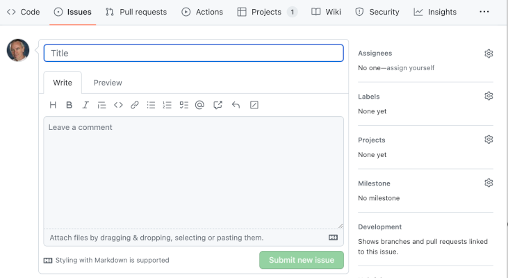

# Agile methodologies

<blockquote class="pretty">
Agile is an attitude, not a technique with boundaries. An attitude has no boundaries, so we wouldn’t ask ‘can I use agile here’, but rather ‘how would I act in the agile way here?’ or ‘how agile can we be, here?'
</blockquote>

Alistair Cockburn

# Agile Methodologies and Scrum

## Agile

Predictive models have two major drawbacks. The first is that they do not have a way to manage the 
unexpected or the uncertain. The second is that from a management point of view, once the design and
the timescale have been agreed, legal and commercial interests come into play that place huge 
constraints on the development team. To a certain extent, the rigid structure of the waterfall model
was the result of a misinterpretation of Royce's original paper. It was an oversimplification that
downplayed the challenge of creating a comprehensive design in advance of any development work. On the
other hand, it could be argued that the waterfall approach is ideally suited to high-risk projects
where an error might lead to death or large-scale financial loss. Even in those cases, however, code
is written by fallible human beings and the process has to account for errors and oversights.

The need for a more nuanced approach to the management of software development was recognised by
many pioneering figures from the 1980s onwards. Several methodologies were proposed that were based
on the principles of iterative prototype building and incremental refinement of requirements. Some
notable examples are RAD ([Martin, 1991](https://en.wikipedia.org/wiki/Rapid_application_development))
and Dynamic Systems Development Method (DSDM) reviewed by 
Millington and Stapleton ([1995](https://doi.org/10.1109/52.406757)).

The final move to a dynamic approach that prioritised the incremental nature of software development
occurred in 2001 with the publication of the 
[Manifesto for Agile Software Development](https://agilemanifesto.org/). It marked a major 
[paradigm shift](https://en.wikipedia.org/wiki/Paradigm_shift) and agile has become the preferred 
approach to software development projects for many companies. According to
[some sources](https://www.simform.com/blog/state-of-agile-adoption/), up to 94% of companies
practice agile to some extent, although only 52% use agile for the majority of projects. 

The international standard 
[ISO/IEC/IEEE 26515](https://napier.primo.exlibrisgroup.com/permalink/44NAP_INST/19n0mho/cdi_ieee_standards_0b0000648897745a),
last updated in 2018, provides a benchmark for agile methods. The agile manifesto itself is built around 
12 principles that will be referred to at various points in the module. The three most relevant at this 
point in the discussion are

* Our highest priority is to satisfy the customer through early and continuous delivery of valuable 
  software.
* Deliver working software frequently, from a couple of weeks to a couple of months, with a preference 
  to the shorter timescale.
* Working software is the primary measure of progress.

These three principles highlight the *continuous* nature of an agile approach with the goal of delivering
working software in the shortest possible timeframe. The 
[Scrum](https://www.scrum.org/learning-series/what-is-scrum) framework interprets the general agile
principles in a way that splits a project into short periods of time called *sprints*. Each sprint
has a managed life cycle as illustrated in Fig. 9.

)](images/scrum.png){: standalone #fig9 data-title="The Scrum framework"}

Although Scrum is the most widely-used agile methodology, there are other such as 
[Kanban](https://kanbanize.com/kanban-resources) which dispense with sprints and adopt a fully
continuous process instead. Despite their differences, there is a large degree of overlap in agile
methods, and a practical implementation of agile will include elements from more than one.

For a discussion of agile methods, please read [Stephens, 2022, Ch. 19](https://learning.oreilly.com/library/view/beginning-software-engineering/9781119901709/c19.xhtml#please-read)

## DevOps

Because an agile project is delivering working software in a continuous series of increments, it then
becomes possible to automate some of the essential steps in the process. The current term for this
is *DevOps*, a compound of *Development* and  *Operations*. The main goal is to eliminate delays and
human error involved in some of the routine aspects of software quality assurance including,
for example, building, testing and even deployment. *Continuous integration* (CI) is the terms used
to indicate that changes to a software application are automatically assembled, compiled and tested.
The process is often visualised as a series of steps known as a *pipeline*. Going one step further
and automatically releasing and deploying software increments is known as *Continuous deployment* (CD).
CD is obviously a more risky proposition that CI and a complete CI/CD pipeline includes rigorous
verification and monitoring steps before software is actually released to users as illustrated in
Fig. 10.

)](https://scaledagileframework.com/wp-content/uploads/2023/01/Continuous_Deployment_F02-2.svg#figure){: standalone #fig10 data-title="The four activities of continuous deployment"}

## Introduction

## Agile principles

## Scrum overview

## Scrum roles

## Scrum ceremonies

## Sprint planning

## Task management

## Issue-related workflow

Most code management platforms provide features to help manage projects. In GitHub, a project can be
represented in a tabular format, as a roadmap or in the form of a Kanban-style task board. The choice
of format is up to the team, but for the purposes of these notes, we will assume the use of a task board.

By default, a task board in GitHub contains the three swimlanes, `Todo`, `In Progress` and `Done` as
shown in Fig. 2. Further columns can be added if needed - this depends on how the team decides to
manage the work. For example, a swimlane for stalled tasks could be added, or for tasks in review.
The task board can be as complicated as required, but in general, the simpler the structure, the
more intuitive it is to use.

{: standalone #fig2 data-title="Default GitHub task board"}

Tasks in GitHub are represented by [issues](https://docs.github.com/en/issues). They can be added
directly on the task board using the button at the bottom of each swimlane. If you take that option,
you will need to explicitly attach the new issue to the relevant code repository. This is because
the relationship between projects and repositories doesnot have to be one-to-one. You can also create
issues using the issues tab on the repository page. If you take that option, you will need to say
explicitly which project the issue should be added to. This is done using the controls on the right of
the issue creation page as shown in Fig. 3.

{: standalone #fig3 data-title="GitHub new issue page"}

When using a task board, an item gradually accumulates detail and moves through the swimlanes from left
to right as the work progresses. Exactly *when* an item is moved from one swimlane to the next needs to
be defined in the team workflow so that there is no ambiguity. Once defined, these rules can be
performed and enforced manually, but GitHub can help to automate some of the steps. Clicking on the
three-dots icon in the top right-hand corner of the task board (see Fig. 5) allows you to select a
`Workflows` option. Here, you can define several actions to be triggered automatically. The options
are more or less self-explanatory and require some experimentation. The main point is that a team
should make explicit decisions about how their task board should operate and which steps are to be
automated. Thos decisions should be clearly documented sothat they are easy for team members to
follow.

## Further reading

* Software Project Management ([O'Regen, 2022, Ch. 4](https://link-springer-com.napier.idm.oclc.org/chapter/10.1007/978-3-031-07816-3_4))
* Manifesto for Agile Software Development ([Beck et al., 2001](https://agilemanifesto.org/))
* Developing information for users in an agile environment ([ISO/IEC/IEEE 26515](https://napier.primo.exlibrisgroup.com/permalink/44NAP_INST/19n0mho/cdi_ieee_standards_0b0000648897745a))

