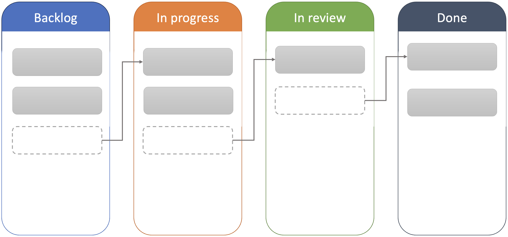

# Kanban

The Kanban approach is a flexible, visual method within Agile software development that focuses on 
optimising workflow and improving efficiency. Originally developed in manufacturing by Toyota, 
Kanban has been adapted for software development to help teams visualise their work, limit work 
in progress (WIP), and streamline processes to enhance productivity. Unlike other Agile frameworks 
that use time-boxed iterations (like sprints in Scrum), Kanban operates as a continuous flow system, 
making it especially valuable for teams managing a steady stream of tasks or handling unpredictable 
workloads.

Kanban emphasises four core principles: 

* Visualising work
* Limiting work in progress
* Managing flow
* Continuously improving

By visualising tasks on a Kanban board, teams gain a clear understanding of the current status of 
each task, allowing them to identify bottlenecks and areas for improvement. Limiting WIP ensures 
that the team remains focused on completing existing work before starting new tasks, which reduces 
context switching and improves task completion rates.

## Visualising work

In Kanban, the concept of visualising work is fundamental to managing and improving workflow. 
Visualising work involves using a Kanban board to represent all tasks, their current status, and 
the workflow stages. The board provides a clear, shared view of work items (represented as cards) 
and the steps they pass through (represented as columns) from initiation to completion. This visual 
approach enhances transparency, promotes collaboration, and helps teams quickly identify 
bottlenecks and inefficiencies.

{: standalone #fig1 data-title="Kanban board" }

The Kanban board typically includes columns that represent stages in the workflow, such as 
_Backlog_, _In Progress_, and _Done_ as shown in Fig. 1. The stages can vary based on the team’s 
specific process and may include additional columns like _Ready for Review_ or _Blocked_.
Each task or work item is represented by a card on the board, which contains information such as a 
task title, description, due date, and assignee. Cards are moved across the board from left to right
as the task progresses through each stage.

As work items move through the board, team members can see the entire workflow at a glance. This 
allows everyone to understand what tasks are in progress, what is completed, and what is waiting to 
be started. This transparency makes the status of every task visible to all team members and 
stakeholders, fostering a shared understanding of the team’s current workload and priorities.

An advantage of making the status of each task clear is that the team can focus on completing work 
in progress before starting new tasks, reducing distractions and context-switching. Visualising 
work allows the team to see where tasks may be piling up or slowing down, indicating potential 
bottlenecks. For example, if many tasks are in the "In Progress" column but few reach "Done," it 
may signal a need for more resources in a specific stage. With a shared visual board, team members 
can collaborate more effectively, adjusting resources and support as needed to move tasks along 
the workflow.

](https://upload.wikimedia.org/wikipedia/commons/c/c2/Sample_Kanban_Board.png){: standalone #fig2 data-title="Complex Kanban board" }

<a href="https://commons.wikimedia.org/w/index.php?curid=55448101">Image: Andy Carmichael - Own work, CC BY-SA 4.0</a>

In reality, task boards can become more complex as shown in Fig. 2. Nevertheless, 
visualising work on a Kanban board transforms the abstract idea of “progress” into a concrete, 
easily understood process. This shared visualisation promotes accountability, aligns team efforts, 
and provides valuable insights for continuous improvement, making it a key element of Kanban’s 
approach to optimising workflow.

## Limiting work in progress

In Kanban, the concept of limiting work in progress (WIP) is a fundamental practice that helps 
teams improve focus, efficiency, and throughput. A WIP limit restricts the number of tasks or 
items that can be actively worked on in each stage of the workflow (e.g. _To do_, _In Progress_, 
_In Review_). This approach is especially useful for reducing bottlenecks, managing workload, and 
ensuring a smooth, continuous flow of tasks through the development pipeline.

Working within set limits prevents team members from becoming overwhelmed and helps ensure that 
work is completed thoroughly. Fewer tasks in progress mean team members can spend more time on 
each task, reducing the risk of mistakes and improving quality. By limiting the number of tasks 
in each stage, teams can quickly identify bottlenecks. For example, if there are too many tasks 
in the "Review" stage, the team can allocate resources to address the backlog rather than adding 
more work.

By focusing on finishing tasks rather than starting new ones, WIP limits help teams deliver 
completed tasks faster. This continuous flow enables a quicker turnaround for feedback and ensures 
that completed work reaches the end user or client sooner.

As an example, imagine a Kanban board with columns for _To Do_, _In Progress_, _Review_, and _Done_. 
A team might set WIP limits like this:

* _In Progress_: WIP limit of 3 tasks
* _In Review_: WIP limit of 2 tasks

If the _In Progress_ column reaches its WIP limit of 3 tasks, no additional tasks can be moved 
into that column until one of the existing tasks is completed and moved to the next stage (e.g. 
_In Review_). This encourages team members to complete current tasks before starting new ones, 
ensuring that the workflow remains balanced and manageable.

Limiting work in progress in Kanban is a powerful way to streamline workflows, reduce 
multitasking, and improve task completion rates. By setting and respecting WIP limits, teams 
can maintain a steady flow of work, deliver high-quality results faster, and create a more 
manageable and productive work environment.

## Managing flow

In Kanban, managing flow is the practice of actively monitoring and optimising the pace at 
which tasks move through the development process. While visualising the workflow and limiting 
work in progress (WIP) are essential tools that enable flow management, managing flow itself 
focuses on analysing and improving the smooth, continuous movement of work items through each stage.

Managing flow involves understanding where slowdowns or inefficiencies occur and making 
adjustments to reduce these delays. This includes monitoring key metrics like cycle time and lead 
time, identifying and addressing bottlenecks, and continually refining the process for faster, 
more predictable delivery.

### Monitoring Flow Efficiency

Managing flow requires closely tracking how long tasks stay in each stage of the workflow. By 
analysing this data, teams gain insight into areas where tasks may be lingering too long, slowing 
the overall process.

For example, if tasks spend an unusually long time in the _In Review_ stage, the team may look 
into whether reviewers have enough bandwidth or if there are specific obstacles causing delays.

### Cycle Time and Lead Time Analysis

Cycle time  refers to the time it takes to complete a task once work begins while lead time is 
the time from task creation to completion. Both are critical metrics in flow management. Analysing 
these metrics allows teams to understand the average time a task takes to complete and identify 
stages where delays often occur.

If cycle times are higher than expected, for example, it may indicate inefficient handoffs or 
complex tasks that need further breakdown, prompting adjustments to improve flow.

### Identifying and Addressing Bottlenecks

Flow management focuses on identifying stages of the workflow where tasks tend to accumulate, 
causing bottlenecks that slow down the overall system. A bottleneck in one stage can affect all 
subsequent stages, hindering the flow of work.

If tasks frequently back up in the _Testing_ stage, for example, the team may increase testing 
resources or automate certain tests to speed up this phase, thereby improving the flow.

### Optimising Task Handoffs

Effective flow management involves minimising friction in task handoffs between stages. Poor 
handoff practices, such as incomplete information or lack of communication, can disrupt flow and 
lead to rework.

For example, implementing checklists or templates that ensure tasks are well-prepared before 
moving from "Development" to "Testing" can make handoffs smoother and reduce delays.

### Balancing Throughput and Quality

Managing flow also involves balancing the speed of completing tasks with the quality of output. 
Teams aim to move tasks through the system without rushing them, ensuring thoroughness and accuracy.
For example, if tasks are being pushed through too quickly, causing errors in later stages, the 
team might adjust the workflow to allow more time for quality checks in critical stages.

Managing flow is a proactive, ongoing effort to ensure that tasks progress smoothly and 
efficiently through each workflow stage. By continuously monitoring flow efficiency, addressing 
bottlenecks, and optimising task handoffs, teams can achieve a faster and more predictable 
delivery process. Unlike visualisation and WIP limits, managing flow directly targets the 
overall pace and effectiveness of the workflow, making it a crucial aspect of improving Kanban 
productivity.

## Continuous improvement

In Kanban, continuous improvement — also referred to as 
[Kaizen](https://en.wikipedia.org/wiki/Kaizen) — is the practice of consistently analysing and 
refining the workflow to enhance efficiency, reduce waste, and ultimately deliver higher-quality 
outcomes over time. Unlike practices such as visualising work, limiting work in progress (WIP), 
or managing workflow, continuous improvement is a proactive approach focused on making incremental 
adjustments informed by feedback and performance data.

A key part of continuous improvement involves regularly evaluating performance metrics, such as 
cycle time, lead time, and throughput, to understand how effectively work progresses through the 
system. By reviewing these metrics, teams can gain insights into areas where bottlenecks may exist, 
identify stages where tasks might be delayed, and make informed adjustments. For example, if lead 
times are consistently high, the team might investigate whether specific stages have inefficiencies 
or bottlenecks that could be improved.

Another component of continuous improvement is identifying and eliminating waste within the 
process. Waste in Kanban is defined as any activity that does not directly add value to the 
workflow or the final product. Waste might appear in forms like excessive task switching, long 
wait times, or redundant process steps. Suppose tasks are delayed in the _In Review_ stage due to 
a lack of available reviewers. In that case, the team could address this issue by assigning 
additional reviewers or streamlining the review process, ultimately improving flow and reducing 
wait times.

Continuous improvement also involves staying responsive to evolving needs and priorities, 
allowing the team to adapt its practices as conditions change. For example, if there is a 
shift in organisational priorities requiring faster delivery times, the team might experiment 
with simplifying or automating specific parts of the process to help meet this new demand. In 
this way, continuous improvement allows the Kanban process to remain flexible, evolving as 
customer requirements or business goals change.

A central aspect of continuous improvement in Kanban is the willingness to run experiments and 
evaluate their results. Small, incremental changes to workflow practices or processes are often 
tested temporarily, allowing the team to gauge their effectiveness before adopting them as 
permanent solutions. For instance, the team might experiment with reducing WIP limits in the 
_In Progress_ stage to determine if this change enhances cycle time. After evaluating results 
over a set period, the team can decide whether this adjustment should be maintained or reverted.

Retrospectives also play a crucial role in continuous improvement by providing a structured 
opportunity for the team to reflect on what’s working, what isn’t, and what adjustments could 
lead to improvement. Unlike daily standups, which focus on immediate task updates, retrospectives 
encourage a more comprehensive review of workflow practices. During a retrospective, the team 
might uncover issues like bottlenecks in testing or delays caused by inefficient handoffs, 
leading to insights that can inform process adjustments.

Additionally, continuous improvement in Kanban benefits greatly from team feedback and 
collaboration. An open culture where team members feel encouraged to suggest improvements 
fosters a collaborative environment for problem-solving. Team members might observe 
inefficiencies during task handoffs or note gaps in documentation, which they can bring up 
for discussion. The team can then use these observations to make informed changes that enhance 
the overall workflow.

Continuous improvement in Kanban goes beyond simply visualising work, setting WIP limits, or 
managing flow. While visualising work offers transparency, continuous improvement uses that 
information to actively refine the process over time. Similarly, setting WIP limits helps control 
workloads, and managing flow ensures smooth task progression, but continuous improvement is about 
examining the workflow at a higher level to assess which practices could be streamlined or 
optimised. Through this process of ongoing reflection, evaluation, and adaptation, continuous 
improvement becomes the driving force behind Kanban’s ability to evolve, increase efficiency, 
and consistently deliver value in a changing environment.

## Kanban and XP compared

Kanban and Extreme Programming (XP) are both Agile approaches to software development, but they 
differ significantly in their structure, focus, and practices. The table below highlights some
of the main differences.

| Aspect                        | Kanban                                                                                                                                                                                                                                                                                   | XP                                                                                                                                                                                                                                                                                               |
|-------------------------------|------------------------------------------------------------------------------------------------------------------------------------------------------------------------------------------------------------------------------------------------------------------------------------------|--------------------------------------------------------------------------------------------------------------------------------------------------------------------------------------------------------------------------------------------------------------------------------------------------|
| Workflow vs. Iterative Cycles | Uses a continuous flow system with no fixed-length iterations. Work items are pulled through the workflow as capacity allows, with a focus on optimising flow rather than time-boxed cycles.                                                                                             | Works in short, iterative cycles (typically 1-2 weeks) called iterations, where the team commits to a set of user stories at the beginning of each cycle and aims to complete them by the end. This iterative approach enables regular feedback and planning cycles.                             |
| Work in Progress (WIP) Limits | Actively enforces WIP limits on each workflow stage to control the amount of work in progress at any given time. This practice helps manage capacity, avoid bottlenecks, and keep the flow steady.                                                                                       | Does not have explicit WIP limits but encourages managing workload by committing only to achievable tasks within each iteration. XP’s practices like Pair Programming and Test-Driven Development (TDD) help improve focus and quality but don’t directly limit the number of tasks in progress. |
| Core Practices and Techniques | Focuses on visualising work on a Kanban board, managing flow, limiting WIP, and continuously improving processes. It does not prescribe specific engineering practices or technical practices, allowing it to be adapted to a wide range of work types.                                  | Includes specific technical practices such as Pair Programming, TDD, Continuous Integration, Refactoring, and Collective Code Ownership. These practices are intended to improve code quality, collaboration, and responsiveness to changing requirements.                                       |
| Planning and Commitment       | Has a flexible approach to planning, allowing tasks to be added or reprioritised as capacity opens up. There is no formal planning session; instead, work is pulled continuously as the team completes tasks, supporting a just-in-time approach to planning.                            | Uses formal planning sessions, including Release Planning (high-level) and Iteration Planning (for each cycle). The team commits to a set of user stories for each iteration, encouraging focus and goal alignment within the cycle’s timeframe.                                                 |
| Customer Involvement          | While Kanban encourages collaboration, it doesn’t require continuous customer involvement in the same way as XP. The approach is less prescriptive about roles, focusing instead on managing and optimising workflow.                                                                    | Requires close collaboration with an on-site customer or product owner, who actively participates in the planning and provides frequent feedback. This role is central to XP, as it helps ensure that development aligns closely with user needs and business goals.                             |
| Feedback Frequency            | Feedback is continuous but tends to be focused on improving the process and optimising flow rather than on the product itself. Teams hold regular retrospectives to identify process improvements, but the system itself does not inherently require user feedback at regular intervals. | Emphasises frequent product feedback through iteration reviews, testing, and continuous customer involvement. Feedback is both technical and functional, addressing code quality and alignment with customer requirements.                                                                       |
| Flexibility and Adaptability  | Offers more flexibility since there are no iteration commitments; tasks can be reprioritised at any time based on business needs. This approach is suitable for teams that handle frequent ad hoc requests or have variable workloads.                                                   | Is slightly less flexible within iterations, as the team commits to a set of user stories at the beginning of each cycle. However, XP is designed to be adaptive over the long term, with short iterations enabling the team to regularly reassess priorities.                                   |
| Process vs. Engineering Focus | Primarily focuses on workflow management and process optimisation. Kanban can be applied to any workflow, including non-software domains, because it emphasises efficient task flow rather than specific technical practices.                                                            | Has a strong engineering focus, with prescribed technical practices and development principles aimed at ensuring code quality, collaboration, and adaptability. XP is especially suited to software development due to its technical discipline and customer-focused approach.                   |

Kanban is a flexible, flow-based approach focused on visualising and optimising 
workflow, with a strong emphasis on limiting WIP and continuously improving processes. XP, on 
the other hand, is a structured, iteration-based approach with defined technical practices that 
emphasise high-quality code, close customer collaboration, and regular feedback. Kanban is ideal 
for teams that need flexibility and streamlined process management, while XP is suited to development 
teams that benefit from strong engineering practices and regular cycles of customer feedback.

{: .tip-title }
> [<i class="fa-regular fa-lightbulb"></i> Practical tips for implementing Kanban](kanban_tips)

## Further reading

[The official guide to the Kanban method](https://kanban.university/kanban-guide/)
