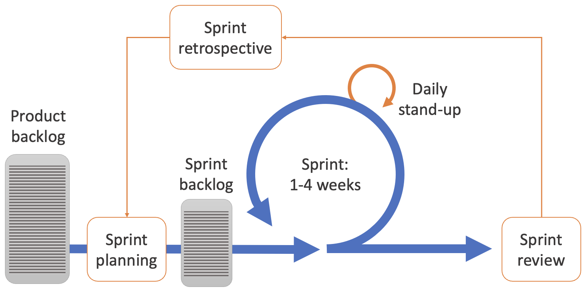
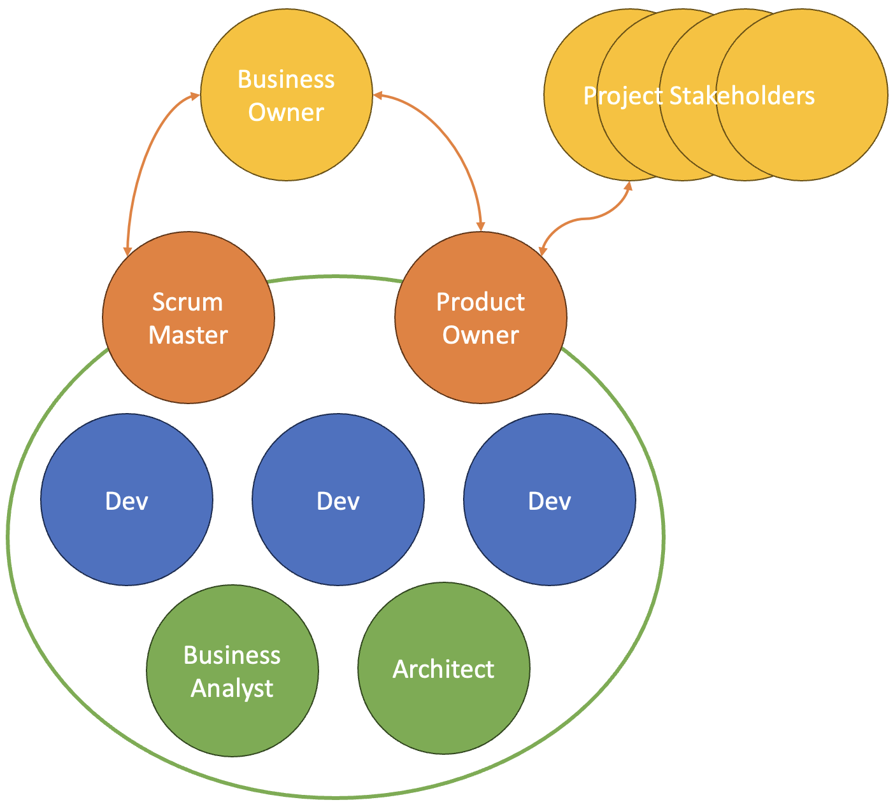

# Scrum

Scrum is an Agile project management framework designed to help teams work collaboratively on 
complex projects while delivering high-quality products in short, iterative cycles. Developed 
for software development but now applied across various fields, Scrum emphasises flexibility, 
transparency, and continuous improvement, making it especially valuable for projects with evolving 
requirements or user needs. By breaking down work into manageable increments called sprints 
(typically lasting two to four weeks), Scrum allows teams to respond to feedback and adapt to 
changing priorities quickly.

{: standalone #fig1 data-title="The Scrum framework"}

Scrum provides a clear structure for organising work through roles, events, and artifacts. Key 
roles include the Product Owner, responsible for defining and prioritising features; 
the Scrum Master, who facilitates the process and removes obstacles; and the Development Team, 
which collaboratively delivers the product increments. Essential events like Sprint Planning, 
Daily Standups, Sprint Reviews, and Retrospectives keep the team aligned, allow for regular 
inspection, and promote incremental progress.

## Scrum Artefacts

The three primary Scrum artifacts are:

* **Product Backlog**: A prioritised list of all the features, enhancements, fixes, and 
  requirements for the product. Managed by the Product Owner, it serves as a dynamic to-do list for 
  the team, evolving as new information emerges and priorities shift.
* **Sprint Backlog**: A subset of items from the product backlog that the team commits to 
  completing during the sprint. This artifact includes the specific tasks necessary to achieve 
  the sprint goal and guides the team's daily work within the sprint.
* **Increment**: The cumulative result of all completed product backlog items up to the end of a 
  sprint. Each increment represents a potentially shippable product state, which is thoroughly 
  tested and meets the Definition of Done, ensuring it adds value to the overall product.

These artifacts provide structure and clarity to the Scrum process, guiding the team’s focus and 
progress while ensuring alignment with the product’s goals and priorities.

## Scrum Roles

In Scrum, defined roles create a clear and focused team structure, ensuring 
accountability, and facilitating collaboration. Each role serves a unique purpose within the 
Scrum framework, helping to balance responsibilities and support a smooth, effective workflow. 
By establishing specific roles, Scrum enables team members to focus on their core contributions — 
whether it’s prioritising work, maintaining process integrity, or delivering the product increment 
— while fostering a shared understanding of each person’s responsibilities. This clarity not only 
enhances communication but also promotes self-organisation, allowing the team to remain Agile and 
aligned in reaching project goals.

{: standalone #fig2 data-title="The Scrum team"}

### Product Owner

The Product Owner in Scrum is responsible for maximising the value of the product by defining and 
managing the product backlog, which is a prioritised list of features, enhancements, and fixes for 
the development team to work on. Acting as the bridge between stakeholders and the development 
team, the Product Owner ensures that the team works on the most valuable features first, aligning 
with business objectives and customer needs. They continuously refine and prioritise backlog items, 
clarify requirements, and set clear goals for each sprint, ensuring that the team has a well-defined, 
actionable list of tasks to accomplish. The Product Owner also actively engages with stakeholders, 
gathering feedback and adjusting priorities as needed to reflect changing business goals or user 
feedback. This role requires a deep understanding of the product vision and market demands, as the 
Product Owner is ultimately accountable for ensuring that the team delivers a product that meets 
user needs and achieves business objectives. Through close collaboration with both the development 
team and stakeholders, the Product Owner drives the direction of the product, ensuring it delivers 
maximum value with each sprint.

The role of Product Owner shares some characteristics with that of a traditional project manager
but there are also some important differences as illustrated in the table below. Whereas the
project manager role is designed for a structured development approach and has been adapted to
suit the Agile context, the role of Product Owner is specifically designed for Agile environments.

| Aspect                                  | Project Manager                                                                                                                                                                                                                                                           | Product Owner                                                                                                                                                                                                                                                                                                                                             |
|-----------------------------------------|---------------------------------------------------------------------------------------------------------------------------------------------------------------------------------------------------------------------------------------------------------------------------|-----------------------------------------------------------------------------------------------------------------------------------------------------------------------------------------------------------------------------------------------------------------------------------------------------------------------------------------------------------|
| Focus and Accountability                | responsible for delivering a project within a defined scope, timeline, and budget. They focus on planning, coordinating, and monitoring project progress, managing resources, and often handling risks and changes in scope to meet the project’s objectives.             | responsible for maximising the value of the product by managing the product backlog, prioritising features, and ensuring that the development team works on the most valuable items. The Product Owner is accountable for the product’s direction and success from a value perspective, aligning development work with business goals and customer needs. |
| Approach to Planning and Prioritisation | typically creates a comprehensive project plan outlining tasks, timelines, milestones, and dependencies. They maintain this plan throughout the project, making adjustments as necessary to ensure the project progresses smoothly and meets its completion goals.        | manages the product backlog and prioritises tasks based on business value, stakeholder input, and market needs. They ensure that each sprint delivers high-value increments by focusing on features that best align with the product vision and goals. Planning is iterative, adjusting based on feedback after each sprint.                              |
| Authority and Decision-Making           | may have authority over project scope and timelines but does not have the same level of influence over the product’s feature set or roadmap. They typically facilitate work according to project constraints but may need to consult stakeholders for strategic changes.  | has authority over what the team works on, making decisions about product features, scope, and priorities. They act as the voice of the customer, translating business needs into specific features and requirements for the team.                                                                                                                        |
| Collaboration with the Development Team | often works more independently of the development team. While they may communicate regularly with the team and track progress, they are less embedded in day-to-day decision-making and are usually responsible for coordinating across multiple teams or stakeholders.   | works closely with the development team, continuously refining the backlog, clarifying requirements, and ensuring that the team understands what’s most valuable. They are a dedicated member of the Scrum team, directly involved in each sprint.                                                                                                        |

### Scrum Master

The Scrum Master ensures that the team follows Scrum principles and practices while fostering a 
collaborative, productive, and self-organising work environment. Acting as both a servant leader 
and a coach, the Scrum Master’s primary responsibility is to support the team’s success by removing 
obstacles, guiding continuous improvement, and facilitating communication. They help the team stay 
focused on the goals of each sprint, protect the team from unnecessary interruptions, and ensure 
that Scrum ceremonies (such as sprint planning, daily standups, sprint reviews, and retrospectives) 
are conducted effectively and provide value.

Beyond facilitating team activities, the Scrum Master serves as an advocate for Scrum within the 
organisation, working to build an environment that supports Agile values. This may involve educating 
stakeholders, managers, and other teams about Scrum principles, emphasising the importance of 
iterative progress and responding to change. They often help the organisation understand why Agile 
practices benefit the team and the product, building awareness of concepts like transparency, 
incremental improvement, and adaptability.

The Scrum Master also plays a key role in coaching both the team and the Product Owner. For the 
development team, they encourage self-organisation, accountability, and continuous learning. For 
the Product Owner, they may provide support in managing the product backlog, ensuring that 
priorities are clear and that there’s alignment with the overall product vision. As an experienced 
Scrum practitioner, the Scrum Master works to create a high-trust environment where team members 
feel empowered to innovate, learn from each sprint, and grow together.

The role of the Scrum Master is typically filled by a dedicated individual who serves as a 
constant presence throughout the Scrum project, rather than rotating among team members. While 
it is possible for teams to share Scrum Master responsibilities, having a fixed Scrum Master is 
generally preferred to ensure continuity, consistency, and focus on the role’s specific 
responsibilities.

A fixed Scrum Master brings several advantages. They develop a deep understanding of the team’s 
dynamics, the unique challenges the team faces, and how best to support continuous improvement 
over time. This consistency allows the Scrum Master to build trust with the team, enabling them 
to provide tailored coaching, anticipate recurring obstacles, and fine-tune Scrum practices to 
fit the team’s needs. Additionally, a fixed Scrum Master is better able to serve as an advocate 
for Scrum within the organisation, educating stakeholders and building a supportive environment 
for Agile practices.

However, in some cases — such as in smaller teams or organisations with limited resources — 
Scrum Master responsibilities may be rotated among team members or taken on by someone with 
other responsibilities, like a developer or Product Owner. While this can work, it may dilute the 
focus on Scrum practices and reduce the ability to continuously support the team’s Agile development.

### Scrum Team (Developers)

The Scrum Team is collectively responsible for creating the product increments that deliver value 
to the customer. In Scrum, the developer role encompasses a wide range of responsibilities, 
including planning, designing, coding, testing, and delivering high-quality, functional product 
features within each sprint. Developers work collaboratively, relying on their cross-functional 
skills to complete tasks, from initial planning to final deployment. Unlike traditional development 
roles, Scrum developers are not limited to specific tasks but are instead empowered to contribute 
to all aspects of product creation, making the team self-organising and adaptable to changing 
requirements.

At the start of each sprint, developers participate in sprint planning, where they help estimate, 
prioritise, and commit to the tasks they believe can be completed within the sprint. During the 
sprint, developers attend daily standups to discuss progress, identify obstacles, and coordinate 
with team members. This ongoing communication ensures alignment, helps maintain focus on sprint 
goals, and allows the team to self-manage their workload. Scrum developers are also responsible 
for meeting the Definition of Done for each task, ensuring that features are complete, tested, 
and meet the quality standards before they are considered done.

Beyond technical responsibilities, Scrum developers play a key role in fostering a collaborative 
and transparent team environment. They participate in sprint reviews, where they demonstrate 
their work to the Product Owner and stakeholders, gathering feedback and gaining insights that 
shape future development. During retrospectives, they reflect on the sprint process, identifying 
areas for improvement and contributing to the team’s continuous improvement efforts.

The role of a Scrum Developer is both dynamic and collaborative, combining technical expertise 
with a commitment to teamwork and Agile values. By working closely with each other, the Product 
Owner, and the Scrum Master, developers help ensure that each sprint delivers a functional, 
valuable increment of the product while fostering a culture of quality, adaptability, and 
continuous learning.

## Scrum ceremonies

Activity in a Scrum project is structured around four events referred to as _ceremonies_ because 
they are structured, ritual-like practices that are integral to the Scrum process. They provide rhythm, 
consistency, and formal opportunities for communication within the team. The term _ceremony_ 
emphasises the importance of these recurring events, as they serve specific purposes that help 
maintain alignment, transparency, and focus across the team. Each ceremony has its own format, 
participants, and objectives, acting as a structured checkpoint that facilitates the iterative 
nature of Scrum.

The four ceremonies, highlighted in orange in Fig. 1, create deliberate moments for the team to 
inspect progress, adapt to new information, and reinforce commitment to goals, much like rituals 
in other fields that foster cohesion and purpose. The regular, consistent nature of ceremonies also 
allows team members to build habits around reflection, planning, and collaboration, helping Scrum 
teams function efficiently and uphold Agile values.

### Sprint Planning

The Sprint Planning ceremony is a collaborative meeting held at the beginning of each sprint, where 
the Scrum team comes together to define what will be achieved during the upcoming sprint. The purpose 
of Sprint Planning is to set clear goals, select the most valuable tasks from the product backlog, 
and determine how the team will approach their work. During this ceremony, the Product Owner, Scrum 
Master, and Development Team discuss the sprint’s priorities, align on objectives, and gain a shared 
understanding of what can realistically be accomplished.

The Product Owner plays a key role in Sprint Planning by presenting the highest-priority items from 
the product backlog, explaining the context, and outlining the expected outcomes. Based on this 
information, the team asks questions, clarifies requirements, and estimates the effort needed for 
each item. This collaborative discussion helps the team and Product Owner reach a consensus on what 
can be feasibly completed within the sprint's timeframe, balancing ambition with practicality.

Once the sprint goal is set, the Development Team breaks down the selected tasks into smaller, 
actionable sub-tasks. This process helps the team determine how they will approach the work, 
identify dependencies, and ensure that they are collectively aligned on the scope of each task. 
This breakdown also provides the team with a sense of ownership and clarity on individual 
responsibilities, promoting accountability and setting a strong foundation for the sprint.

The Scrum Master facilitates the Sprint Planning ceremony to ensure that discussions remain focused, 
timeboxed, and productive, helping the team avoid over-commitment or ambiguity. By the end of Sprint 
Planning, the team has a well-defined sprint backlog, a shared understanding of the sprint goal, and 
a clear path for how they intend to achieve it. This ceremony is essential for setting the team up 
for a successful sprint by aligning everyone on objectives and the approach to reaching them, thus 
fostering commitment and focus throughout the sprint.

### Daily stand-up

The Daily Stand-Up, also known as the Daily Scrum, is a brief, focused meeting held every day of 
the sprint, where the Scrum team gathers to discuss progress, plan their day’s work, and identify 
any obstacles. The purpose of this ceremony is to ensure alignment among team members and maintain 
a steady momentum toward the sprint goal. Typically lasting 15 minutes or less, the stand-up is 
structured to be concise and efficient, with each team member addressing three key points: what 
they completed since the last stand-up, what they plan to work on today, and any impediments that 
might hinder their progress.

The Scrum Master often facilitates the stand-up to keep it on track and ensure that discussions 
remain relevant to the sprint goal, but the meeting is primarily for the development team’s 
benefit, fostering self-organisation and accountability. By regularly sharing updates, team 
members stay informed of each other’s work, allowing them to quickly spot dependencies or 
potential roadblocks. If issues arise, the team can either address them on the spot or arrange 
follow-up discussions outside the stand-up, ensuring that the ceremony remains time-efficient.

The Daily Stand-Up plays an important role in maintaining transparency within the team, promoting 
open communication, and helping everyone stay focused on shared objectives. By meeting consistently 
and briefly each day, the team can make minor adjustments as needed, keeping their work aligned 
and addressing challenges early before they escalate. This ceremony is essential for keeping the 
team synchronised and driving continuous progress, ensuring they remain on course to complete the 
sprint successfully.

### Sprint Review

The Sprint Review ceremony is held at the end of each sprint and serves as an opportunity for the 
Scrum team to showcase the work they have completed during the sprint to stakeholders, gather 
feedback, and assess progress toward the product goals. This collaborative meeting allows the 
team to demonstrate the increment — the potentially shippable product or set of features completed 
during the sprint — in a real-world, hands-on way. The focus of the Sprint Review is on inspection 
and adaptation: stakeholders and the team review the completed work to assess its alignment with 
requirements, discuss any changes in priorities, and consider new ideas or insights that may have 
arisen.

During the Sprint Review, the Product Owner often leads the presentation, explaining the increment’s 
purpose, highlighting the functionality achieved, and detailing how the work contributes to the 
product’s overall direction. Developers provide additional context, answering questions and 
demonstrating specific features or improvements. This transparency gives stakeholders a clear 
picture of progress and allows them to offer feedback, ensuring that the product evolves in line 
with user needs and business goals.

The Sprint Review is a dynamic meeting where the product backlog is often revisited and updated 
based on the feedback received. This feedback loop enables the Product Owner to adjust priorities, 
refine upcoming user stories, and adapt to any new requirements or challenges. It also fosters a 
strong connection between the Scrum team and stakeholders, creating a shared sense of ownership 
in the product’s success.

Overall, the Sprint Review helps ensure that development remains aligned with customer needs, 
business objectives, and market realities. By promoting regular inspection and adaptation, this 
ceremony encourages responsiveness to change and continuous value delivery, which are central to 
the Scrum and Agile philosophies.

### Sprint Retrospective

The Sprint Retrospective is a reflective meeting held at the end of each sprint in Scrum, 
dedicated to assessing the team’s processes, collaboration, and effectiveness. Unlike the Sprint 
Review, which focuses on the product, the Sprint Retrospective centers on the team’s performance 
and how they can work better together. The goal is to create an open, honest environment where 
team members can discuss what went well, what could have been improved, and what specific 
adjustments they can make for future sprints. This ongoing practice of self-improvement is vital 
to Scrum’s emphasis on continuous learning and adaptability.

Facilitated by the Scrum Master, the Retrospective often begins by revisiting the sprint’s events, 
interactions, and challenges. Team members are encouraged to share their experiences, highlighting 
successful aspects of the sprint, as well as any obstacles that impeded their progress. Common 
themes may include communication, workload distribution, tool usage, and adherence to Scrum 
principles. This collective reflection helps the team identify both strengths and weaknesses in 
their processes and working dynamics.

After identifying areas for improvement, the team collaborates on specific, actionable changes to 
implement in the next sprint. These changes might involve adjusting WIP limits, altering 
communication patterns, or revising how daily standups are conducted. Importantly, the 
Retrospective provides a structured opportunity for the team to acknowledge successes, celebrate 
achievements, and reinforce positive behaviours.

The Sprint Retrospective is key to fostering a culture of openness, trust, and continuous 
improvement within the Scrum team. By regularly reflecting on their work and actively seeking 
ways to enhance their processes, the team can improve their efficiency, strengthen their 
collaboration, and adapt to challenges over time. This ceremony ensures that each sprint builds 
on the last, making the team more cohesive and effective in meeting their goals.

{: .tip-title }
> [<i class="fa-regular fa-lightbulb"></i> Practical tips for getting used to Scrum](scrum_tips)

## Further reading

[Scrum Alliance](https://resources.scrumalliance.org/?tn=Articles)
[Stephens, 2022, Ch. 19](https://learning.oreilly.com/library/view/beginning-software-engineering/9781119901709/c19.xhtml#please-read)

