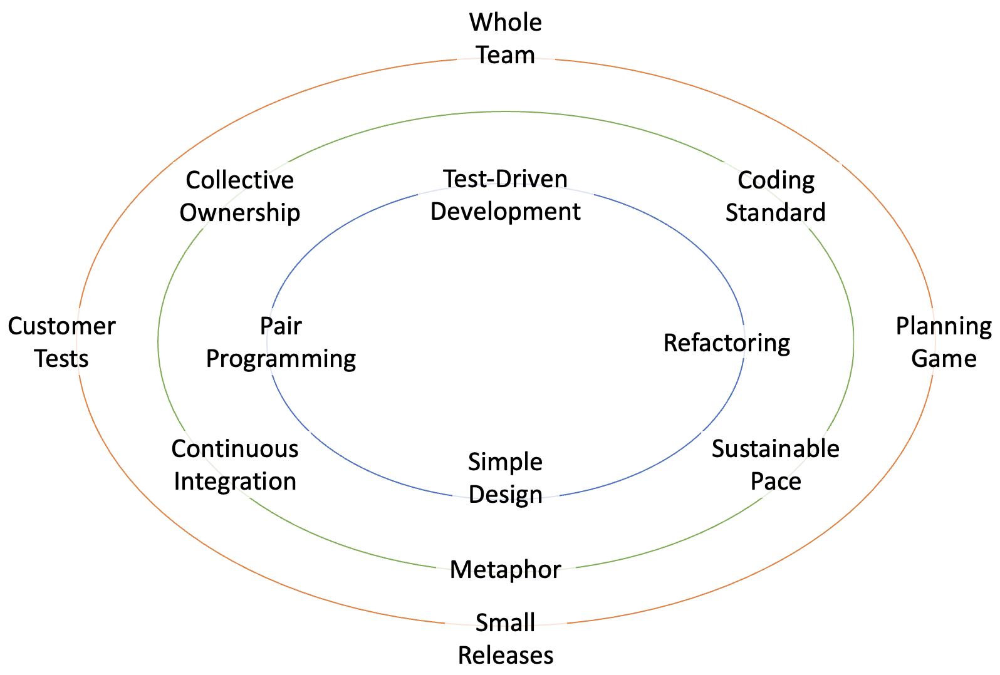

# Extreme Programming

Extreme Programming (XP) is an Agile software development framework designed to improve software 
quality and responsiveness to changing customer requirements. Developed in the 1990s by Kent Beck, 
XP emphasises frequent releases in short development cycles, which improves productivity and 
introduces checkpoints at which new customer requirements can be adopted. 

XP is centered around a set of core values:

* Communication
* Simplicity
* Feedback
* Courage
* Respect

These values guide XP teams to focus on collaboration, reduce unnecessary complexity, and 
maintain a close working relationship with customers to ensure the product aligns with their 
expectations. In XP, teams work in short, iterative cycles with customer feedback at every stage, 
allowing for quick adjustments based on real-world insights.

XP’s practices are particularly beneficial for projects with rapidly changing requirements or 
those that demand high reliability and performance. It is also highly suited to teams that thrive 
in collaborative environments and are committed to following disciplined engineering practices. 
By applying XP, teams can achieve faster delivery cycles, improved code quality, and closer 
alignment with business needs, making it a valuable approach within Agile development.

## XP Practices

XP is commonly visualised as the collection of practices shown in Fig. 1. However, it is more 
than a loose collection of guidelines. It’s a disciplined, interconnected framework with a 
specific set of values, principles, and practices that work synergistically to support high-quality, 
responsive software development. Each practice in XP is carefully chosen and reinforced by other 
practices, creating a cohesive approach that is designed to address common challenges in software 
projects.

{: standalone #fig1 data-title="XP practices"}

Some of the practices such as refactoring are covered elsewhere in these notes. The next few
sections provide details on some of the others.

### Pair Programming

Pair programming is a core practice in XP and other Agile methodologies that involves two 
developers working together on the same task, at the same workstation. In pair programming, one 
developer, known as the “driver,” writes the code, while the other, known as the “observer” or 
“navigator,” reviews each line of code as it’s written, offering suggestions and identifying 
potential improvements. The two developers swap roles frequently, ideally every 20-30 minutes, 
to maintain engagement and share knowledge. Theoretically, pair programming delivers

* Improved code quality
* Knowledge sharing and skill development
* Increased collaboration and team cohesion
* Reduced bottlenecks and dependencies

While pair programming can be highly beneficial, it may not always be suitable for every task or 
team. Pairing on repetitive or low-priority tasks, for example, may not justify the time investment. 
Also, if a developer is working on a task that requires deep concentration or independent 
exploration, solo work may be more effective. 

Where pair programming is used, it needs to be implemented carefully and managed just like any 
other technique. Paired developers should have complementary skills, for example, and individuals
should not be paired for too long to avoid "pair fatigue". Rotating pairs also improves 
knowledge sharing across the whole team. While the developers are working together it is important
to maintain control over the process by ensuring that the roles are clearly identified and that 
timing is properly observed. As well as swapping roles on a regular basis, the work should be
timeboxed (e.g. 90 minutes) so that the pair gets regular breaks.

Using pair programming effectively takes some practice. Both members of the pair need to buy
into the process. A skills imbalance can lead to poor communication, frustration and eventual
dominance by one of the pair who tends to take the driver role more often. Some developers may 
feel uncomfortable working so closely with a partner, especially if they are used to working 
independently. In such situations, it can be useful to start with short, informal pair programming 
sessions and gradually increase their frequency and duration as team members get more comfortable. 
Clear expectations for collaboration are crucial, as is creating a safe, respectful environment 
where everyone feels valued.

### Planning Game

The Planning Game guides the team in planning and prioritising work based on customer needs 
and the team’s capacity. It’s a collaborative process involving both the development team and 
the customer (or product owner) to establish what features will be implemented, in what order, 
and within what timeframe. The Planning Game helps ensure that development stays focused on 
delivering the highest-value features first, aligning closely with Agile’s customer-centric 
philosophy. In this context, the term _game_ highlights the interactive and iterative nature of 
planning, where both customers and developers play specific roles, make strategic choices, and 
engage in a dynamic back-and-forth to reach a shared goal. 

Like other games, the Planning Game involves strategic decision-making and negotiation. 
Customers prioritise features based on business value, while developers estimate feasibility 
and effort. Both sides negotiate a realistic plan that balances priorities and technical 
capabilities. This negotiation resembles the tactical aspects of a game, where both sides 
strategise to reach the best possible outcome within given constraints. The Planning Game is 
played in rounds — release planning and iteration planning — where each session builds on 
previous rounds, adjusting based on progress and changing needs. Like rounds in a game, each 
iteration allows the team to reassess and realign based on newly revealed information, making 
it an interactive, evolving process.

The main stages of the Planning Game are

1. **User Story Creation**: User stories are written by the customer to express the product’s 
   functionality.
2. **Prioritisation**: The customer prioritises the user stories based on business value, which 
   helps focus the team on the most impactful features first.
3. **Estimation**: The development team estimates the effort required for each story using 
   relative measures (such as story points) or time-based estimates. Estimations are usually 
   kept rough in release planning but become more refined in iteration planning.
4. **Iteration Selection**: For each iteration, the customer selects a set of user stories to 
   be completed, working within the capacity of the development team. Developers commit to 
   delivering these stories by the end of the iteration.
5. **Review and Adjust**: At the end of each iteration, the team and customer review progress, 
   adjust priorities as necessary, and plan the next iteration, allowing flexibility for 
   evolving requirements.

Just as with pair programming, or any other technique, there may be situations where the 
Planning Game is not the best approach. To take a simple example, it is not possible to 
produce valid resource or time estimates if the project requirements are not sufficiently
clear. Other requirements elicitation techniques should be used to elaborate the requirements
to the point where accurate estimation is possible. Another potential problem situation is where
the customer is not fully engaged in the process. To be effective, the Planning Game requires
both the Customer and Developer roles to be filled. Trying to use the Planning Game with only 
the developers means that there is no negotiation and no trade-offs between business goals
and technical feasibility.

### Metaphor

the concept of _metaphor_ is used in XP as a shared story or analogy that represents the 
structure and function of the system being developed. It’s a simple, understandable mental 
model that helps the entire team — developers, customers, and other stakeholders — visualise 
how the system works and how its components relate to each other.

The metaphor serves as an alternative to formal architectural documentation by providing a 
relatable, high-level description of the system’s design that anyone, regardless of technical 
expertise, can understand. It’s a tool for communicating complex technical concepts in an 
accessible way, which supports alignment, consistency, and collaboration across the team.

Some examples of development metaphors are listed below.

* **Digital Library System as a “Bookshelf”**: In a system designed to manage digital resources, 
  the metaphor could be a “bookshelf,” where different categories of resources (books, magasines, 
  newspapers) are “shelves” that organise the data. This metaphor can help the team visualise 
  how resources are stored, organised, and retrieved.
* **E-commerce Platform as a “Marketplace”**: In an e-commerce system, using the metaphor of a 
  “marketplace” can represent different entities like “sellers” (merchants), “products” (items 
  for sale), and “shoppers” (users), making it easy to understand the roles and interactions 
  between these components.
* **Airline Booking System as a “Travel Agency”**: In a flight booking system, the metaphor of 
  a “travel agency” can represent different elements, like flights as “itineraries” and customer 
  bookings as “reservations,” helping simplify how users interact with the system.

The metaphor acts as a high-level mental model that supports communication, simplifies complexity, 
and guides design. By offering a relatable analogy for the system’s structure and behavior, the 
metaphor helps all team members maintain a consistent understanding of the project, ultimately 
leading to more cohesive development and collaborative alignment. However, they can sometimes 
oversimplify or fail to represent complex systems accurately. In cases where the system requires 
highly technical detail or has intricate dependencies, the metaphor may need to be supplemented 
with additional documentation or architectural models.

## Roles

As well as the Developer and Customer roles, XP provides for several other roles that are 
described below.

### Coach

The coach in an XP project serves as a mentor and facilitator who guides the team in 
effectively implementing and adhering to XP practices and principles. Unlike a traditional 
project manager, the coach focuses on process over control, helping the team maintain discipline 
in core XP practices like Test-Driven Development (TDD), Pair Programming, and Continuous 
Integration. The coach works closely with the team to identify obstacles, resolve conflicts, 
and encourage open communication, fostering a collaborative and productive environment. 
Additionally, the coach supports continuous improvement by conducting retrospectives, 
providing feedback, and helping team members reflect on their work to refine practices. Through 
their guidance, the coach ensures that the team remains aligned with XP values, delivers 
high-quality code, and responds flexibly to changing customer needs.

### Tracker

The job of the Tracker is to monitor the team’s progress, identifying obstacles, and providing 
insights into the project’s trajectory. The Tracker gathers data on metrics like story 
completion, velocity, defect rates, and any other indicators that reveal the team’s 
productivity and quality levels. By analysing this information, the Tracker helps the team 
recognise patterns, manage workload, and adjust processes to optimise efficiency and maintain 
a sustainable pace. The Tracker also assists in iteration planning by highlighting areas where 
the team is excelling or struggling, offering a fact-based perspective that supports better 
decision-making. Ultimately, the Tracker’s role is to ensure transparency, support continuous 
improvement, and enable the team to meet its goals consistently.

### Tester

It is the Tester's responsibility to ensure the quality of the software under development and 
alignment with customer expectations. The Tester collaborates closely with the customer and 
developers to define and create acceptance tests for each user story, clarifying what constitutes 
a completed and functional feature. By developing automated tests and running continuous checks, 
the Tester helps identify issues early, preventing defects from reaching production. They work 
with developers to ensure that each iteration delivers a high-quality, reliable product by 
validating that new features meet requirements and that existing functionality remains intact. 
Through continuous testing and feedback, the Tester contributes significantly to the XP team’s 
goal of delivering software that is both functional and stable, building confidence in the final 
product.

### Manager

the Manager plays a supportive role focused on resource coordination, facilitating team needs, 
and addressing any logistical or administrative challenges that arise. Unlike a traditional 
command-and-control manager, the XP Manager acts as a facilitator, ensuring the team has the 
tools, information, and environment required to function effectively. They handle external 
dependencies, communicate with stakeholders outside the team, and shield the team from 
unnecessary interruptions, allowing developers to stay focused on their work. Additionally, 
the Manager may assist in prioritising work alongside the customer, balancing business goals 
with technical considerations. Their role is to create a productive, supportive environment 
that enables the XP team to follow Agile principles and maintain a sustainable pace, helping 
to keep the project aligned with both team capabilities and customer expectations.

### Whole team

In XP, the entire team can be considered a cohesive project role because the team collectively 
takes responsibility for the project’s success, with each member contributing their unique 
expertise to achieve shared goals. Rather than working in silos, the XP team operates as a single, 
collaborative unit where roles like developers, testers, the customer, and the coach contribute 
to both decision-making and project execution. This collective approach ensures that everyone 
has a stake in each part of the process—from defining requirements and estimating effort to 
coding, testing, and delivering value.

The XP team as a whole embodies key XP values such as communication, simplicity, feedback, 
courage, and respect. By working together closely, team members ensure transparency, address 
issues collaboratively, and create a shared understanding of the project’s goals. This alignment 
enables the team to self-organise, respond flexibly to changes, and support each other in 
maintaining quality standards, meeting deadlines, and continuously improving. Thus, in XP, the 
team itself functions as an integrated role that unites individual contributions toward the 
project’s success, with shared ownership over both the process and the product.

{: .tip-title }
> [<i class="fa-regular fa-lightbulb"></i> Practical tips for implementing XP](xp_tips)

## Further reading

[Extreme Programming: A gentle introduction](http://www.extremeprogramming.org/)
