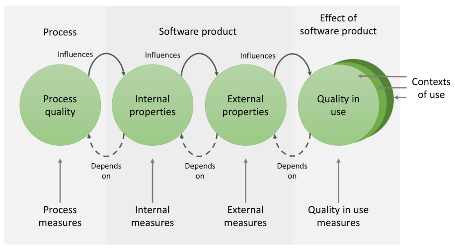

# Software Metrics and Code Analysis Tools

<blockquote class="pretty">
The problem with quick and dirty...is that dirty remains long after quick has been forgotten.
</blockquote>

Steve McConnell

## ISO 25000 Systems and software Quality Requirements and Evaluation (SQuaRE)

To produce a high-quality output requires two complementary elements. The obvious one is
that the product itself must conform to certain agreed standards. However, that can only
be guaranteed if the processes by which the product is produced are clearly defined and
carefully followed. That is the second element. With a carefully designed process, the
quality characteristics of the product can be checked at various important stages in its
life cycle. In addition, sticking to a specified process ensures that those activities that
contribute to the final quality of the product are carried out correctly.

[ISO 25000](https://iso25000.com/index.php/en/iso-25000-standards) is a coordinated set of
standards related to the quality of software products which summarise the relationships
between different quality aspects and their measurements as shown in Fig. 1.

*Fig. 1: Relationship between types of quality measures [ISO 25023](https://napier.primo.exlibrisgroup.com/permalink/44NAP_INST/19n0mho/cdi_bsi_primary_000000000030280200)*

In the last section, we discussed internal and external properties of code and related
quality criteria and standards. The next logical question is when and how the appropriate
checks need to be performed. As illustrated in Fig. 1, both internal and external properties
depend on the processes that were used to create them. That includes project-level processes
for the allocation and completion of work, life cycle processes and how they are implemented in
an organisation, operational processes represented by standard workflows as well as the
personal processes used by a skilled developer. In these notes, we will be focussing on the
workflow aspects as the interface between the software engineer and the project context.

## External quality criteria

Quality is a very difficult concept to pin down with a definition.
[SEVOCAB](https://pascal.computer.org/) offers three versions from different
sources:

> ### **quality**
>
> (1) degree to which the system satisfies the stated and implied needs of its
> various stakeholders, and thus provides value
> ([ISO/IEC 25010](https://napier.primo.exlibrisgroup.com/permalink/44NAP_INST/19n0mho/cdi_bsi_primary_000000000030215101))
>
> (2) ability of a product, service, system, component, or process to meet customer
> or user needs, expectations, or requirements
> ([ISO/IEC/IEEE 24765](https://napier.primo.exlibrisgroup.com/permalink/44NAP_INST/19n0mho/cdi_bsi_primary_000000000030413573))
>
> (3) the degree to which a set of inherent characteristics fulfils the requirements
> ([PMBOK](https://napier.primo.exlibrisgroup.com/permalink/44NAP_INST/n96pef/alma9923796446002111))

All of these definitions focus on the final product from the point of view of the
customer. In that sense, quality can only be evaluated with reference to the
*external properties* of the system which include, for example:

* **Reliability**:
  The degree to which a system, product or component performs specified functions
  under specified conditions for a specified period of time
  ([ISO/IEC 25010](https://napier.primo.exlibrisgroup.com/permalink/44NAP_INST/19n0mho/cdi_bsi_primary_000000000030215101))
* **Security**:
  Protection against intentional subversion or forced failure
  ([ISO/IEC 15288](https://napier.primo.exlibrisgroup.com/permalink/44NAP_INST/19n0mho/cdi_bsi_primary_000000000030433813))
* **Maintainability**:
  The degree of effectiveness and efficiency with which a product or system can be
  modified by the intended maintainers
  ([ISO/IEC 25010](https://napier.primo.exlibrisgroup.com/permalink/44NAP_INST/19n0mho/cdi_bsi_primary_000000000030215101))
* **Portability**:
  The ease with which a system or component can be transferred from one hardware or
  software environment to another
  ([ISO/IEC 24765](https://napier.primo.exlibrisgroup.com/permalink/44NAP_INST/19n0mho/cdi_bsi_primary_000000000030346267))
* **Usability**:
  The degree to which a product or system can be used by specified users to achieve
  specified goals with effectiveness, efficiency and satisfaction in a specified
  context of use
  ([ISO/IEC 25010](https://napier.primo.exlibrisgroup.com/permalink/44NAP_INST/19n0mho/cdi_bsi_primary_000000000030215101))

External properties describe the operation of the whole system and therefore need
to be evaluated at the system level. That is, the system has to be tested in use.
This system-level testing is explicitly captured in the
[V life cycle model](../unit3_agile/Week03a_lifecycle.md#the-v-model) where it is paired with the
analysis phase of the waterfall. This type of quality testing is relevant for any
software development project including those that use an agile approach. The
derivation of external quality criteria and their evaluation is discussed in more
detail in the [requirements modelling](Week11a_requirements_modelling.md) section.

## Internal quality criteria

While the external properties of a software product are those that are visible to
the client, they depend to a large extent on the *internal properties* of the code.
These are aspects of the code that can be verified by static analysis or inspection.
For example, code that is easy to read will necessarily be easier to maintain.
Similarly, code that is systematically tested will be more reliable.

Some languages such as Python require code to be laid out and indented in a
particular way and this acts as a quality control. Other languages such as C# allow
the developer more freedom. In that case, a set of best-practice conventions may
evolve around the particular language, and organisations may go further and create
an internal set of coding standards that developers are expected to follow.

As well as indentation rules, coding conventions can cover other aspects of the
code including

* Acceptable names for variables, functions, classes, namespaces, etc.
* Use of comments
* Use of whitespace
* Preferred methods where alternatives exist
* Exception handling
* etc.

If you are working with the same language on a regular basis, you will gradually
become aware of the recognised best practices in that context. They are occasionally
documented as is the case for
[C#](https://learn.microsoft.com/en-us/dotnet/csharp/fundamentals/coding-style/coding-conventions)
and they are often referred to in technical forums such as
[Stack Overflow](https://stackoverflow.com/questions/14973642/how-using-try-catch-for-exception-handling-is-best-practice).
This illustrates the dynamic nature of code conventions: an authority such as
Microsoft may set out their expectations and update them over time as the language
itself develops, and in parallel with that, a further set of preferences will
evolve among the user community.

## Code weaknesses

Building on the CWE database, the [Object Management Group (OMG)](https://www.omg.org/)
has created a standard for automatic identification of code weaknesses based on
measures that can be taken from static code analysis. The standard has been adopted by
the ISO as [ISO 5055](https://www.it-cisq.org/standards/code-quality-standards/). The
standard is used by tools that check code automatically and alert the developer as
they go along. Such tools treat the number of occurrences of weakness patterns as
*metrics* whose value is an indication of code quality. A metric is simply something that
can be measured, and some metrics are more useful than others. For example, a very easy
metric often used in software development projects is the number of lines of  code, or
more often, thousands of lines of code (KLOC). However, Bill Gates once commented that

> Measuring programming progress by lines of code is like measuring aircraft building
> progress by weight
>
> [Stephens, 2022, Ch. 15](https://learning.oreilly.com/library/view/beginning-software-engineering/9781119901709/c15.xhtml)

The metrics that you use in any situation have to be genuinely meaningful.
Stephens provides the following criteria for choosing a good metric (which with some small
reordering abbreviates to MORSE):

> **Simple**: The easier the attribute is to understand, the better.
>
> **Measurable**: For the attribute to be useful, you must measure it.
>
> **Relevant**: If an attribute doesn't lead to a useful indicator, there's no point
> measuring it.
>
> **Objective**: It's easier to get meaningful results from objective data than from
> subjective opinions. The number of bugs is objective. The application's “warmth and
> coziness” is not.
>
> **Easily obtainable**: You don't want to realize the team members’ fears by making them
> spend so much time gathering tracking data that they can't work on the actual project.
> Gathering attribute data should not be a huge burden.
>
> [Stephens, 2022, Ch. 15](https://learning.oreilly.com/library/view/beginning-software-engineering/9781119901709/c15.xhtml)

## Further reading

* Trends and Findings in Measuring Software Quality Metrics in the Industry
  [Falco & Rabiolo, 2022](https://doi.org/10.1109/ARGENCON55245.2022.9939935)
