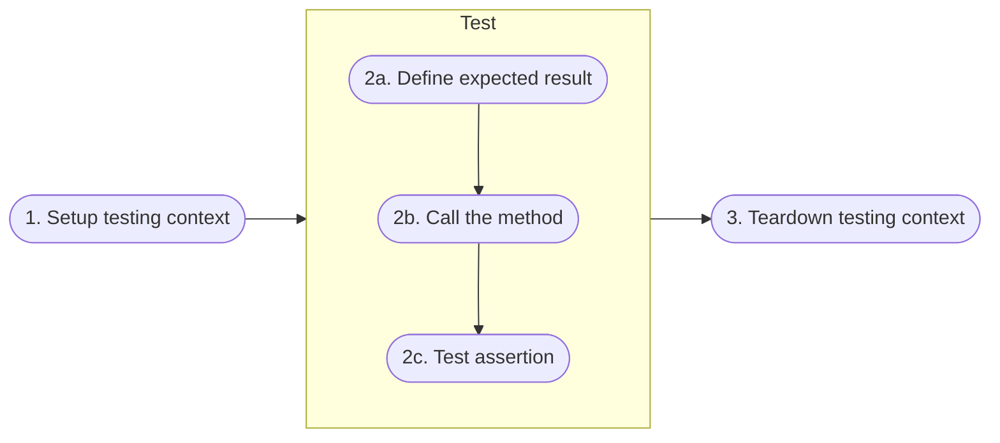
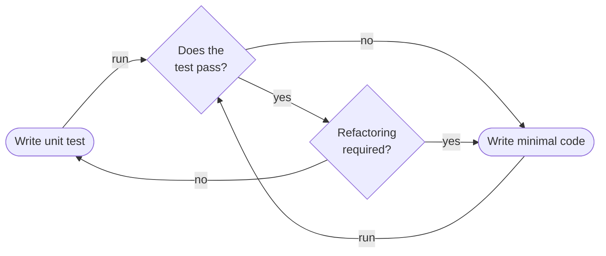

# Test-driven development

<hr class="splash">


### More than the act of testing, the act of designing tests is one of the best bug preventers known.

<br/>

*Boris Beizer*

<hr class="splash">


###### Contents

1. [Unit testing](#unit-testing)
2. [How many unit tests?](#how-many-unit-tests)
3. [Anatomy of a unit test](#anatomy-of-a-unit-test)
4. [Test-driven development](#test-driven-development)
5. [Further reading](#further-reading)

## Unit testing

The naive way to write software is to plan for the best of all possible worlds where nothing
ever goes wrong. One of the best reality checks for that approach is exposing code to users
who invariably behave in ways that seem completely incomprehensible to the developer. It then
becomes suddenly clear that there are many more checks that need to be done, exceptions to
be handled and orientation to be provided if the software is going to perform its function
successfully. The best-case, optimistic route through the software is sometimes called the
[*happy path*](https://en.wikipedia.org/wiki/Happy_path). Focusing exclusively on the
happy path in testing means that many potential errors will be overlooked.

The software engineer is responsible for ensuring that the code they produce is as robust as
possible. That level of quality follows partly from a principled approach to software design.
However, that is not enough to ensure that the code will work under all possible input conditions.
The only way to have confidence that it will do so is to test it thoroughly through *unit tests*.
These are so called because they are supposed to test the code at the unit level - that is,
the level of the individual method (or function) where the functionality cannot be broken down
any further. The idea is that the smaller and simpler a piece of code it, the easier it is to
verify that it works correctly through unit testing. That is because each corresponding test
will be simple and easy to understand. Unit tests can be run manually, but a better way is
to take advantage of modern tools that allow you to automate your tests. They can then be
managed along with the rest of the codebase and can be run repeatedly by any member of the
development team.

## How many unit tests?

A typical method will have an acceptable range of inputs depending on its
parameters, and an acceptable range of outputs. The ideal unit test would ensure that the
code produces expected output for every possible combination of parameter values. This is not
always possible, however, because integer parameters, for example, have a theoretically
infinite range. In practice, it is more feasible to concentrate on *typical* and *boundary*
cases. Typical values correspond to the happy path where everything works as planned, and the
boundary (or *edge*) cases represent the extreme or exceptional values that parameters might
take. A good example of an exceptional value would be where the argument has not been correctly
set and the parameter therefore has a null value. The number of tests required therefore
increases with the number of parameters.

When the method is implementing an explicit behaviour, there may be specific
checks that can be carried out and these checks could also be cartured in unit tests. For
example, the method might be part of an ecommerce system which has a limit on the total cost
of an order. One or more unit tests could be used to ensure that the value limit is never
exceeded as items are added to the shopping basket. The general point is that a single method
is likely to have several associated unit tests.

## Anatomy of a unit test

The overall process of carrying out a unit test is visualised in Fig. 1.



*Fig. 1: Unit test structure*

### 1. Setup

Most methods rely on data provided by other parts of the application to provide the context
in which they run. However, the point of a unit test is to test the unit in isolation, and to
do that, the first stage in the process has to be to create a realistic working context.
This can involve

* loading a database with a specific known set of data
* erasing a hard disk and installing a known clean operating system installation
* copying a specific known set of files
* the preparation of input data as well as set-up and creation of mock objects

([Wikipedia](https://en.wikipedia.org/wiki/Test_fixture))

A mock object is something that is created purely for the puroses of the test to simulate
the existence of a real software object. For example, if the software under test was a bus
tracker application it would receive its data from the bus company's API. Certain functions
would only be triggered for certain combinations of API data. To avoid the need to wait for
such conditions to appear naturally, a mock API could be used that was specifically
designed to deliver the required data continuously or at regular intervals. The following terms
define slightly different temporary objects for testing:

> _**Fake**_: A fake is a generic term that can be used to describe either a stub or a mock
> object. Whether it's a stub or a mock depends on the context in which it's used. So in other
> words, a fake can be a stub or a mock.
>
> _**Mock**_: A mock object is a fake object in the system that decides whether or not a unit
> test has passed or failed. A mock starts out as a Fake until it's asserted against.
>
> _**Stub**_: A stub is a controllable replacement for an existing dependency (or collaborator)
> in the system. By using a stub, you can test your code without dealing with the dependency
> directly. By default, a stub starts out as a fake.
>
> [Microsoft](https://learn.microsoft.com/en-us/dotnet/core/testing/unit-testing-best-practices)

### 2a. Define expected result

A unit test implements a *test case* which maps known inputs to a known output. These known
values are defined at the start of the test.

### 2b. Call the method

The method is called with the defined arguments and the result is captured in a variable.

### 2c. Test assertion

An *assertion* is essentially a test carried out on the result returned by the method under
test. Unit testing frameworks provides various types of assertion statement, but the most
common is the assertion of equality between the returned value and the expected value.
The example C# code in Fig. 2 illustrates the use of the `Assert.AreEqual()` test.

``` C#
using Microsoft.VisualStudio.TestTools.UnitTesting;
using System.IO;
using System;

namespace HelloWorldTests
{
   [TestClass]
   public class UnitTest1
   {
      private const string Expected = "Hello World!";
      [TestMethod]
      public void TestMethod1()
      {
         using (var sw = new StringWriter())
         {
            Console.SetOut(sw);
            HelloWorld.Program.Main();

            var result = sw.ToString().Trim();
            Assert.AreEqual(Expected, result);
         }
      }
   }
}
```

*Fig. 2: Example unit test in C#*

> #### Notes
>
> **Line 1**: Unit testing functions are defined in the
> [Microsoft.VisualStudio.TestTools.UnitTesting](https://learn.microsoft.com/en-us/dotnet/api/microsoft.visualstudio.testtools.unittesting?view=visualstudiosdk-2022) namespace.
>
> **Line 7**: This annotation is required when using
> [MSTest](https://learn.microsoft.com/en-us/visualstudio/test/using-microsoft-visualstudio-testtools-unittesting-members-in-unit-tests?view=vs-2022)
> in Visual Studio.
>
> **Line 10**: This line defines the expected output
>
> **Line 11**: This annotation is required by MSTest
>
> **Lines 17 & 19**: The method under test is called and the output captured in the `result`
> variable.
>
> **Line 20**: An assertion is used to test whether the expected and actual values are the same.

### 3. Teardown

After the test has been run, any fixtures that were created in the first stage need to be
removed. This process is commonly called `teardown`, although some frameworks use different
terminology. MSTest, for example, uses *assembly* and *cleanup* instead of *setup* and
*teardown*.

## Good practice for unit tests

### Test names

The clean code practice of using clear an unambiguous names for tests is very
useful here - it helps to identify exactly what has gone wrong if a test fails. For example,
we could imagine calling the maximum value test something like `TestMaxBasketValue()` and
for a while, we might remember what that meant. Once it was just ine test among hundreds,
it would help to give it a more descriptive name such as
`TestBasketValueDoesNotExceedMaxValueLimit()`. The inconvenience of typing in a long name
(once), is easily outweighed by the way it explains what has gone wrong when the test
fails unexpectedly.

[Microsoft](https://learn.microsoft.com/en-us/dotnet/core/testing/unit-testing-best-practices)
recommends that test names should have three parts:

* The name of the method being tested.
* The scenario under which it's being tested.
* The expected behavior when the scenario is invoked.

### Avoid using magic strings

A magic string is a hard-coded literal used with no explanation. The problem with them
is that they fail to communicate what the test is trying to achieve. If another developer
has to spend valuable time working out what the test is doing, it is not well-written.

### KISS

Unit tests should test one thing in a simple manner. That means keeping the number of
assertions to a minimum - ideally just one - and avoiding complex control structures such
as loops and conditionals.

## Test-driven development

Over time, testing has become increasingly formalised as part of the development process. In
the past, a lot of faulty code was released because developers were under pressure to complete
their projects by a deadline and testing seemed to be a supplementary activity that could be
cut from the project if necessary. The waterfall development lifecycle seemed to encourage
this way of thinking because it postponed testing until the last stage of a project. (This
was not actually true of the waterfall approach, but that was how it was perceived).

The ultimate turnaround came with the introduction in 1999 of *test-driven development* (TDD)
as part of [Extreme Programming](https://en.wikipedia.org/wiki/Extreme_programming). Kent Beck,
one of the signatories to the Agile Manifesto, published a
[book](https://napier.primo.exlibrisgroup.com/permalink/44NAP_INST/n96pef/alma9923574478202111)
on the topic in 2003.

There are two main principles behind TDD. The first is that tests are written first and then
minimally sufficient code is written to allow the test to pass. The process the continues in
an iterative fashion until the application meets its acceptance criteria. The second principle
is that code is continuously refactored as the development proceeds to maintain a clear and
simple structure. The process is visualised in Fig. 3.


*Fig. 3: Test-driven development*


TDD is explained very well in the context of C# development in chapter 6 of
Alls ([2020](https://napier.primo.exlibrisgroup.com/permalink/44NAP_INST/n96pef/alma9923706264502111)).
Please read the chapter this week.


## Further reading

* Software Testing [(O'Regen, 2022, Ch. 8)](https://link-springer-com.napier.idm.oclc.org/chapter/10.1007/978-3-031-07816-3_8)
* [TDD vs BDD vs ATDD and other Agile development techniques](https://www.techtarget.com/searchsoftwarequality/tip/TDD-vs-BDD-vs-ATDD-and-other-Agile-development-techniques)
* Test-driven development [(Beck, 2003)](https://napier.primo.exlibrisgroup.com/permalink/44NAP_INST/n96pef/alma9923574478202111)
* [Unit testing best practices with .NET Core and .NET Standard](https://learn.microsoft.com/en-us/dotnet/core/testing/unit-testing-best-practices)
