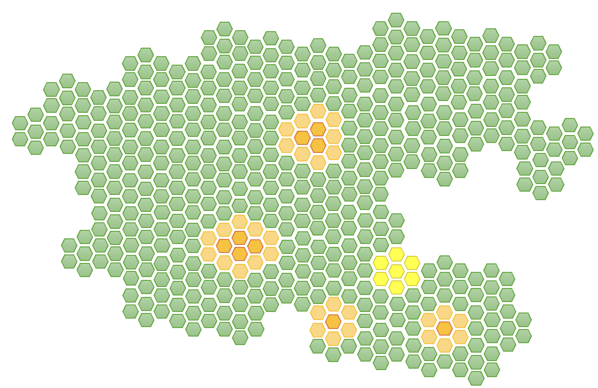

# Types of testing

Although unit testing is of the most immediate concern to developers, there are other
types of testing that it is important to be aware of. Some of the traditional categories
are less relevant in the age of devops, but they are nevertheless still in common use. As a 
reference, Fig. 1 illustrates the concept of unit testing in a schematic way: green hexagons
represent code units in an existing codebase and yellow hexagons represent code units that have 
been introduced or modified by the developer. Unit testing is confined to the units that have
actually been changed.

{: standalone #fig1 data-title="Codebase with modified units" }

## Integration testing

integration testing focuses on verifying that different components or modules of the application 
work together as intended. Unlike unit tests, which isolate and test individual functions or 
classes, integration tests assess the interactions and data flow between multiple parts of the 
system as illustrated in Fig. 2. The goal of integration testing is to identify issues that may 
arise when components are combined, such as data mismatches, unexpected behaviours, or failures due 
to complex dependencies.

{: standalone #fig2 data-title="Integration testing" }

When developing an application, it’s common to divide code into smaller units that handle specific 
tasks, such as managing database queries, processing user input, or handling API requests. Each of 
these units may work correctly on its own, as verified by unit tests, but when integrated with other 
components, unexpected behaviours can occur. Integration testing identifies these issues early by 
verifying that components interact smoothly, produce the correct results, and handle data exchanges 
properly. For example, an integration test might verify that the user authentication system interacts
correctly with the database, or that a payment processing service communicates successfully with an 
external API to complete transactions.

Integration testing differs from unit testing in its scope and complexity. While unit testing 
isolates each function or method to validate that it works as expected in a controlled environment, 
integration testing examines how multiple units function together, often involving real or mock 
databases, network calls, or external systems. Integration tests are generally more complex and 
slower to execute than unit tests because they involve multiple components and sometimes require 
setup for dependent systems. Integration tests are typically run in a controlled environment that 
closely resembles the actual deployment setup, where dependencies—such as databases, APIs, and other 
services—are available for components to interact with. Integration tests differ from unit tests in 
scope, as they focus on interactions between components rather than isolated functionality.

For a developer, integration testing is essential to ensure that code functions properly in the 
larger application context, helping catch issues that unit tests cannot detect. It provides a 
critical bridge between unit tests, which focus on isolated functionality, and end-to-end tests, 
which verify the entire system from a user perspective. Integration testing gives developers 
confidence that their code will perform reliably when interacting with other parts of the system, 
reducing bugs and improving the overall stability of the application.

## End-to-End Testing

End-to-end (E2E) testing is a type of software testing that verifies the complete functionality of 
an application by testing the entire workflow from start to finish, as a user would experience it. 
Unlike unit tests, which focus on isolated pieces of functionality, and integration tests, which 
check interactions between specific components, E2E tests examine the application as a whole. They 
simulate real-world scenarios by interacting with the software’s user interface, databases, APIs, 
and other services, to ensure that all parts of the system work together seamlessly to meet user 
requirements.

In an E2E test, the testing process begins with a user action, such as logging into an application 
or adding an item to a shopping cart, and follows each step through to the expected outcome, such 
as a successful login or an order confirmation. The purpose of these tests is to confirm that each 
step in the workflow functions correctly and that the user experience remains smooth and error-free. 
This approach is particularly important for catching issues that arise from dependencies across the 
entire system, such as data flow between the frontend and backend, interactions with external 
services, or complex multi-step processes.

E2E testing is often automated to ensure consistency and efficiency. Tools like 
[Selenium](https://www.selenium.dev/), [Cypress](https://www.cypress.io/), 
and [Playwright](https://playwright.dev/) are commonly used to script and run these tests, as they 
can simulate real user interactions with the application, including clicks, form submissions, and 
navigation. Automated E2E tests are typically integrated into the CI/CD pipeline, so they run 
whenever code changes are made, allowing developers to catch issues early in the development cycle.

One of the biggest advantages of E2E testing is that it validates the full functionality of an 
application in conditions similar to those experienced by end-users. This makes E2E testing highly 
effective at identifying issues that may not be evident in unit or integration tests, such as UI 
bugs, data formatting issues, or sequence-related errors. E2E tests also help ensure that any 
changes to the codebase do not negatively impact the user journey or break critical paths in the 
application.

However, E2E testing can be more time-consuming and resource-intensive than other forms of testing. 
Because these tests simulate real user interactions and involve multiple layers of the application 
stack, they tend to take longer to execute. Additionally, E2E tests can be sensitive to 
environmental factors, such as network delays or system configurations, which can lead to test 
flakiness. For this reason, E2E testing is typically used to validate the most critical user 
workflows rather than to cover every detail of the application.

In the software development lifecycle, E2E testing is an essential final step that verifies the 
application’s functionality, reliability, and usability from a user’s perspective. By validating 
that the complete system works as expected, E2E tests provide a high level of confidence before 
code is deployed to production, ensuring that users receive a seamless and fully functional 
experience.

## Regression testing

Regression testing focuses on ensuring that recent changes or additions to the codebase haven’t 
inadvertently affected existing functionality. In contrast to unit testing, regression testing is 
the process of re-running tests — often a comprehensive suite of tests as illustrated in Fig. 3, 
including unit tests, integration tests, and end-to-end tests — to ensure that recent code changes 
have not inadvertently affected existing functionality. In an active development environment, each 
of changes to the codebase carries the risk of introducing unintended side effects, especially in 
larger, interconnected systems where components rely on each other’s behaviour.

{: standalone #fig3 data-title="Regression testing" }

Regression testing addresses this risk by re-running previously written tests that cover existing 
functionality after each significant code change. These tests verify that the core functionalities 
still work as expected, confirming that new code hasn’t broken something that was previously 
working. For example, if a developer modifies a feature related to user login, regression testing 
would involve running all relevant tests that verify the login process, as well as any tests that 
indirectly depend on it, like those involving user permissions or account management.

Automated testing frameworks are commonly used for regression testing, allowing tests to be run 
quickly and consistently as part of the build or deployment process. Continuous Integration (CI) 
tools can trigger regression tests automatically whenever changes are pushed to the codebase, 
enabling the team to catch issues early. Running automated regression tests provides the team with 
immediate feedback, giving developers confidence that their changes haven’t introduced new bugs. 
In cases where issues are detected, regression testing pinpoints exactly which functionalities 
have been affected, making it easier to identify the root cause.

## Load testing

During development, software engineers work with small amounts of data, and only a handful
of users are accessing the system at any one time. Once the system is deployed, there will
typically be much more data and many more simultaneous connections. To ensure that the
system will be able to withstand the increased workload, *load testing* can be used to
simulate realistic traffic levels. Sometimes called *soak testing*, it is not usually carried
out by software engineers, but if any problems are discovered with the way the software is
built, it will be the software engineers who need to fix it.

## Security testing

To ensure that the system is safe from attack and that the data cannot be accessed without
authorisation, various types of security testing can be used. These can include automated
tests using tools such as
[SonarQube](https://www.sonarsource.com/lp/solutions/security/?utm_source=bing&utm_medium=paid&utm_campaign=SQ-EMEA-Generic&utm_term=security%20testing&utm_content=SAST&msclkid=7c0d61766bf81327e29704553152e093)
or manual [penetration testing](https://www.ncsc.gov.uk/guidance/penetration-testing)
carried out by security professionals. Although this type
of test is not carried out by software engineers, they are again the ones who will be
required to fix any issues. In general, it is better to avoid security issues by adopting
secure development practices from the outset by adopting sound development practices.

## Usability testing

While they are working on an application, software engineers become so familiar with its
design and structure that the style of the pages, the process flows and the data structures
seem obvious. The operation of the system may not be as straightforward to end users who do not
have the benefit of knowing its inner workings. *Usability testing* aims to discover any
weaknesses in the user interface that might make it difficult to operate for an ordinary
user. To be effective, this type of testing has to be carried out with the participation of
real people.

## Accessibility testing

While usability focuses on the design choices that the software engineers have made in the
construction of the system, *accessibility* is concerned with the support for disabled
users. The most significant issue is whether the system works with a screen reader, but there
are many other guidelines for creating accessible software that are not obvious to those with
no sensory or physical impairments.

The most widely-used set of rules for software accessibility is the
[Web Content Accessibility Guidelines](https://wcag.com/resource/what-is-wcag/)
(WCAG) published by the World Wide Web Consortium (W3C). W3C provide
[guidance on how to perform accessibility testing](https://www.w3.org/WAI/test-evaluate/) either
in the form of participatory sessions as with usability testing,or through the use of technical
tools that examine the structure an capabilities of the user interface. Automated testing
is possible for web applications because their user interface is rendered in HTML which can
be easily scanned. Some vendors of development tools such as
[Microsoft](https://learn.microsoft.com/en-us/windows/win32/winauto/inspect-objects)
provide their own inspection tools for testing the accessibility of code during development.

## Acceptance testing

Acceptance criteria are defined for each user story in a development project when it is
elaborated prior to development. These criteria set out explicitly when the development
task can be considered to be *done*. By this means, the software engineers attempt to
ensure that the user's needs as expressed in the original user stories are implemented
correctly. However, those intentions still need to be tested with the users themselves.

Although the ultimate aim of acceptance testing is to ensure that the final product is
complete and conforms to the original requirements, it is not necessary to wait until
the end of the project to carry out acceptance testing. It can be integrated into the
flow of the project just like other types of testing. This embodies agile
principles 1, 3, 4 and 7:

> **1**: Our highest priority is to satisfy the customer through early and continuous
> delivery of valuable software.
>
> **3**: Deliver working software frequently, from a couple of weeks to a couple of months,
> with a preference to the shorter timescale.
>
> **4**: Business people and developers must work together daily throughout the project.
>
> **7**: Working software is the primary measure of progress.

{: .tip-title }
> [<i class="fa-regular fa-lightbulb"></i> Pitfalls to avoid with integration, end-to-end and regression testing](types_tips)

## Further reading

* Testing ([Stephens, 2022, Ch. 13](https://learning.oreilly.com/library/view/beginning-software-engineering/9781119901709/c13.xhtml))
