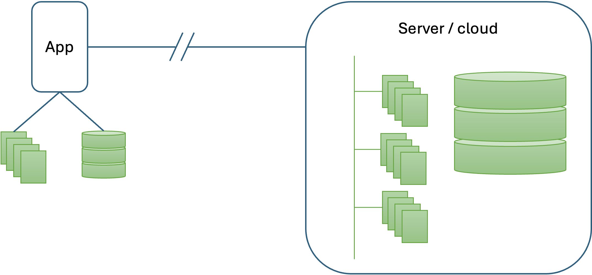
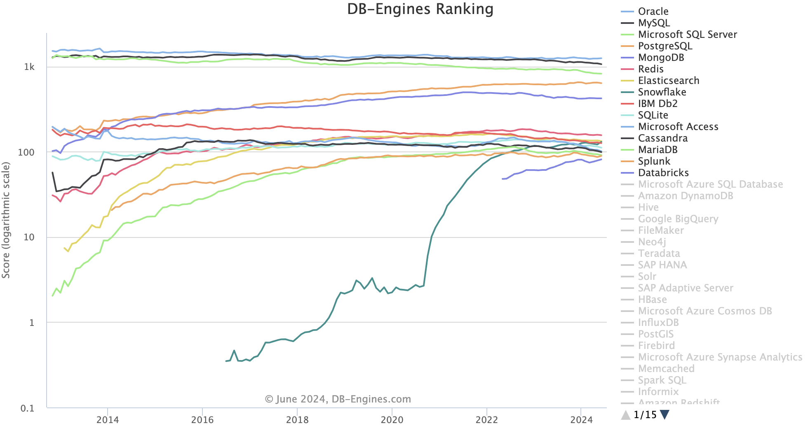
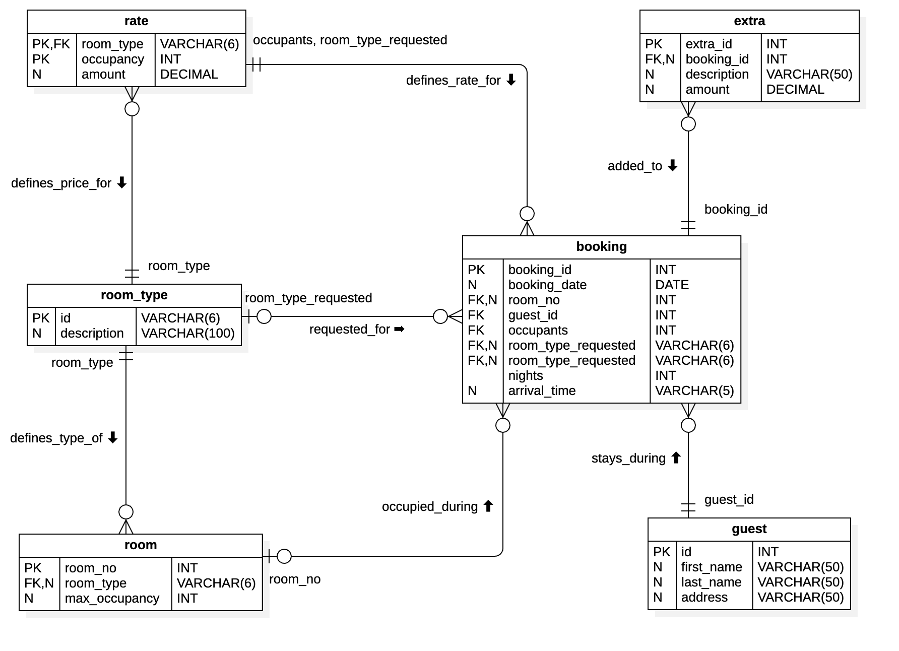
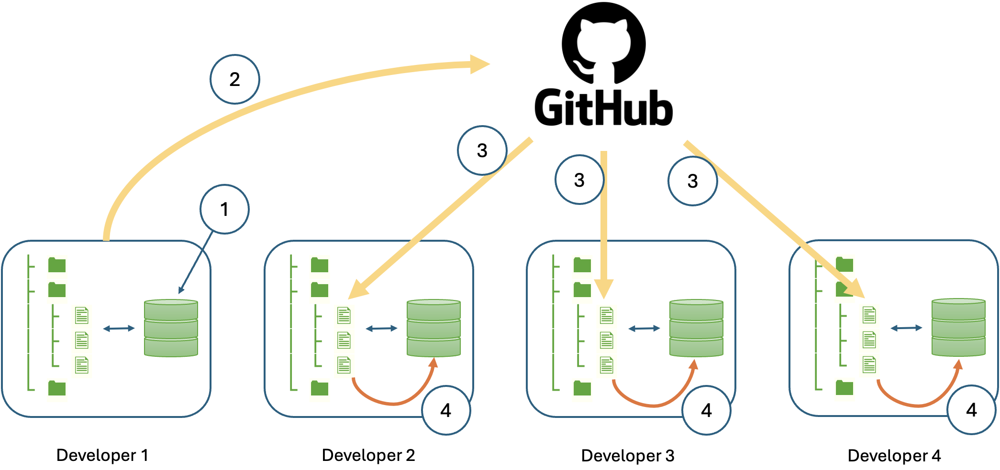
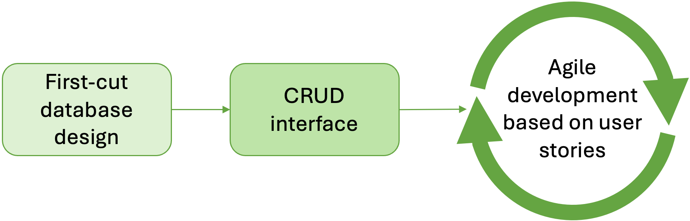
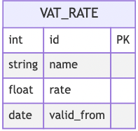
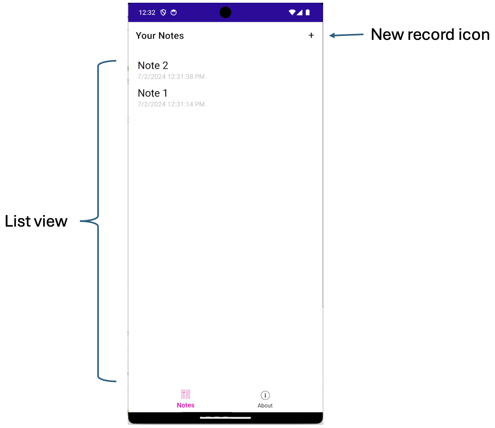

# Data-driven applications

All applications have to deal with data in one way or another and most of them need data that 
persists from one execution of the application to the next. Choosing the right option for persistent 
data storage depends on various factors including data structure, access patterns, scalability 
requirements, transaction needs, and so on. The main choices are between file system storage or a 
database, and whether the data is stored locally or on a remote server as illustrated in Fig. 1.

{: standalone #fig1 data-title="Application storage options" }

### File system

File system storage is a good choice when dealing with large, unstructured data files such as images, 
videos, documents, and log files that need to be stored and accessed efficiently. It is particularly 
suitable for applications that require scalable storage solutions with easy access to files, such as 
content management systems, media streaming platforms, and backup solutions. File system storage is 
also beneficial for scenarios where high throughput and quick retrieval of large files are necessary. 
Additionally, it provides a cost-effective way to store massive amounts of data, particularly when 
integrated with cloud-based services like Amazon S3 or Google Cloud Storage, which offer robust, 
scalable, and durable file storage solutions.

### Local database

A local database is ideal when data needs to be accessed quickly and reliably on the same device 
where the application is running. This is particularly useful for mobile applications, desktop 
applications, and embedded systems that require offline functionality, allowing users to continue 
working without an internet connection. Local databases, such as SQLite, offer lightweight, 
self-contained storage with minimal setup and maintenance, making them suitable for applications 
with relatively small to moderate data storage needs and straightforward querying requirements. 
They are also beneficial for reducing latency in data access and ensuring data persistence in 
environments where network connectivity is unreliable or bandwidth is limited. Additionally, local 
databases can be used to cache data for performance improvements in applications that primarily 
interact with a remote database but need quick access to frequently used data.

### Central (shared) database

A shared database is an optimal storage solution for a software application when multiple users or 
systems need concurrent access to the same set of data, ensuring consistency and synchronization 
across different platforms. This is particularly beneficial for web applications, enterprise systems, 
and collaborative tools where real-time data sharing and updates are crucial. Shared databases 
enable centralized data management, making it easier to maintain data integrity, enforce security 
policies, and perform analytics across the entire dataset. They support robust transactional 
capabilities and can handle complex queries and relationships, which is essential for applications 
requiring ACID properties. Furthermore, shared databases facilitate scalability, allowing the 
application to grow and accommodate more users and data without compromising performance. By using 
a shared database, organizations can streamline operations, enhance collaboration, and provide a 
unified view of critical information to all stakeholders.

### Relational vs NoSQL databases

Relational databases offer strong consistency and data integrity through ACID transactions, making 
them suitable for applications with complex relationships and transactional requirements, such as 
financial systems and e-commerce platforms. Their structured schema and SQL query language enable 
powerful querying capabilities, making it easier to perform complex joins and aggregations. 
Relational databases also have a mature ecosystem with robust tools for backup, recovery, and 
management, making them reliable choices for mission-critical applications where data accuracy 
and reliability are paramount.

On the other hand, NoSQL databases provide greater flexibility and scalability for handling large 
volumes of unstructured or semi-structured data, such as in web applications, IoT platforms, and 
real-time analytics. They support eventual consistency models, allowing for distributed systems and 
horizontal scalability across multiple nodes. NoSQL databases are well-suited for use cases 
requiring high availability, rapid development cycles, and handling diverse data formats. They 
excel in environments where schema flexibility, performance, and scalability are prioritized over 
rigid data consistency models typical of relational databases. Moreover, NoSQL databases often 
integrate seamlessly with modern development practices and cloud-native architectures, enabling 
agile development and deployment of applications at scale.

Despite the advantages of NoSQL databases, they come with some drawbacks. Ensuring data consistency, 
for example, can be more complex due to the eventual consistency models typically used in NoSQL 
databases. It becomes the developer's responsibility to implement custom logic for conflict 
resolution and managing data integrity. Another drawback is the potential for increased application 
complexity when dealing with denormalized data structures. This can lead to data redundancy and 
additional effort in maintaining consistency across distributed systems. Moreover, while NoSQL 
databases excel in scalability and performance, achieving these benefits often requires careful 
consideration of data modelling and indexing strategies, as well as trade-offs between consistency 
and availability.

The remainder of these notes will focus on the relational model. An additional motivation for this 
is the relative dominance of the relational model as illustrated in Fig. 2 where the top four 
engines are relational. Thus the market share of the most popular NoSQL database, MongoDB, is 
very small in comparison. Note that the vertical axis uses a logarithmic scale.

{: standalone #fig2 data-title="Popularity of database engines" }

## DB structure recap

The data in a relational database is contained in tables with defined relationships between them. 
Each table has a fixed set of columns of known datatypes and a series of rows each of which 
represents a single entity of the type defined by the table. Each row in a table is uniquely 
identified by a _primary key_ which can be a single column or a combination of columns. A 
one-to-many relationship between tables is represented by a _foreign key_ in the child table. 
The value of the foreign key matches the primary key of the related row in the parent table. 
Fig. 3 shows an entity-relationship diagram (ERD) that defines the tables used in a simple hotel 
management system.

{: standalone #fig3 data-title="A simple hotel management database" }

In Fig. 3, tables are represented by boxes and relationships between tables by lines. The diagram 
uses the [crow's foot](https://vertabelo.com/blog/crow-s-foot-notation/) conventions in which the 
symbols at the end of the relationship lines define how many entities of each type participate in 
the relationship. For example, the diagram shows that a guest may stay at the hotel during a booking. 
The labels indicate that one guest may have multiple bookings but may not yet have made any bookings, 
and one booking is related to one and only one guest. The crow's foot style of diagram is used 
by [StarUML](https://docs.staruml.io/working-with-additional-diagrams/entity-relationship-diagram) 
and in the [Mermaid](https://mermaid.js.org/syntax/entityRelationshipDiagram.html) markup language, 
but the [official UML notation](https://vertabelo.com/blog/uml-notation/) is slightly different.

### Primary keys

Every table in a relational database should have a defined primary key which uniquely identifies a 
row. The key may be a real piece of data (such as national insurance number) or a meaningless integer 
known as a _surrogate_ or _synthetic_ key. Using integers as identifiers is so common that 
all relational database platforms provide a means of automatically generating a new primary key 
value when a row is inserted into a table. In MySQL, for example, the primary key column can be 
defined with the [AUTO-INCREMENT](https://dev.mysql.com/doc/refman/8.0/en/example-auto-increment.html) 
property while in SQL Server, the column is defined with the 
[IDENTITY](https://learn.microsoft.com/en-us/sql/t-sql/statements/create-table-transact-sql-identity-property?view=sql-server-ver16) 
property. Either way, the effect is the same - when entering the data for a new row in the table, 
the primary key value is supplied by the database engine.

### Foreign keys

In the example database shown in Fig. 3, one room may be occupied during many bookings. In this case, 
the room is the _parent_ record because it appears at the 'one' end of the relationship and the 
booking is the _child_ record because it appears at the 'many' end. The relationship between a 
booking and a room is represented by the foreign key attribute `booking.room_no` whose value matches 
the primary key of the relevant row in the `room` table.

### Challenges

* After creating a new database record, application software may need to perform further 
  processing. If the primary key value was generated by the database engine, it may not be 
  immediately accessible. The developer needs to bear this in mind and include the appropriate 
  steps to find out what the generated value is.
* When inserting a child record, the foreign key value must be populated. Special care may be needed 
  to ensure that the correct value is used.
* When performing data maintenance operations such as updates and deletions referential integrity 
  must be respected. The database engine will not permit a parent record to be deleted, for example, 
  if there are related child records. The application code may therefore have to perform some error 
  checking to ensure that this type of operation is possible without errors.
* During a development project, there are many copies of the database. Each developer has a local 
  copy and there may be several shared instances used for testing. When one developer modifies the 
  database structure during feature development it needs to be replicated on all the other copies of 
  the database to keep them up to date. This can be a complicated process if done manually. For this 
  reason, many technical environments including .NET implement the concept of database _migrations_ 
  to help simplify the process and make it more manageable.

## Migrations

### The problem

In an ideal world, the structure of a relational database would be optimised in advance and would 
remain fixed. In reality, though, it is often necessary to modify the structure over the course of 
a development project. This introduces a new source of conflict since several copies of the database 
may be in use. The challenge is how to ensure that a structural change introduced by one developer 
is replicated across all other copies of the database so that they stay in sync and the code 
continues to work as expected.

To illustrate the problem, consider Fig. 4 which shows a small development team where each 
developer has a local copy of the database. Developer 1 introduces a change to the database 
structure as part of feature development. The developer makes the database change locally, tests 
the code on the new structure and then commits the modified code to the shared repository on GitHub. 
Later, the other developers synchronise their local repositories by pulling the latest code. Every 
developer now has a version of the code that requires the modified database structure; however, 
the databases belonging to developers 2, 3 and 4 have not been changed and the code will therefore 
raise exceptions. The problem is how to achieve the final step 4 indicated by the orange arrows in 
the figure in which the database changes are applied.

{: standalone #fig4 data-title="Visualising the database migration problem" }

* Original change
* Change committed to the repository
* Synchronisation
* Migration 
{: .figure-labels}

### Controlled migrations

The solution adopted on many different technical platforms is to introduce the concept of 
_controlled migrations_. While the details may differ from one platform to another, the general 
features are always the same:

* Generate database update scripts from changes to the model files rather than making the changes 
  directly against the database.
* Generate downgrade scripts at the same time so that a migration can be reverted if necessary.
* Provide a controlled way of running the generated scripts.
* Maintain a record of all changes in sequence from a known baseline version of the database.
* Record the current migration level in the database itself so that its status can be queried 
  for validation purposes.

To solve the immediate problem, generating and applying migration scripts must be incorporated into 
the team workflow. For the developer making the change, the sequence of actions would be something 
like this:

1.  Identify the database change required.
2.  Update the relevant model files.
3.  Generate the migrations script.
4.  Apply the migration script locally.
5.  Update the code and test the changes.
6.  Commit, push and request a review.
7.  Action any changes arising from the review feedback.
8.  Merge and delete the development branch.

For the rest of the development team, the workflow is affected at the point of synchronising their 
local repo:

1.  Sync changes from GitHub.
2.  Check for migration scripts.
3.  Apply migration scripts.

### No free lunch

While the general process is logical, it is very difficult to deal with all of the possible 
complications that can arise. For example, consider the situation where a developer needs to rename 
a column in a table. A typical migration generation tool will parse the model file, discover that 
a column that previously existed has disappeared and that a new column has been added. The script 
will therefore be generated accordingly:

```sql
ALTER TABLE users DROP COLUMN name;
ALTER TABLE users ADD COLUMN full_name VARCHAR(100) NOT NULL;
```

The problem is that if there is already data in the table it will be lost when the original column is 
dropped. There will also be an error when the new column is created since it is defined as NOT NULL. 
To rename the column and retain the data the script would have to do the following:

```sql
ALTER TABLE users ADD COLUMN full_name VARCHAR(100) NOT NULL;
UPDATE users SET full_name = name;
ALTER TABLE users DROP COLUMN name;
```

The actual change required depends on the _intention_ of the developer, and that cannot be deduced 
from the change to the model file alone. It is therefore very important to check any generated script 
files and to make manual modifications if necessary.

A further complication with migrations can arise when two developers make conflicting changes at the 
same time. Conceptually, this is similar to the code merge problem when using a shared repo and again 
the solution is manual intervention. Typically, this would require a developer to apply any committed 
conflicting migrations before their own so that the result is cumulative. More sophisticated tools 
for managing migrations provide methods for identifying and managing such situations, but it is the 
developer's responsibility to stick to the standard workflow so that the necessary steps can be 
taken at the appropriate time.

## CRUD

Whatever the choice of storage technology or platform, there are only four generic operations that 
can be performed. They are summarised by the acronym _CRUD_ which stands for

* **C**reate: data items - such as records or files - can be created. In a relational database, 
  this operation is performed by the `insert` statement.
* **R**ead: data items can be retrieved. In a relational database, this operation is performed in a 
  query using the `select` keyword.
* **U**pdate: existing data items can be modified. In a relational database, this is done with the 
  `update` statement.
* **D**elete: data items can be removed from storage. In a relational database, this requires the 
  use of the `delete` statement.

Regardless of the information captured in user stories during requirements analysis, it is always a 
good strategy to ensure that an application should be able to perform all four basic operations for 
all types of data item in persistent storage. It may not be essential for the end user to be able to 
insert or update records in a given database table, but it is almost guaranteed that the data will 
need to be modified at some point. This might be, for example, because the application administrator 
needs to add a lookup value to a static data table (see section 5), or simply because the developer 
needs easy access to the data during implementation. For these reasons, creating a basic CRUD 
interface for persistent storage as a starting point for further development as illustrated in 
Fig. 5 can be a good strategy.

{: standalone #fig5 data-title="CRUD-first design strategy" }

As well as providing a convenient way to maintain the data as the development proceeds, another 
advantage of the CRUD-first strategy is that the basic pages created to support the CRUD operations 
can make excellent prototypes for more specific interface elements required for the user stories. 
In many web development environments, there are [tools](https://github.com/topics/crud-generator)
that can be used to generate a set of pages that implement CRUD functionality automatically. This is 
possible because the code required is very similar for every table; however, CRUD generators can only 
focus on one table at a time and cannot therefore maintain the relationships between parent and child 
tables.

## ORM

Relational structures and object-oriented structures are superficially similar. However, the table 
below summarises several differences between them which can make it difficult to work with both at 
the same time.

|                     | Objects                                                                                                                                                                                    | Relations                                                                                                                                                                                        |
|---------------------|--------------------------------------------------------------------------------------------------------------------------------------------------------------------------------------------|--------------------------------------------------------------------------------------------------------------------------------------------------------------------------------------------------|
| Data Representation | Objects encapsulate both state (attributes/properties) and behaviour (methods/functions). Objects are instances of classes, which define the data structure and behaviour.                 | Data is represented in tables (relations), where each table consists of rows (records) and columns (attributes). Tables are connected through relationships defined by primary and foreign keys. |
| Schema Design       | The schema is designed based on classes and inheritance hierarchies, supporting encapsulation, polymorphism, and inheritance.                                                              | The schema is designed using normalization principles to reduce data redundancy and improve data integrity, focusing on tables and relationships.                                                |
| Data Integrity      | Data integrity is maintained through encapsulation and the use of methods to control access and modifications to the object's data.                                                        | Data integrity is enforced using constraints such as primary keys, foreign keys, unique constraints, and check constraints.                                                                      |
| Relationships       | Relationships between objects are typically established through references or pointers, allowing direct access to related objects.                                                         | Relationships between tables are established using foreign keys, and data is accessed using SQL queries that join tables based on these keys.                                                    |
| Querying Data       | Data is accessed through method calls on objects, often using object query languages (e.g., HQL, JPQL) or ORM (Object-Relational Mapping) frameworks to translate object queries into SQL. | Data is accessed using SQL queries, which allow for complex querying and manipulation of data across multiple tables.                                                                            |
| Scalability         | Can be more complex to scale horizontally because object graphs need to be managed across distributed systems.                                                                             | Traditionally easier to scale vertically, but can be complex to scale horizontally due to the need to maintain ACID properties across distributed systems.                                       |
| Flexibility         | Offers flexibility in terms of modelling complex relationships and behaviours within the application code.                                                                                 | More rigid in structure, requiring predefined schemas, but excels in handling structured data and complex queries.                                                                               |

As mentioned a couple of times in the table, a common strategy when working with relational 
databases in an object-oriented language is to use an _object-relational mapper_ (ORM). An ORM 
abstracts the idiosyncracies of the relational database behind an access API that object-oriented 
developers find more familiar. As an example, consider the situation where the code needs to look 
up a user record by its primary key. The SQL statement might be

```sql
SELECT * FROM users WHERE id = 100;
```

Using an ORM, this might become

```c#
Users.Find(100);
```

Because it eliminates the need to embed SQL statements into the host coding language, using an ORM 
simplifies the work of the developer and improves the productivity of the development team and the 
maintainability of the resulting code. An ORM tool typically provides a range of other benefits 
beyond the developer's comfort. For example, it often has features for performing database 
migrations as described in section 3. This is true, for example, with 
[Entity Framework](https://learn.microsoft.com/en-us/ef/core/managing-schemas/migrations/?tabs=dotnet-core-cli), 
the standard Microsoft ORM used with .NET.

As with most software tools, using an ORM often represents a trade-off between convenience and 
performance. Because of the layer of abstraction that the ORM introduces, the developer no longer 
has fine control over the way database queries are constructed. Consequently, the queries generated 
by the ORM may not be optimal and may result in lower performance. A specific type of performance 
issue is the [N+1 problem](https://blog.appsignal.com/2020/06/09/n-plus-one-queries-explained.html) 
in which an initial query is followed by a series of other queries in order to retrieve related data. 
In such as case, a hand-crafted SQL statement could return exactly the data required and no more in 
a single trip to the database.

### Lazy and eager loading

When an ORM retrieves data from the database, it has two options: it can either return just the 
object that was initially requested and a set of placeholders for the related data, or it can 
return all of the related data along with the initial object. The first strategy is known as 
_lazy loading_ and can lead to the N+1 problem mentioned above. If the code includes further 
processing such as the iteration over related objects, then lazy loading is a mistake. However, 
it is entirely appropriate in other situations where it is less certain that the related objects 
will be needed.

The second strategy, _eager loading_, ensures that there is only one trip to the database because 
all related data is retrieved in one go. Whether this is a good idea or not depends on what happens 
next. If the object is part of a list for the user to browse, eager loading is perhaps not such a 
good idea. The user may or may not decide to drill down into the related details. If the initial list 
is very long, it is clear that retrieving all related data for every item in the list would require 
a large transfer of potentially unused data, and would also be wasteful in terms of memory. In 
contrast, eagerly loading the data for an item at the point the user selects it from the initial 
list would be a good idea.

The main point is that both strategies are appropriate in different situations, and it is part of 
the developer's job to decide which to use. Every ORM tool will default to either lazy or eager 
loading, and the first step towards being able to control the strategy is knowing what the default 
is. [Entity Framework](https://learn.microsoft.com/en-us/ef/core/querying/related-data/eager) for 
example defaults to lazy loading but provides a mechanism for switching to eager loaded when needed.

## The time dimension

During a development project to create a new application, all database tables may appear to be very 
similar. However, once the application is deployed and being used, the number of rows in certain 
tables will grow quickly while other tables remain relatively small. This is because the two types 
of table fulfil different functions in the database design.

### Dynamic data

Data in tables that grow rapidly is known as _dynamic data_ for obvious reasons. Usually, these 
tables correspond to the core purpose of the application. For example, in an application to process 
travel tickets, the table containing the ticket information itself will grow very quickly since a 
new row is added with every ticket sold.

A major consideration for the application developer is how to manage the maintenance of this type 
of data so as to avoid clashes and errors. In the ticketing system, for example, two people might 
be attempting to book the last available ticket on some journey. Until one of the sales is completed, 
the last ticket appears available to both customers. If both sales are allowed to complete the place 
will be double-booked and the problem will need to be resolved manually. If the system is slightly 
more sophisticated and prevents the second sale from completing because the ticket has been booked 
by the first customer, an error will occur when the second customer tries to complete their purchase.

Relational databases provide ways to handle such clashes using features such as 
[foreign keys](https://bdavison.napier.ac.uk/db/Notes/Entities/intro/) to maintain 
[referential integrity](https://en.wikipedia.org/wiki/Referential_integrity) and 
[transactions](https://bdavison.napier.ac.uk/db/Notes/Transactions/intro/) to protect an 
operation while it is still in progress. However, they are not always easy to accommodate in 
the user interface, and sometimes the issues need to be handled by application code. To prevent 
the disappointment of completing a ticket purchase only to be told that the last ticket has just 
gone to someone else, the user interface might display real-time status information such as the 
number of remaining tickets and whether anyone else is in the process of purchasing them. This 
type of display would require regular polling of the database to update the status information or 
a reactive design that responds automatically to changes at the backend in an event-driven way. 
To accommodate this type of feature, the developer could make use of established 
[design patterns](https://www.freecodecamp.org/news/communication-design-patterns-for-backend-development/) 
such as long polling or publish/subscribe.

### Static data

Tables with comparatively few rows that change very little over time contain _static data_. Their 
purpose is to provide the framework for the application by maintaining reference lists, for example. 
In the case of the ticketing system, the list of destinations will be relatively short compared to 
the number of tickets sold, and it will not change very often. Geographic information such as 
countries and cities is another example of static data. From the point of view of the system 
developer, static data tables provide the source of data for dropdown lists in the user interface 
and can be used to validate user input.

Compared to dynamic data, static data is relatively simple to manage. Nevertheless, there are some 
important aspects of static data to bear in mind. Since static data values may be used throughout 
the application, updating static data is a risky proposition. It could lead to incorrect behaviour 
in the user interface, for example, or it could invalidate historical data. The subject of VAT rates 
provides an interesting case. In the UK, the current standard rate for retail items has been 20% 
since 4th Jan 2011 and many billions of transactions have used that rate. If the rate of VAT were 
to change back to 17.5% as it was before Jan 2011, we would need to update the static data in our 
VAT rate lookup table. However, it must also be possible to perform the correct VAT calculation for 
historical purchases that were made when VAT was 20%. For this reason, we cannot simply update the 
rate because that would make it impossible to perform those historical calculations correctly.

The solution to the problem above is to introduce an explicit reference to time into the structure 
of the static table to show when a particular rate was valid. This is illustrated by the table 
structure in Fig. 6.

{: standalone #fig6 data-title="VAT rate table" }

To find the current rate is simply a question of finding the record with the highest (most recent) `valid_from` value that is earlier than the current date. For historical calculations, the purchase data is compared with the `valid_from` value to select the correct rate. It is important to recognise, however, that maintaining data of this type requires careful management in the application code. Rather than an update statement, a new record would have to be inserted into the VAT rate table:

```sql
INSERT INTO vat_rate (name, rate, valid_from) VALUES ('standard', 0.175, '2025-1-4');
```

## Interface design

It is useful to think of user interface (UI) design in terms of 
[design patterns](https://ui-patterns.com/patterns) which not only save time, but also take 
advantage of existing knowledge to deliver more effective and usable solutions. The sections 
below cover the most important design patterns for data-driven applications.

### List view

An essential requirement in a data-driven application is the ability to view a set of records in 
the form of a list. This is usually very easy to accomplish in most technical environments since 
it is so common. There are many variations on the form that the list can take and some may depend 
on the environment you are working in. In a web environment, for example, a list is typically 
rendered in the form of an HTML table, while the .NET MAUI environment provides the 
[ListView](https://learn.microsoft.com/en-us/dotnet/maui/user-interface/controls/listview?view=net-maui-8.0) 
object.

When thinking about the presentation of a list of records, it is important to consider the user's 
requirements. For some use cases, they may need to 
[filter](https://ui-patterns.com/patterns/TableFilter) or 
[re-order](https://ui-patterns.com/patterns/SortByColumn) the list while under other circumstances 
these additional controls may not be needed. Including features that might never be used would 
violate the [YAGNI](https://martinfowler.com/bliki/Yagni.html) principle.

A central function of the list view is to enable the user to navigate to the specific record they 
want. Once there, they should be able to view the details of that record, and this can be 
accomplished in several different ways. The first is the 
[one-window drilldown](https://learning.oreilly.com/library/view/designing-interfaces/0596008031/ch02s03.html#idx-CHP-2-0154) 
pattern in which the user clicks on the record and the list view is replaced by a single record 
view (see below). Most data maintenance operations can be performed in the single record view with 
the exception of record creation. Another essential feature of a list view presentation is therefore 
the ability to add a new record to the list. Fig. 7 shows a simple notes application where existing 
notes are shown in a list and a new note is added using the icon in the top right-hand corner of 
the display.

{: standalone #fig7 data-title="List view example" }

In the early stages of a software development project, there may only be a small number of test 
records in the database. At that stage, it is easy to overlook the implications for the interface 
design when the application is in use and the number of records is significantly larger. In that 
later stage, using a simple list view to show the entire contents of a table may not be desirable. 
On the one hand, a large list will be very difficult for the user to navigate. On the other, 
transferring a large amount of data in one go may cause performance issues and will incur network 
costs. It is therefore worth thinking ahead and identifying ways to avoid such future issues.

One strategy that avoids large transfers of data is to use the 
[pagination pattern](https://ui-patterns.com/patterns/Pagination) in which only a specified number 
of records is displayed at any one time. This has the advantage of showing the user how many pages 
are available, but may not be appropriate if the user needs to be able to scroll continuously 
through the whole list. Another strategy to help the user navigate a long list is to enable 
filtering. Here the main implementation consideration is whether the filtering should be done at 
the backend by returning only a subset of the database records, or at the frontend. Filtering at 
the front end has numerous advantages such as the ability to implement reactive lists where the 
list immediately reflects the text entered into the search field. However, that relies on the 
entire dataset being available. There are obvious trade-offs between strategies and choosing the 
right option for your application depends on the needs of your users.

### Single record view

Viewing a single record typically requires some kind of form where the data items are contained in 
labelled fields. As with the list view, this is such a common requirement that it is usually quite 
easy to implement. While there are any number of ways to improve the aesthetics and usability of 
forms, the main purpose of a single record view is to support the CRUD operations. Where the record 
already exists, the page should support _Read_, _Update_ and _Delete_ with appropriate controls 
for those operations. The same form could be used to _Create_ a new record when it is invoked using 
the _create_ feature on the list view in which case, the only control available to the user (apart 
from _Cancel_) is to _Save_ the new record.

When a relationship is defined in a relational database using a primary key/foreign key pair, the 
database engine itself will prevent certain operations in order to safeguard referential integrity. 
In particular, the following operations are forbidden:

* Inserting a child record with no parent (ie no value for the foreign key)
* Updating the foreign key value of the child record to one that does not match a primary key value 
  in the parent table
* Deleting a parent record while there are related child records

{: .note-title }
> <i class="fa-solid fa-triangle-exclamation"></i> Note
> 
> Technically, a foreign key may be defined to allow null values, but that is unusual. In most cases, 
> the relationship is a strong one in which a foreign key value is required.

Although the database engine will enforce these rules, they will appear as errors and the application 
code should be constructed so as to perform sufficient checking to avoid them.

As mentioned in section 6, static data values may be used to populate dropdown lists for a single 
record view page and to perform data validation before the data is stored in the database. Depending 
on the frequency of CRUD operations, it may be efficient to adopt a 
[caching strategy](https://learn.microsoft.com/en-us/dotnet/core/extensions/caching) to optimise 
performance and avoid repeated calls to the database.

### Master-detail

Sometimes it is convenient to present the list of records and the single record view of the current 
record on a single page. This of course is only advisable when there is sufficient space on the 
display and is probably not a suitable approach for mobile applications. In the 
[master-detail pattern](https://blogs.windows.com/windowsdeveloper/2017/05/01/master-master-detail-pattern/) 
(also called the [two-panel selector](https://learning.oreilly.com/library/view/designing-interfaces/0596008031/ch02s03.html#idx-CHP-2-0154)), 
the single record view is synchronised with the current record in the list view. Apart from that, 
the operation of the two views is very similar to the list view and single record view when used in 
isolation.

## Further reading

*   [Microsoft Entity Framework Core documentation](https://learn.microsoft.com/en-us/ef/core/)
*   [UI Design Patterns](https://ui-patterns.com/patterns)
