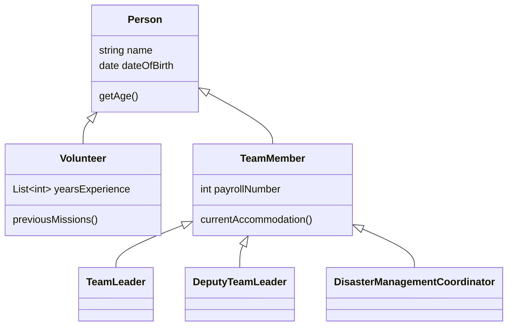
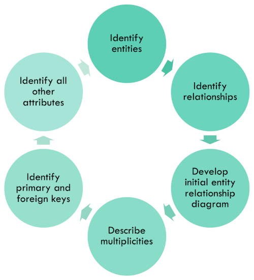
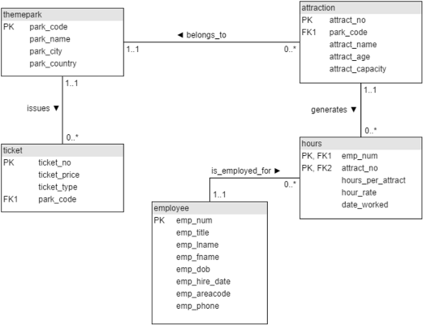

# Design activities

Although some aspects of software design are fairly routine and have simple established
processes that the designer can follow, it is in general a creative process that requires
the application of skill and experience. It should be thought of as an iterative process
just like development where the first version is just good enough. Later versions improve
the design through repeated conversations with the client and the development team.

As a creative process, it is important to keep options open until the later stages. That
is sometimes difficult, as are the creative jumps needed to move from an adequate design
idea to a good one. To help guide the process, it is useful to structure the activities.
One common distinction is between high-level design which focuses on the abstract
description of the system and low-level design which concentrates more on how to
implement the abstract structures and processes. 

## High-level design

One way to think about high-level design is as the part of the process that does not
require any software to be built. Everything at the high level can be described in
abstract terms, typically using appropriate diagrams.

In general, design activities can be split into the categories shown in the following table ([O'Regen, 2022, Ch. 6](https://link-springer-com.napier.idm.oclc.org/chapter/10.1007/978-3-031-07816-3_6)).

| Category                                  | Description                                                                                                                                                                                                                                                                                                                                                                                                                                                                                                              |
|-------------------------------------------|--------------------------------------------------------------------------------------------------------------------------------------------------------------------------------------------------------------------------------------------------------------------------------------------------------------------------------------------------------------------------------------------------------------------------------------------------------------------------------------------------------------------------|
| Architecture design of system             | Definition of all the major components of a system and how they communicate. [Block diagrams](https://en.wikipedia.org/wiki/Block_diagram) are often used to capture system structure at this level.                                                                                                                                                                                                                                                                                                                     |
| Abstract specification of each sub-system | Decomposition of each major component and its description using appropriate methods such as [user stories](https://www.agilealliance.org/glossary/user-stories/), [design patterns](https://napier.primo.exlibrisgroup.com/permalink/44NAP_INST/n96pef/alma9923811554702111), etc.                                                                                                                                                                                                                                       |
| Interface design                          | Specification of how data is exchanged across component boundaries. This includes the *user interface* (UI) as well as software interfaces such as method signatures and APIs. UI design techniques such as [wireframes](https://designerrs.com/what-is-wireframing-in-ui-ux-design/) are often used during the [requirements modelling process](Week11a_requirements_modelling.md) using tools such as [Figma](https://www.figma.com/). API designs can be described with tools such as [Swagger](https://swagger.io/). |
| Component design                          | Detailed design of major components using appropriate methods such as [UML diagrams](https://napier.primo.exlibrisgroup.com/permalink/44NAP_INST/n96pef/alma9923410250502111)                                                                                                                                                                                                                                                                                                                                            |
| Data structure design                     | Data modelling including relational or non-relational database design and the design of structures used for transferring data from one component or system to another.                                                                                                                                                                                                                                                                                                                                                   |
| Algorithm design                          | The design of optimised deterministic routines for a specified purpose. UML sequence diagrams, state charts and activity diagrams are often useful here.                                                                                                                                                                                                                                                                                                                                                                 |

In addition to the items above, in his [chapter 6](https://eu.alma.exlibrisgroup.com/leganto/public/44NAP_INST/citation/6676830220002111?auth=SAML),
Stephens suggests that the following topics should also be covered in high-level design:

* Security including authentication, role-based access and general data protection strategies.
* Hardware, and by extension, the operating environment that the software will run in.
* Reports - that is to say, any formatted output data from the system

## Low-level design

You can think of low-level design as the actual implementation of the high-level design.
It describes *how* things are done rather than *what* needs to be done.
In his [chapter 7](https://eu.alma.exlibrisgroup.com/leganto/public/44NAP_INST/citation/6676830220002111?auth=SAML), Stephens focuses on the two most common design approaches which
are object-oriented design (OOD) and database design. However, he also points
out that there are other complementary perspectives that might be useful. These are
summarised in the table below.

| Approach                | Description                                                                                                                 |
|-------------------------|-----------------------------------------------------------------------------------------------------------------------------|
| Design-to-schedule      | In a time-constrained project, simpler designs might be preferred                                                           |
| Design-to-tools         | The preferred toolset in use might predetermine certain aspects of the design                                               |
| Process-oriented design | This approach models process first and then determines the data structures that are needed. It is not an alternative to OOD |
| Data-oriented design    | This approach prioritises data structure design over processes                                                              |

## Object-oriented design

In OOD, a software system is modelled as a set of interacting software objects, each of
which has associated data (*properties*) and behaviour (*methods*). Because there may be
many objects of the same type, objects are defined by an abstract definition called a
*class*. The creation of an object of a particular class is known as *instantiation* in
which a complex software data structure is created and populated with the relevant data.

Most classes correspond to some real-world object, person, place or event. They can be
identified from user interviews because they correspond to the nouns and noun phrases
that are used. The box below shows an example.

> When a need is identified, the Disaster Response Team Leader will approve the creation
> of an operational team to address it.

This example includes three nouns/noun phrases, *need*, *Disaster Response Team Leader* and
*operational team*, each of which would become a class in the system design. Design
can then progress to identifying the data properties required by each class, how the class
related to other classes, it can be storedin a database and the behaviours that need
to be implemented as class methods.

A major benefit of OOD is the ability to represent classes as special cases of other classes
in the form of a hierarchy. In the example above, the Disaster Response Team Leader is just one
of the roles in a disaster response team. Others could include the Team Support Manager, 
Logistics Manager and the Disaster Management Coordinator (all defined roles for
[UN Disaster Assessment and Coordination teams](https://reliefweb.int/report/world/un-disaster-assessment-and-coordination-undac-field-handbook-7th-edition-2018)). 
Common features of all roles such as names, privilege level, appointment dates, etc. could be part 
of the parent class, Team Member. At a higher level of abstraction, a Team Member is a Person. The 
class hierarchy could therefore be represented in a diagram like the one in Fig. 1.

{" data-title="Example class hierarchy"}

{: .figcaption}
Fig. 1. Example class hierarchy

Classes can be split into subclasses to make handling the different types of object
more convenient as the TeamMember class is split up in Fig. 1. This is known as
*refinement*, and the creation of a more general class such as Person in Fig. 1 is
known as *generalisation*. Whether these actions are needed depends on the requirements
of the project. Remember the KISS and YAGNI principles.

Another major part of OOD is making decisions about object composition. Although the
class definitions in Fig. 1 are not complete, the Volunteer class coontains a method,
`previousMissions`. That assumes the existence of a `Mission` class, and some kind
of relationship between volunteers and missions. One way to model that relationship
would be for the Volunteer class to include a property which is a list of Mission objects.

## Database design

Until recently, database design implied the use of a relational database in which data
is represented by tables with relationships between them. This century, non-relational
database have become more common in which data is represented as complex objects.
Non-relational database seem to be a better match with OO structures since objects
can be stored and retreived directly. With relational databases, there is additional
processing required to convert an OO structure into a relational structure and vice versa.
However, non-relational database have some performance bottlenecks when the data structures
are complex which relastional structures are optimised in various ways. If the data is
simple - that is there are few examples of nested objects - then a non-relational database
may perform better.

Relational databases can be modelled in a top-down fashion similar to the way a class
hierarchy can be built up from the information in user interviews. The process, illustrated
in Fig. 2, is iterative and continues until there are no further changes.

{: standalone #fig2 data-title="Entity relationship modelling" }

The standard method for representing the relationships between entities in a relational
database structure is the *entity-relastionship diagram* (ERD). It closely resembles a
simplified UML class diagram, and an example built using
[draw.io](https://www.drawio.com/) is shown in Fig. 3.

{: standalone #fig3 data-title="Example entity-relationship diagram" }

Relational structures are defined by mathematical rules and can be checked for validity
by using the process of [normalisation](https://bdavison.napier.ac.uk/db/Notes/Normalisation/intro/).

Because non-relational structures allow the application to store objects directly, the structure
of a non-relational database is best described using a standard UML class diagram. Developers
are sometimes attracted to non-relational databases because they think it allows them to
avoid defining a database schema and verifying the database structures with normalisation
which is perceived as difficult. However, the freedom that is permitted by non-relational
structures can create many problems it is not properly controlled. Because modern
non-relational databases such as [MongoDB](https://www.mongodb.com/) use
[JSON](https://www.json.org/json-en.html) syntax, structures can be defined, controlled
and validated by using [JSON schemas](https://json-schema.org/understanding-json-schema/index.html).

## User Experience Design

User Experience (UX) Design is a critical aspect of software development, focusing on how users 
interact with and feel about a product. For software engineers, understanding UX principles helps 
ensure that the software is not only functional but also intuitive, accessible, and enjoyable to use.
UX design is more than just aesthetics; it encompasses the entire user journey, including usability, 
efficiency, accessibility, and satisfaction. By applying UX principles, software engineers can 
enhance the usability and effectiveness of the software they create, leading to higher user 
engagement and satisfaction.

### Core Principles of UX Design

A full exploration of UX design is beyond the scope of this module. The list below summarises some
main aspects and provides links to additional material.

> **User-Centered Design**
> 
> UX design starts with the user. Engineers should consider the needs, goals, and challenges of the 
> end-users throughout the development process. This involves understanding the context in which the 
> software will be used and aiming to create a solution that meets user needs in a straightforward, 
> effective way. Techniques such as 
> [user personas](https://www.interaction-design.org/literature/topics/personas?srsltid=AfmBOop1lWX0vVCRPyuGfu25Hs4r6D-q7PHyDV9irJrTHESns1Jz-3rK), 
> [user stories](https://www.interaction-design.org/literature/topics/user-stories), and 
> [empathy mapping](https://www.interaction-design.org/literature/topics/empathy-mapping) 
> can help engineers keep the focus on real user needs.
> 
> **Usability and Simplicity**
> 
> Usability is about making software easy to use, even for first-time users. Engineers should aim for 
> simplicity, minimising the cognitive load on users by designing intuitive navigation, clear 
> workflows, and logical content structures. For instance, common actions should be easy to find, 
> interfaces should be uncluttered, and complex functions should be broken down into clear steps. 
> Usability testing, even with a few users, can reveal valuable insights into how to make a product 
> more intuitive. A good starting reference for usability is Jakob Neilsen's 
> [usability heuristics](https://www.nngroup.com/articles/ten-usability-heuristics/).
> 
> **Consistency and Familiarity**
> 
> [Consistency in design](https://www.interaction-design.org/literature/article/principle-of-consistency-and-standards-in-user-interface-design?srsltid=AfmBOopRwYCF2KdEdsf-nMpjtl9825UtTN9NBG0nbZBqpNAJZGP7Viu6) 
> — across layouts, navigation, buttons, colours, and terminology — helps users feel 
> comfortable and reduces their learning curve. Reusing familiar design patterns and conventions 
> (e.g., using a magnifying glass icon for search, a gear for settings) helps users recognise features 
> and functionality quickly, improving the overall experience. Engineers can work closely with UX 
> designers to ensure that code reflects consistent design standards throughout the application.
> 
> **Feedback and Responsiveness**
> 
> Good UX design gives users clear 
> [feedback on their actions](https://www.interaction-design.org/literature/article/talk-to-me-feedback-and-notifications-in-mobile-design), 
> confirming that their input has been 
> received. For instance, loading animations, progress bars, or success messages let users know that 
> the system is processing their request. Engineers can add responsive elements like hover states, 
> error messages, and validation prompts to provide users with real-time feedback, making interactions 
> smooth and predictable.
> 
> **Accessibility**
> 
> Accessible design ensures that the software is usable by people with varying abilities. Engineers 
> should follow [accessibility guidelines](https://www.wcag.com/resource/what-is-wcag/), such as 
> providing alternative text for images, supporting 
> keyboard navigation, and ensuring colour contrast is adequate. Accessibility improves inclusivity, 
> allowing a wider audience to use and benefit from the software and is not to be confused with 
> *availability* which is a measure of how consistently a system is available to be accessed when 
> needed. The accessibility of web applications can be tested automatically using a range of [cloud
> services](https://testguild.com/accessibility-testing-tools-automation/).
> 
> **Performance and Efficiency**
> 
> UX design also involves creating software that performs efficiently and minimises wait times, as 
> performance issues directly impact user satisfaction. Engineers can contribute to a positive UX 
> by optimising loading times, reducing response times, and ensuring smooth transitions between 
> actions. For example, lazy loading, efficient data management, and optimised asset loading are 
> technical strategies that enhance UX by improving performance.
> 
> **Iterative Improvement and User Testing**
> 
> UX design is an iterative process that evolves based on user feedback. Engineers should be 
> prepared to refine and improve features based on usability testing, user feedback, and data 
> analysis. Small, regular updates based on user insights help improve the product over time and 
> keep the UX aligned with real-world needs.

### Collaboration with UX Designers

In many projects, engineers work closely with UX designers to ensure the final product reflects 
both functional and design considerations. Effective collaboration between UX designers and 
engineers involves open communication, feedback loops, and mutual respect for each other’s 
expertise. Engineers can provide valuable input on the feasibility of design ideas, while UX 
designers can ensure that technical implementations align with user needs. By integrating UX 
considerations into the development process, engineers help build software that is not only 
technically sound but also user-friendly and aligned with the expectations of real users.

Understanding UX principles empowers software engineers to contribute to a user-centered 
development process, resulting in software that is accessible, efficient, and enjoyable to use. 
Whether working independently or in collaboration with designers, an engineer’s commitment to 
UX ensures that users experience maximum value from the software they create.

{: .tip-title }
> [<i class="fa-regular fa-lightbulb"></i> Tips for application design](design_tips)

## Further reading

* User experience design [Stephens, 2022, Ch. 9](https://eu.alma.exlibrisgroup.com/leganto/public/44NAP_INST/citation/6676830220002111?auth=SAML)
* Algorithms [Stephens, 2022, Ch. 11](https://eu.alma.exlibrisgroup.com/leganto/public/44NAP_INST/citation/6676830220002111?auth=SAML)
