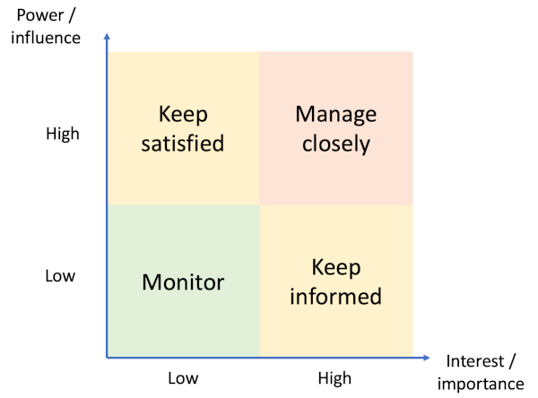

# Human Factors in Software Engineering

If you think about software engineering as simply writing code, it is easy to
overlook the other people who have an interest in the software products that you
are creating. Fig. 1 illustrates some of the most important ones.

{: standalone #fig1 data-title="Other people" }

## Stakeholder analysis

A *stakeholder* is any person, group of people or organisation with an interest in
a project. The client (or customer) obviously has an interest in the system being
built: they have set the requirements and they are paying for it. Depending on
the type of system and the context of use, however, there may be many other
stakeholders that need to be considered as the development proceeds. The process
of mapping out all of these separate concerns is called *stakeholder analysis*.
You need to be aware that sometimes, your software development project may not be
welcome and certain stakeholders may be resistant to the intended outcome.
Identifying those negative interests can help you to avoid unexpected setbacks.

[Smith, 2000](https://www.pmi.org/learning/library/stakeholder-analysis-pivotal-practice-projects-8905)
provides a clear explanation of how to conduct a thorough stakeholder analysis.

1. **Identify the stakeholders**

   Starting with an initial brainstorming session, all possible interests are
   included. Candidate stakeholders may be dropped later  if it becomes clear that
   they are not in fact concerned with the project.

2. **Identify stakeholders' interests, impact level, and relative priority**

   The next step is to gather the list of stakeholders into a
   convenient format such as a spreadsheet, to rate their level of potential
   impact on the project and rank them in terms of importance. Direct
   conversations with the stakeholders is useful at this stage.

3. **Assess stakeholders for importance and influence**

   *Influence* is an indication of the control that a stakeholder has over the
   project. The client is very influential because they can terminate the project
   at any time. *Importance* quantifies the extent to which a stakeholder is
   critical for the success of the project. For example, if the target users
   are dissatisfied with the outcome, the project may be considered a failure.

   As part of this step it can be useful to visualise stakeholders on a chart
   divided into four quadrants as shown in Fig. 2. Those in the top right quadrant
   are the key stakeholders for your project.

   {: standalone #fig2 data-title="Stakeholders mapped by importance and influence" }

4. **Outline assumptions and risks**

   Risk management in a software development project usually focuses on resource
   availability and technical risks. One of the benefits of performing a stakeholder
   analysis is that it offers a simple way to include sociopolitical risks into
   your thinking. This information can be added to the spreadsheet.

5. **Define stakeholder participation**

   This final step is about making decisions about *who* should participate in
   the project and *when*. Some stekholders just need to be kept informed;
   others need to be actively kept on-side.

## The team

Your closest relationships are likely to be with the rest of your team. They
act as mentors, sounding board, technical support, collaborators, etc. Effective
teamwork is essential in any software engineering environment. The following
important topics in this area are covered in [Stephens, 2022, Ch. 3](https://learning.oreilly.com/library/view/beginning-software-engineering/9781119901709/c03.xhtml#please-read):

* The features of an effective team
* Team roles
* Team culture
* Physical environment
* Collaboration software

## Project management

The vast majority of software development takes place within a managed project.
As a software engineer, you need to be familiar with common project management
concepts and techniques even if you are not directly responsible for managing
the project. The following important topics are covered in
[O'Regen, 2022, Ch. 4](https://link-springer-com.napier.idm.oclc.org/chapter/10.1007/978-3-031-07816-3_4#please-read)

* Project structures
* Project planning and time estimation
* Risk management
* Project quality management
* Project processes
* Management of agile projects

## Further reading

The minimum reading for this week includes the two book chapters mentioned
above. If you would like to improve your understanding further, you might
like to look at the following:

* [Stephens, 2022, Ch. 4](https://learning.oreilly.com/library/view/beginning-software-engineering/9781119901709/c04.xhtml)
* [Rehman et al., 2019](https://napier.primo.exlibrisgroup.com/permalink/44NAP_INST/n96pef/alma9923909970902111)
