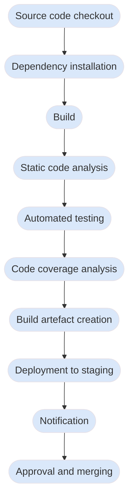

# Continuous Integration

Continuous Integration (CI) is a foundational practice in modern software development, designed to streamline 
the integration of code changes and ensure a cohesive, high-quality codebase. In traditional workflows, 
integrating code from multiple developers could lead to conflicts, unexpected bugs, and last-minute issues 
that were often discovered late in the development process. CI addresses these challenges by encouraging 
frequent, automated integration of code changes into a shared repository, ideally multiple times a day. 
Each integration triggers automated processes, including building the code, running tests, and conducting 
code quality checks, which provide immediate feedback to developers on the stability and functionality of 
their code.

{: standalone #fig1 data-title="Continuous integration" }

By automating these steps, CI aims to catch issues early, making it easier for developers to resolve bugs 
quickly before they accumulate or affect other parts of the system. CI also supports a collaborative 
environment where code is continually validated, helping teams maintain a consistent, deployable codebase 
that’s ready for further testing or release. This continuous approach improves productivity and reduces 
integration risk, allowing development teams to move faster without sacrificing code quality. Implementing 
CI effectively requires a combination of technical tools, such as version control and automated testing 
frameworks, and a culture of frequent, small code commits, making it a powerful methodology for delivering 
reliable software in today’s fast-paced development environments.

## The pipeline

The _pipeline_ is a core concept in CI. It is a structured sequence of automated steps that 
code changes go through to ensure quality, functionality, and readiness for deployment. 
When developers commit new code, it triggers the CI pipeline, which takes the code through 
each stage in a controlled, consistent environment. 


{: .side-by-side data-title="Typical steps in a CI pipeline"}

``` c#
// METHOD B
//
// Cyclomatic complexity = 4
// Cognitive complexity = 1

String getWords(int number) {
  switch (number) {
    case 1:
      return "one";
    case 2:
      return "a couple";
    case 3:
      return "a few";
    default:
      return "lots";
  }
}
```
{: .side-by-side}

{: .figcaption}
Fig. 2: Typical steps in a CI pipeline


## Automated builds

In CI, an automated build is a process that compiles and assembles the latest code changes 
each time a developer commits to the central code repository. This automated process ensures 
that the codebase is continually validated and kept in a functional state, integrating any 
new code seamlessly with the existing structure. The build process typically includes tasks 
like compiling the code, linking dependencies, generating executable files, and sometimes 
running initial tests, all without manual intervention. For a C# application for example, 
an automated build typically involves compiling the code using a tool like 
[MSBuild](https://github.com/dotnet/msbuild), resolving dependencies via 
[NuGet](https://www.nuget.org/), and generating an executable or library file. By automating 
the build, CI systems provide immediate feedback on code integrity, catching errors early 
and preventing issues from propagating through the development lifecycle.

A key output of an automated build is the creation of _build artefacts_ — compiled versions or 
components of the software that are ready for deployment or further testing. These artefacts 
might include binaries, libraries, executables, or installation packages. For instance, in a 
C# project, the build artefacts might include a `.dll` library or a `.exe` executable. In CI, 
build artefacts serve as snapshots of a stable build that has passed through the initial 
stages of verification, providing a consistent version of the codebase that can be used 
across different environments (such as staging, testing, or production). Having reliable 
build artefacts makes it easier to deploy a tested version of the software, ensure 
consistency between environments, and roll back if needed. By creating artefacts 
automatically with each successful build, CI allows for a continuous flow of validated, 
deployable software that reduces integration risk and supports a rapid release cadence.

## Automated testing

In an Agile project, automated testing within CI plays a crucial role in providing 
immediate feedback, helping developers maintain a high-quality, adaptable codebase. In 
Agile, where iterations are short and requirements evolve rapidly, catching issues early 
is essential for maintaining momentum and ensuring that new features don’t disrupt existing 
functionality. Automated tests are designed to run every time code is committed, enabling 
the CI pipeline to immediately validate changes and alert the development team to any 
potential issues.

Different types of automated testing support this rapid feedback cycle in unique ways. 
**Unit tests** focus on individual functions or methods, quickly confirming that new code 
behaves as expected without affecting other parts of the system. For example, a C# 
developer may write unit tests for a method like `CalculateTotal()` in an `Order` class, 
ensuring it returns accurate totals for various inputs. In CI, these unit tests run 
automatically upon each commit, providing near-instant feedback if the method’s behaviour 
deviates from expected results. This immediate notification allows developers to fix issues 
before they affect other areas of the application, supporting the Agile principle of 
delivering working software quickly and consistently.

**Integration tests** extend this feedback by verifying that different components or services 
interact correctly. In an Agile C# project, an integration test might check that a 
`UserService` retrieves data from a database properly, validating the service logic and 
database connection together. In CI, these integration tests help identify any problems with 
interconnected components soon after code changes are introduced, which is especially 
valuable in Agile projects where components may be frequently modified to accommodate new 
requirements.

**Functional tests** provide feedback on specific application features, confirming they 
work as intended from the user’s perspective. For instance, in a C# application with an 
authentication system, a functional test might verify that users can log in successfully 
with valid credentials and are restricted with invalid ones. Running functional tests within 
CI ensures that key user-facing functionality remains intact after each change, aligning 
with Agile’s focus on building features incrementally and iteratively. Developers receive 
prompt feedback on feature stability, allowing them to make adjustments as needed within 
the same sprint or iteration.

Finally, **end-to-end (E2E) tests** validate entire workflows, such as purchasing a product 
in a C# e-commerce application, ensuring that the system as a whole operates seamlessly. 
Although these tests are more extensive, their automated execution within CI provides 
developers with a comprehensive understanding of the software’s overall integrity. By 
detecting any disruptions to critical workflows as soon as changes are committed, Agile 
teams can adjust immediately, ensuring user-facing features continue to function reliably.

## Environmental consistency

CI requires a standardised environment in order to work reliably. Every automated build
is a test of the environmental setup which is isolated from individual developer 
configurations. In CI, builds and tests are executed in a controlled setting, often using 
virtual machines, containers (like [Docker](https://www.docker.com/)), or cloud environments 
that simulate the production environment. This consistency reduces variability between 
developer setups and the live deployment environment, preventing the common "it works on my 
machine" issues that can arise when code behaves differently across configurations.

For live deployment, environmental consistency ensures that code validated in the CI 
pipeline behaves predictably when it reaches production. When the CI process standardises 
build and deployment steps, any issues related to dependencies, environment variables, or 
configurations are identified and addressed before the software is deployed. As a result, 
teams can deploy with greater confidence, knowing the software has already been tested in 
conditions mirroring production. This practice reduces the likelihood of unexpected 
behaviour in live environments and minimises the risk of downtime or critical errors 
post-release.

Environmental consistency also benefits ongoing customer support by making it easier to 
replicate and troubleshoot issues. When developers and support teams know that the CI 
environment closely aligns with production, they can more reliably reproduce and 
investigate customer-reported issues. Furthermore, CI can be configured to create 
identical staging or test environments, allowing support teams to validate fixes in 
an environment that matches live conditions. This approach streamlines the debugging 
process, enables faster response times, and improves the reliability of deployed updates, 
ultimately enhancing the customer experience by ensuring consistent, stable software in 
production.

