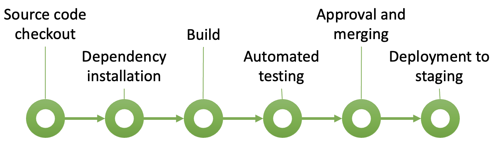
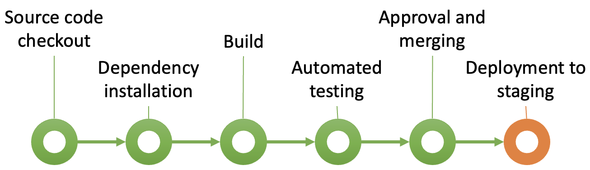

# Continuous Integration and Continuous Delivery/Deployment

DevOps and Continuous Integration and Continuous Delivery/Deployment (CI/CD) are closely related concepts, 
but they differ in scope and purpose. DevOps is a comprehensive cultural and organisational philosophy that 
combines development and operations to create a unified, collaborative environment. DevOps focuses on 
breaking down the traditional silos between development and operations teams, fostering a culture of 
shared responsibility, automation, and continuous improvement. DevOps covers a wide range of practices 
and principles beyond just deployment, including infrastructure management, continuous monitoring, incident 
response, security, and iterative feedback. Its goal is to streamline the entire software lifecycle from 
planning and coding through to release, operations, and ongoing maintenance.

{: standalone #fig1 data-title="CI/CD" }

CI/CD, on the other hand, is a set of practices and tools that are often part of a DevOps strategy but 
are specifically focused on the automation of code integration, testing, and deployment. Continuous 
Integration (CI) is the practice of regularly integrating code changes into a shared repository, 
automatically building and testing each integration to catch errors early. Continuous Delivery (CD) 
extends CI by preparing code for deployment, automating further testing and packaging steps to keep code 
in a deployable state at all times. Continuous Deployment goes a step further, deploying every validated 
code change directly to production without manual intervention. CI/CD thus primarily addresses the 
pipeline for moving code changes smoothly from development to deployment, ensuring quality and speeding 
up release cycles.

## The pipeline

The _pipeline_ is a core concept in CI/CD. It is a structured sequence of steps - most of
which are automated - that code changes go through to ensure quality, functionality, and 
readiness for deployment. When developers commit new code, it triggers the CI/CD pipeline, 
which takes the code through each stage in a controlled, consistent environment. 
Notifications are triggered at specific points in the pipeline to inform team members of 
key events or results, such as build completions, test failures, successful deployments, or 
code quality issues. Pipelines may be configured differently to reflect the priorities and 
preferences of teams and organisations. The example in Fig. 1 shows some typical stages.

{: standalone #fig2 data-title="Typical CI/CD pipeline" }

## Initialisation

The first stage in a CI/CD pipeline is _Source Code Checkout_, where the CI/CD system pulls the 
latest version of the code from the version control repository (such as Git). This step 
ensures that the pipeline operates on the most recent code committed by developers. When 
a developer pushes a new commit, the CI pipeline is triggered, and it begins by accessing 
the codebase exactly as it exists at that moment. By checking out a fresh copy of the 
codebase, the CI/CD pipeline can work independently of any local environments or 
developer-specific configurations, ensuring a clean slate for the testing and build 
processes that follow. This stage is essential for achieving consistency, as it guarantees 
that each pipeline run is isolated and uses the same starting code, reducing the likelihood 
of undetected conflicts or environment-related errors.

{: standalone #fig3 data-title="Initialisation" }

The second stage, _Dependency Installation_, involves downloading and configuring any 
external libraries, frameworks, or modules that the code depends on to build and run 
properly. These dependencies are typically specified in configuration files, such as a 
`package.json` for Node.js projects, a `.csproj` file for .NET applications, or a 
`requirements.txt` for Python projects. The CI/CD pipeline reads these configuration files to 
ensure that all required dependencies are installed in the pipeline’s environment, mirroring 
what the application would need in production. Installing dependencies is crucial for 
accurate testing and building, as it replicates the conditions under which the software 
will eventually run. This stage minimises the risk of discrepancies that could lead to 
errors, as developers often have different dependencies installed locally. By standardising 
dependency installation, the CI/CD pipeline ensures that all subsequent stages have the 
resources they need to execute consistently and accurately, ultimately supporting a stable 
and reliable build process.

## Automated builds

In CI/CD, an automated build is a process that compiles and assembles the latest code changes 
each time a developer commits to the central code repository. This automated process ensures 
that the codebase is continually validated and kept in a functional state, integrating any 
new code seamlessly with the existing structure. The build process typically includes tasks 
like compiling the code, linking dependencies, generating executable files, and sometimes 
running initial tests, all without manual intervention. For a C# application for example, 
an automated build typically involves compiling the code using a tool like 
[MSBuild](https://github.com/dotnet/msbuild), resolving dependencies via 
[NuGet](https://www.nuget.org/), and generating an executable or library file. By automating 
the build, CI systems provide immediate feedback on code integrity, catching errors early 
and preventing issues from propagating through the development lifecycle.

{: standalone #fig4 data-title="Automated builds" }

A key output of an automated build is the creation of _build artefacts_ — compiled versions or 
components of the software that are ready for deployment or further testing. These artefacts 
might include binaries, libraries, executables, or installation packages. For instance, in a 
C# project, the build artefacts might include a `.dll` library or a `.exe` executable. In CI/CD, 
build artefacts serve as snapshots of a stable build that has passed through the initial 
stages of verification, providing a consistent version of the codebase that can be used 
across different environments (such as staging, testing, or production). Having reliable 
build artefacts makes it easier to deploy a tested version of the software, ensure 
consistency between environments, and roll back if needed. By creating artefacts 
automatically with each successful build, CI/CD allows for a continuous flow of validated, 
deployable software that reduces integration risk and supports a rapid release cadence.

## Automated testing

During the _Automated Testing_ stage the primary focus is on running fast, targeted tests 
that verify the core functionality, quality, and integrity of the code. This stage provides 
immediate feedback, allowing developers to catch issues early in the development process. 

{: standalone #fig5 data-title="Automated testing" }

The types of tests in this stage typically include:

* **Unit Tests**: Unit tests validate the functionality of individual functions, methods, 
  or classes in isolation. These tests ensure that each small component of the application 
  behaves as expected, and they run quickly, making them ideal for the CI/CD pipeline. For 
  example, a unit test might check that a method in a C# class returns the correct result 
  for different inputs. In cases where certain unit tests depend on a specific database 
  schema, database migrations may be run in a limited scope at the start of the automated 
  testing stage to prepare the database structure. This ensures that any new or altered 
  database schema required for these unit tests is correctly in place.

* **Integration Tests**: Integration tests focus on testing the interactions between 
  multiple components or modules within the application. For example, an integration test 
  might verify that a service can successfully retrieve data from the database and that 
  different services communicate effectively. These tests help ensure that changes to one 
  component do not break dependencies or cause issues with other parts of the system. In 
  cases where database access is required, database migrations may be applied before 
  integration tests, setting up the necessary tables, fields, and data to support these tests.

* **Static Code Analysis**: Although not a test in the traditional sense, static code 
  analysis tools are often integrated into the automated testing stage. These tools analyse 
  the source code for adherence to coding standards, detect security vulnerabilities, and 
  identify code quality issues without executing the code. This stage helps enforce coding 
  best practices and ensures that the code is clean, maintainable, and secure.
  static analysis tools such as 
  [SonarQube](https://www.sonarsource.com/products/sonarcloud/), 
  [ESLint](https://eslint.org/) or [Checkmarx](https://checkmarx.com/), are integrated into 
  the CI/CD pipeline to run each time code is committed. These tools generate reports on the 
  code’s quality, highlighting areas that may need refactoring, improving readability, or 
  addressing security concerns. For example, a static code analyser might flag duplicated 
  code, unused variables, improper use of data types, or potential injection vulnerabilities, 
  depending on the tool and configuration used.

* **Code Coverage Analysis**: Code coverage analysis measures the percentage of the codebase 
  that is exercised by the tests, highlighting any untested areas. This metric is valuable 
  for identifying gaps in test coverage and ensuring that critical parts of the application 
  are well-tested. Higher coverage provides greater confidence in the robustness of the code.
  Code coverage tools, such as 
  [Coverlet](https://learn.microsoft.com/en-us/dotnet/core/testing/unit-testing-code-coverage?tabs=linux) 
  for .NET, [JaCoCo](https://www.eclemma.org/jacoco/) for Java, or 
  [Istanbul](https://istanbul.js.org/) for JavaScript, integrate into the CI/CD pipeline and 
  generate reports that show which parts of the code were executed by the tests and which 
  parts were not.

* **Selective Functional Tests (Smoke Tests)**: Selective functional tests, often called 
  smoke tests, focus on validating key functionalities to confirm that the main features of 
  the application work as expected. For instance, a smoke test might check that the login 
  feature or a primary user workflow functions correctly. These tests provide a quick 
  overview of core functionality without going into the detail of full end-to-end tests.

* **Database Migration Testing** (if needed for automated tests): In some cases, basic 
  database migrations may be applied in the automated testing stage if they are necessary 
  prerequisites for certain unit or integration tests. For instance, if a unit test verifies 
  functionality that depends on a new database field or table introduced in the latest 
  migration, then the migration needs to be applied beforehand. This limited use of database 
  migrations ensures that tests reflect the latest database schema and prevents 
  schema-related failures during testing. However, full migration testing is typically 
  reserved for the staging environment, where a complete set of migrations can be validated 
  in a production-like setting.

## Approval and merging

Once the code passes all automated checks, the CI/CD pipeline signals it is ready for review.
The final quality control step requires a human reviewer — typically a senior developer, 
team lead, or designated peer — who evaluates the code for functional correctness, adherence 
to standards, and alignment with project requirements. The reviewer examines the code changes 
in detail, often using tools like pull requests in GitHub or merge requests in GitLab, which 
provide insights into what was changed, how it was implemented, and any potential impact on 
the rest of the codebase. During this review, the reviewer might leave comments, suggest 
improvements, or request further changes. If any changes are needed, the developer addresses 
them, resubmits the code, and the process repeats until the reviewer is satisfied.

{: standalone #fig6 data-title="Approval and merging" }

After approval, the code is merged into the main branch (or trunk) of the codebase. In many 
pipelines, this step triggers additional actions, such as deploying the code to a staging or 
production environment, depending on the setup. The approval and merging stage provides an 
extra layer of oversight that combines automated testing with human judgment, ensuring code 
quality and reducing the risk of introducing bugs or regressions into the main codebase. 
This final review step helps maintain stability, code consistency, and a high standard of 
quality in collaborative development environments.

## Deployment to staging

Up untli this point, the steps in the pipeline have been concerned with continuous integration.
In _Deployment to staging_ the validated code is automatically deployed to a staging 
environment that closely resembles the production environment. This stage occurs after 
the code has successfully passed all initial automated tests, including unit tests, 
integration tests, and other quality checks, ensuring that it is stable enough to undergo 
more comprehensive testing. The staging environment typically mirrors production in terms 
of infrastructure, configurations, data handling, and dependencies, allowing teams to 
validate that the application behaves as expected in conditions that simulate real-world use.

{: standalone #fig7 data-title="Deployment to staging" }

During deployment to staging, the CI/CD pipeline takes the built artefacts — such as binaries, 
Docker containers, or installation packages — and deploys them to the staging environment. 
This process often includes running database migrations, configuring environment-specific 
settings, and updating any dependencies to ensure that the application is fully functional 
and aligned with the production setup. By using an environment identical to production, 
the Deployment to Staging helps uncover issues that might not surface in the earlier, more 
isolated testing environments.

Once deployed to staging, additional rounds of testing are typically performed. These include 
end-to-end testing, which checks that complete workflows operate smoothly; performance 
testing, which assesses how the application handles load and stress; and user acceptance 
testing (UAT), where stakeholders or end-users validate that the software meets requirements 
and expectations. These tests help verify that recent changes not only function correctly 
but also maintain the performance and reliability standards needed for production.

The _Deployment to staging_ stage helps to minimise risk before going live, as 
it allows the team to catch deployment issues or unanticipated interactions within a 
production-like environment. By identifying and resolving potential problems in staging, 
the team can confidently promote the code to production, knowing that it has been thoroughly 
tested and is ready for real-world use. This stage, therefore, contributes to a smoother, 
more reliable release process and ultimately enhances the quality and stability of the 
deployed software.

## Tools

The most common tools for implementing CI/CD pipelines provide automation, version control integration, 
and deployment capabilities to streamline the software development process. Popular choices include:

* [Jenkins](https://www.jenkins.io/): An open-source CI/CD tool known for its flexibility and 
  extensibility. Jenkins supports numerous plugins, allowing teams to build customised pipelines that 
  handle everything from code building to testing and deployment.

* [GitHub Actions](https://github.com/features/actions): Integrated directly with GitHub repositories, 
  GitHub Actions simplifies CI/CD by allowing developers to automate workflows based on events like code 
  pushes and pull requests. It supports a range of actions for testing, building, and deploying 
  applications.

* [GitLab CI/CD](https://docs.gitlab.com/ee/ci/): Part of the GitLab platform, GitLab CI/CD offers a 
  robust, integrated pipeline system. It supports end-to-end DevOps workflows, with features for building, 
  testing, and deploying code within a single platform, especially beneficial for teams using GitLab for 
  version control.

* [CircleCI](https://circleci.com/): A cloud-based CI/CD platform known for its speed and ease of setup, 
  CircleCI offers optimised, parallel builds that speed up testing. It integrates well with GitHub, 
  Bitbucket, and other version control systems, making it a popular choice for cloud-native development.

* [Travis CI](https://www.travis-ci.com/): Often used for open-source projects, Travis CI integrates with 
  GitHub and automates testing and deployment. It’s known for its simplicity and is widely adopted by 
  smaller teams and individual developers.

* [Azure DevOps Pipelines](https://azure.microsoft.com/en-us/products/devops/pipelines): Part of 
  Microsoft’s Azure DevOps suite, Azure Pipelines supports multi-platform builds, integrates with Azure 
  cloud services, and allows for robust CI/CD workflows, making it a strong choice for teams working 
  within the Azure ecosystem.

* [AWS CodePipeline](https://aws.amazon.com/codepipeline/): Amazon’s CI/CD service integrates tightly 
  with other AWS products, enabling teams to build, test, and deploy applications within the AWS cloud 
  environment. It’s especially useful for applications with significant AWS infrastructure dependencies.

Each of these tools offers a range of capabilities tailored to different environments, workflows, and 
team needs. They provide the essential building blocks for continuous integration and continuous 
deployment, enabling faster, more reliable software delivery.

## Environmental consistency

CI/CD requires a standardised environment in order to work reliably. Every automated build
is a test of the environmental setup which is isolated from individual developer 
configurations. In CI/CD, builds and tests are executed in a controlled setting, often using 
virtual machines, containers (like [Docker](https://www.docker.com/)), or cloud environments 
that simulate the production environment. This consistency reduces variability between 
developer setups and the live deployment environment, preventing the common "it works on my 
machine" issues that can arise when code behaves differently across configurations.

For live deployment, environmental consistency ensures that code validated in the CI/CD 
pipeline behaves predictably when it reaches production. When the CI/CD process standardises 
build and deployment steps, any issues related to dependencies, environment variables, or 
configurations are identified and addressed before the software is deployed. As a result, 
teams can deploy with greater confidence, knowing the software has already been tested in 
conditions mirroring production. This practice reduces the likelihood of unexpected 
behaviour in live environments and minimises the risk of downtime or critical errors 
post-release.

Environmental consistency also benefits ongoing customer support by making it easier to 
replicate and troubleshoot issues. When developers and support teams know that the CI/CD 
environment closely aligns with production, they can more reliably reproduce and 
investigate customer-reported issues. Furthermore, CI/CD can be configured to create 
identical staging or test environments, allowing support teams to validate fixes in 
an environment that matches live conditions. This approach streamlines the debugging 
process, enables faster response times, and improves the reliability of deployed updates, 
ultimately enhancing the customer experience by ensuring consistent, stable software in 
production.

{: .tip-title }
> [<i class="fa-regular fa-lightbulb"></i> Tips for getting started with CI](cicd_tips)

## Further reading

* [DevOps for Dummies (Freeman, 2019)](https://napier.primo.exlibrisgroup.com/permalink/44NAP_INST/n96pef/alma9923667933802111)
