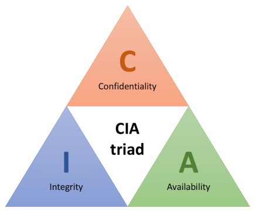
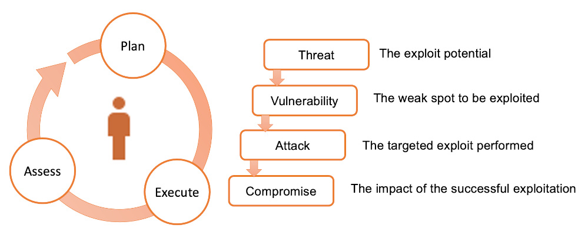

# Security

### Cybersecurity of the future is going to look a lot like software engineering.

 

*Ross Haleliuk*

###### Contents

1. [Introduction](#introduction)
2. [Seven pernicious kingdoms](#seven-pernicious-kingdoms)
3. [Thinking like a threat actor](#thinking-like-a-threat-actor)
4. [Further reading](#further-reading)

## Introduction

The CIA triad of Confidentiality, Integrity and Availability illustrated in Fig. 1 is a broad,
commonly-used framework for describing system and data security.

*Fig. 1: The CIA triad*

> **Confidentiality**: Access to data and systems is restricted to authorised users
>
> **Integrity**: The data content of a system should be correct and protected from improper
> modification, either accidental or malicious.
>
> **Availability**: Genuine users should be able to access systems and data whenevery they need to.

The first scenario that usually comes to mind when considering security is the deliberate
intrusion by an unauthorised user. However, threats come in many other forms and the CIA triad
provides a structure in which to think about the full range of possible threats. The table
below contrasts accidental and deliberate threats in relation to their general source.

| Source      | Deliberate                                                  | Accidental                  |
|-------------|-------------------------------------------------------------|-----------------------------|
| Human       | Abuse of privilege, Spoofing                                | Operational error           |
| Software    | SQL injection, Ransomware, Denial of Service, Worms/viruses | Incompatibility             |
| Hardware    | Physical sabotage                                           | Power failure, Disk failure |
| Environment | Terrorist attack                                            | Natural disaster            |

Some aspects of security - while important - are the responsibility of systems administrators and
network teams rather than software engineers. The tour below illustrates some of the vulnerabilities
of a typical software system with a view to highlighting the areas of specific concern for
software specialists.

<h6 align="center"> Here's you, engineering your software...

</h6>

## Seven pernicious kingdoms

The number of potential security threats is large and grows with every technological
innovation. Each threat has its own characteristics and such a large body of information is
difficult to conceptualise. In fact,human beings have difficulty holding more than about seven
categories in their minds at any one time. In 2005, Tsipenyuk, Chess and McGraw introduced a
taxonomy of software security errors that acknowledged this limitation. They identified categories
of software errors that they called *phyla* and then grouped them into the seven *pernicious
kingdoms* listed below.

1. **Input validation and representation**

   This group includes any situation in which a user could enter data into a system that would
   cause errors.This includes malicious activities such as SQLcinjection and cross-site scripting,
   and also accidental effects such as buffer overflows.
2. **API abuse**

   An *API* represents a contract between a caller (e.g. a remote client, or just a client class
   within an application) and a callee which provides certain services. API abuse errors are those
   in which an API can fail to behave as promised, or which can be exploited by the caller.
3.**Security features**

   This group refers to standard features such as authentication, access control and encryption
   that a developer might build into an application but which may contain errors that allow
   manipulation by malicious actors.
4. ***Time and state***

   Modern computer systems, especially those that explicitly implement event-driven or
   asynchronous features, do not always perform actions in the same sequence as the designer
   originally imagined. This group of software errors focuses on the failure to appreciate this
   complexity and to take adequate control and verification actions.
5. **Errors**

   While error handling is an essential practice, information about the way the system works
   can leak out through the details provided by error messages. Two typical scenarios are where
   default messages are simply forwarded to the UI and where the developer has deliberately
   included extra detail to help with debugging.
6. **Code quality**

   Poor code quality leads to unpredictable behaviour which can be exploited by a malicious
   actor. Errors in this group may have specific causes and effects, but the general category
   is similar to the concept of a code smell - if something is not obviously done in a princpled
   way, there is a good chance that it can be exploited.
7. **Encapsulation**

   The term *encapsulation* is used here in a slightly more general sense than usual. The authors
   use it to refer to any strict demarcation between types of data or elements of a system. They
   use the example of a web browser that allows access only to carefully controlled areas of the
   user's hard drive. Errors in this category represent failures to maintain adequate safeguards
   of this kind.

Since 2005, further work has been done in this area, and the original taxonomy developed by
Tsipenyuk, Chess and McGraw has been incorporated into the
[Common Weakness Enumeration](https://cwe.mitre.org/data/definitions/699.html) (CWE), an open
database of known security threats maintained by [MITRE](https://www.mitre.org/). The database
is kept up to date by the user community, and a list of the top 25 software vulnerabilities is
published each year. The list for 2023 is shown below.

|                                                                                   |                                                                                                     |
|-----------------------------------------------------------------------------------|-----------------------------------------------------------------------------------------------------|
| 1. [Out-of-bounds Write](https://cwe.mitre.org/data/definitions/787.html)         | 14. [Integer Overflow](https://cwe.mitre.org/data/definitions/190.html)                             |
| 2. [Cross-site Scripting](https://cwe.mitre.org/data/definitions/79.html)         | 15. [Deserialization of Untrusted Data](https://cwe.mitre.org/data/definitions/502.html)            |
| 3. [SQL Injection](https://cwe.mitre.org/data/definitions/89.html)                | 16. [Command Injection](https://cwe.mitre.org/data/definitions/77.html)                             |
| 4. [Use After Free](https://cwe.mitre.org/data/definitions/416.html)              | 17. [Improper Use of Memory Buffer](https://cwe.mitre.org/data/definitions/119.html)                |
| 5. [OS Command Injection](https://cwe.mitre.org/data/definitions/78.html)         | 18. [Use of Hard-coded Credentials](https://cwe.mitre.org/data/definitions/798.html)                |
| 6. [Improper Input Validation](https://cwe.mitre.org/data/definitions/20.html)    | 19. [Server-Side Request Forgery](https://cwe.mitre.org/data/definitions/918.html)                  |
| 7. [Out-of-bounds Read](https://cwe.mitre.org/data/definitions/125.html)          | 20. [Missing Authentication for Critical Function](https://cwe.mitre.org/data/definitions/306.html) |
| 8. [Path Traversal](https://cwe.mitre.org/data/definitions/22.html)               | 21. [Race Condition](https://cwe.mitre.org/data/definitions/362.html)                               |
| 9. [Cross-Site Request Forgery](https://cwe.mitre.org/data/definitions/352.html)  | 22. [Improper Privilege Management](https://cwe.mitre.org/data/definitions/269.html)                |
| 10. [Dangerous File Type Upload](https://cwe.mitre.org/data/definitions/434.html) | 23. [Code Injection](https://cwe.mitre.org/data/definitions/94.html)                                |
| 11. [Missing Authorization](https://cwe.mitre.org/data/definitions/862.html)      | 24. [Incorrect Authorization](https://cwe.mitre.org/data/definitions/863.html)                      |
| 12. [NULL Pointer Dereference](https://cwe.mitre.org/data/definitions/476.html)   | 25. [Incorrect Default Permissions](https://cwe.mitre.org/data/definitions/276.html)                                                               |
| 13. [Improper Authentication](https://cwe.mitre.org/data/definitions/287.html)                                                   |                                                                                                     |

Other organisations, such as the
[Open Worldwide Application Security Project](https://owasp.org/) (OWASP) also produce updated
lists of security threats. The [OWASP Top Ten](https://owasp.org/www-project-top-ten/), for example,
is specifically aimed at web-based systems. In contrast, the CWE list is more general and includes
issues related to compiled object-oriented languages as well as web-related threats.

## Thinking like a threat actor

Planning an exploit has a lot in common with agile software development. It is an essentially
iterative process as illustrated in Fig. 2 in which the threat actor attempts to take advantage
of a known system weakness. If the exploit is not 100% successful in achieving the intended goal,
the process is repeated.

*Fig. 2: Security exploit lifecycle*

Any of the vulnerabilities listed in the CWE could be the starting point for an attempted exploit.
Any system that captures user input, for example, might be vulnerable to injection attacks or
to induced buffer overflow errors.

A number of frameworks are available to be used in the evaluation of potential security threats.
One of these is STRIDE where the meaning of each letter of the acronymis expanded in the table
below.

| Threat type                 | Description                                                                                                                                                           |
|-----------------------------|-----------------------------------------------------------------------------------------------------------------------------------------------------------------------|
| **S**poofing identity       | The situation where messages or data appear to come from a legitimate source, but which are in fact generated by a malicious actor.                                   |
| **T**ampering               | The injection of malicious code which compromises the normal operation of the system. This could include, for example, uploading modified firmware to an edge device. |
| **R**epudiation             | The failure to securely attribute an action to a user (or a device).                                                                                                  |
| **I**nformation disclosure  | The unauthorised leakage of data from system. This includes data of any kind including user or device identities as well as sensor data.                              |
| **D**enial of service       | The overloading of the system so that it becomes unavailable.                                                                                                         |
| **E**scalation of privilege | The unauthorised access to administrative functions of a system.                                                                                                      |

Like any other framework of this type, STRIDE provides a checklist for the security analyst to
work through. However, these models typically treat the system under test as a black box and are
therefore of limited use to the software engineer.

## Further reading

* [Haleliuk, 2023](https://ventureinsecurity.net/p/if-we-cant-produce-enough-security)
* [Stephens, 2022, Ch. 8](https://learning.oreilly.com/library/view/beginning-software-engineering/9781119901709/c08.xhtml)
* [2022 Top Routinely Exploited Vulnerabilities](https://www.cisa.gov/news-events/cybersecurity-advisories/aa23-215a)
* Seven pernicious kingdoms: a taxonomy of software security errors [(Tsipenyuk, Chess & McGraw, 2005)](https://doi.org/10.1109/MSP.2005.159)
* A Taxonomy of Software Flaws Leading to Buffer Overflows ([Khoury, 2022](https://doi.org/10.1109/QRS57517.2022.00011))
* A Taxonomy for Security Flaws in Event-Based Systems ([Lee & Kim, 2020](https://www.mdpi.com/2076-3417/10/20/7338))
