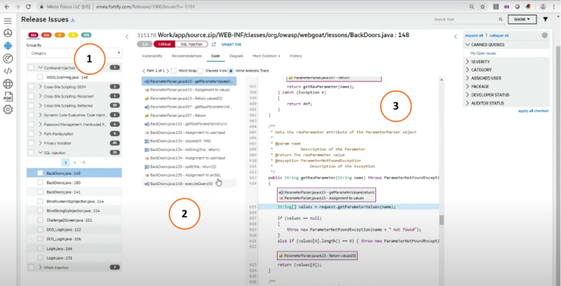
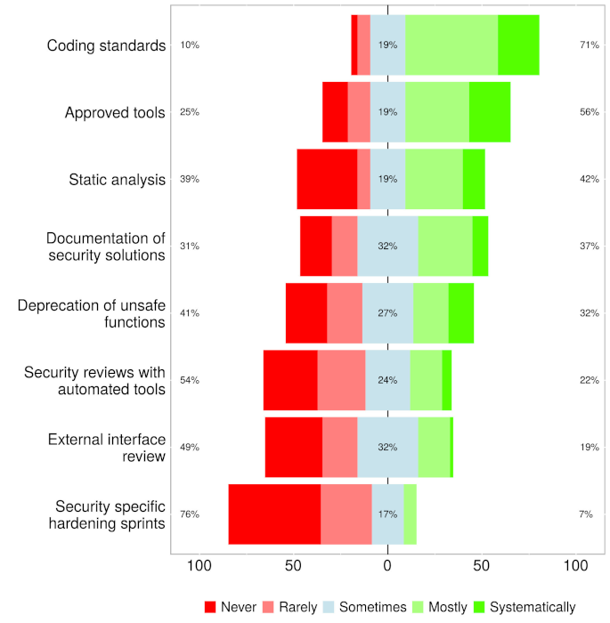
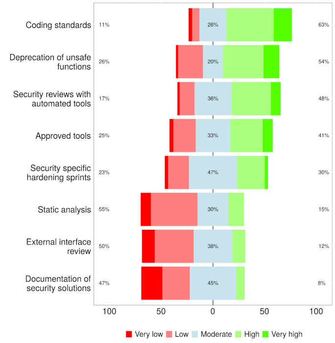

# Secure software development

<hr class="splash">


### It's hard enough to find an error in your code when you're looking for it;<br/>it's even harder when you've assumed your code is error-free.

<br/>

*Steve McConnell*

<hr class="splash">


###### Contents

1. [Introduction](#introduction)
2. [Secure design patterns](#secure-design-patterns)
3. [Design by contract](#design-by-contract)
4. [Static analysis tools](#static-analysis-tools)
5. [Integrating security engineering into Agile](#integrating-security-engineering-into-agile)
6. [Further reading](#further-reading)

## Introduction

In the past, security testing has been something that happens after an application has been built.
That is an inefficient and unreliable approach for the same reasons that including a final testing
phase is a bad idea in a structured development lifecycle. If any problems are discovered, it
means delays and rework. A recent concept that aims to remedy this situation is the introduction
of security concerns throughout the software development process. This has given rise to the term
*DevSecOps* which expresses the parallel nature of development, security and operations activities.

Another common term used to describe the migration of security issues to earlier points in the
development process is
[*shift left*](https://www.fortinet.com/resources/cyberglossary/shift-left-security).
Taking the usual left-to-right flow of diagrams such as the one in Fig. 1 that illustrates the
usual series of DevOps stages, shifting left implies that security issues are pushed back from
their usual home in the test stage to the earlier build, code and plan stages.


*Fig. 1: Typical DevOps stages*

For the software engineer, there are two main strategies for resolving security issues during
design and coding activities. The first is to avoid the introduction of security flaws in the first
place through greater attention to secure practices, and the second is to detect security flaws
early so that they can be fixed.

## Secure design patterns

A design pattern provides an outline solution to a recurring problem that can be adpted toa wide
range of contexts. The most widely-known patterns are used to solve common processing challenges
but since the publication of
[*Design patterns : elements of reusable object-oriented software*](https://napier.primo.exlibrisgroup.com/permalink/44NAP_INST/n96pef/alma9923574391402111)
in 1995, the idea has also been applied to application security. In particular,
[Dougherty et al. (2009)](https://resources.sei.cmu.edu/asset_files/TechnicalReport/2009_005_001_15110.pdf)
classify several patterns by their level of abstraction:


> Focusing on the high-level allocation of responsibilities between different components of the
> system, examples of **architectural-level patterns** are:
>
> * Distrustful Decomposition
> * PrivSep (Privilege Separation)
> * Defer to Kernel
>
> Addressing problems in the internal design of a single high-level system component, examples of
> **design-level patterns** are:
>
> * Secure Factory
> * Secure Strategy Factory
> * Secure Builder Factory
> * Secure Chain of Responsibility
> * Secure State Machine
> * Secure Visitor
>
> Applicable to the implementation of specific functions or methods in the system and often linked
> to corresponding secure coding guidelines, examples of **implementation-level patterns**  are:
>
> * Secure Logger
> * Clear Sensitive Information
> * Secure Directory
> * Pathname Canonicalization
> * Input Validation
> * Resource Acquisition Is Initialization

## Design by contract

Security problems generally mean that the software is not behaving or is not being used as the
engineer originally intended. Instead, it is being manipulated by a malicious actor in some way.
A strategy to detect and counter such unexpected behaviour is to include additional checks on the
state of the system during execution. The
[*design by contract*](https://en.wikipedia.org/wiki/Design_by_contract) concept allows the software
engineer to verify the correct operation of properties and methods by defining

* **preconditions** that must be met on entering the relevant code block
* **postconditions** that define the expectations at the time the property or method code exists
* **invariants** that specify conditions that should always be true is the code is operating correctly

The idea of code contracts was first introduced by Bertrand Meyer in the Eiffel language in 1986.
Since then, support for contracts has been included in many common languages including C#. The
[Microsoft documentaion](https://learn.microsoft.com/en-us/dotnet/framework/debug-trace-profile/code-contracts)
explains how to use annotations to invoke the contract features and provides an illustrative example.

The checks carried out as part of a code contract define the expectations at specific points in the
code execution. Although they are generally used in unit tests, assertions can also be used in a
similar way. For example, a code contract for a class that calculates VAT might require that the
net price is non-negative as a precondition, and that the VAT calculated is non-negative as a
postcondition. This could be expressed as shown below:

```c#
using System;
using System.Diagnostics.Contracts;

public class VatCalculator
{
    private const double VatRate = 0.2; // 20% VAT rate

    public double CalculateVat(double amount)
    {
        // Precondition: Ensure that the amount is non-negative
        Contract.Requires(amount >= 0, "Amount should be non-negative");

        // Business logic: Calculate VAT
        double vat = amount * VatRate;

        // Postcondition: Ensure that the calculated VAT is non-negative
        Contract.Ensures(vat >= 0, "Calculated VAT should be non-negative");

        return vat;
    }
}

class Program
{
    static void Main()
    {
        var vatCalculator = new VatCalculator();

        double amount = 100;
        double vat = vatCalculator.CalculateVat(amount);

        Console.WriteLine($"VAT for {amount:C} is {vat:C}");
    }
}

```

The same checks could be carried out using assertions as shown below. Note that `Trace.Assert()`
is used rather than `Debug.Assert()` since `Debug` references are removed from production code.

```c#
#define TRACE

using System;
using System.Diagnostics;

public class VatCalculator
{
    private const double VatRate = 0.2; // 20% VAT rate

    public double CalculateVat(double amount)
    {
        // Precondition: Ensure that the amount is non-negative
        Trace.Assert(amount >= 0, "Amount should be non-negative");

        // Business logic: Calculate VAT
        double vat = amount * VatRate;

        // Postcondition: Ensure that the calculated VAT is non-negative
        Trace.Assert(vat >= 0, "Calculated VAT should be non-negative");

        return vat;
    }
}

class Program
{
    static void Main()
    {
        var vatCalculator = new VatCalculator();

        double amount = 100;
        double vat = vatCalculator.CalculateVat(amount);

        Console.WriteLine($"VAT for {amount:C} is {vat:C}");
    }
}
```

## Static analysis tools

Many security errors can be detected by the identification of characteristic patterns in the code.
This makes them amenable to static analysis and several tools are available that can scan code and
pick them up. Some commonly-used static application security test (SAST) tools are listed below.
All of them require a paid subscription and are cloud-based. There is a NuGet package that can
be used to provide Intellisense hints in Visual Studio by using the Checkmarx API, but a
subscription is still required.

* [Fortify on Demand](https://www.microfocus.com/en-us/cyberres/application-security/fortify-on-demand)
* [Veracode](https://www.veracode.com/products/binary-static-analysis-sast)
* [Checkmarx](https://checkmarx.com/)
* [Microsoft Security Code Analysis](https://learn.microsoft.com/en-us/previous-versions/azure/security/develop/security-code-analysis-overview)

The screenshot below shows the main diagnostic page from Fortify. Panel **①** lists the vulnerabilities
discovered by a scan and the number of occurrences. Panel **②** lists the locations of the
vulnerabilities in the codebase, and panel **③** highlights the actual code. The application also
provides an explanation of the issues found and recommendations for resolving them. The other tools
listed above provide similar functionality.



*Fig.2: Fortify results page*

## Integrating security engineering into Agile

Effective security engineering in the planning, design and coding activities of a software project
add to the already long list of responsibilities for the software engineer. However, we have already
discussed some strategies that can be used to make the task less onerous. Adapting the workflow
definition to include security-specific activities, for example, can help to ensure that they are
not overlooked. The integration of static analysis tools into the working environment and ideally
into the IDE can provide help for the developer in context. However, there is also a need for
developer education regarding security. Knowledge of security vulnerabilities such as those listed
in the CWE and of secure design patterns means that the developer is less likely to introduce
security flaws by accident.

Like any kind of activity, security-enhancing practices must be seen to deliver value. A recent
[survey](https://doi.org/10.1016/j.infsof.2020.106488) of agile practitioners in Finland concluded
that agile teams did engage in security-oriented activities, especially in the planning and coding
stages. The respondents considered the activities carried out early in the lifecycle to have the
most impact. However, an interesting feature of the results suggested that although the impact of
such activities was rated highly, they were not used as much as they might have been. The
researchers noted this as a point for further investigation. The images shown in Fig. 3 present the
results of the survey for security-related activities carried out during coding.

| a                                                             | b                                                                |
|---------------------------------------------------------------|------------------------------------------------------------------|
|  |  |

*Fig. 3: Security activity use (a), and impact (b) during the implementation phase of an agile project
([Rindell et al., 2021](https://doi.org/10.1016/j.infsof.2020.106488))*

The authors note that the practices that see the most use are those used for other purposes as well.
Although static analysis falls into this category, its impact in terms of security is not rated very
highly. The authors suggest that this might be due to limitations of static analysis tools to identify
security issues; however, another explanation might be that SAST tools such as those mentioned above
are not widely used. The authors also note the mismatch between the perceived value of hardening
sprints in which the focus is on improving security and their low uptake. They suggest that hardening
sprints might be difficult to introduce without breaking agile's flexible practices.

## Further reading

* Design patterns : elements of reusable object-oriented software ([Gamma et al., 1995](https://napier.primo.exlibrisgroup.com/permalink/44NAP_INST/n96pef/alma9923574391402111))
* Security in agile software development: A practitioner survey ([Rindell et al., 2021](https://doi.org/10.1016/j.infsof.2020.106488))
* [What is DevSecOps?](https://www.microsoft.com/en-us/security/business/security-101/what-is-devsecops)
