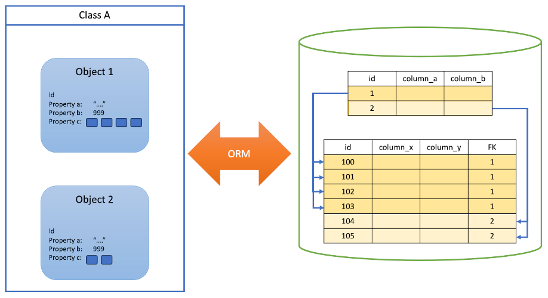
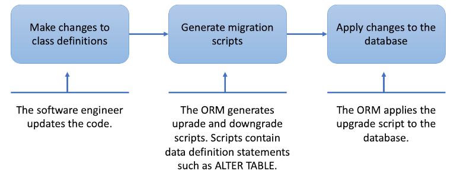

# Computer-aided software engineering

### A fool with a tool is still a fool.

 

*Grady Booch*

###### Contents

1. [What is CASE?](#what-is-case)
2. [Object-relational mapping](#object-relational-mapping)
3. [Model-driven development](#model-driven-development)
4. [Further reading](#further-reading)

## What is CASE?

Computer-aided software engineering (CASE) refers to the use of computational tools to
simplify the job of creating software systems. That might refer to the top-down design
of systems, or to the bottom-up activity of actually writing code. CASE has been around
since the 1980s and the tour below takes a quick run through its history.

<h6 align="center"> Here's you in 2023...

</h6>

When digital computers were first invented, they had to be programmed by setting manual
switches. Since then, the entire history of computing has been about making that task easier.
Assembly language made it easier to write programs compared to binary code. Compilers
relieved software engineers for the need to write assembly language. Object-orientation
facilitated code reuse and interoperability. Graphical development tools automated the tasks
of debugging, testing, code control, etc. The introduction of tools specifically labelled
as *CASE tools* could therefore be considered redundant, especially since a lot of the
functionality of older CASE tools is now available in common IDEs. However, it serves to
highlight some aspects of software engineering that are aimed at a slightly higher level of
abstraction.

## Object-relational mapping

A relational database (RDBMS) is often used to provide persistent storage for data. It is a
mature and robust solution and current versions provide good integration with development
languages through standard interfaces such as
[ODBC](https://learn.microsoft.com/en-us/sql/odbc/reference/what-is-odbc?view=sql-server-ver16),
[JDBC](https://www.geeksforgeeks.org/introduction-to-jdbc/) and others. It comes with SQL,
a powerful query language that handles the potentially complex relationships among databse
entities and provides a convenient way of separating data from code.

The relations (tables) in a relational database are conceptually very similar to classes in
object-oriented programming (OOP). Each one defines a set of entities that have the same
attributes, and each individual entity is represented by a row in the table. Thus, a row
is equivalent to an object instantiated from a class definition where each such object has
the same set of properties.

*Fig. 1: Object-relational mapping*

As illustrated in Fig. 1, n object-relational mapper (ORM) is a tool that translates
between the database view and the OOP view to simplify the job of interacting with an
RDBMS with OO code. Previously, the strategy for triggering database operations from code
was to embed SQL statements into code written in another language. Using an ORM removes
this complication by providing an interface to database structures in the native
programming language. ORMs have been around for many years and their capabilities have
steadily improved over time. However, even the best ORMs still require tradeoffs to work.
A major limitation, for example, is the complexity of handling foreign key relationships
in the OO domain.

A full discussion of ORMs is not possible here - they are included in these notes for their
ability to simplify an additional aspect of the software development process. Because
they can translate from one domain to the other, they can be used to update one
environment based on changes in the other. The team needs to decide whether it will be
the database that is the *source of truth* or the class definitions. If the database is
selected, the code can be *reverse engineered* from teh database, while if it is the code
the is selected as the source of truth, code changes need to be *migrated* to the database.
Both migration and reverse engineering have defined procedures and can potentially be
automated. For example, GitHub actions could be used to apply database migrations at the
point that the corresponding code changes are deployed to a server. Fig. 2 illustrates
a typical migration process.

*Fig. 2: Database migration process*

The upgrade and downgrade scripts generated by the migration process are stored in the
code repository so that they can be used to maintain the database structures. However,
downgrading a database can risk losing data and is therefore only performed on a live
database in exceptional circumstances.

> **NB**: It should be noted that in a team environment, database changes made by one
> developer are _**not**_ automatically applied when other team members synchronise their
> code repository with new changes. The synchronisation process only updates the files in
> the file system. To effect the changes to the database structure, each developer will
> need to run the migrations scripts themselves. Usually, this is a simple process but
> if overlooked can lead to runtime errors.
>
> Likewise, migration scripts are not necessarily applied when code is deployed to a server
> unless this has been set up as a devops automation.

## Model-driven development

Model-driven development (MDD) is a formalisation of the idea that given a precise enough
model of a software system, the software itself can be generated through a deterministic
process. MDD was a popular concept in the 2000s as various authors and tool vendors tried
to use UML as the basis for generating code. The main idea is that working with a model
using a graphical representation such as UML is quicker, easier and more intuitive than
working directly with code. The approach was criticised in several ways
[(Hailpern & Tarr, 2006)](https://doi.org/10.1147/sj.453.0451):

* **Redundancy**: Multiple representations of the same software concepts are needed to
  capture the full picture leading to complexity and duplication.
* **Round-trip problems**: Given the complex set of documents required for the realistic
  representation of a software system, keeping them all consistent becomes a major overhead.
* **Moving complexity rather thn reducing it**: To represent the full complexity of a
  software system would require an equally complex model. This point recalls the [short
  story](https://www.sccs.swarthmore.edu/users/08/bblonder/phys120/docs/borges.pdf)
  by Jorge Luis Borges which imagine a 1:1 scale map.
* **Additional skills requirements**: With each representation format, the developer would
  be required to learn its rules and operation. Again, this could potentially represent
  additional overhead rather than a reduction in effort.

[Other academics](https://copyprogramming.com/howto/uml-is-the-worst-thing-to-ever-happen-to-mdd-why)
have (informally) argued that UML is not the appropriate medium for MDD since it models
code and not the behaviour of the desired system. All of these criticisms, though, are
theoretical. The test of a technical approach should be in whether it delivers useful
results of not. This might be called the pragmatic criterion. Several tools exist that
allow the user to create a set of UML diagrams and then to generate code from them. None
of them will deliver a perfect working system; however, they all deliver well-structured
code that reduces the amount of repetitive content that would otherwise be the
responsibility of the software engineer. Some examples are:

* [Enterprise Architect](https://sparxsystems.com/products/ea/index.html)
* [Visual Paradigm](https://www.visual-paradigm.com/)
* [IBM Rational Software Architect Designer](https://www.ibm.com/docs/en/rational-soft-arch/9.7.0?topic=designer-rational-software-architect-product-overview)
* [StarUML](https://staruml.io/)
* [UModel](https://www.altova.com/umodel)
* [NClass](https://github.com/gbaychev/NClass)

## Further reading

* [Relationships in Microsoft Entity Framework](https://learn.microsoft.com/en-us/ef/ef6/fundamentals/relationships)
* [Managing database schemas (migrations and reverse engineering) with Microsoft Entity Framework](https://learn.microsoft.com/en-us/ef/core/managing-schemas/)
* Model-driven development: The good, the bad, and the ugly [(Hailpern & Tarr, 2006)](https://doi.org/10.1147/sj.453.0451)
