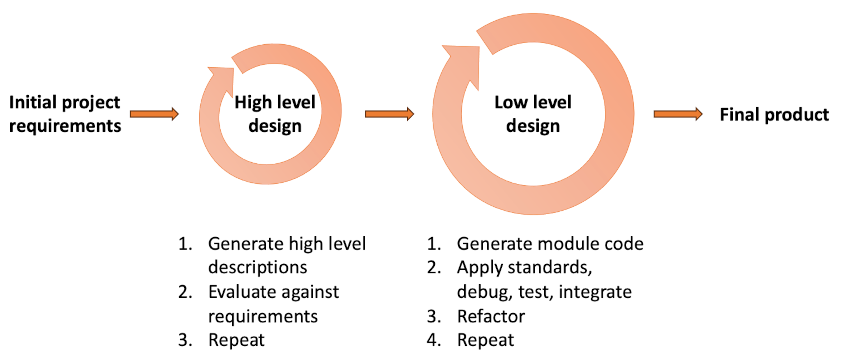

# Generative AI tools

### The amateur software engineer is always in search of magic.

 

*Grady Booch*

###### Contents

1. [The emergence of generative AI](#the-emergence-of-generative-ai-)
2. [Generalised Pre-trained Transformers (GPT)](#generalised-pre-trained-transformers-gpt)
3. [Limitations](#limitations)
4. [Software assistants](#software-assistants)
5. [Conclusions and recommendations](#conclusions-and-recommendations)
6. [Further reading](#further-reading)

## The emergence of generative AI

According to a recent
[magazine article](https://www.businessinsider.com/chatgpt-jobs-at-risk-replacement-artificial-intelligence-ai-labor-trends-2023-02?r=US&IR=T#tech-jobs-coders-computer-programmers-software-engineers-data-analysts-1),
the top 10 careers most at risk from generative AI are

1. Tech jobs (Coders, computer programmers, software engineers, data analysts)
2. Media jobs (advertising, content creation, technical writing, journalism)
3. Legal industry jobs (paralegals, legal assistants)
4. Market research analysts
5. Teachers
6. Finance jobs (Financial analysts, personal financial advisors)
7. Traders
8. Graphic designers
9. Accountants
10. Customer service agents

There are commentators who disagree with this bleak assessment and see generative AI as
another useful tool that will boost software productivity. The truth is that at the time of
writing, both perspectives are pure speculation. It is extremely difficult to predict
how generative AI tools will develop from this point onwards. Given that they have only
existed for a few years, though, there is a very good chance that new versions released
in the near future will improve performance and introduce new capabilities that will
continue to surprise the world.

Is it significant that software engineering appears at the top of the list above? Well,
the article did not claim that it was an ordered list, bu the main implication is that
those going into a creer in software engineering at this moment need to know about the
available tools and how to use them effectively.

## Generalised Pre-trained Transformers (GPT)

A GPT is a form of
[artificial neural network](https://www.geeksforgeeks.org/artificial-neural-networks-and-its-applications/)
(ANN) that has been trained on huge amounts of textual input using the
[transformer](https://builtin.com/artificial-intelligence/transformer-neural-network)
architecture. Its main function is to predict the next word in a passage of text based on
patterns in its training data. Large language models (LLMs) like ChatGPT provide an
interface to the GPT that includes some additional support functions. One of those is
the ability to supply a *prompt* which acts as the seed for the LLM's generated response.
The amazingly natural quality of the text generated by ChatGPT has caused huge speculation
around the world as to the potential of AI to replace human beings in many sectors and the
potential risks of allowing the unregulated exploitation of generative AI. The topic was
central to the recent [AI for Good summit](https://aiforgood.itu.int/summit23/) in
Geneva, is the theme of a second [summit](https://www.cityandfinancialglobal.com/global-ai-regulation-summit-2023/home)
on the global regulation of AI hosted by the UK government.

Governments and inter-governmental bodies move slowly,however, and many tools are already
available in the software engineering community that exploit this new technology. In
addition to ChatGPT, several models exist written specifically to assist in the generation of
code rather than natural language text. They include

* **OpenAI's [Codex](https://openai.com/blog/openai-codex)**

  An adaptation of the GPT-3.5 architecture, Codex is specifically trained on a mixture of
  licensed data, data created by human trainers, and publicly available data in multiple
  languages to generate and understand code. It powers applications like GitHub Copilot.

* **GitHub [Copilot](https://github.com/features/copilot)**

  While Copilot itself is not a language model, it's a tool powered by OpenAI's Codex.
  Integrated with Visual Studio Code, it assists developers by suggesting entire lines or
  blocks of code, helping them to write code faster and with fewer errors.

* **Google's BERT for [Code Search](https://developers.google.com/code-search/)**

  While BERT (Bidirectional Encoder Representations from Transformers) was initially
  designed for natural language understanding, variants of BERT have been adapted to
  understand code semantics, especially for tasks like code search.

* **Facebook [Aroma](https://ai.meta.com/blog/aroma-ml-for-code-recommendation/) code-to-code search and recommendation tool**

  Aroma is a tool by Facebook that leverages neural networks for code-to-code search and
  recommendation, helping developers find and use code snippets from a large-scale codebase.

* [TabNine](https://www.tabnine.com/):

  Powered by GPT-3 and Codex, TabNine is an AI-powered code completion tool. Though it's
  not exclusively a language model, the underlying AI aids in predictive code completion.

* [DeepCode](https://snyk.io/platform/deepcode-ai/):

  Uses deep learning to analyze and learn from code repositories. While not exclusively
  for code generation, it assists in code reviews by pointing out potential issues.

At the time of writing, these are not the only software engineering tools and services to
make use of generative AI, and there will be many others in the near future.

## Limitations

A general limitation of ANNs is that they cannot create new information or ideas;
instead, they are limited to the contents of their training data. They sythesise
responses based on the statistical frequency with which patterns appear in that data.
This also implies that the generated solutions will reflect the most common methods
and stles used in the training data. If the user prompts the LLM to generate a
solution for a well-known problem where there are many examples in the training data
it is likely to do a good job. If the solution requested is obscure or uncommon,
the solution may not be so accurate. At the extreme, the LLM tries to fill in gaps
in its training data with best-guess elements which can sometimes be plain wrong.
When the LLM appears to be making things up with no basis in fact, it is called a
*hallucination*. The greater the novelty of the problem, the more likely the LLM
is to produce hallucinations.

## Software assistants

Most IDEs include a code completion facility that offers suggestions for how to finish
the token or line that you are currently typing out. There are two main sources of
information for these hints. The first is the syntax of the language you are working
with - its keywords and general structural rules allow the editor to guess what you
intend. The second source of information is the structure of the code that you have
already written, or which comes from a package that you have imported. Either way,
the internal structure of the classes defined in existing code can be introspected
by the editor to show what options exist in the current context. Fig.1 shows the
suggestions provided by Visual Studio in response to the user typing the dot after
an object name. Microsoft coined the term *Intellisense* to describe the various
coding and structural hints provided by their tools. The term has now been adopted
in other environments as well.

*Fig. 1: Context-sensitive suggestions generated from introspection in Visual Studio*

With the advent of LLMs, code completion suggestions have taken a huge leap forwards.
[GitHub Copilot](https://docs.github.com/en/copilot/quickstart) for example has been
trained on all the code in GitHub repositories. It therefore has access to patterns
that have been generalised based on many thousands of examples. This allows it to
predict the structure of entire classes or methods rather than just the next symbol.
It also uses the code written so far in the file in the same way as a prompt. Its
suggestions are therefore tailored to the specific context and contain correctly-named
variables, classes, interfaces, etc. Copilot suggestions are presented in exactly the
same way as Intellisense hints - they are just longer. In this way, AI assistants
like Copilot are simply extensions of exisiting functionality.

## Conclusions and recommendations

The practical value of generative AI in accelerating software development cannot be
ignored. A lot of routine software development will be eliminated by simply mining
software repositories such as GitHub. The successful software engineer will need a
good understanding of AI tools and their limitations and will also need to keep pace
with future developments.

For the software engineering student there is a further challenge related to academic
integrity. Many subject areas are worried that students will submit work that has been
generated by AI rather than by the students themselves. For those disciplines that is
a major problem. In software engineering, however, learning to use generative AI
effectively will quickly become essential. The key question is how the student has
used the generated material. It is unlikely that generated code will offer a good
solution to problems of any complexity. The skill will be in the adaptations and
customisations that the student then makes to better fit the solution to the
requirements. This process needs to be as transparent as possible so that the student's
level of skill is clear. The following recommendations should help to do that and to
avoid any accusations of academic misconduct.

1. When AI tools have been used, this must be stated at the outset.
2. The software development process should be clearly described, detailing the
   additional work that has gone into the project on top of the generated code. This
   could be presented with the help of a flow diagram like the one in Fig. 2.
3. The original generated code should be available for inspection and comparison with the
   final version.
4. Provide a justified rationale for the modifications made to the generated code based
   on the requirements of the project and the quality of the final product.
5. If possible, a theoretically justified process should be adopted for the use of
   AI code generation as part of the development methodology. At the time of writing,
   no formalised methods exist, and individual actions will need to be justified on
   their own merits. It will not be long, however, before project methodologies catch
   up with technological developments.

*Fig. 2. An outline generative development process*

The final word goes to two German researchers, authors of a paper entitled, *How ChatGPT
Will Change Software Engineering Education*:

> It is crucial to acknowledge that although AI-generated code can serve as a valuable
> resource for developers, it cannot replace human expertise and comprehension. The
> developer will still need to understand the problem and the requirements and validate
> the code generated. They will also need to maintain, debug and adapt the code to
> changing requirements. Thus, future engineers will need to prioritize software design
> competencies over manual code writing skills.
>
> As AI-generated code becomes more
> prevalent, software engineers will need to have a deeper understanding of how to
> design and architect a software system. This includes understanding howto properly
> define the problem and requirements, as well as how to validate and test the
> AI-generated code to ensure it meets the needs of the project. Engineers will also
> need to have a good understanding of how AI algorithms like ChatGPT work, in order to
> be able to adjust or fine-tune the generated code as needed.
>
> [Daun & Brings, 2023](https://doi.org/10.1145/3587102.3588815)

## Further reading

* The Next Frontier in Software Development: AI-Augmented Software Development Processes [(Ozkaya, 2023)](https://doi.org/10.1109/MS.2023.3278056)
* A Review of ChatGPT Applications in Education, Marketing, Software Engineering, and Healthcare: Benefits, Drawbacks, and Research Directions [(Fraiwan & Khasawneh, 2023)](https://doi.org/10.48550/arXiv.2305.00237)
