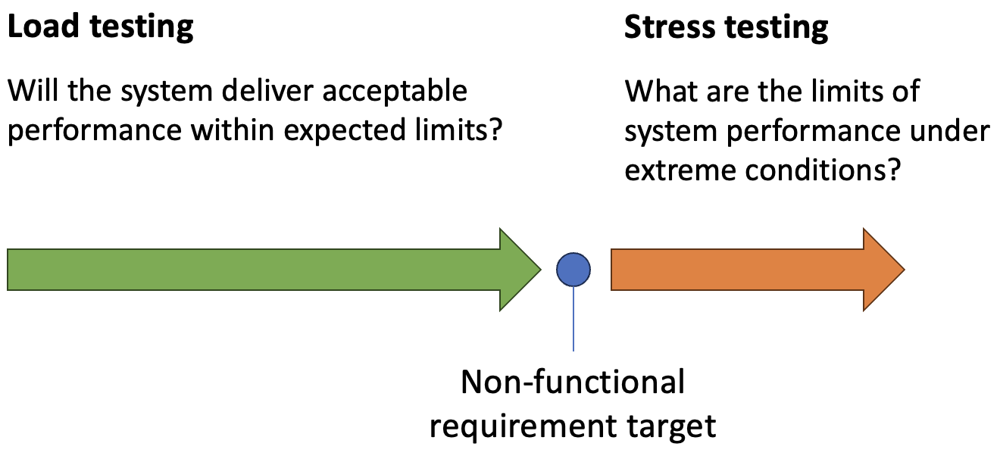

# External Quality

[SEVOCAB](https://pascal.computer.org/), a reference for technical terminology, offers three different
definitions of *quality* from different sources:

> ### **Quality**
>
> (1) degree to which the system satisfies the stated and implied needs of its
> various stakeholders, and thus provides value
> ([ISO/IEC 25010](https://napier.primo.exlibrisgroup.com/permalink/44NAP_INST/19n0mho/cdi_bsi_primary_000000000030215101))
>
> (2) ability of a product, service, system, component, or process to meet customer
> or user needs, expectations, or requirements
> ([ISO/IEC/IEEE 24765](https://napier.primo.exlibrisgroup.com/permalink/44NAP_INST/19n0mho/cdi_bsi_primary_000000000030413573))
>
> (3) the degree to which a set of inherent characteristics fulfils the requirements
> ([PMBOK](https://napier.primo.exlibrisgroup.com/permalink/44NAP_INST/n96pef/alma9923796446002111))

All of these definitions focus on the final product from the point of view of the
customer. In that sense, quality can only be evaluated with reference to the
*external properties* of the system which include, for example:

* **Reliability**:
  The degree to which a system, product or component performs specified functions
  under specified conditions for a specified period of time
  ([ISO/IEC 25010](https://napier.primo.exlibrisgroup.com/permalink/44NAP_INST/19n0mho/cdi_bsi_primary_000000000030215101))
* **Security**:
  Protection against intentional subversion or forced failure
  ([ISO/IEC 15288](https://napier.primo.exlibrisgroup.com/permalink/44NAP_INST/19n0mho/cdi_bsi_primary_000000000030433813))
* **Maintainability**:
  The degree of effectiveness and efficiency with which a product or system can be
  modified by the intended maintainers
  ([ISO/IEC 25010](https://napier.primo.exlibrisgroup.com/permalink/44NAP_INST/19n0mho/cdi_bsi_primary_000000000030215101))
* **Portability**:
  The ease with which a system or component can be transferred from one hardware or
  software environment to another
  ([ISO/IEC 24765](https://napier.primo.exlibrisgroup.com/permalink/44NAP_INST/19n0mho/cdi_bsi_primary_000000000030346267))
* **Usability**:
  The degree to which a product or system can be used by specified users to achieve
  specified goals with effectiveness, efficiency and satisfaction in a specified
  context of use
  ([ISO/IEC 25010](https://napier.primo.exlibrisgroup.com/permalink/44NAP_INST/19n0mho/cdi_bsi_primary_000000000030215101))

External properties describe the operation of the whole system and therefore need
to be evaluated at the system level. That is, the system has to be tested in use.
This system-level testing is explicitly captured in the
[V life cycle model](../unit3_lifecycles/sdlc.md#fig4) where it is paired with the
analysis phase of the waterfall. This type of quality testing is relevant for any
software development project including those that use an agile approach. 

<audio controls>
  <source src="audio/external_quality.mp3" type="audio/mpeg">
Your browser does not support the audio element.
</audio>

## Relationship with non-functional requirements

External quality criteria and non-functional requirements (NFRs) are both concerned with setting and measuring 
standards for how a system should operate. Unlike functional requirements that define what a system does, 
non-functional requirements establish how the system should behave under different conditions, such as 
performance, usability, security, and reliability. During the development phase, these NFRs guide design 
and implementation decisions, ensuring that the final product meets the quality standards essential for a 
successful launch.

In the context of a development project, non-functional requirements act as specific targets that developers 
work toward to achieve a high-quality system. For example, an NFR might specify that the application should 
load within two seconds under average conditions or support up to 10,000 simultaneous users without performance 
degradation. These requirements shape choices made during design and development, such as selecting 
appropriate architectures, frameworks, and optimisations to handle expected loads. By defining these 
targets early, NFRs give developers a clear standard, which is crucial for making technical decisions 
that align with user expectations and business goals.

External quality criteria are then used during the testing and validation phases of development to assess 
whether the system meets these non-functional benchmarks. Performance tests, for instance, can simulate 
various load conditions to verify that the application stays within the response time defined by its NFRs. 
If response times fall short, this feedback helps developers optimise code, improve database queries, or 
fine-tune caching mechanisms. In this way, external quality criteria provide essential feedback loops that 
enable developers to make adjustments and ensure that the system meets its performance requirements before 
release.

The relationship between non-functional requirements and external quality criteria in a development project 
is therefore a process of defining, designing, testing, and validating the system’s quality before release.
NFRs set clear expectations for how the system should perform under various conditions, guiding design and 
implementation choices. External quality criteria then serve as concrete metrics that validate whether these 
requirements are met during testing. By combining NFRs with targeted testing and adjustments based on external 
quality criteria, development teams ensure that the final product is ready to meet performance, usability, 
security, and reliability standards from day one, providing a solid foundation for success post-deployment.

## Reliability

Reliability and stability are often included as NFRs for development projects. A requirement 
for 99.9% uptime, for instance, influences choices like implementing redundancy, creating failover mechanisms, 
and ensuring robust error handling. During testing, criteria for reliability are validated through rigorous 
stress and failure scenario tests to confirm that the system can recover gracefully from potential issues. 
Identifying and addressing reliability issues early in the project reduces the risk of system downtime after 
release and provides greater confidence that the system will function consistently in production.

Several methods are commonly used to assess reliability, each targeting different aspects of system behaviour 
to confirm that the software is robust and dependable before release.

One primary method for testing reliability is load testing, which assesses how the system performs under 
typical, expected loads. Load testing simulates regular user interactions, examining whether the application 
can handle standard traffic without performance degradation or errors. By conducting load testing early and 
repeatedly, developers can catch issues related to resource usage, memory leaks, or slow response times that 
might affect the system’s ability to operate reliably in production.

Endurance testing - or _soak testing_ - extends load testing by running the system under a standard load for an 
extended period, such as several hours or days to evaluate its long-term reliability by. Endurance testing 
identifies issues like memory leaks, performance degradation over time, and other slow-building problems that 
may not be apparent in shorter tests. By examining how the software behaves over prolonged periods, endurance 
testing ensures the system can sustain normal operations without unexpected slowdowns or resource depletion.

{: standalone #fig1 data-title="Performance testing" }

Stress testing takes load testing a step further as shown in Fig. 1 by applying extreme or unexpected loads 
to observe how the system behaves under strain. This type of testing determines the system’s breaking points 
and helps identify how it responds to high levels of demand. During stress testing, developers examine how 
the software manages resource-intensive tasks, handles spikes in usage, and, importantly, whether it fails 
gracefully if it reaches its limits. The objective is to ensure that, in the event of excessive load or 
unexpected conditions, the system degrades predictably rather than crashing or losing data.

Another crucial method for evaluating system reliability is 
[failover](https://csrc.nist.gov/glossary/term/failover) and recovery testing, which assesses how the system 
recovers from hardware or software failures. This includes testing scenarios like database outages, network 
disruptions, or server failures to determine whether the system can automatically fail over to backup 
resources or recover smoothly without data loss. Failover testing often involves simulating failures within 
the infrastructure to validate that redundancy mechanisms work as expected and that the application can resume 
normal operations after recovery.

Imagine a software system that relies on a database server to store and retrieve user data. As a software 
developer, you know that the application makes frequent requests to this database server to fetch information, 
process transactions, and store session data. Under normal conditions, the system operates smoothly. However, 
if the database server experiences an unexpected outage — due to a network issue, hardware failure, or 
database overload — the application could be left without access to critical data, potentially causing it 
to crash or become unresponsive.

In this scenario, if the system is not designed to handle database unavailability, any requests made to the 
database during the outage might result in unhandled exceptions or timeouts, which could cause the application 
to stop functioning. Users would experience downtime, and any unsaved data could be lost. As a developer, 
this resource dependency (on the database server) is a clear point of failure that could significantly disrupt 
the system.

Failover and Recovery Testing can help identify and correct these issues before they impact users in a 
production environment. To simulate a database server failure, failover testing would intentionally cut off 
access to the database server during testing. For example, you could temporarily block network access to the 
database or stop the database service itself to observe how the application responds. During this simulated 
outage, you would monitor whether the system gracefully handles the loss of the database connection or if it 
crashes.

The results of failover testing provide insight into areas of improvement for handling database downtime. 
For instance, you might discover that the application does not currently have retry mechanisms or 
error-handling routines for database timeouts. Based on these observations, you could implement several 
strategies to make the system more resilient:

* **Implementing a Retry Logic**: Adding retry logic to database requests so that if the initial request 
  fails, the system tries again after a brief delay.
* **Setting Up a Failover Database**: Configuring a failover or replica database that the system can switch 
  to automatically in case of a primary database failure.
* **Adding Graceful Error Handling**: Creating error messages or status indicators for users, informing them 
  that the database is temporarily unavailable, instead of displaying generic or cryptic error messages.
* **Caching Data**: Implementing caching for non-critical data, allowing the application to continue operating 
  in a limited capacity even without database access.

After implementing these changes, you would rerun failover and recovery testing to ensure that the system 
now handles database failures as expected. During recovery testing, once the database server is restored, 
you would verify that the application can reconnect to the database automatically without needing a manual 
restart, ensuring that normal operations resume smoothly.

## Security

Security requirements define protections against unauthorised access and data breaches. NFRs in this area 
guide developers in applying encryption, access controls, and secure data handling practices during 
development. Penetration testing and security assessments conducted near the end of the development 
phase allow developers to measure security effectiveness against external quality criteria, identifying 
any areas that don’t meet the defined standards. Addressing these gaps prior to deployment minimises 
security risks and prepares the system to handle real-world threats.

A security weakness that should be identified and fixed by software engineers is hardcoding sensitive 
information, such as API keys, passwords, or database credentials, directly in the source code. When 
sensitive data is embedded within the codebase, it risks exposure, particularly if the code is stored in 
a version control system like GitHub, where unauthorized individuals might gain access to it.

Consider a scenario where a developer is building an application that connects to an external service, 
such as a payment gateway, using an API key for authentication. An insecure but often tempting approach 
might be to hardcode the API key directly into the application code:

```c#
public class PaymentService
{
    private readonly string ApiKey = "my-secret-api-key";

    public void ProcessPayment()
    {
        // Code to process payment using ApiKey
    }
}
```

Although convenient, hardcoding sensitive information creates a serious security risk. If this code is 
committed to a repository—whether public or private—the API key could potentially be exposed, allowing 
unauthorized access to the payment service, enabling unauthorized transactions, or compromising sensitive 
user data.

A more secure approach is for software engineers to manage sensitive information through environment 
variables or configuration files stored securely outside the main codebase, or to use a secure configuration 
management system. Using environment variables or secure configuration files allows sensitive information 
to be referenced without being directly embedded in the source code. Here’s how the example can be securely 
rewritten in C#:

```c#
public class PaymentService
{
    private readonly string ApiKey;

    public PaymentService()
    {
        ApiKey = Environment.GetEnvironmentVariable("PAYMENT_API_KEY");
    }

    public void ProcessPayment()
    {
        // Code to process payment using ApiKey
    }
}
```

In this example, the API key is retrieved from an environment variable named `PAYMENT_API_KEY`, which is set 
outside the code. This variable could be managed by configuration files, such as an `appsettings.json` file 
in .NET, or injected through deployment scripts or CI/CD tools. Configuration files themselves should never 
include raw secrets; instead, they should refer to secure storage solutions, like cloud provider secret 
managers (e.g., [AWS Secrets Manager](https://docs.aws.amazon.com/secretsmanager/latest/userguide/intro.html), 
[Azure Key Vault](https://learn.microsoft.com/en-us/azure/key-vault/general/basic-concepts)) or use 
environment variables.

When configuration files are necessary, they should be managed carefully. For example, sensitive 
configurations might look like this in an appsettings.json file:

```json
{
    "PaymentService": {
        "ApiKey": "Your-API-Key-Here"
    }
}
```

In practice, this file would contain placeholders or references to environment-specific values rather than 
actual secrets, and sensitive configuration files should be excluded from version control using a `.gitignore` 
file. This way, the configuration can vary depending on the environment (e.g., development, testing, 
production) without exposing sensitive data in the source code.

Avoiding hardcoding sensitive information is a coding best practice that software engineers should follow. 
Security specialists often focus on high-level security assessments, but secure handling of sensitive data 
is a responsibility every developer should take on to reinforce secure development practices. By using 
environment variables, secure configuration files, and secure vaults, engineers can keep sensitive 
information out of the codebase, reducing the risk of unauthorized access and ensuring that secrets are 
managed safely throughout the project.

## Maintainability

Maintainability as an external quality criterion refers to how easily a software system can be modified, 
extended, or debugged by developers after its initial release. While maintainability is often thought of as 
an internal quality characteristic — related to the code itself — it also has a strong external aspect, 
impacting the system’s overall lifecycle, adaptability to changing requirements, and ability to support 
business objectives long-term.

Maintainability is closely related to technical debt as both influence the ease with which a codebase can 
be modified, extended, and debugged over time. They share a relationship where low maintainability often 
leads to high technical debt, while managing and reducing technical debt is key to improving maintainability.
Highly maintainable code is readable, modular, well-documented, and tested, allowing developers to make 
changes with minimal risk and effort. Maintainable systems are more resilient to changes in requirements or 
technologies, making it simpler to adapt them over time. A maintainable codebase is one that minimizes 
long-term development costs, reduces errors, and enhances team productivity.

Technical debt, on the other hand, represents the future cost of additional work that arises from taking 
shortcuts or making compromises in the development process. Technical debt can accumulate when developers 
implement quick fixes, skip refactoring, or defer testing to meet short-term goals or deadlines. While 
technical debt can sometimes be a strategic decision, allowing a team to deliver functionality quickly, 
it comes at the cost of making the code harder to maintain in the future. If left unchecked, technical debt 
can accumulate to the point where even minor updates become time-consuming and error-prone.

The relationship between maintainability and technical debt is thus one of cause and effect. When technical 
debt accumulates, the codebase becomes less maintainable, as shortcuts, inconsistent coding practices, and 
deferred improvements increase code complexity, reduce modularity, and make the code harder to understand and 
work with. For example, excessive code duplication, lack of documentation, and low test coverage—all forms of 
technical debt—create a codebase that is difficult to modify without introducing new errors. This reduces 
maintainability by making changes riskier and more time-intensive.

Conversely, improving maintainability often involves paying down technical debt. Addressing technical debt 
by refactoring code, removing duplication, adding tests, and documenting the codebase enhances maintainability 
by reducing complexity and making the code easier to work with. This process requires intentional investment, 
as refactoring and testing take time and some teams include explicit refactoring sprints in every development
project. The long-term payoff is a codebase that is adaptable and resilient, able to support future development 
without overwhelming technical costs.

In practice, managing technical debt is essential to maintaining a high level of maintainability. 
Developers and teams can periodically assess technical debt by evaluating metrics such as cyclomatic 
complexity, test coverage, code duplication, and modularity. By identifying high-debt areas, teams can 
prioritize improvements that pay down debt incrementally. When technical debt is controlled, maintainability 
is preserved, allowing teams to make changes confidently and efficiently.

## Portability

Portability refers to the ease with which a software application can be moved and run across different 
environments, such as operating systems, hardware platforms, or cloud infrastructures, with minimal 
modification. Highly portable software is versatile and adaptable, able to function consistently across 
various systems. Portability is particularly valuable for software intended to reach a broad audience or 
applications that may need to scale across diverse environments as they grow.

For a software engineer, improving portability involves minimizing dependencies on any single operating 
system, hardware platform, or specific technology stack. This approach helps ensure that the codebase is 
adaptable and functions as expected in different environments. Key practices for achieving portability 
include using standardized libraries, avoiding platform-specific features, abstracting dependencies, and 
externalizing configuration settings.

In C# for example, an engineer can enhance portability by using .NET Core or the latest version of .NET 
rather than .NET Framework, as .NET Core and newer versions of .NET are cross-platform, capable of running 
on Windows, macOS, and Linux. For example, to create a portable file-reading function, the engineer should 
avoid platform-specific paths (like `C:\` on Windows) and use `Path.Combine()` to construct file paths in a 
way that works across operating systems as illustrated in the following example.

```c#
using System;
using System.IO;

public class FileReader
{
    public string ReadFile(string relativePath)
    {
        string filePath = Path.Combine(Directory.GetCurrentDirectory(), relativePath);
        if (File.Exists(filePath))
        {
            return File.ReadAllText(filePath);
        }
        else
        {
            throw new FileNotFoundException("File not found: " + filePath);
        }
    }
}
```

In this code, `Path.Combine()` creates a file path that works on any platform, rather than hardcoding a path 
structure that only works on a specific OS. Additionally, `Directory.GetCurrentDirectory()` retrieves the 
application’s working directory, making it adaptable to different installation directories.

Beyond paths, software engineers should externalize environment-specific configurations, such as API 
endpoints, database connection strings, and credentials, into environment variables or configuration files. 
For instance, the `appsettings.json` file in .NET can be used to store environment-specific configurations, 
and these can be loaded at runtime based on the environment. This allows for easy adjustments without 
modifying the code, enhancing portability by enabling the application to adapt to each environment dynamically.
Because `appsettings.json` contains environment-specific configurations, such as database connection strings, 
API keys, and other sensitive information it can expose sensitive data to unauthorized access if is committed
to the code repository. To protect sensitive information and avoid security risks, it’s best practice to 
exclude `appsettings.json` from version control (using a `.gitignore` file) and manage environment-specific 
configurations through secure methods, like environment variables or a secure configuration management tool. 
This approach helps maintain security and allows for environment-specific settings to be applied without 
compromising sensitive information.

Portability also benefits from careful dependency management. Engineers should avoid relying on 
platform-specific libraries or features and, whenever possible, use standardized libraries or cross-platform 
dependencies. For example, rather than using a Windows-specific library for cryptography, an engineer could 
use the built-in .NET cryptographic libraries, which work across all .NET-supported platforms. This approach 
not only increases the portability of the code but also reduces the risk of compatibility issues when 
deploying to different operating systems or cloud providers.

## Usability

Usability as an external quality criterion refers to how effectively and efficiently end-users can interact 
with a software system to accomplish their goals. High usability means that users find the system intuitive, 
easy to navigate, and responsive to their needs, contributing to a positive user experience. Usability is 
critical to software adoption and user satisfaction, as it directly impacts how comfortable and productive 
users feel when using the software.

Usability NFRs, such as specifying that users should complete a core action within three clicks, also 
shape design and development decisions. These requirements ensure that the application is easy to navigate 
and provides a smooth user experience. During user acceptance testing (UAT) or usability testing, external 
quality criteria such as the number of clicks needed to complete key tasks or user satisfaction scores are 
measured to ensure the system meets usability standards. If usability criteria aren’t met, developers can 
make necessary adjustments to workflows or layouts, improving the user experience prior to launch.

To ensure high usability during development, software engineers should adopt a user-centered approach, 
focusing on the needs, preferences, and workflows of target users. This begins with thorough requirements 
gathering, where engineers collaborate with designers, product managers, and users to understand key user 
needs and pain points. Engineers should then implement responsive and accessible design patterns, ensuring 
that the interface adapts well across devices and platforms and is inclusive of users with disabilities. 
Another vital aspect is consistent and intuitive navigation, with clear visual hierarchies and logical 
layouts that minimize user confusion.

The following list contains several usability testing methods that are valuable for software engineers to 
ensure that applications are intuitive, efficient, and user-friendly. 

* **Task-Based Testing**: [Task-based testing](https://blog.uxtweak.com/task-based-usability-testing/) 
  involves giving users specific tasks to complete, such as "Add an item to your shopping cart." Engineers 
  observe users to see if they can complete these tasks smoothly and within an expected timeframe. This 
  approach helps identify any pain points, confusing elements, or roadblocks in the workflow.

* **A/B Testing**: [A/B testing](https://www.optimizely.com/optimization-glossary/ab-testing/) 
  (or split testing) presents users with two or more design variations to determine which version performs 
  better in terms of usability and user satisfaction. Engineers use data collected from these tests to make 
  informed decisions about interface elements, layouts, or feature placements.

* **Heuristic Evaluation**: In [heuristic evaluation](https://www.interaction-design.org/literature/topics/heuristic-evaluation?srsltid=AfmBOor-NSCbg6GLebW90uWruAufEcVspA-tUK0-pkA8QncYt0rYnimx), 
  engineers or usability experts review the application against established usability principles (heuristics) 
  like consistency, error prevention, and feedback. This technique helps engineers identify usability flaws 
  early on, even before users test the system.

* **User Interviews and Surveys**: Collecting direct feedback through interviews or surveys provides 
  engineers with qualitative insights into how users feel about the application. Understanding user 
  perceptions and preferences helps engineers make design choices that align with user expectations and needs.

* **Accessibility Testing**: [Accessibility testing](https://accessibe.com/glossary/accessibility-testing) 
  is a subset of usability testing that ensures the application is usable for people with disabilities. This 
  may include checking screen reader compatibility, testing keyboard navigation, and evaluating colour 
  contrast. Engineers can use tools like WAVE or Axe to identify accessibility issues and improve usability 
  for a broader audience.

{: .tip-title }
> [<i class="fa-regular fa-lightbulb"></i> Tips for applying external quality criteria](external_tips)
