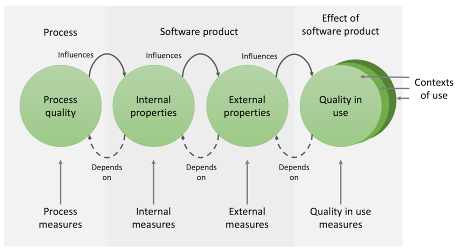

# Software Quality Standards

## ISO 25000 Systems and software Quality Requirements and Evaluation (SQuaRE)

To produce a high-quality output requires two complementary elements. The obvious one is
that the product itself must conform to certain agreed standards. However, that can only
be guaranteed if the processes by which the product is produced are clearly defined and
carefully followed. That is the second element. With a carefully designed process, the
quality characteristics of the product can be checked at various important stages in its
life cycle. In addition, sticking to a specified process ensures that those activities that
contribute to the final quality of the product are carried out correctly.

[ISO 25000](https://iso25000.com/index.php/en/iso-25000-standards) is a coordinated set of
standards related to the quality of software products which summarise the relationships
between different quality aspects and their measurements as shown in Fig. 1.

{: standalone #fig1 data-title="Relationship between types of quality measures" }

In the last section, we discussed internal and external properties of code and related
quality criteria and standards. The next logical question is when and how the appropriate
checks need to be performed. As illustrated in Fig. 1, both internal and external properties
depend on the processes that were used to create them. That includes project-level processes
for the allocation and completion of work, life cycle processes and how they are implemented in
an organisation, operational processes represented by standard workflows as well as the
personal processes used by a skilled developer. In these notes, we will be focussing on the
workflow aspects as the interface between the software engineer and the project context.

## Code weaknesses

Building on the CWE database, the [Object Management Group (OMG)](https://www.omg.org/)
has created a standard for automatic identification of code weaknesses based on
measures that can be taken from static code analysis. The standard has been adopted by
the ISO as [ISO 5055](https://www.it-cisq.org/standards/code-quality-standards/). The
standard is used by tools that check code automatically and alert the developer as
they go along. Such tools treat the number of occurrences of weakness patterns as
*metrics* whose value is an indication of code quality. A metric is simply something that
can be measured, and some metrics are more useful than others. For example, a very easy
metric often used in software development projects is the number of lines of  code, or
more often, thousands of lines of code (KLOC). However, Bill Gates once commented that

> Measuring programming progress by lines of code is like measuring aircraft building
> progress by weight
>
> [Stephens, 2022, Ch. 15](https://learning.oreilly.com/library/view/beginning-software-engineering/9781119901709/c15.xhtml)

The metrics that you use in any situation have to be genuinely meaningful.
Stephens provides the following criteria for choosing a good metric (which with some small
reordering abbreviates to MORSE):

> **Simple**: The easier the attribute is to understand, the better.
>
> **Measurable**: For the attribute to be useful, you must measure it.
>
> **Relevant**: If an attribute doesn't lead to a useful indicator, there's no point
> measuring it.
>
> **Objective**: It's easier to get meaningful results from objective data than from
> subjective opinions. The number of bugs is objective. The application's “warmth and
> coziness” is not.
>
> **Easily obtainable**: You don't want to realize the team members’ fears by making them
> spend so much time gathering tracking data that they can't work on the actual project.
> Gathering attribute data should not be a huge burden.
>
> [Stephens, 2022, Ch. 15](https://learning.oreilly.com/library/view/beginning-software-engineering/9781119901709/c15.xhtml)

## Further reading

* Trends and Findings in Measuring Software Quality Metrics in the Industry
  [Falco & Rabiolo, 2022](https://doi.org/10.1109/ARGENCON55245.2022.9939935)
