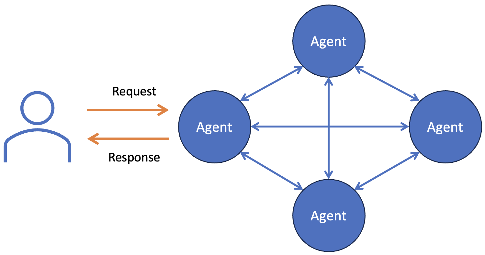

# Agentic AI

Agentic AI is revolutionising operations in many domains by introducing autonomous agents capable 
of sophisticated decision-making and problem-solving with minimal human oversight. These agents 
can enhance software development workflows by automating complex tasks, from code generation to 
testing, significantly speeding up the development process and reducing errors 
[(Acharya et al. 2025)](https://doi.org/10.1109/ACCESS.2025.3532853). 

<audio controls>
  <source src="audio/agentic_ai.mp3" type="audio/mpeg">
Your browser does not support the audio element.
</audio>

This section explores the concept of agentic AI and how it integrates into software engineering, 
discussing its potential to transform traditional practices, impact the roles of software 
engineers, and drive efficiency. We will explore the implications of deploying AI agents, 
addressing both the technological advances they bring and the challenges they pose in adapting 
current software engineering ecosystems.

## Foundational Concepts

Agentic AI agents, resembling 
[digital twins](https://www.youtube.com/watch?v=2hnoGo27uf8&ab_channel=IBMTechnology) 
of employees, are built upon the foundations of large language models (LLMs) and employ advanced 
prompt engineering to perform defined roles within software engineering environments. These agents 
are equipped with specific attributes essential for executing tasks autonomously, drawing 
parallels to human job functions but implemented via sophisticated AI technologies. Core
components are shown in orange in Fig. 1 with their human correlates in green.

{: standalone #fig1 data-title="Anatomy of an AI agent"}

* **Persona**: Defines the agent's role and is persistent, mirroring a job title in traditional 
  environments. This persona guides the agent's actions and interactions within its operational 
  scope.

* **Instruction**: Broad guidelines provided to the agent, outlining the scope of tasks it can 
  handle, akin to a job description. This ensures the agent can adapt to various scenarios within 
  its role, providing flexibility and directive focus.

* **Task**: Concrete actions derived from instructions, focused on addressing specific user 
  inputs. These are detailed steps the agent undertakes to resolve particular issues or fulfill 
  requests, ensuring precise and effective responses.

* **Planning**: Strategies embedded in the agent to enhance decision-making and adaptability. 
  This involves sophisticated prompt engineering techniques that enable the agent to navigate 
  complex or evolving situations effectively.

* **Memory**: Utilisation of vector databases and other technologies to recall past interactions, 
  essential for maintaining context in ongoing or complex dialogues.

* **Tools**: Capabilities enabling the agent to interact with external systems and APIs to 
  perform tasks beyond basic conversational responses, thus integrating deeper into the software development lifecycle.

* **Delegation**: The ability to pass tasks between agents based on specialisation and task 
  complexity, optimising workflow efficiency and effectiveness.

[Janakiram, 2024](https://thenewstack.io/ai-agents-a-comprehensive-introduction-for-developers/)

While some aspects of software engineering require human creativity and judgement, others are
more suitable for automation. These include Pair Programming where an AI agent could act as a 
virtual pair programmer, working alongside human developers. It would analyse the code in real-time, 
suggest improvements, and even detect potential bugs as the code is being written. This agent 
would utilise its persona to adapt its interaction style to match the developer’s proficiency level, 
ensuring effective collaboration.

Another potential role for AI agents is in code review, automatically scanning submitted code 
against best practices, style guidelines, and potential security issues. It would provide detailed 
feedback, much like a senior software engineer would, helping to streamline the review process 
and reduce the workload on human reviewers. This agent would use its memory and tools to reference 
historical data and past reviews to ensure consistency and accuracy in its assessments.

## Agentic workflows

The main characteristic of agentic AI is that it exhibits _agency_. That is to say that it
operates at least partly on its own initiative and takes a proactive role in interactions with
human users. In non-agentic workflows, the process is iterative and dependent on user feedback 
for each subsequent improvement, characterised by a linear, reactive interaction pattern. The 
LLM's output quality in the next round is directly influenced by the user's immediate prior 
feedback. Conversely, agentic workflows see the LLM proactively seeking information and 
iteratively refining its responses independently. This proactive approach mimics a collaborative 
team effort, potentially leading to higher quality outcomes as the LLM takes initiative based 
on the initial user input [(Singh et al., 2024)](10.1109/AIIoT61789.2024.10578990).

Singh et al. [(2024)](10.1109/AIIoT61789.2024.10578990) identified four general agentic design
patterns that take advantage of the technology's proactive abilities. They are discussed below.

### Reflection

The reflection design pattern involves the AI's ability to evaluate and adapt its own 
decision-making processes based on previous actions or results. This self-assessment allows the 
AI to enhance its performance without direct user intervention, ensuring more dynamic and 
effective responses over time.

{: standalone #fig1 data-title="The Reflection design pattern"}

Consider an AI developed for software debugging that uses reflection. Initially, the AI analyses 
a block of code to identify errors. If its first attempt at debugging fails to resolve the issue, 
it reflects on which strategies were ineffective and why, adjusting its approach in subsequent 
attempts. This might involve prioritising different types of errors or altering the methods used 
for debugging based on the complexity or nature of the bug detected. This process of reflection 
allows the AI to learn from each interaction and incrementally improve its problem-solving 
strategies.

In the context of financial trading, the reflection design pattern could be applied to enhance 
algorithmic trading systems. Such a system could analyse its own trading decisions in real-time 
to refine strategies. For example, if a trading algorithm is set to execute trades based on 
certain market conditions, it could reflect on past trade outcomes under similar conditions to 
adjust its parameters for future trades. This continuous self-assessment allows the system to 
adapt to changing market dynamics, potentially increasing profitability and reducing risk.

### Tool Use

The _Tool Use_ design pattern involves enhancing the capabilities of AI agents by integrating 
external tools or APIs into their workflow. This pattern enables agents to perform more complex, 
real-world tasks beyond basic processing. 

{: standalone #fig2 data-title="The Tool Use design pattern"}

An example of this is an AI personal assistant configured to manage scheduling and communications. 
By integrating with calendar APIs, email services, and messaging platforms, the AI can 
autonomously schedule meetings, send reminders, and even reschedule appointments based on 
conflicts or priorities, acting much like a human assistant would. This interaction with various 
tools allows the AI to handle tasks effectively across different platforms, demonstrating a 
sophisticated level of autonomy and utility.

In the context of software development, the Tool Use design pattern can be exemplified through 
an AI-powered code debugging agent. This agent integrates directly with development environments 
and version control systems via APIs to automatically scan and analyse code commits for potential 
bugs. Upon detecting issues, it not only flags them but also suggests optimal fixes based on 
best practices and previous successful resolutions documented in its learning database. This 
process not only streamlines the debugging phase but also educates developers by providing 
insights into more efficient coding practices.

### Planning

The _Planning_ design pattern involves structuring AI agents to engage in sophisticated reasoning 
and decision-making processes that anticipate and adapt to complex scenarios. This pattern 
extends beyond reactive responses, enabling agents to strategise and plan their actions 
proactively. 

{: standalone #fig3 data-title="The Planning design pattern"}

An example of this in use could be an AI travel assistant that plans 
multi-destination trips for clients. The agent assesses factors like weather conditions, 
local events, and client preferences to dynamically adjust travel itineraries, suggesting 
optimal routes and accommodations. This process not only enhances the travel experience by 
personalising itineraries but also anticipates and mitigates potential disruptions.

In the context of software development, the Planning design pattern can be exemplified through 
an AI-powered project management assistant. This agent could autonomously create and adjust 
software development timelines based on team progress, individual developer workloads, and 
predefined project milestones. By actively monitoring code commits and issue resolutions, the 
agent would predict potential delays and reassign tasks dynamically. This proactive approach 
ensures efficient project management, timely delivery, and optimal resource allocation, 
demonstrating the AI's capability to plan and execute complex workflows in software development.

### Multi-Agent Collaboration

The _Multi-Agent Collaboration_ design pattern involves multiple AI agents working together to 
achieve complex goals that a single agent alone could not handle efficiently. This design 
pattern utilises the strengths of diverse agents to manage different aspects of a problem or 
project, coordinating their efforts in a coherent manner.

{: standalone #fig4 data-title="The Multi-Agent Collaboration design pattern"}

For example, in a software development environment, multiple AI agents could collaborate on a 
large codebase. One agent could specialise in identifying and flagging potential security 
vulnerabilities, another could focus on code optimisation for performance, and a third could 
manage documentation consistency. Together, these agents would provide a comprehensive review 
and enhancement of the software product, far surpassing the capabilities of a single agent 
working in isolation. This multi-agent collaboration ensures a robust, efficient, and 
well-rounded development process.

### Other patterns

Just like other types of design pattern, the list related to agentic AI continues to grow. The
four discussed above are characterised according to their main purpose. Patterns can also be
classified according to their structure. This approach is sometimes more useful when designing
the architecture of a software system. In a recent 
[internet article](https://dev.to/dpaluy/exploring-agentic-workflow-patterns-312a), 
David Paluy outlines 11 structural patterns listed in the table below.

| Pattern      | Application                                                                |
|--------------|----------------------------------------------------------------------------|
| Network      | Distributed decision-making, multi-agent collaboration, adaptive learning. |
| Hierarchical | Task delegation, multi-layered decision-making                             |            
| Sequential   | Workflow automation, data processing                                       |
| Parallel     | Performance optimisation, multi-modal AI processing                        |
| Loop         | Self-learning models, continuous monitoring                                |
| Router       | Query classification, intelligent data routing                             |
| Aggregator   | Combining diverse data sources, multi-perspective analysis                 |
| Branching    | Decision-based workflows, conditional task execution                       |
| Ensemble     | Improving accuracy, reducing bias, decision-making processes               |
| Cascade      | Complex problem-solving, iterative enhancement                             |
| Fallback     | AI failover, fault tolerance                                               |

## Impacts on software engineers

With the integration of Agentic AI into software development, software engineers may experience 
a significant shift in their daily tasks towards more strategic and design-focused 
responsibilities. As AI agents take over routine coding, testing, and debugging tasks, engineers 
can focus more on system architecture, algorithm design, and user experience enhancements. This 
shift will likely empower engineers to strategise on complex system integrations and innovative 
solutions, placing greater emphasis on creative problem-solving and high-level decision-making, 
thereby elevating the role of the engineer to a planner and designer, rather than just a coder.

Embedding agents into development workflows can automate and optimise tasks such as code reviews 
and testing, allowing engineers to focus on more complex issues. For example, using AI agents for 
real-time bug detection streamlines the development cycle, reducing time-to-market for software 
products. As well as direct consequences for development processes, software engineers will need 
to develop skills in building architectures that support the integration of AI agents. This 
includes understanding how to design systems that not only accommodate AI agents but also 
leverage their capabilities to enhance system performance and user interaction. A practical use 
case is in adaptive security systems where AI agents continuously learn from network traffic and 
threat patterns to improve system defenses without human intervention.

These shifts require engineers to upskill in areas such as AI-driven design, system architecture, 
and the ethical implications of deploying AI agents, ensuring they remain at the forefront of 
technology innovation and application. Although the source of the quotation below is unclear, it
can be found in many places on the internet because it resonates with the experience of many 
developers and software companies.

<blockquote class="pretty">
AI will not replace you, people who use AI will
</blockquote>

{: .tip-title }
> [<i class="fa-regular fa-lightbulb"></i>Tips for working with AI agents](agents_tips.md)

## Further reading

* [Agentic AI: Autonomous Intelligence for Complex Goals—A Comprehensive Survey (Acharya et al. 2025)](https://doi.org/10.1109/ACCESS.2025.3532853)
* [AI Agents: A Comprehensive Introduction for Developers](https://thenewstack.io/ai-agents-a-comprehensive-introduction-for-developers/)
* [Enhancing AI Systems with Agentic Workflows Patterns in Large Language Model (Singh et al., 2024)](10.1109/AIIoT61789.2024.10578990)
* [Exploring Agentic Workflow Patterns](https://dev.to/dpaluy/exploring-agentic-workflow-patterns-312a)
