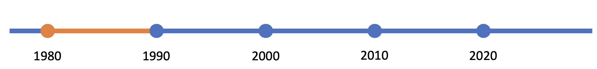

# Computer-Aided Software Engineering

Computer-aided software engineering (CASE) refers to the use of computational tools to
simplify the job of creating software systems. That might refer to the top-down design
of systems, or to the bottom-up activity of actually writing code. When digital computers were 
first invented, they had to be programmed by setting manual
switches. Since then, the entire history of computing has been about making that task easier.
Assembly language made it easier to write programs compared to binary code. Compilers
relieved software engineers for the need to write assembly language. Object-orientation
facilitated code reuse and interoperability. Graphical development tools automated the tasks
of debugging, testing, code control, etc. The introduction of tools specifically labelled
as *CASE tools* could therefore be considered redundant, especially since a lot of the
functionality of older CASE tools is now available in common IDEs. However, it serves to
highlight some aspects of software engineering that are aimed at a slightly higher level of
abstraction.

## Early Adoption

In the early 1980s, the increasing complexity of software and the need for more structured 
methodologies gave rise to the CASE concept which initially focused on automating manual tasks 
like drawing flowcharts or data flow diagrams. During this period, a notable distinction emerged 
between Upper CASE and Lower CASE tools. Upper CASE tools helped with initial system design and 
analysis, while Lower CASE tools aided in the actual construction and maintenance of systems. As the 
field evolved, some advanced CASE tools, like the Information Engineering Facility (IEF), introduced 
repository-based systems to manage the vast amount of information associated with large software 
projects. However, as different CASE tools emerged, a significant challenge arose around integrating 
their functionality and sharing data among them. For more details on this period, please see the
[Butler Cox Foundation Research Report 57](https://archivesit.org.uk/wp-content/uploads/2021/09/BCF-RRBT-12-1988-Iss1.pdf) 
from 1988. 

## Growth, Integration and Standardisation

In the 1990s, integrated CASE (I-CASE) tools emerged as a comprehensive solution to integration 
challenges, providing both upper and lower CASE functionalities within a unified system. 
Concurrently, the rise of object-oriented programming (OOP) spurred the popularity of object-oriented 
CASE (OO-CASE) tools. To improve how CASE tools managed and exchanged data, initiatives such as the 
CASE Data Interchange Format (CDIF) were launched, aiming for standardization. However, as the 
market became saturated with numerous tools, a period of consolidation ensued, during which larger 
software vendors acquired specialized CASE tool providers. For more details on this period, please
refer to the 
[Proceedings of the 7th International Workshop on CASE](https://ieeexplore-ieee-org.napier.idm.oclc.org/servlet/opac?punumber=3235) 
(1995).

## Transition & Evolution

With the rising popularity of Agile methodologies and Extreme Programming (XP), the software 
development industry began shifting away from heavyweight, repository-based CASE tools towards more 
flexible and lightweight methods. Concurrently, the Unified Modeling Language (UML) emerged as the 
de facto standard for software modelling. This shift catalyzed a surge in the development and 
adoption of UML-based CASE tools, facilitating more dynamic and iterative design processes. 
Additionally, the [Object Management Group](https://www.omg.org/) (OMG) introduced the 
[Model-Driven Architecture](https://www.omg.org/mda/) (MDA), 
which further advanced the concept of software development driven by models. This approach enabled 
the creation of tools capable of generating code directly from UML diagrams, streamlining the software 
development lifecycle. 

Model-driven development (MDD) is a formalisation of the idea that given a precise enough
model of a software system, the software itself can be generated through a deterministic
process. MDD was a popular concept in the 2000s as various authors and tool vendors tried
to use UML as the basis for generating code. The main idea is that working with a model
using a graphical representation such as UML is quicker, easier and more intuitive than
working directly with code. The approach was criticised in several ways
[(Hailpern & Tarr, 2006)](https://doi.org/10.1147/sj.453.0451):

* **Redundancy**: Multiple representations of the same software concepts are needed to
  capture the full picture leading to complexity and duplication.
* **Round-trip problems**: Given the complex set of documents required for the realistic
  representation of a software system, keeping them all consistent becomes a major overhead.
* **Moving complexity rather than reducing it**: To represent the full complexity of a
  software system would require an equally complex model. This point recalls the [short
  story](https://www.sccs.swarthmore.edu/users/08/bblonder/phys120/docs/borges.pdf)
  by Jorge Luis Borges which imagine a 1:1 scale map.
* **Additional skills requirements**: With each representation format, the developer would
  be required to learn its rules and operation. Again, this could potentially represent
  additional overhead rather than a reduction in effort.

[Other academics](https://copyprogramming.com/howto/uml-is-the-worst-thing-to-ever-happen-to-mdd-why)
have (informally) argued that UML is not the appropriate medium for MDD since it models
code and not the behaviour of the desired system. All of these criticisms, though, are
theoretical. The test of a technical approach should be in whether it delivers useful
results of not. This might be called the pragmatic criterion. Several tools exist that
allow the user to create a set of UML diagrams and then to generate code from them. None
of them will deliver a perfect working system; however, they all deliver well-structured
code that reduces the amount of repetitive content that would otherwise be the
responsibility of the software engineer. Some examples are:

* [Enterprise Architect](https://sparxsystems.com/products/ea/index.html)
* [Visual Paradigm](https://www.visual-paradigm.com/)
* [IBM Rational Software Architect Designer](https://www.ibm.com/docs/en/rational-soft-arch/9.7.0?topic=designer-rational-software-architect-product-overview)
* [StarUML](https://staruml.io/)
* [UModel](https://www.altova.com/umodel)
* [NClass](https://github.com/gbaychev/NClass)

For more information about this period, please refer to the overview by
[Sharon, (2003)](https://dl.acm.org/doi/abs/10.5555/1074100.1074241).

## Modern Tools & DevOps Integration

The evolution of DevOps practices brought about significant advancements in Continuous Integration 
and Continuous Deployment (CI/CD), resulting in tools that seamlessly integrate with modern 
development, testing, and deployment pipelines. Concurrently, CASE tools adapted to the changing 
technological landscape by transitioning to cloud-based platforms, which enhanced collaboration 
among distributed teams. Moreover, modern Integrated Development Environments (IDEs) began to 
natively incorporate many CASE capabilities, often blurring the distinctions between CASE tools and 
IDEs, thereby streamlining the software development process. This integration and evolution paved 
the way for the rise of the low-code approach, an extension of model-driven development that allows 
developers to create applications with minimal hand-coding and lower technical complexity. Low-code 
platforms utilize visual programming interfaces enriched by the powerful capabilities of model-driven 
environments, significantly accelerating development cycles and democratizing application development.
For a further discussion of low-code, please refer to [Cabot (2020)](https://doi.org/10.1145/3417990.3420210).

## Generative AI

Generative AI is revolutionizing software engineering by enhancing various aspects of CASE tools. 
In the realm of code writing and assistance, generative AI contributes through automatic code 
generation, intelligent code completion, and efficient bug detection, streamlining the development 
process. It also plays a crucial role in improving documentation by automatically generating detailed 
documentation, enhancing inline comments, and translating complex technical jargon into more 
understandable language.

For code reviews, AI-driven tools automate the review process, offering explanations for code logic 
and improving code quality. These tools address requirements analysis by interpreting requirements 
and performing gap analysis, thus ensuring that the software developed meets the intended 
specifications. In software design and modeling, AI capabilities extend to generating UML diagrams 
and suggesting design patterns that optimize the architectural setup of software systems.

Testing and Quality Assurance (QA) benefit immensely from generative AI through the automatic 
generation of test cases and the interpretation of error messages, which enhances the efficiency of 
testing processes. The educational aspects of software development are also enriched by AI through 
interactive learning platforms and tools that respond to technical queries, facilitating a deeper 
understanding for developers.

Finally, in software maintenance, generative AI aids in understanding legacy code and suggesting 
code refactoring, ensuring that older systems stay up to date with modern standards and practices. 
Collectively, these advancements demonstrate how generative AI, as a CASE tool, is integral in 
modernizing the software engineering landscape, making it more efficient, understandable, and 
maintainable.

## Further reading

* Model-driven development: The good, the bad, and the ugly [(Hailpern & Tarr, 2006)](https://doi.org/10.1147/sj.453.0451)
