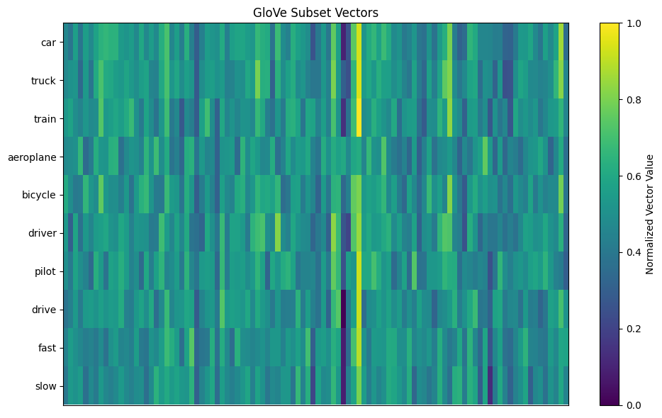
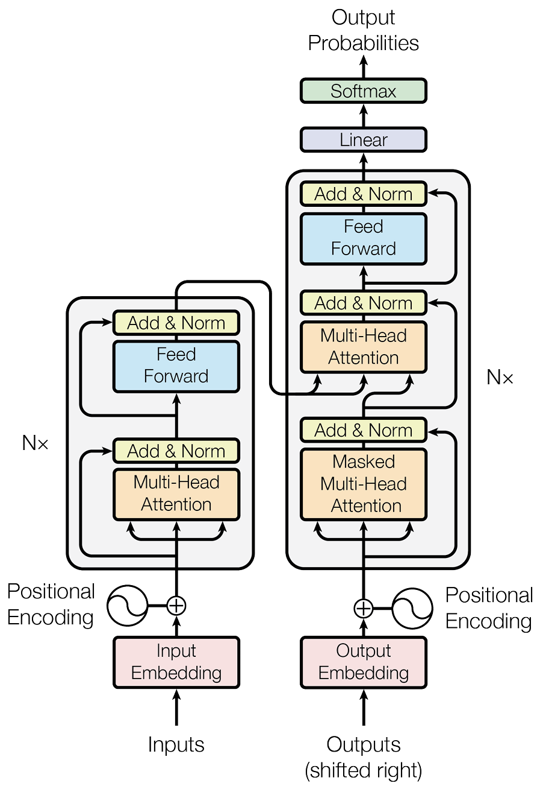

# Large language models

The use of large language models (LLMs) in software development is a relatively recent phenomenon 
but represents a significant leap in how software development and programming tasks are approached. 
They are a type of artificial neural network (ANN) that draws on developments in deep learning made
during the 2010s. As ANNs grew more sophisticated, companies and researchers began to develop more 
specialised tools for software development. Early examples included autocomplete features in IDEs 
(Integrated Development Environments) which were based on simpler statistical models.
The introduction of the transformer architecture by Google in 2017, through their paper 
[Attention is All You Need](https://dl.acm.org/doi/10.5555/3295222.3295349), marked a significant 
advance. Transformer models, which use mechanisms called attention and self-attention, proved highly 
effective for a range of language processing tasks and became the backbone of modern LLMs.

OpenAI's release of GPT (Generative Pre-trained Transformer) models started with GPT in 2018. 
These models demonstrated remarkable language generation capabilities, including generating 
coherent code snippets and understanding programming queries. Then in 2021, GitHub introduced 
Copilot, powered by OpenAI’s Codex (a descendant of GPT-3 specialised in programming languages), 
which provided context-aware code suggestions directly in the IDE. This represented a major step in 
operationalising LLMs for practical software development. Current tools go beyond code completion
and also provide code explanation, bug fixing, and even writing entire programs based on natural 
language descriptions. Companies like Google, Facebook and Microsoft have also developed their own 
versions of AI-powered tools for coding.

The integration of LLMs in software development is expanding to include more aspects of software 
engineering, such as automated testing, code review, and even requirements analysis. The future 
likely holds more personalised and adaptive AI assistants that further streamline and enhance the 
developer experience. The rapid development of LLMs for software development reflects broader trends 
in AI and machine learning, highlighting the increasing convergence of software engineering and AI 
technologies. This evolution promises to make software development more efficient, accessible, and 
innovative.

## Word embeddings

Word embeddings are a technique used in natural language processing (NLP) to represent words as 
vectors of real numbers. This method converts text into a format that computers can process more 
effectively, encoding semantic and syntactic aspects of words into high-dimensional space. 
Typically, each word is represented by a vector in a space with several hundred dimensions.

The fundamental idea behind word embeddings is to map each word to a vector such that words with 
similar meanings or those appearing in similar contexts have vectors that are close to each other 
in the embedding space. This not only captures the meanings of words but also their relationships, 
such as synonyms, antonyms, and various grammatical nuances.

For example, words like _car_ and _truck_ are semantically similar and thus have vectors that 
are close together in the vector space. Similarly, word embeddings can solve analogies by vector 
arithmetic, the classic example being king - man + woman = queen, illustrating how embeddings 
capture both semantic and relational information. Fig. 1 illustrates the vectors associated with
ten words from the [GloVe](https://www.google.com/url?q=https%3A%2F%2Fnlp.stanford.edu%2Fprojects%2Fglove%2F) 
model. In this version, each vector has 100 dimensions (elements) which are colour-coded in the
figure. From the visualisation it is possible to identify similarities between the vectors of related
words.

{: standalone #fig1 data-title="Visualising word embeddings"}

The vectors are constructed using algorithms that analyse words' contexts in large corpora of text. 
Two popular methods are:

* **[Word2Vec](https://www.analyticsvidhya.com/blog/2021/07/word2vec-for-word-embeddings-a-beginners-guide/)**: 
  This technique, developed by Google, uses models like [Skip-Gram and 
  Continuous Bag of Words (CBOW)](https://www.geeksforgeeks.org/word-embeddings-in-nlp-comparison-between-cbow-and-skip-gram-models/). 
  Skip-Gram predicts context words for a given target word, while CBOW predicts a target word based 
  on its context. These models create embeddings by optimising them to predict words correctly given 
  their contexts, thereby encoding the semantic information of words into the vectors.
* **[GloVe](https://www.google.com/url?q=https%3A%2F%2Fnlp.stanford.edu%2Fprojects%2Fglove%2F) 
  (Global Vectors for Word Representation)**: Developed at Stanford, GloVe constructs a large matrix 
  that records how frequently pairs of words co-occur within a certain distance in the text. This 
  matrix is then factorised to lower dimensions, effectively capturing the significant relationships 
  between words in fewer dimensions. Each word's vector is refined such that its dot product with 
  another word's vector approximates the log probability of their co-occurrence, enhancing the 
  model's ability to infer meanings and relationships.

The numerical values in a word vector are derived through the training process where the model 
iteratively adjusts the vectors to better fit the linguistic data. For instance, in Word2Vec, each 
word is initially assigned a random vector, and through training, these vectors are adjusted to 
maximise the likelihood of the actual word context in the data. The final numerical values of each 
vector are the parameters that result from this optimisation process.

## Attention

The concept of _attention_ is a fundamental innovation that enhances a model's ability to process 
language in a nuanced and context-sensitive manner. Originating from the need to manage and 
interpret the relationships between elements in sequences of data, attention mechanisms provide a 
dynamic means of focusing on specific parts of data while considering the whole.

At its core, attention is a mechanism that allows a model to weigh and focus on different parts of 
the input data when performing tasks. This ability is crucial in language processing, where the 
relevance and meaning of words can significantly depend on the broader linguistic context.

In the context of LLMs, attention operates by assigning a relevance score to each part of the input 
data, which in language tasks, is typically a sequence of words or tokens. These scores determine 
how much 'attention' the model should pay to each part of the sequence when generating an output.

To illustrate the concept of attention, consider the sentence:

> Despite the rain, the picnic by the river went ahead, surprising everyone with its success.

In this sentence, the attention mechanism would help a model to:

* Focus on _Despite the rain_: The model recognises that this phrase sets a contrasting context for 
  the rest of the sentence. Attention allows the model to link this phrase with the outcome 
  described later, _surprising everyone with its success_, illustrating how the initial adversity 
  contrasts with the final outcome.
* Link _picnic_ with _by the river_ and _went ahead_: Attention helps the model identify that the 
  location _by the river_ is specifically associated with _the picnic_ and that _went ahead_ 
  indicates the continuation of the picnic despite adverse conditions.
* Emphasise _surprising everyone_ in relation to the entire event: The model uses attention to 
  weigh the importance of the success being unexpected, tying it back to the initial mention of 
  rain and the determination to proceed with the picnic.

This nuanced sentence showcases how attention mechanisms allow a language model to handle complex 
dependencies and contextual relationships within a sentence, enhancing its ability to generate 
sophisticated and contextually appropriate responses.

For example, in processing the sentence "The cat sat on the mat," the model uses attention to 
determine that the words "cat" and "mat" have a strong contextual relationship, important for 
understanding the sentence structure and meaning.

The primary form of attention used in LLMs is called _self-attention_ which allows the model to 
look at other words in the input sequence when processing a specific word. Self-attention is 
characterised by three main components:

* **Query, Key, and Value**: Each word in the input sequence is transformed into three vectors: a 
  query, a key, and a value. These vectors are generated through trainable linear transformations.

* **Scoring**: The model calculates scores by comparing every query with every key. This comparison 
  is typically performed through a dot product, and the scores determine how much each element in 
  the sequence should influence the others.

* **Weighting and Summation**: The scores are then normalised using a 
  [softmax](https://machinelearningmastery.com/softmax-activation-function-with-python/) function, 
  which converts them into a probability distribution (weights). These weights are used to create a 
  weighted sum of the value vectors, resulting in an output vector for each word. This output vector 
  is a synthesis of relevant information from across the input sequence.

Prior to the advent of attention mechanisms, models like recurrent neural networks (RNNs) processed 
text sequentially, which made it difficult to maintain context over long distances. Attention, by 
contrast, processes all words at once, allowing it to capture relationships regardless of distance 
within the text.

## Transformers

The transformer architecture, introduced by Vaswani et al. in the landmark paper 
[Attention is All You Need](https://dl.acm.org/doi/10.5555/3295222.3295349) in 2017, represents a 
significant breakthrough in machine learning, particularly in the field of NLP. The model is 
essentially built on several layers of attention mechanisms that process data simultaneously, unlike 
previous models that processed input sequentially. This architecture consists of two main parts: the 
encoder and the decoder. This structure is illustrated in Fig. 2 where the encoder part is shown
on the left and the decoder on the right.

{: standalone #fig2 data-title="Transformer architecture"}

### The Encoder

The encoder's role is to transform input data into continuous representations that contain both the 
information of the individual elements and their context within the sequence. This is achieved 
through the following steps:

1. Input Embedding: Each input token (word) is converted into a vector using an embedding layer. 
   These embeddings incorporate positional encoding to maintain the sequence order, as the model 
   itself does not inherently process data sequentially.
2. Self-Attention Mechanism: The key innovation in the transformer is the self-attention mechanism 
   in the encoder. Each input embedding is transformed into three vectors: queries, keys, and values. 
   The model calculates attention scores by comparing all queries with all keys (using dot products), 
   which are then used to weigh the values. This weighting process allows each output element of the 
   encoder to consider the entire input sequence, emphasising parts of the sequence as needed.
3. Feed-Forward Neural Networks: Each position’s output from the attention layer is fed into a 
   feed-forward neural network, which is applied identically to all positions. This layer further 
   transforms the data, ensuring complex patterns can be learned.
4. Residual Connection and Layer Normalisation: After each attention and feed-forward layer, a 
   residual connection is added (the input to the layer is added to its output), followed by layer 
   normalisation. This helps in mitigating the vanishing gradient problem and promotes faster training.

### The Decoder

The decoder is designed to output one token at a time, for tasks such as translation or text 
generation, and works in a similar way to the encoder but with some key differences:

1. Masked Self-Attention: The first layer of the decoder is a masked self-attention layer, which 
   prevents positions from attending to subsequent positions. This masking ensures that the 
   predictions for a given position can only depend on known outputs at earlier positions.
2. Encoder-Decoder Attention: In addition to the self-attention layers, the decoder includes 
   encoder-decoder attention layers. These layers help the decoder focus on relevant parts of the 
   input sentence, similar to how attention works in sequence-to-sequence models with attention.
3. Output Layer: Finally, the decoder's output is transformed into predicted tokens one step at a 
   time. Each output token is fed back into the decoder during the next step of generation, in a 
   process known as auto-regressive generation.

Transformers have proven to be highly effective for a range of tasks beyond NLP, including computer 
vision and music generation. The architecture's ability to handle parallel computations has 
drastically reduced training times and improved the handling of long-range dependencies in sequence 
data. Furthermore, transformers have paved the way for the development of large-scale models such 
as [BERT](https://huggingface.co/docs/transformers/en/model_doc/bert), 
[GPT](https://huggingface.co/docs/transformers/en/model_doc/openai-gpt)
and others, which have set new benchmarks across various machine learning tasks. The scalability 
and efficiency of transformers make them a pivotal development in the AI field.

### Attention and word embeddings

In transformer models, the process typically starts with word embeddings as the initial input, 
which offer a basic, context-neutral representation of the words in a sentence. Attention mechanisms 
build upon these static embeddings to create dynamic, context-sensitive representations. For 
instance, in a sentence like "The bank of the river is steep", the attention mechanism enables the 
model to focus more on _river_, helping to clarify that _bank_ relates to the riverbank rather than 
a financial institution.

The integration of word embeddings with attention mechanisms enhances the model's ability to process 
text by enabling it to adjust how words are represented based on their context. This adjustment is 
crucial for tasks that require a detailed representation of text, such as sentiment analysis, where 
the connotation of a word can significantly alter depending on the context it is used in.

In more complex models, attention is applied in multiple layers, iteratively refining these 
representations. Multi-layered attention helps the model to represent complex language structures 
and relationships within the text more effectively, improving its ability to process intricate 
patterns and dependencies without the implication of human-like understanding.

## Examples

Since the release of the first version of OpenAI's GPT there has been a great deal of development
in the area of LLMs and several have been designed specifically to generate source code rather
than natural language. Notable examples include:

* **OpenAI's [Codex](https://openai.com/blog/openai-codex)**

  An adaptation of the GPT-3.5 architecture, Codex is specifically trained on a mixture of
  licensed data, data created by human trainers, and publicly available data in multiple
  languages to generate and understand code. It powers applications like GitHub Copilot.

* **GitHub [Copilot](https://github.com/features/copilot)**

  While Copilot itself is not a language model, it's a tool powered by OpenAI's Codex.
  Integrated with Visual Studio Code, it assists developers by suggesting entire lines or
  blocks of code, helping them to write code faster and with fewer errors.

* **Google's BERT for [Code Search](https://developers.google.com/code-search/)**

  While BERT (Bidirectional Encoder Representations from Transformers) was initially
  designed for natural language understanding, variants of BERT have been adapted to
  understand code semantics, especially for tasks like code search.

* **Facebook [Aroma](https://ai.meta.com/blog/aroma-ml-for-code-recommendation/) code-to-code search and recommendation tool**

  Aroma is a tool by Facebook that leverages neural networks for code-to-code search and
  recommendation, helping developers find and use code snippets from a large-scale codebase.

* [TabNine](https://www.tabnine.com/):

  Powered by GPT-3 and Codex, TabNine is an AI-powered code completion tool. Though it's
  not exclusively a language model, the underlying AI aids in predictive code completion.

* [DeepCode](https://snyk.io/platform/deepcode-ai/):

  Uses deep learning to analyse and learn from code repositories. While not exclusively
  for code generation, it assists in code reviews by pointing out potential issues.

At the time of writing, these are not the only software engineering tools and services to
make use of generative AI, and there will be many others in the near future.

## Limitations

A general limitation of ANNs is that they cannot create new information or ideas;
instead, they are limited to the contents of their training data. They sythesise
responses based on the statistical frequency with which patterns appear in that data.
This also implies that the generated solutions will reflect the most common methods
and stles used in the training data. If the user prompts the LLM to generate a
solution for a well-known problem where there are many examples in the training data
it is likely to do a good job. If the solution requested is obscure or uncommon,
the solution may not be so accurate. At the extreme, the LLM tries to fill in gaps
in its training data with best-guess elements which can sometimes be plain wrong.
When the LLM appears to be making things up with no basis in fact, it is called a
*hallucination*. The greater the novelty of the problem, the more likely the LLM
is to produce hallucinations.

