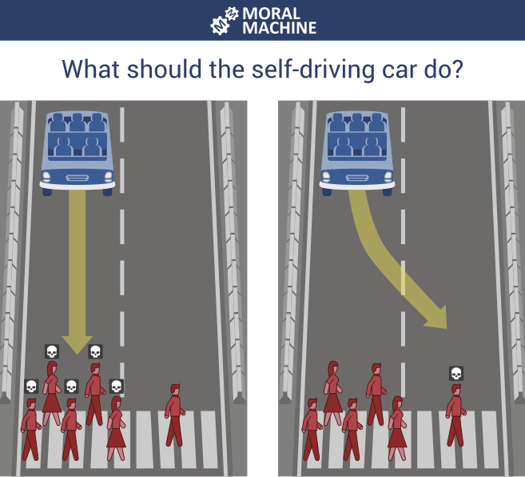
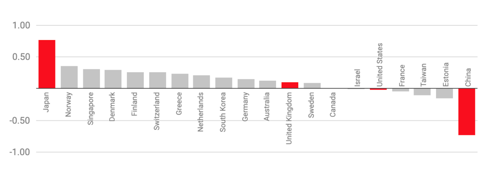
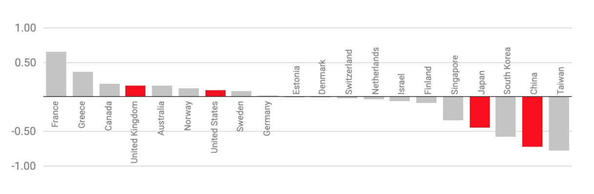

# Ethics and professionalism

### A professional is someone who can do his best work when he doesn't feel like it.

 

*Alistair Cooke*

###### Contents

1. [Definitions](#definitions)
2. [The trolley problem](#the-trolley-problem)
3. [Professional codes of ethics](#professional-codes-of-ethics)
4. [Final word...](#final-word)
5. [Further reading](#further-reading)

## Definitions

When it comes to abstract concepts like ethics and professionalism, it can be difficult to
find clear definitions. Many standard definitions are very abstract themselves and are
designed to be applied to a wide range of contexts. This means that they need to be
interpreted for a particular case.

In general, both concepts are used to describe the desirable characteristics of a person
acting in a particular role. Loui and Millar (2007) describe ethics as follows:

> #### Ethics
>
> The study of the actions that a responsible individual ought to choose, the values that an
> honorable individual ought to espouse, and the character that a virtuous individual ought
> to have.
>
> For example, everyone ought to be honest, fair, kind, civil, respectful, and trustworthy.
> Besides these general obligations that everyone shares, professionals have additional
> obligations that arise from the responsibilities of their professional work and their
> relationships with clients, employers, other professionals, and the public.
>
> [(Loui & Miller, 2007)](https://onlineethics.org/cases/ethics-and-professional-responsibility-computing)

Marebane et al., 2023 identify seven dimensions of professional responsibility in the field
of software engineering. These are summarised in the tour below.

<h6 align="center"> Here's you, engineering your software...

</h6>

## The trolley problem

There follows a series of fairly well-known ethical dilemmas related to death and
responsibility. At first, they seem contrived and of little relevance to software engineers.

1. You are walking by a railway track when you notice a trolley that is out of control
   and heading towards a group of five workers. Next to you, there is a lever that will
   divert the trolley onto an empty siding that will save the lives of the workers.
   **Do you pull the lever?**
2. You are in the same situation, except this time there is a single worker on the siding.
   That person will die if you pull the lever, but on the other hand you will still save
   the lives of the original group. **Do you pull the lever?**
3. This time there is no siding and you are on a bridge over the railway track. The trolley
   is still out of control and heading towards the group of five workers, but there is a
   large man standing next to you. If you push him off the bridge his body will block the
   track and save the workers. **Do you push the man off the bridge?**

The trolley problem is summarised in a
[TEDEd animation](https://ed.ted.com/lessons/would-you-sacrifice-one-person-to-save-five-eleanor-nelsen)
bu Eleanor Nelson.

In 2018, researchers from MIT ran an experiment called
the [Moral Machine](https://doi.org/10.1038/s41586-018-0637-6) in which people were
invited to choose the course of action that an autonomous vehicle should take when
faced with a life-and-death decision. Overall, 40 million decisions were captured from
people in 233 countries. Fig. 1 shows an example of one of the questions.

*Fig. 1: A question in the Moral Machine*

Surprising patterns emerged when the data was analysed that were dependent on the
cultural preferences in different parts of the world. For example, some cultures
prioritised saving passengers in the car over pedestrians while others took the
opposite view. This difference is visualised in Fig. 2 where a score closer to 1
indicates that respondents placed a greater emphasis on sparing pedestrians. If the score
is closer to -1, they preferred to save passengers while 0 is the global average.

*Fig. 2. Choosing to save pedestrians or passengers
([Hao, 2018](https://www.technologyreview.com/2018/10/24/139313/a-global-ethics-study-aims-to-help-ai-solve-the-self-driving-trolley-problem/)).*

The choice of whether to save the very young or the very old revealed a more uncomfortable
difference in cultural preferences. Faced with a scenario in which the brakes on the
autonomous vehicle had failed and at least one death was inevitable, respondents had to
choose between a baby and an elderly grandmother. The results are shown in Fig. 3 where
a score closer to 1 indicates that respondents preferred to save the young and a score
closer to -1 showed they preferred to save the old. Again, 0 represents the global average.

*Fig. 3: Choosing to save the young or the old.
([Hao, 2018](https://www.technologyreview.com/2018/10/24/139313/a-global-ethics-study-aims-to-help-ai-solve-the-self-driving-trolley-problem/)).*

## Professional codes of ethics

Some professions such as medicine and law require practitioners to maintain their status
and right to practice through a legally recognised certification process. Software engineering
does not have an equivalent system, and therefore membership of professional bodies and
adherence to their codes of practice are essentially voluntary. There is still an expectation
though that a computing professional will act with the same level of integrity as defined by
such codes.

In relation to software engineering, the most widely referenced professional code of
ethics is maintained by the
[Association for Computing Machinery (ACM)](https://www.acm.org/code-of-ethics). It is divided
into four main parts as shown below.

1. General ethical principles

&nbsp;&nbsp;&nbsp;&nbsp;
[1.1 Contribute to society and to human well-being, acknowledging that all people are stakeholders
in computing](https://www.acm.org/code-of-ethics#h-1.1-contribute-to-society-and-to-human-well-being,-acknowledging-that-all-people-are-stakeholders-in-computing.).

&nbsp;&nbsp;&nbsp;&nbsp;
[1.2 Avoid harm](https://www.acm.org/code-of-ethics#h-1.2-avoid-harm.).

&nbsp;&nbsp;&nbsp;&nbsp;
[1.3 Be honest and trustworthy](https://www.acm.org/code-of-ethics#h-1.3-be-honest-and-trustworthy.).

&nbsp;&nbsp;&nbsp;&nbsp;
[1.4 Be fair and take action not to discriminate](https://www.acm.org/code-of-ethics#h-1.4-be-fair-and-take-action-not-to-discriminate.).

&nbsp;&nbsp;&nbsp;&nbsp;
[1.5 Respect the work required to produce new ideas, inventions, creative works, and
computing artifacts](https://www.acm.org/code-of-ethics#h-1.5-respect-the-work-required-to-produce-new-ideas,-inventions,-creative-works,-and-computing-artifacts.).

&nbsp;&nbsp;&nbsp;&nbsp;
[1.6 Respect privacy](https://www.acm.org/code-of-ethics#h-1.6-respect-privacy.).

&nbsp;&nbsp;&nbsp;&nbsp;
[1.7 Honor confidentiality](https://www.acm.org/code-of-ethics#h-1.7-honor-confidentiality.).

2. Professional responsibilities

&nbsp;&nbsp;&nbsp;&nbsp;
[2.1 Strive to achieve high quality in both the processes and products of professional work](https://www.acm.org/code-of-ethics#h-2.1-strive-to-achieve-high-quality-in-both-the-processes-and-products-of-professional-work.).

&nbsp;&nbsp;&nbsp;&nbsp;
[2.2 Maintain high standards of professional competence, conduct, and ethical practice](https://www.acm.org/code-of-ethics#h-2.2-maintain-high-standards-of-professional-competence,-conduct,-and-ethical-practice.).

&nbsp;&nbsp;&nbsp;&nbsp;
[2.3 Know and respect existing rules pertaining to professional work](https://www.acm.org/code-of-ethics#h-2.3-know-and-respect-existing-rules-pertaining-to-professional-work.).

&nbsp;&nbsp;&nbsp;&nbsp;
[2.4 Accept and provide appropriate professional review](https://www.acm.org/code-of-ethics#h-2.4-accept-and-provide-appropriate-professional-review.).

&nbsp;&nbsp;&nbsp;&nbsp;
[2.5 Give comprehensive and thorough evaluations of computer systems and their impacts,
including analysis of possible risks](https://www.acm.org/code-of-ethics#h-2.5-give-comprehensive-and-thorough-evaluations-of-computer-systems-and-their-impacts,-including-analysis-of-possible-risks.).

&nbsp;&nbsp;&nbsp;&nbsp;
[2.6 Perform work only in areas of competence](https://www.acm.org/code-of-ethics#h-2.6-perform-work-only-in-areas-of-competence.).

&nbsp;&nbsp;&nbsp;&nbsp;
[2.7 Foster public awareness and understanding of computing, related technologies, and their
consequences](https://www.acm.org/code-of-ethics#h-2.7-foster-public-awareness-and-understanding-of-computing,-related-technologies,-and-their-consequences.).

&nbsp;&nbsp;&nbsp;&nbsp;
[2.8 Access computing and communication resources only when authorized or when compelled by
the public good](https://www.acm.org/code-of-ethics#h-2.8-access-computing-and-communication-resources-only-when-authorized-or-when-compelled-by-the-public-good.).

&nbsp;&nbsp;&nbsp;&nbsp;
[2.9 Design and implement systems that are robustly and usably secure](https://www.acm.org/code-of-ethics#h-2.9-design-and-implement-systems-that-are-robustly-and-usably-secure.).

3. Professional leadership principles

&nbsp;&nbsp;&nbsp;&nbsp;
[3.1 Ensure that the public good is the central concern during all professional computing work](https://www.acm.org/code-of-ethics#h-3.1-ensure-that-the-public-good-is-the-central-concern-during-all-professional-computing-work.).

&nbsp;&nbsp;&nbsp;&nbsp;
[3.2 Articulate, encourage acceptance of, and evaluate fulfillment of social responsibilities by
members of the organization or group](https://www.acm.org/code-of-ethics#h-3.2-articulate,-encourage-acceptance-of,-and-evaluate-fulfillment-of-social-responsibilities-by-members-of-the-organization-or-group.).

&nbsp;&nbsp;&nbsp;&nbsp;
[3.3 Manage personnel and resources to enhance the quality of working life](https://www.acm.org/code-of-ethics#h-3.3-manage-personnel-and-resources-to-enhance-the-quality-of-working-life.).

&nbsp;&nbsp;&nbsp;&nbsp;
[3.4 Articulate, apply, and support policies and processes that reflect the principles of the
Code](https://www.acm.org/code-of-ethics#h-3.4-articulate,-apply,-and-support-policies-and-processes-that-reflect-the-principles-of-the-code.).

&nbsp;&nbsp;&nbsp;&nbsp;
[3.5 Create opportunities for members of the organization or group to grow as professionals](https://www.acm.org/code-of-ethics#h-3.5-create-opportunities-for-members-of-the-organization-or-group-to-grow-as-professionals.).

&nbsp;&nbsp;&nbsp;&nbsp;
[3.6 Use care when modifying or retiring systems](https://www.acm.org/code-of-ethics#h-3.6-use-care-when-modifying-or-retiring-systems.).

&nbsp;&nbsp;&nbsp;&nbsp;
[3.7 Recognize and take special care of systems that become integrated into the infrastructure
of society](https://www.acm.org/code-of-ethics#h-3.7-recognize-and-take-special-care-of-systems-that-become-integrated-into-the-infrastructure-of-society.).

4. Compliance with the Code

&nbsp;&nbsp;&nbsp;&nbsp;
[4.1 Uphold, promote, and respect the principles of the Code](https://www.acm.org/code-of-ethics#h-4.1-uphold,-promote,-and-respect-the-principles-of-the-code.).

&nbsp;&nbsp;&nbsp;&nbsp;
[4.2 Treat violations of the Code as inconsistent with membership in the ACM](https://www.acm.org/code-of-ethics#h-4.2-treat-violations-of-the-code-as-inconsistent-with-membership-in-the-acm.).

The
[Institute of Electrical and Electronics Engineers (IEEE)](https://www.ieee.org/about/corporate/governance/p7-8.html)
code of ethics is also widely used, and in the UK the
[British Computer Society (BCS)](https://www.bcs.org/membership-and-registrations/become-a-member/bcs-code-of-conduct/)
acts as the professional body for the computing industry. Its code of conduct is also based
on four principles as shown below.

You make IT for everyone

> Working together to address issues in your profession and in wider society, you want
> everyone to have access to IT. You share what you know, uphold standards and conduct
> yourself professionally and fairly at all times.
>
> **PUBLIC INTEREST**
>
> You shall:
>
> 1. have due regard for public health, privacy, security and wellbeing of others and the environment
> 2. have due regard for the legitimate rights of third parties
> 3. conduct your professional activities without discrimination on the grounds of sex, sexual orientation, marital status, nationality, colour, race, ethnic origin, religion, age or disability, or of any other condition or requirement
> 4. promote equal access to the benefits of IT and seek to promote the inclusion of all sectors in society wherever opportunities arise.

Show what you know, learn what you don't

> You have integrity and show competence, but you know you don’t know everything, that’s
> why you continuously learn and grow and never take on tasks that you don’t have the
> skills and resources to complete.
>
> **PROFESSIONAL COMPETENCE AND INTEGRITY**
>
> You shall:
>
> 1. only undertake to do work or provide a service that is within your professional competence
> 2. NOT claim any level of competence that you do not possess
> 3. develop your professional knowledge, skills and competence on a continuing basis, maintaining awareness of technological developments, procedures, and standards that are relevant to your field
> 4. ensure that you have the knowledge and understanding of legislation and that you comply with such legislation, in carrying out your professional responsibilities
> 5. respect and value alternative viewpoints and seek, accept and offer honest criticisms of work
> 6. avoid injuring others, their property, reputation, or employment by false or malicious or negligent action or inaction
> 7. reject and will not make any offer of bribery or unethical inducement.

Respect the organisation or individual you work for

> You work with due care and diligence, acting in your client or company’s best interests
> at all times. You take personal and collective responsibility for your actions while
> maintaining discretion and ethical standards.
>
> **DUTY TO RELEVANT AUTHORITY**
>
> You shall:
>
> 1. carry out your professional responsibilities with due care and diligence in accordance with the relevant authority’s requirements while exercising your professional judgement at all times
> 2. seek to avoid any situation that may give rise to a conflict of interest between you and your relevant authority
> 3. accept professional responsibility for your work and for the work of colleagues who are defined in a given context as working under your supervision
> 4. NOT disclose or authorise to be disclosed, or use for personal gain or to benefit a third party, confidential information except with the permission of your relevant authority, or as required by legislation
> 5. NOT misrepresent or withhold information on the performance of products, systems or services (unless lawfully bound by a duty of confidentiality not to disclose such information), or take advantage of the lack of relevant knowledge or inexperience of others.

Keep IT real. Keep IT professional. Pass IT on

> As a BCS member, you’re an ambassador for the IT industry and use your voice to help
> promote it positively to the world. You support your IT colleagues and other members in
> their growth both personally and professionally.
>
> **DUTY TO THE PROFESSION**
>
> You shall:
>
> 1. accept your personal duty to uphold the reputation of the profession and not take any action which could bring the profession into disrepute
> 2. seek to improve professional standards through participation in their development, use and enforcement
> 3. uphold the reputation and good standing of BCS, The Chartered Institute for IT
> 4. act with integrity and respect in your professional relationships with all members of BCS and with members of other professions with whom you work in a professional capacity
> 5. encourage and support fellow members in their professional development.

## Final word...

The final word goes to Marting Fowler inn a speech that he made to the GOTO conference
in 2014. Although the event was some time ago, it is interesting to consider what has changed
since and what has not. It is clear that some of the issues he discusses are still relevant
in 2023.

*Fig. 4: Martin Fowler at GOTO2014*

## Further reading

* Ethics and professional responsibility in computing [(Loui & Miller, 2007)](https://onlineethics.org/cases/ethics-and-professional-responsibility-computing)
* Mapping of studies on ethical responsibilities of software engineers [(Marebane, Hans & Kgaphola, 2023)](https://doi.org/10.1109/AFRICON55910.2023.10293734)
* [Stephens, 2022, Ch. 20](https://learning.oreilly.com/library/view/beginning-software-engineering/9781119901709/c20.xhtml)
* [O'Regen, 2022, Ch. 2](https://link-springer-com.napier.idm.oclc.org/chapter/10.1007/978-3-031-07816-3_2)
